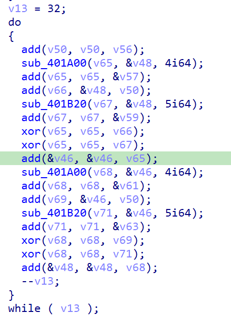

# QWB 2021

## StandOnTheGiants

base64魔改（由于魔改表有重复字母需要爆破，可以借助itertools写的很快）+rsa解密（题目里可以找到一串异或，解密结果是数字，factordb分解即可得到p、q）

~~~python
import base64
from Crypto.Util.number import bytes_to_long, long_to_bytes
correct_table = 'ABCDEFGHIJKLMNOPQRSTUVWXYZabcdefghijklmnopqrstuvwxyz0123456789+/'
table = 'abcdefghijklmnopqrstuvwxyzABCDEFGHIJKLMNOPQRSTUVWXYZ*+,-./:;?@+-'
c = 'bborOT+ohG*,U:;@/gVIAZ-,t++LaZkOrk?UcSOKJ?p-J+vuSN?:e,Kc/?h-oH?:tthoqYYSPp-ZC+Yw:*jrxPymGYO/PvDOIivNYtvJ?Mi*GG+/lmqEysrTdSD+eP+moP+l?+Np/oK='
new_c = []
for i in range(len(c)):
    if c[i] == '+':
        new_c.append(["1", "+"])
    elif c[i] == '-':
        new_c.append(["3", "/"])
    elif c[i] != '=':
        new_c.append([correct_table[table.index(c[i])]])
    else:
        new_c.append([c[i]])
print(new_c)

from itertools import product

for i in product(*new_c):
    c = bytes_to_long(base64.b64decode(''.join(i)))

    # data = [0x0C, 0x0E, 0x0F, 0x0C, 0x79, 0x0F, 0x7B, 0x79, 0x79, 0x79, 0x78, 0x05, 0x7F, 0x79, 0x04, 0x79, 0x7B, 0x7B, 0x0E, 0x0A, 0x04, 0x7C, 0x7B, 0x7B, 0x0D, 0x0E, 0x0D, 0x79, 0x78, 0x0F, 0x0D, 0x08, 0x7F, 0x05, 0x09, 0x0B, 0x78, 0x7F, 0x08, 0x7E, 0x78, 0x7E, 0x7E, 0x09, 0x0D, 0x7B, 0x7C, 0x05, 0x7C, 0x7C, 0x04, 0x7E, 0x0F, 0x7C, 0x05, 0x08, 0x7E, 0x78, 0x0E, 0x78, 0x04, 0x04, 0x0F, 0x0C, 0x04, 0x0E, 0x78, 0x05, 0x0A, 0x0E, 0x7F, 0x0F, 0x7F, 0x7E, 0x0B, 0x0B, 0x0A, 0x79, 0x7C, 0x7F, 0x78, 0x0F, 0x7C, 0x7E, 0x0E, 0x78, 0x78, 0x04, 0x79, 0x79, 0x0F, 0x0E, 0x7F, 0x0E, 0x7C, 0x04, 0x78, 0x79, 0x04, 0x78, 0x7E, 0x0D, 0x7E, 0x0E, 0x7E, 0x0A, 0x09, 0x09, 0x08, 0x0B, 0x0B, 0x0E, 0x7B, 0x08, 0x09, 0x08, 0x08, 0x09, 0x0B, 0x04, 0x7F, 0x0A, 0x0F, 0x0A, 0x79, 0x79, 0x0B, 0x7B, 0x7F, 0x7E, 0x0D, 0x0E, 0x7F, 0x0C, 0x7F, 0x7B, 0x04, 0x08, 0x79, 0x0D, 0x0E, 0x7C, 0x0C, 0x0E, 0x7E, 0x0D, 0x0E, 0x0B, 0x05, 0x0B, 0x09, 0x08, 0x0A, 0x0B, 0x0A, 0x0B, 0x0E, 0x0D, 0x7E, 0x0A, 0x78, 0x7C, 0x7F, 0x7B, 0x08, 0x78, 0x0A, 0x7C, 0x7F, 0x08, 0x7B, 0x7C, 0x0F, 0x0A, 0x7F, 0x04, 0x09, 0x7C, 0x79, 0x78, 0x0A, 0x78, 0x0C, 0x78, 0x0F, 0x0E, 0x7F, 0x7E, 0x7E, 0x0B, 0x08, 0x79, 0x0F, 0x7C, 0x0A, 0x79, 0x78, 0x79, 0x0C, 0x7E, 0x08, 0x7F, 0x0E, 0x0B, 0x09, 0x7F, 0x08, 0x0C]
    # for i in range(len(data)):
    #     data[i] ^= 0x3d
    # print(int(bytes(data).decode(), 16))

    import gmpy2

    p = 33372027594978156556226010605355114227940760344767554666784520987023841729210037080257448673296881877565718986258036932062711
    q = 64135289477071580278790190170577389084825014742943447208116859632024532344630238623598752668347708737661925585694639798853367
    n = p * q
    mod = (p - 1) * (q - 1)
    d = gmpy2.invert(65537, mod)
    m = pow(c, d, n)
    try:
        flag = long_to_bytes(m).decode()
        print(flag)
    except:
        continue
# flag{1F_i_#@vE_&33n_a_lI7tL3_FVRTher}
~~~

## ezmath

注意下v3初始值被hook掉了，找正确的值即可

~~~python
data = [0.00009794904266317233, 0.00010270456917442, 0.00009194256152777895, 0.0001090322021913372, 0.0001112636336217534, 0.0001007442677411854, 0.0001112636336217534, 0.0001047063607908828, 0.0001112818534005219, 0.0001046861985862495, 0.0001112818534005219, 0.000108992856167966, 0.0001112636336217534, 0.0001090234561758122, 0.0001113183108652088, 0.0001006882924839248, 0.0001112590796092291, 0.0001089841164633298, 0.00008468431512187874]
flag = ""
for k in range(len(data)):
    for a1 in range(0x2020, 0x7f7f):
        i = 8225
        v3 = 0.00048291080524950886
        print(hex(a1))
        while i < a1:
            v3 = 2.718281828459045 - v3 * i
            print(v3)
            i += 1
        if abs(v3 - data[k]) < 1e-18:
            print("flag: ", hex(a1))
            flag += bytes.fromhex(hex(a1)[2:]).decode()[::-1]
            break
    break
print(flag)
~~~

尝试爆破发现越界inf错误，这题只能用数学方法分析；观察到2.718281828459045即为e

具体数学方法如下，不去费脑细胞了，真碰上了交给密码手吧

~~~python
import math

data = [0.00009794904266317233, 0.00010270456917442, 0.00009194256152777895, 0.0001090322021913372, 0.0001112636336217534, 0.0001007442677411854, 0.0001112636336217534, 0.0001047063607908828, 0.0001112818534005219, 0.0001046861985862495, 0.0001112818534005219, 0.000108992856167966, 0.0001112636336217534, 0.0001090234561758122, 0.0001113183108652088, 0.0001006882924839248, 0.0001112590796092291, 0.0001089841164633298, 0.00008468431512187874]
flag = ""
for k in range(len(data)):
    v3 = math.e / data[k] - 2
    # print(round(v3))
    flag += bytes.fromhex(hex(round(v3))[2:]).decode()[::-1]
print(flag)
~~~

## AllInOne

做了大量混淆，加入了一堆空类、重复类，需要找到真正执行代码的地方

不行还是看不懂，网上只找到一个wp，但是混淆太厉害了，后续考虑学习下怎么插入log

## LongTimeAgo

先去除花指令，得到如下主函数代码

~~~c
int __fastcall main(int argc, const char **argv, const char **envp)
{//。。。
  sub_40CC40(argc, argv, envp);
  memset(v23, 0, sizeof(v23));
  sub_49F840(&unk_4A68E0, "Input Your Key:");
  sub_4A04A0(qword_4A6580, v23);
  v3 = v23;
  do
  {
    v4 = *(_DWORD *)v3;
    v3 += 4;
    v5 = ~v4 & (v4 - 16843009) & 0x80808080;
  }
  while ( !v5 );
  if ( (~v4 & (v4 - 16843009) & 0x8080) == 0 )
  {
    v5 >>= 16;
    v3 += 2;
  }
  if ( &v3[-__CFADD__((_BYTE)v5, (_BYTE)v5) - 3] - v23 == 64 )
  {
    v7 = v23;
    v8 = v32;
    v9 = (int *)&unk_4A4020;
    v10 = v32;
    sub_49F840(&unk_4A68E0, "Are You Sure You Want To Keep Waiting...\n");
    v11 = v24;
    v12 = v24;
    do
    {
      v13 = sub_401DB0(v7, 8);                  // 限制输入范围，返回十六进制数
      *((_BYTE *)v11 + 8) = 0;
      v11[1] = v13;
      v14 = 4i64;
      while ( 1 )
      {
        v15 = v14;
        if ( *((_BYTE *)v11 + v14 + 3) )
          break;
        if ( !--v14 )
        {
          v15 = 0;
          break;
        }
      }
      *v11 = v15;
      v16 = *v9;
      v10[8] = 0;
      *((_DWORD *)v10 + 1) = v16;
      v17 = 4i64;
      while ( 1 )
      {
        v18 = v17;
        if ( v10[v17 + 3] )
          break;
        if ( !--v17 )
        {
          v18 = 0;
          break;
        }
      }
      v7 += 8;
      *(_DWORD *)v10 = v18;
      v11 += 9;
      v10 += 36;
      ++v9;
    }
    while ( v7 != &v23[64] );
    sub_403460((__int64)v28, 13);               // 很奇怪的函数,很费时间
    sub_403460((__int64)&v29, 14);
    sub_403460((__int64)&v30, 15);
    sub_403460((__int64)&v31, 16);              // 这里明显感觉像是初始化加密密钥
    sub_4029E0(v24, v28);                       // 这里开始用密钥，v24存储的正好是前面的十六进制数
    sub_4029E0(v25, v28);
    sub_402030(v26, v28);
    sub_402030(v27, v28);
    v19 = 0;
    while ( 1 )
    {
      v20 = *v12;
      if ( *v12 != *(_DWORD *)v8 )
        break;
      if ( v20 - 1 >= 0 )
      {
        if ( v32[36 * v19 - 573 + v20] != v32[36 * v19 + 3 + v20] )
          break;
        v21 = v20 - 2;
        while ( (int)v21 >= 0 )
        {
          v22 = *((_BYTE *)v12 + v21-- + 4);
          if ( v22 != v8[v21 + 5] )
            goto LABEL_6;
        }
      }
      ++v19;
      v12 += 9;
      v8 += 36;
      if ( v19 == 8 )
      {
        sub_401550("QWB{%s}\n", v23);
        return 0;
      }
    }
  }
LABEL_6:
  sub_401550("sorry\n");
  return 0;
}
~~~

中间很长一段do-while作用是提取64位大小的十六进制数；然后是sub_403460生成初始key，很费时间，chatgpt分析貌似是一个模拟状态机，直接动调获取v28数组值；然后是两组sub_4029E0和两组sub_402030，

sub_4029E0里找key位置发现了明显的XTEA加密特征，再往上找可以找到找到整个do-while大循环正是多轮XTEA加密，delta值可以找到

~~~c
  v13 = 0;
  do
  {
    sub_401A00((__int64)v73, &v55, 4);
    sub_401B20((__int64)v74, &v55, 5);
    xor(v75, v73, v74);
    add(v76, v75, &v55);
    v59 = 0;
    v14 = 4i64;
    v58 = v13;
    while ( 1 )
    {
      v15 = v14;
      if ( *((_BYTE *)&v57 + v14 + 3) )
        break;
      if ( !--v14 )
      {
        v15 = 0;
        break;
      }
    }
    v57 = v15;
    v16 = v13 & 3;
    v13 -= 0x70C88617;	// delta
    add(v77, &v57, &a2[9 * v16]);
    xor(v78, v76, v77);
    add(&v53, &v53, v78);
    sub_401A00((__int64)v79, &v53, 4);
    sub_401B20((__int64)v80, &v53, 5);
    xor(v81, v79, v80);
    add(v82, v81, &v53);
    v59 = 0;
    v17 = 4i64;
    v58 = v13;
    while ( 1 )
    {
      v18 = v17;
      if ( *((_BYTE *)&v57 + v17 + 3) )
        break;
      if ( !--v17 )
      {
        v18 = 0;
        break;
      }
    }
    v57 = v18;
    add(v83, &v57, &a2[9 * ((v13 >> 11) & 3)]);
    xor(v85, v82, v83);
    add(&v55, &v55, v85);
  }
  while ( v13 != 0xE6EF3D20 );	// 简单计算了需要32轮
~~~

需要注意do-while往后有两处地方对加密的结果进行了异或

~~~c
// 第一处是对v1
v19 = sub_401EF0(3, 5);
v84 = 0;
v83[1] = v19;
v83[0] = v21;
xor(&v53, &v53, v83);
// 第二处是对v2
v23 = sub_401EF0((int)v54, 6);
v86 = 0;
v85[1] = v23;
v85[0] = v25;
xor(&v55, &v55, v85);
~~~

sub_402030明显看出TEA加密特征，可以看到4、5、4、5这样的，基本可以推测出是移位操作；v50是total、v56是delta（前面可以得到是0x3d3529bc），加密轮数为32

tea同xtea后面也多了个异或，可以直接动态调试获取，也可以分析生成规律得到算法

~~~python
import struct
from ctypes import c_uint32

def xtea_decrypt(r, v, key, delta):
    v0, v1 = c_uint32(v[0] ^ get_key(5)), c_uint32(v[1] ^ get_key(6))
    total = c_uint32(0xE6EF3D20)
    while total.value != 0:
        v1.value -= (((v0.value << 4) ^ (v0.value >> 5)) + v0.value) ^ (total.value + key[(total.value >> 11) & 3])
        total.value += delta
        v0.value -= (((v1.value << 4) ^ (v1.value >> 5)) + v1.value) ^ (total.value + key[total.value & 3])
    return v0.value, v1.value

def tea_decrypt(r, v, key, delta):
    v0, v1 = c_uint32(v[0] ^ get_key(7)), c_uint32(v[1] ^ get_key(8))
    total = c_uint32(delta * r)
    for i in range(r):
        v1.value -= ((v0.value << 4) + key[2]) ^ (v0.value + total.value) ^ ((v0.value >> 5) + key[3])
        v0.value -= ((v1.value << 4) + key[0]) ^ (v1.value + total.value) ^ ((v1.value >> 5) + key[1])
        total.value -= delta
    return v0.value, v1.value

def get_key(x):
    return (((1 << (x-1)) - 1) << 4)+13

if __name__ == "__main__":
    key = [get_key(i) for i in range(13, 17)]
    print(list(map(hex, key)))
    v = [0x1F306772, 0xB75B0C29, 0x4A7CDBE3, 0x2877BDDF, 0x1354C485, 0x357C3C3A, 0x738AF06C, 0x89B7F537]
    for i in range(0, 4, 2):
        v[i:i+2] = xtea_decrypt(32, v[i:i+2], key, 0x70C88617)
    for i in range(4, 8, 2):
        v[i:i+2] = tea_decrypt(32, v[i:i+2], key, 0x3d3529bc)
    flag = "QWB{"
    for i in v:
        flag += hex(i)[2:].zfill(8)
    print(flag+"}")
~~~

## unicorn_like_a_pro

用的unicorn模拟执行，需要编译一份unicorn还原符号表，注意要ida搜下字符串找到版本号，搜到[1.0.3](https://github.com/unicorn-engine/unicorn/releases/tag/1.0.3)

照着bindiff插件教程，基本还原函数名，但不知道为什么我的uc_open貌似差距比较大没能还原

很多api去找文档看含义，比较重要的是uc\_hook\_add

~~~c
/*
 Register callback for a hook event.
 The callback will be run when the hook event is hit.
 
 @uc: handle returned by uc_open()
 @hh: hook handle returned from this registration. To be used in uc_hook_del() API
 @type: hook type, refer to uc_hook_type enum
 @callback: callback to be run when instruction is hit
 @user_data: user-defined data. This will be passed to callback function in its
      last argument @user_data
 @begin: start address of the area where the callback is in effect (inclusive)
 @end: end address of the area where the callback is in effect (inclusive)
   NOTE 1: the callback is called only if related address is in range [@begin, @end]
   NOTE 2: if @begin > @end, callback is called whenever this hook type is triggered
 @...: variable arguments (depending on @type)
   NOTE: if @type = UC_HOOK_INSN, this is the instruction ID (ex: UC_X86_INS_OUT)
 
 @return UC_ERR_OK on success, or other value on failure (refer to uc_err enum
   for detailed error).
*/
UNICORN_EXPORT
uc_err uc_hook_add(uc_engine *uc, uc_hook *hh, int type, void *callback,
        void *user_data, uint64_t begin, uint64_t end, ...);
~~~

unicorn对目前来说还是太难了，泪崩，搞不懂回调函数里的参数
