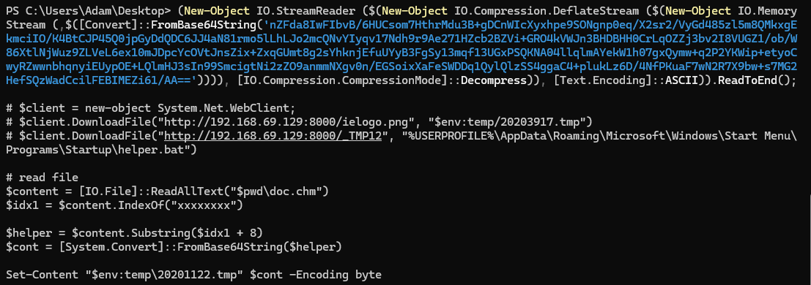
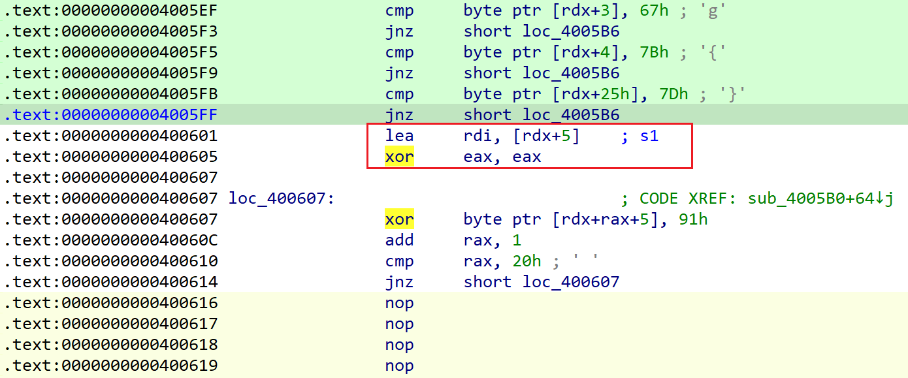

# Week 1（2024.9.16-2024.9.22）

## reverse_html

exeinfo识别出chm（windows帮助文件），直接压缩包形式打开，发现`doc.htm`里有一串cmd执行命令，里面的base64字符串解码得到invoke代码，在cmd中查看下可以看到代码

代码意思是从`doc.chm`里找到`xxxxxxxx`的位置，并向后截取字符串解码写入文件

~~~python
import base64

a = base64.b64decode("kAADAAAABAAAAP//AAC4AAAAAAAAAEAAAAAAAAAAAAAAAAAAAAAAAAAAAAAAAAAAAAAAAAAAAAAAAPgAAAAOH7oOALQJzSG4AUzNIVRoaXMgcHJvZ3JhbSBjYW5ub3QgYmUgcnVuIGluIERPUyBtb2RlLg0NCiQAAAAAAAAAX0/hmRsuj8obLo/KGy6PyhJWHMoZLo/K416Oyxkuj8rjXorLES6PyuNei8sRLo/K416Myxouj8pARo7LGC6Pyhsujso6Lo/KrF+Gyxguj8qsX43LGi6PylJpY2gbLo/KAAAAAAAAAAAAAAAAAAAAAAAAAAAAAAAAUEUAAEwBBACQi5dfAAAAAAAAAADgAAIhCwEOGwASAAAAEAAAAAAAAH0XAAAAEAAAADAAAAAAABAAEAAAAAIAAAYAAAAAAAAABgAAAAAAAAAAYAAAAAQAAAAAAAACAEABAAAQAAAQAAAAABAAABAAAAAAAAAQAAAAAAAAAAAAAAA8NgAAUAAAAAAAAAAAAAAAAAAAAAAAAAAAAAAAAAAAAABQAABYAQAAwDIAADgAAAAAAAAAAAAAAAAAAAAAAAAAAAAAAAAAAAD4MgAAQAAAAAAAAAAAAAAAADAAAHAAAAAAAAAAAAAAAAAAAAAAAAAAAAAAAAAAAAAudGV4dAAAADMRAAAAEAAAABIAAAAEAAAAAAAAAAAAAAAAAAAgAABgLnJkYXRhAABYCQAAADAAAAAKAAAAFgAAAAAAAAAAAAAAAAAAQAAAQC5kYXRhAAAAkAMAAABAAAAAAgAAACAAAAAAAAAAAAAAAAAAAEAAAMAucmVsb2MAAFgBAAAAUAAAAAIAAAAiAAAAAAAAAAAAAAAAAABAAABCAAAAAAAAAAAAAAAAAAAAAAAAAAAAAAAAAAAAAAAAAAAAAAAAAAAAAAAAAAAAAAAAAAAAAAAAAAAAAAAAAAAAAAAAAAAAAAAAAAAAAAAAAAAAAAAAAAAAAAAAAAAAAAAAAAAAAAAAAAAAAAAAAAAAAAAAAAAAAAAAAAAAAAAAAAAAAAAAAAAAAAAAAAAAAAAAAAAAAAAAAAAAAAAAAAAAAAAAAAAAAAAAAAAAAAAAAAAAAAAAAAAAAAAAAAAAAAAAAAAAAAAAAAAAAAAAAAAAAAAAAAAAAAAAAAAAAAAAAAAAAAAAAAAAAAAAAAAAAAAAAAAAAAAAAAAAAAAAAAAAAAAAAAAAAAAAAAAAAAAAAAAAAAAAAAAAAAAAAAAAAAAAAAAAAAAAAAAAAAAAAAAAAAAAAAAAAAAAAAAAAAAAAAAAAAAAAAAAAAAAAAAAAAAAAAAAAAAAAAAAAAAAAAAAAAAAAAAAAAAAAAAAAAAAAABVi+yD5PiB7PwAAAChBEAAEDPEiYQk+AAAAFaNlCTcAAAAx4Qk3AAAACt+FRaNTCQIx4Qk4AAAACiu0qbHhCTkAAAAq/cViMeEJOgAAAAJz088x4Qk7AAAAB/qx3nHhCTwAAAAVTv4gseEJPQAAABRs1SAx4Qk+AAAAM+mtnXHhCTMAAAAAAAAAMeEJNAAAAAAAAAAx4Qk1AAAAAAAAADHhCTYAAAAAAAAAOiRAAAAjVQkCI2MJMwAAADooQEAAI2MJOwAAAC+DAAAAI2UJMwAAACLATsCdRiDwQSDwgSD7gRz72oFaKQwABD/FQAwABCLjCT8AAAAM8BeM8zoKwMAAIvlXcIEAMzMzMzMzMzMzFWL7INtDAF1HGoAagBqAGgAEAAQagBqAP8VBDAAEFD/FQgwABC4AQAAAF3CDADMzFWL7FEPtgJTVovxuwQAAACKSg2ITg2KSg6IBg+2QgGIRgEPtkICiEYCD7ZCA4hGAw+2QgSIRgQPtkIFiEYFD7ZCBohGBg+2QgeIRgcPtkIIiEYID7ZCCYhGCQ+2QgqIRgoPtkILiEYLD7ZCDIhGDI1GDYhODopKD4hODw8fRAAAimj/igiKUAGKcAKIbfyITf2IVf+Idf72wwN1QQ+20Q+2Tf+KicAxABCITf0Ptk3+ionAMQAQiE3/D7ZN/IqJwDEAEIhN/ovLwekCiqmwMAAQMqrAMQAQilX/inX+ikjzQzLNiEgDikj0Mk39iEgEikj1MsqISAWKSPYyzohIBoPABIP7LA+Cdf///15bi+Vdw8zMzMzMzMzMzMzMzMzMzFWL7IPsDFNWi8KL8VeL+IlF+Il19Cv+uwQAAAAPH0AAugQAAACKBA8wAUGD6gF19YPrAXXrxkX/AQ8fgAAAAACL/rsEAAAAZg8fhAAAAAAAi8+6BAAAAGYPH4QAAAAAAA+2AY1JBIqAwDEAEIhB/IPqAXXsR4PrAXXWgH3/Cg+2RgWKTgGIRgEPtkYJiEYFD7ZGDYhGCQ+2RgqITg2KTgKIRgIPtkYOiE4Kik4GiEYGD7ZGD4hODopOA4hGAw+2RguIRg8PtkYHiEYLiE4HD4TMAAAAjX4CjXIEZg8fRAAAin8BjX8Eikf6it+Kb/yKyIpX+zLdiEX+MsqK8zLwisHA6AcCyQ+2wDLya8AbMsGKyjJF/jLNMsaIR/qKwcDoBwLJD7bAa8AbMsGKTf4ywjLPMsaIR/uKw8DoBwLbD7bAa8AbMsMyxTLGiEf8isHA6AcCyQ+2wGvAGzLBMscyxohH/YPuAQ+Fdf///4pt/7sEAAAAi3X0i8YPttXB4gQDVfi/BAAAAIoKQjAIQIPvAXX1g+sBdev+xYht/+mg/v//i034vwQAAACBwaAAAABmkLoEAAAAigFBMAZGg+oBdfWD7wF1619eW4vlXcM7DQRAABDydQLyw/LpiwMAAFWL7ItFDIPoAHQzg+gBdCCD6AF0EYPoAXQFM8BA6zDoBwYAAOsF6OEFAAAPtsDrH/91EP91COgYAAAAWesQg30QAA+VwA+2wFDoDAEAAFldwgwAahBouDUAEOhkCQAAagDoNgYAAFmEwA+E0QAAAOgtBQAAiEXjswGIXeeDZfwAgz1YQwAQAA+FxQAAAMcFWEMAEAEAAADoYgUAAITAdE3ouAgAAOhyBAAA6JEEAABogDAAEGh8MAAQ6IoLAABZWYXAdSnoCgUAAITAdCBoeDAAEGh0MAAQ6GYLAABZWccFWEMAEAIAAAAy24hd58dF/P7////oPQAAAITbdUPoMwcAAIvwgz4AdB9W6E0GAABZhMB0FP91DGoC/3UIizaLzv8VcDAAEP/W/wUYQAAQM8BA6w+KXef/dePosgYAAFnDM8CLTfBkiQ0AAAAAWV9eW8nDagfo4gYAAMxqEGjYNQAQ6F0IAAChGEAAEIXAfwQzwOtpSKMYQAAQM/9HiX3kg2X8AOgZBAAAiEXgiX38gz1YQwAQAnVr6NAEAADohwMAAOjjBwAAgyVYQwAQAINl/ADoOQAAAGoA/3UI6E0GAABZWQ+28PfeG/Yj94l15MdF/P7////oIgAAAIvGi03wZIkNAAAAAFlfXlvJw4t95P914Oj5BQAAWcOLdeTojgQAAMNqB+gyBgAAzGoMaAA2ABDorQcAAIt9DIX/dQ85PRhAABB/BzPA6dkAAACDZfwAg/8BdAqD/wJ0BYtdEOsxi10QU1f/dQjoyQAAAIvwiXXkhfYPhKMAAABTV/91COid/f//i/CJdeSF9g+EjAAAAFNX/3UI6Fn6//+L8Il15IP/AXUnhfZ1I1NQ/3UI6EH6//+F2w+VwA+2wFDouv7//1lTVv91COhqAAAAhf90BYP/A3VIU1f/dQjoQv3//4vwiXXkhfZ0NVNX/3UI6EQAAACL8Oski03siwFR/zBoPRQAEP91EP91DP91COhIAwAAg8QYw4tl6DP2iXXkx0X8/v///4vGi03wZIkNAAAAAFlfXlvJw1WL7FaLNZgwABCF9nUFM8BA6xP/dRCLzv91DP91CP8VcDAAEP/WXl3CDABVi+yDfQwBdQXogwEAAP91EP91DP91COiu/v//g8QMXcIMAFWL7GoA/xUwMAAQ/3UI/xU0MAAQaAkEAMD/FSwwABBQ/xUoMAAQXcNVi+yB7CQDAABqF+jXCAAAhcB0BWoCWc0poyBBABCJDRxBABCJFRhBABCJHRRBABCJNRBBABCJPQxBABBmjBU4QQAQZowNLEEAEGaMHQhBABBmjAUEQQAQZowlAEEAEGaMLfxAABCcjwUwQQAQi0UAoyRBABCLRQSjKEEAEI1FCKM0QQAQi4Xc/P//xwVwQAAQAQABAKEoQQAQoyxAABDHBSBAABAJBADAxwUkQAAQAQAAAMcFMEAAEAEAAABqBFhrwADHgDRAABACAAAAagRYa8AAiw0EQAAQiUwF+GoEWMHgAIsNAEAAEIlMBfhonDAAEOjh/v//ycNVi+yD7BSDZfQAjUX0g2X4AFD/FRQwABCLRfgzRfSJRfz/FRgwABAxRfz/FRwwABAxRfyNRexQ/xUgMAAQi0XwjU38M0XsM0X8M8HJw4sNBEAAEFZXv07mQLu+AAD//zvPdASFznUm6JT///+LyDvPdQe5T+ZAu+sOhc51Cg0RRwAAweAQC8iJDQRAABD30V+JDQBAABBew2hAQwAQ/xUQMAAQw2hAQwAQ6P4GAABZw7hIQwAQw7hQQwAQw+jv////i0gEgwgkiUgE6Of///+LSASDCAKJSATDVYvsi0UIVotIPAPID7dBFI1RGAPQD7dBBmvwKAPyO9Z0GYtNDDtKDHIKi0IIA0IMO8hyDIPCKDvWdeozwF5dw4vC6/lW6H0GAACFwHQgZKEYAAAAvlxDABCLUATrBDvQdBAzwIvK8A+xDoXAdfAywF7DsAFew+hMBgAAhcB0B+hvBAAA6xjoOAYAAFDoZgYAAFmFwHQDMsDD6F8GAACwAcNqAOjQAAAAhMBZD5XAw+hnBgAAhMB1AzLAw+hbBgAAhMB1B+hSBgAA6+2wAcPoSAYAAOhDBgAAsAHDVYvs6OQFAACFwHUZg30MAXUT/3UQi00UUP91CP8VcDAAEP9VFP91HP91GOjmBQAAWVldw+izBQAAhcB0DGhkQwAQ6OcFAABZw+j1BQAAhcAPhN4FAADDagDo4gUAAFnp3AUAAFWL7IN9CAB1B8YFYEMAEAHonwMAAOjCBQAAhMB1BDLAXcPotQUAAITAdQpqAOiqBQAAWevpsAFdw1WL7IA9YUMAEAB0BLABXcNWi3UIhfZ0BYP+AXVi6C0FAACFwHQmhfZ1ImhkQwAQ6FcFAABZhcB1D2hwQwAQ6EgFAABZhcB0KzLA6zCDyf+JDWRDABCJDWhDABCJDWxDABCJDXBDABCJDXRDABCJDXhDABDGBWFDABABsAFeXcNqBejgAAAAzGoIaCA2ABDoWwIAAINl/AC4TVoAAGY5BQAAABB1XaE8AAAQgbgAAAAQUEUAAHVMuQsBAABmOYgYAAAQdT6LRQi5AAAAECvBUFHos/3//1lZhcB0J4N4JAB8IcdF/P7///+wAesfi0XsiwAzyYE4BQAAwA+UwYvBw4tl6MdF/P7///8ywItN8GSJDQAAAABZX15bycNVi+zoLAQAAIXAdA+AfQgAdQkzwLlcQwAQhwFdw1WL7IA9YEMAEAB0BoB9DAB1Ev91COhRBAAA/3UI6EkEAABZWbABXcO4jEMAEMNVi+yB7CQDAABTahfoJgQAAIXAdAWLTQjNKWoD6PkAAADHBCTMAgAAjYXc/P//agBQ6MUDAACDxAyJhYz9//+JjYj9//+JlYT9//+JnYD9//+JtXz9//+JvXj9//9mjJWk/f//ZoyNmP3//2aMnXT9//9mjIVw/f//ZoylbP3//2aMrWj9//+cj4Wc/f//i0UEiYWU/f//jUUEiYWg/f//x4Xc/P//AQABAItA/GpQiYWQ/f//jUWoagBQ6DsDAACLRQSDxAzHRagVAABAx0WsAQAAAIlFtP8VDDAAEGoAjVj/99uNRaiJRfiNhdz8//8a24lF/P7D/xUwMAAQjUX4UP8VNDAAEIXAdQyE23UIagPoBAAAAFlbycODJXxDABAAw1NWvqg1ABC7qDUAEDvzcxlXiz6F/3QKi8//FXAwABD/14PGBDvzculfXlvDU1a+sDUAELuwNQAQO/NzGVeLPoX/dAqLz/8VcDAAEP/Xg8YEO/Ny6V9eW8PMzMzMzMzMzMzMzMzMzGhYHgAQZ2T/NgAAi0QkEIlsJBCNbCQQK+BTVlehBEAAEDFF/DPFUIll6P91+ItF/MdF/P7///+JRfiNRfBnZKMAAPLDi03wZ2SJDgAAWV9fXluL5V1R8sNVi+xWi3UI/zboVQIAAP91FIkG/3UQ/3UMVmgsFAAQaARAABDo+AEAAIPEHF5dw8IAAMzMzFWL7IMlgEMAEACD7CSDDRBAABABagroBwIAAIXAD4SpAQAAg2XwADPAU1ZXM8mNfdxTD6KL81uJB4l3BIlPCDPJiVcMi0Xci33kiUX0gfdudGVsi0XoNWluZUmJRfiLReA1R2VudYlF/DPAQFMPoovzW41d3IkDi0X8iXMEC8cLRfiJSwiJUwx1Q4tF3CXwP/8PPcAGAQB0Iz1gBgIAdBw9cAYCAHQVPVAGAwB0Dj1gBgMAdAc9cAYDAHURiz2EQwAQg88BiT2EQwAQ6waLPYRDABCLTeRqB1iJTfw5RfR8LzPJUw+ii/NbjV3ciQOJcwSJSwiLTfyJUwyLXeD3wwACAAB0DoPPAok9hEMAEOsDi13woRBAABCDyALHBYBDABABAAAAoxBAABD3wQAAEAAPhJMAAACDyATHBYBDABACAAAAoxBAABD3wQAAAAh0effBAAAAEHRxM8kPAdCJReyJVfCLReyLTfBqBl4jxjvGdVehEEAAEIPICMcFgEMAEAMAAACjEEAAEPbDIHQ7g8ggxwWAQwAQBQAAAKMQQAAQuAAAA9Aj2DvYdR6LRey64AAAAItN8CPCO8J1DYMNEEAAEECJNYBDABBfXlszwMnDM8BAwzPAOQUUQAAQD5XAw/8lRDAAEP8lPDAAEP8lQDAAEP8lWDAAEP8lVDAAEP8lUDAAEP8laDAAEP8lXDAAEP8lYDAAEP8lZDAAEP8lTDAAEP8lJDAAELABwzPAw1WL7FGDPYBDABABfGaBfQi0AgDAdAmBfQi1AgDAdVQPrl38i0X8g/A/qIF0P6kEAgAAdQe4jgAAwMnDqQIBAAB0KqkIBAAAdQe4kQAAwMnDqRAIAAB1B7iTAADAycOpIBAAAHUOuI8AAMDJw7iQAADAycOLRQjJwwAAAAAAAAAAAAAAAAAAAAAAAAAAAAAAAAAAAAAAAAAAAAAAAAAAAAAAAAAAAAAAAAAAAAAAAAAAAAAAAAAAAAAAAAAAAAAAAAAAAAAAAAAAAAAAAAAAAAAAAAAAAAAAAAAAAAAAAAAAAAAAAAAAAAAAAAAAAAAAAAAAAAAAAAAAAAAAAAAAAAAAAAAAAAAAAAAAAAAAAAAAAAAAAAAAAAAAAAAAAAAAAAAAAAAAAAAAAAAAAAAAAAAAAAAAAAAAAAAAAAAAAAAAAAAAAAD8NgAABjcAABY3AABEOQAALjkAABQ5AAD+OAAA6DgAAM44AACyOAAAnjgAAIo4AABsOAAAUDgAAAAAAABSNwAAXDcAADI3AAAAAAAAJDgAAKI3AACUNwAAiDcAAM43AADwNwAADDgAALQ3AAAAAAAAhx4AEAAAAAAAAAAAAAAAAAAAAAAAAAAAAAAAAAAAAAAAAAAAAAAAAAAAAAAgQAAQcEAAEGNhbGMAAAAAAAAAAI0BAgQIECBAgBs2AAAAAABSCWrVMDalOL9Ao56B89f7fOM5gpsv/4c0jkNExN7py1R7lDKmwiM97kyVC0L6w04ILqFmKNkksnZboklti9Elcvj2ZIZomBbUpFzMXWW2kmxwSFD97bnaXhVGV6eNnYSQ2KsAjLzTCvfkWAW4s0UG0Cwej8o/DwLBr70DAROKazqREUFPZ9zql/LPzvC05nOWrHQi5601heL5N+gcdd9uR/EacR0pxYlvt2IOqhi+G/xWPkvG0nkgmtvA/njNWvQf3agziAfHMbESEFkngOxfYFF/qRm1Sg0t5Xqfk8mc76DgO02uKvWwyOu7PINTmWEXKwR+unfWJuFpFGNVIQx9Y3x3e/Jrb8UwAWcr/terdsqCyX36WUfwrdSir5ykcsC3/ZMmNj/3zDSl5fFx2DEVBMcjwxiWBZoHEoDi6yeydQmDLBobblqgUjvWsynjL4RT0QDtIPyxW2rLvjlKTFjP0O+q+0NNM4VF+QJ/UDyfqFGjQI+SnTj1vLbaIRD/89LNDBPsX5dEF8Snfj1kXRlzYIFP3CIqkIhG7rgU3l4L2+AyOgpJBiRcwtOsYpGV5HnnyDdtjdVOqWxW9Opleq4IunglLhymtMbo3XQfS72LinA+tWZIA/YOYTVXuYbBHZ7h+JgRadmOlJseh+nOVSjfjKGJDb/mQmhBmS0PsFS7FgAAAACQi5dfAAAAAA0AAADwAQAAtDMAALQZAAAAAAAAkIuXXwAAAAAOAAAAAAAAAAAAAAAAAAAAuAAAAAAAAAAAAAAAAAAAAAAAAAAAAAAAAAAAAAAAAAAAAAAAAAAAAAAAAAAAAAAAAAAAAAAAAAAAAAAABEAAELAzABABAAAAcDAAEAAAAAAAAAAAAAAAAAABAAAAAAAAAAAAAAAAAAAAAAAAAAAAAAAAAAAAAAAAAAAAAAAAAAAAAAAAAAAAAAAAAAAAAAAAAAAAAAAAAAAAAAAAAAAAAAAAAAAAAAAAAAAAAAAAAAAAAAAAAAAAAFgeAABHQ1RMABAAADMRAAAudGV4dCRtbgAAAAAAMAAAcAAAAC5pZGF0YSQ1AAAAAHAwAAAEAAAALjAwY2ZnAAB0MAAABAAAAC5DUlQkWENBAAAAAHgwAAAEAAAALkNSVCRYQ1oAAAAAfDAAAAQAAAAuQ1JUJFhJQQAAAACAMAAABAAAAC5DUlQkWElaAAAAAIQwAAAEAAAALkNSVCRYUEEAAAAAiDAAAAQAAAAuQ1JUJFhQWgAAAACMMAAABAAAAC5DUlQkWFRBAAAAAJAwAAAIAAAALkNSVCRYVFoAAAAAmDAAABgDAAAucmRhdGEAALAzAAAEAAAALnJkYXRhJHN4ZGF0YQAAALQzAADwAQAALnJkYXRhJHp6emRiZwAAAKQ1AAAEAAAALnJ0YyRJQUEAAAAAqDUAAAQAAAAucnRjJElaWgAAAACsNQAABAAAAC5ydGMkVEFBAAAAALA1AAAIAAAALnJ0YyRUWloAAAAAuDUAAIQAAAAueGRhdGEkeAAAAAA8NgAAPAAAAC5pZGF0YSQyAAAAAHg2AAAUAAAALmlkYXRhJDMAAAAAjDYAAHAAAAAuaWRhdGEkNAAAAAD8NgAAXAIAAC5pZGF0YSQ2AAAAAABAAAAYAAAALmRhdGEAAAAYQAAAeAMAAC5ic3MAAAAAAAAAAAAAAAAAAAAAAAAAAAAAAAD+////AAAAAND///8AAAAA/v///wAAAABwFQAQAAAAAP7///8AAAAA0P///wAAAAD+////AAAAADYWABAAAAAAAAAAACkWABD+////AAAAANT///8AAAAA/v///xIXABAxFwAQAAAAAP7///8AAAAA2P///wAAAAD+/////hsAEBEcABCMNgAAAAAAAAAAAAAkNwAAADAAAMg2AAAAAAAAAAAAAHY3AAA8MAAA2DYAAAAAAAAAAAAALjgAAEwwAAAAAAAAAAAAAAAAAAAAAAAAAAAAAPw2AAAGNwAAFjcAAEQ5AAAuOQAAFDkAAP44AADoOAAAzjgAALI4AACeOAAAijgAAGw4AABQOAAAAAAAAFI3AABcNwAAMjcAAAAAAAAkOAAAojcAAJQ3AACINwAAzjcAAPA3AAAMOAAAtDcAAAAAAAD/BVdpbkV4ZWMA8wBDcmVhdGVUaHJlYWQAAIYAQ2xvc2VIYW5kbGUAS0VSTkVMMzIuZGxsAAAlAF9fc3RkX3R5cGVfaW5mb19kZXN0cm95X2xpc3QAAEgAbWVtc2V0AAA1AF9leGNlcHRfaGFuZGxlcjRfY29tbW9uAFZDUlVOVElNRTE0MC5kbGwAADgAX2luaXR0ZXJtADkAX2luaXR0ZXJtX2UAQQBfc2VoX2ZpbHRlcl9kbGwAGQBfY29uZmlndXJlX25hcnJvd19hcmd2AAA1AF9pbml0aWFsaXplX25hcnJvd19lbnZpcm9ubWVudAAANgBfaW5pdGlhbGl6ZV9vbmV4aXRfdGFibGUAACQAX2V4ZWN1dGVfb25leGl0X3RhYmxlABcAX2NleGl0AABhcGktbXMtd2luLWNydC1ydW50aW1lLWwxLTEtMC5kbGwArQVVbmhhbmRsZWRFeGNlcHRpb25GaWx0ZXIAAG0FU2V0VW5oYW5kbGVkRXhjZXB0aW9uRmlsdGVyABcCR2V0Q3VycmVudFByb2Nlc3MAjAVUZXJtaW5hdGVQcm9jZXNzAACGA0lzUHJvY2Vzc29yRmVhdHVyZVByZXNlbnQATQRRdWVyeVBlcmZvcm1hbmNlQ291bnRlcgAYAkdldEN1cnJlbnRQcm9jZXNzSWQAHAJHZXRDdXJyZW50VGhyZWFkSWQAAOkCR2V0U3lzdGVtVGltZUFzRmlsZVRpbWUAYwNJbml0aWFsaXplU0xpc3RIZWFkAH8DSXNEZWJ1Z2dlclByZXNlbnQAAAAAAAAAAAAAAAAAAAAAAAAAAAAAAAAAAAAAAAAAAAAAAAAAAAAAAAAAAAAAAAAAAAAAAAAAAAAAAAAAAAAAAAAAAAAAAAAAAAAAAAAAAAAAAAAAAAAAAAAAAAAAAAAAAAAAAAAAAAAAAAAAAAAAAAAAAAAAAAAAAAAAAAAAAAAAAAAAAAAAAAAAAAAAAAAAAAAAAAAAAAAAAAAAAAAAAAAAAAAAAAAAsRm/RE7mQLv/////AAAAAAEAAAABAAAAAAAAAAAAAAAAAAAAAAAAAAAAAAAAAAAAAAAAAAAAAAAAAAAAAAAAAAAAAAAAAAAAAAAAAAAAAAAAAAAAAAAAAAAAAAAAAAAAAAAAAAAAAAAAAAAAAAAAAAAAAAAAAAAAAAAAAAAAAAAAAAAAAAAAAAAAAAAAAAAAAAAAAAAAAAAAAAAAAAAAAAAAAAAAAAAAAAAAAAAAAAAAAAAAAAAAAAAAAAAAAAAAAAAAAAAAAAAAAAAAAAAAAAAAAAAAAAAAAAAAAAAAAAAAAAAAAAAAAAAAAAAAAAAAAAAAAAAAAAAAAAAAAAAAAAAAAAAAAAAAAAAAAAAAAAAAAAAAAAAAAAAAAAAAAAAAAAAAAAAAAAAAAAAAAAAAAAAAAAAAAAAAAAAAAAAAAAAAAAAAAAAAAAAAAAAAAAAAAAAAAAAAAAAAAAAAAAAAAAAAAAAAAAAAAAAAAAAAAAAAAAAAAAAAAAAAAAAAAAAAAAAAAAAAAAAAAAAAAAAAAAAAAAAAAAAAAAAAAAAAAAAAAAAAAAAAAAAAAAAAAAAAAAAAAAAAAAAAAAAAAAAAAAAAAAAAAAAAAAAAAAAAAAAAAAAAAAAAAAAAAAAAAAAAAAAAAAAAAAAAAAAAAAAAAAAAAAAAAAAAAAAAAAAAAAAAEAAAAAEAAA0w5jDsMCAxKjExMeUx8jH/MQ0yEzLIMi40kzS/NMw07TTyNAs1EDUdNV81ZzWaNaQ1sjXNNeU1SjZcNhs3WDdyN6c3sDe7N8I34jfoN+439Df6NwA4BzgOOBU4HDgjOCo4MTg5OEE4SThVOF44YzhpOHM4fTiNOJ04rTi2ONU45DjtOPo4EDlKOVM5WjlgOWY5cjl4Oe85kzqzOuQ6Fzs9O0w7YztpO287dTt7O4E7hzucO7E7uDu+O9A72jtCPE88czxRPXE9ez2UPZ09oj21Pck9zj3hPQE+HT5zPng+kj6cPks/VD9cP5c/oT+qP7M/yD/RPwAAACAAADQAAAAAMAkwEjAgMCkwSzBSMGUwbzB1MHswgTCHMI0wkzCZMJ8wpTCrMLEwwTAAAAAwAAAkAAAAcDCcMKAwNDM4M0Az0DXwNfw1FDYYNjQ2ODYAAAAAAAAAAAAAAAAAAAAAAAAAAAAAAAAAAAAAAAAAAAAAAAAAAAAAAAAAAAAAAAAAAAAAAAAAAAAAAAAAAAAAAAAAAAAAAAAAAAAAAAAAAAAAAAAAAAAAAAAAAAAAAAAAAAAAAAAAAAAAAAAAAAAAAAAAAAAAAAAAAAAAAAAAAAAAAAAAAAAAAAAAAAAAAAAAAAAAAAAAAAAAAAAAAAAAAAAAAAAAAAAAAA==")
with open("out.tmp", "wb") as f:
    f.write(a)

~~~

得到的文件拖入010editor可以看到`This program cannot be run in DOS mode`的关键信息，可知为PE文件，对比正常的PE文件发现少了文件头`MZ(4d5a)`，添加修改为exe即可

ida读取后使用findcrypt插件可以识别出aes加密，直接提取key和cipher python解密

~~~python
from Crypto.Cipher import AES
aes_key = 0x16157E2B.to_bytes(4, "little") + 0xA6D2AE28.to_bytes(4, "little") + 0x8815F7AB.to_bytes(4, "little") + 0x3C4FCF09.to_bytes(4, "little")
aes_cipher = 0x79C7EA1F.to_bytes(4, "little") + 0x82F83B55.to_bytes(4, "little") + 0x8054B351.to_bytes(4, "little") + 0x75B6A6CF.to_bytes(4, "little")
aes = AES.new(aes_key, AES.MODE_ECB)
print(aes.decrypt(aes_cipher).decode())	# flag{thisisit01}
~~~

## reverse_re2

花指令题目，选取部分花指令如下

~~~asm
.text:005816C3                 xor     eax, ebp
.text:005816C5                 mov     [ebp-4], eax
.text:005816C8                 call    sub_5816CE
.text:005816C8 ; ---------------------------------------------------------------------------
.text:005816CD                 db 0C7h
.text:005816CE
.text:005816CE ; =============== S U B R O U T I N E =======================================
.text:005816CE
.text:005816CE
.text:005816CE ; void sub_5816CE()
.text:005816CE sub_5816CE      proc near               ; CODE XREF: .text:005816C8↑p
.text:005816CE                                         ; DATA XREF: sub_5816CE↓o
.text:005816CE                 mov     eax, offset sub_5816CE
.text:005816D3                 mov     ebx, offset byte_5816E3
.text:005816D8                 sub     ebx, eax
.text:005816DA                 pop     eax
.text:005816DB                 inc     eax
.text:005816DC                 add     eax, 1
.text:005816DF                 add     ebx, eax
.text:005816E1                 push    ebx
.text:005816E2                 retn	
.text:005816E2 sub_5816CE      endp
.text:005816E2
.text:005816E2 ; ---------------------------------------------------------------------------
.text:005816E3 byte_5816E3     db 8Dh                  ; DATA XREF: sub_5816CE+5↑o
.text:005816E4 ; ---------------------------------------------------------------------------
.text:005816E4                 call    sub_573E31
.text:005816E9                 test    eax, eax
.text:005816EB                 jz      short loc_5816F7
.text:005816ED                 push    539h
.text:005816F2                 call    j___loaddll
~~~

从0x005816C8地址开始出现大量花指令，0x005816E2处的retn跳转byte_5816E3+1的地址（0x005816E4）执行，而sub_573E31是反调试函数。

1. 检查发现可以直接patch掉从0x005816C8到0x0058179F以及0x00581945到0x00581A18之间的汇编代码
2. 按下U取消这之间所有的函数定义，在main开头按下P即可得到反编译的代码

~~~c
int __cdecl main_0(int argc, const char **argv, const char **envp)
{
  size_t v4; // eax
  size_t v5; // eax
  void *v6; // [esp+25Ch] [ebp-4A4h]
  char Str2[37]; // [esp+268h] [ebp-498h] BYREF
  char v8[483]; // [esp+28Dh] [ebp-473h] BYREF
  char Str1[520]; // [esp+470h] [ebp-290h] BYREF
  char Str[132]; // [esp+678h] [ebp-88h] BYREF

  strcpy(Str, "12345678");
  memset(&Str[9], 0, 119);
  strcpy(Str1, "flag{oh!yougotthefakeflagnowxxxxxxxxxx}");
  memset(&Str1[40], 0, 472);
  Str2[0] = -35;
  Str2[1] = -97;
  Str2[2] = 88;
  Str2[3] = -77;
  Str2[4] = 114;
  Str2[5] = -56;
  Str2[6] = -79;
  Str2[7] = -46;
  Str2[8] = -111;
  Str2[9] = 65;
  Str2[10] = 111;
  Str2[11] = -69;
  Str2[12] = -55;
  Str2[13] = 92;
  Str2[14] = 123;
  Str2[15] = -63;
  Str2[16] = 19;
  Str2[17] = -19;
  Str2[18] = -5;
  Str2[19] = 40;
  Str2[20] = -77;
  Str2[21] = 16;
  Str2[22] = 11;
  Str2[23] = -49;
  Str2[24] = 33;
  Str2[25] = 104;
  Str2[26] = -94;
  Str2[27] = -122;
  Str2[28] = 107;
  Str2[29] = -98;
  Str2[30] = -112;
  Str2[31] = 29;
  Str2[32] = -54;
  Str2[33] = -12;
  Str2[34] = 9;
  Str2[35] = 30;
  Str2[36] = -24;
  qmemcpy(v8, "yj", 2);
  j__memset(&v8[2], 0, 0x1D9u);
  v6 = j__malloc(0x408u);
  if ( sub_573E68() )
    return 0;
  sub_574831(dword_6060C4, "%s", Str1);
  v4 = j__strlen(Str);
  sub_571C21(v6, Str, v4);
  if ( sub_572473() )
    return 3;
  v5 = j__strlen(Str1);
  sub_572DEC(v6, Str1, v5);
  if ( sub_57149C() )
    return 2;
  if ( !j__strcmp(Str1, Str2) )
    sub_574831(dword_6060C0, "%s\n", "Correct!");
  return 0;
}
~~~

看到256循环S盒交换直接RC4加密

~~~python
def KSA(key):
    """ Key-Scheduling Algorithm (KSA) 密钥调度算法"""
    S = list(range(256))
    j = 0
    for i in range(256):
        j = (j + S[i] + key[i % len(key)]) % 256
        S[i], S[j] = S[j], S[i]
    return S

def PRGA(S):
    """ Pseudo-Random Generation Algorithm (PRGA) 伪随机数生成算法"""
    i, j = 0, 0
    while True:
        i = (i + 1) % 256
        j = (j + S[i]) % 256
        S[i], S[j] = S[j], S[i]
        K = S[(S[i] + S[j]) % 256]
        yield K

def RC4(key, text):
    """ RC4 encryption/decryption """
    S = KSA(key)
    keystream = PRGA(S)
    res = []
    for char in text:
        res.append(char ^ next(keystream))
    return bytes(res)

if __name__ == "__main__":
    key = b"12345678"
    text = [0xDD, 0x9F, 0x58, 0xB3, 0x72, 0xC8, 0xB1, 0xD2, 0x91, 0x41, 0x6F, 0xBB, 0xC9, 0x5C, 0x7B, 0xC1, 0x13, 0xED, 0xFB, 0x28, 0xB3, 0x10, 0xB, 0xCF, 0x21, 0x68, 0xA2, 0x86, 0x6B, 0x9E, 0x90, 0x1D, 0xCA, 0xF4, 9, 0x1E, 0xE8, ord("y"), ord("j")]
    print(RC4(key, text))
    print(RC4(key, text).decode())
# flag{youaretoasdasfazxvzxsw123sssssxxx}	官方答案不对
~~~

## [WUSTCTF 2020]funnyre

https://www.nssctf.cn/problem/2000

去花即可（jz+jnz+1字节），后面才是难点，因为数据太多，所以最好angr直接符号执行

定位开始操作的地方，发现是两个寄存器读取了内存里的flag

因此需要设置内存值以及寄存器，然后再find

~~~python
import angr
import claripy

def Go():
    project = angr.Project("./attachment")
    initial_state = project.factory.entry_state(addr=0x400605)
    flag = claripy.BVS('flag', 32*8)
    initial_state.memory.store(0xdeadbeef+5, flag)
    initial_state.regs.rdx = 0xdeadbeef
    initial_state.regs.rdi = 0xdeadbeef+5
    simulation = project.factory.simulation_manager(initial_state)
    simulation.explore(find=0x401DA9)

    if simulation.found:
        solution_state = simulation.found[0]
        solution = solution_state.solver.eval(flag, cast_to=bytes)
        print("[+] Success! Solution is: {}".format(solution.decode("utf-8")))
    else:
        raise Exception('Could not find the solution')

if __name__ == "__main__":
    Go()
# 1dc20f6e3d497d15cef47d9a66d6f1af
~~~

## crackme

~~~c
__int64 sub_400ADF()
{//...
  sub_410410((unsigned int)"input: ", 0, v0, v1, v2, v3);
  sub_440790(0LL, v9, 256LL);
  v8 = (_BYTE *)sub_400380(v9, 10LL);
  if ( v8 )
    *v8 = 0;
  if ( (unsigned int)cmp(v9, "flag{", 5LL) )
    goto LABEL_11;
  v7 = strlen(v9);
  if ( v9[v7 - 1] != '}' )
    goto LABEL_11;
  v9[v7 - 1] = 0;
  if ( strlen(v10) != 16 )
    goto LABEL_11;
  sub_42D630(v12, "nice2you", 8LL);
  tea_encrypt(v10, v11);                        // v10是2个4字节，前八个字符，v11是4*4个字节（后八个字符+nice2you）
  v4 = strlen(v10);
  sub_400A8C(v10, v4, &unk_6CB0A0);				// table查表索引
  for ( i = 0; i <= 7; ++i )
    v10[i + 8] ^= v10[i];						// 后八位异或前八位
  if ( (unsigned __int8)sub_400D6A(v10) == 1 )	// 一堆等式，可以z3求解
  {
    sub_410C40("ok");
    result = 0LL;
  }
  else
  {
LABEL_11:
    result = sub_410C40("error");
  }
  if ( __readfsqword(0x28u) != v13 )
    sub_4440D0();
  return result;
}
~~~

重点是`sub_42D630(v12, "nice2you", 8LL);`要分析出来是strcat的功能（可以动调分析），得到key值，进行tea解密

~~~python
import struct
from z3 import *

s = Solver()
a1 = [Int(f"a1{i}") for i in range(16)]
s.add(-202850 * a1[0] == -34078800)
s.add(182136 * a1[0] - 75396 * a1[1] == 18610884)
s.add(-360745 * a1[1] - 465588 * a1[2] - 300043 * a1[0] == -145478307)
s.add(-97624 * a1[0] + 386642 * a1[3] - 515451 * a1[2] + 42526 * a1[1] == -8086825)
s.add(31288 * a1[0] + -324524 * a1[3] + -89265 * a1[1] - 239750 * a1[4] - 241348 * a1[2] == -91924377)
s.add(-266640 * a1[2] + 216272 * a1[5] + 411737 * a1[0] + 210304 * a1[3] - 8658 * a1[4] + 454111 * a1[1] == 144299767)
s.add(-402351 * a1[4] + -496724 * a1[0] + 367831 * a1[2] + 371046 * a1[5] + -123257 * a1[3] + 188174 * a1[1] + 178541 * a1[6] == -37352471)
s.add(-415443 * a1[1] + 237549 * a1[5] + -323336 * a1[7] + -207212 * a1[3] + -23780 * a1[0] + 94300 * a1[4] + 364867 * a1[6] + 273839 * a1[2] == -8993582)
s.add(511561 * a1[5] + -215494 * a1[0] + 44567 * a1[6] + 179735 * a1[2] + 55541 * a1[8] + -204854 * a1[7] + -160275 * a1[1] + 441741 * a1[4] + 443248 * a1[3] == 57425926)
s.add(407430 * a1[0] + 407030 * a1[3] + 503571 * a1[6] + -434809 * a1[5] + 385646 * a1[4] + 437781 * a1[7] + 20147 * a1[9] + -10713 * a1[2] - 247694 * a1[8] + 4963 * a1[1] == 267063706)
s.add(128236 * a1[7] + -189787 * a1[4] + 298269 * a1[2] + 117737 * a1[8] + -59638 * a1[1] + 503873 * a1[5] + -288072 * a1[9] + -449297 * a1[3] + -307883 * a1[6] - 60891 * a1[0] + 313065 * a1[10] == -99001600)
s.add(127585 * a1[3] + 447223 * a1[10] + -511720 * a1[0] + -64919 * a1[1] + -115935 * a1[11] + -328029 * a1[6] + 2659 * a1[4] + -246110 * a1[2] + -491943 * a1[8] + -392232 * a1[9] - 178041 * a1[5] + 49684 * a1[7] == -319105050)
s.add(431281 * a1[7] + 303436 * a1[10] + 322142 * a1[8] + 190343 * a1[2] + 522606 * a1[5] + -368910 * a1[9] + 427328 * a1[12] + -403570 * a1[11] + -430137 * a1[0] + 436111 * a1[4] + -435520 * a1[6] - 267519 * a1[3] - 525665 * a1[1] == -150506496)
s.add(-423522 * a1[4] + -393086 * a1[6] + -323745 * a1[12] + 463495 * a1[1] + 345256 * a1[8] + 138356 * a1[7] + -225302 * a1[0] + 251299 * a1[11] + -82368 * a1[9] + -428085 * a1[10] + 71943 * a1[13] + 425456 * a1[2] + 56298 * a1[3] - 365233 * a1[5] == -14594715)
s.add(-26106 * a1[14] + -143761 * a1[3] + 15549 * a1[13] + -503539 * a1[10] + -398270 * a1[9] + 36874 * a1[2] + -84278 * a1[7] + 434801 * a1[12] + -472636 * a1[0] + 448925 * a1[8] + -46393 * a1[5] + -129268 * a1[4] + -43783 * a1[11] + 60534 * a1[6] + 441341 * a1[1] == -38159340)
s.add(-408983 * a1[3] + -453493 * a1[9] + 246957 * a1[5] + 197292 * a1[15] + -62054 * a1[8] + -21100 * a1[6] + -500028 * a1[14] + -386306 * a1[2] + 415182 * a1[13] + 24237 * a1[0] + -414063 * a1[4] + 524530 * a1[1] + 93336 * a1[10] + 7350 * a1[12] + 129819 * a1[11] - 293569 * a1[7] == -124057838)
if s.check() == sat:
    ans = s.model()
    a1 = [ans[i].as_long() for i in a1]
for i in range(8):
    a1[i+8] ^= a1[i]
table = [0x25, 0x3A, 0x4C, 0x27, 0x8E, 0x5F, 0xA8, 0xC5, 0x20, 0xC2, 0xFF, 0x8B, 0x28, 0x30, 0xB4, 0x3C, 0x19, 0xC0, 0x2F, 0x6A, 0x65, 0x24, 0x8C, 0x13, 0x7E, 0xF6, 0x3E, 0x17, 0xDD, 0x89, 0x55, 0x82, 0x57, 0x03, 0xF1, 0xE1, 0x3D, 0xB8, 0x31, 0x67, 0x00, 0x22, 0x2D, 0xA7, 0x32, 0x58, 0x8F, 0xCF, 0x78, 0x39, 0x73, 0x44, 0x34, 0xD8, 0x77, 0x12, 0x88, 0xF5, 0x51, 0x75, 0xC9, 0x7F, 0x7B, 0x0F, 0xE5, 0xF8, 0x6E, 0xE2, 0x83, 0x05, 0x47, 0x72, 0xFE, 0xE0, 0xF7, 0xF0, 0x04, 0x9A, 0x80, 0x1C, 0x8D, 0xEF, 0x4E, 0x33, 0xAA, 0x66, 0x9C, 0x37, 0xB1, 0x21, 0x85, 0x1D, 0xAF, 0x81, 0x42, 0x5B, 0xC7, 0x9D, 0xE6, 0x38, 0x8A, 0x49, 0x7A, 0xAE, 0xD0, 0xDF, 0xFB, 0x79, 0x18, 0xDC, 0xF3, 0xA5, 0x59, 0x29, 0xEB, 0xB0, 0x0D, 0x43, 0xEC, 0xEE, 0xCC, 0x2E, 0xF9, 0x08, 0x74, 0x5E, 0x50, 0xBA, 0xE4, 0x61, 0xA6, 0x14, 0x54, 0xE8, 0xDB, 0xB5, 0xFA, 0xD9, 0xED, 0xA3, 0x01, 0xB3, 0x11, 0x2B, 0x96, 0x6F, 0x52, 0x36, 0x23, 0x16, 0x1E, 0xF2, 0x40, 0x6C, 0x48, 0x35, 0x9E, 0xB9, 0x45, 0xC3, 0x02, 0x7D, 0x97, 0x94, 0x4A, 0xD1, 0x95, 0xCB, 0xC4, 0x2C, 0xA4, 0x15, 0x07, 0xBD, 0xA2, 0xAB, 0x9F, 0xB6, 0x9B, 0xFD, 0xB2, 0x53, 0x64, 0x5A, 0xDE, 0x0B, 0x70, 0xBE, 0x76, 0xE9, 0x4D, 0xBF, 0xEA, 0xF4, 0xAC, 0x86, 0x0C, 0x6B, 0x63, 0x5C, 0x71, 0x91, 0x2A, 0x3B, 0x09, 0x90, 0xFC, 0x98, 0x46, 0xA9, 0x69, 0xB7, 0xD7, 0xDA, 0xC1, 0x93, 0xC8, 0xD4, 0x06, 0x4F, 0x62, 0x6D, 0x3F, 0xBC, 0x92, 0x84, 0x26, 0x68, 0x60, 0xE3, 0xD6, 0xC6, 0xCA, 0x1A, 0xCE, 0xAD, 0x10, 0x1F, 0xBB, 0x41, 0x7C, 0xA0, 0x5D, 0x0E, 0x1B, 0x99, 0xE7, 0x4B, 0xD2, 0xCD, 0x0A, 0xD3, 0xA1, 0x87, 0xD5, 0x56]
a1 = [table.index(i) for i in a1]

def tea_decrypt(r, v, key, delta):
    v0, v1 = c_uint32(v[0]), c_uint32(v[1])
    # delta = 0x9e3779b9
    total = c_uint32(delta * r)
    for i in range(r):
        v1.value -= ((v0.value << 4) + key[2]) ^ (v0.value + total.value) ^ ((v0.value >> 5) + key[3])
        v0.value -= ((v1.value << 4) + key[0]) ^ (v1.value + total.value) ^ ((v1.value >> 5) + key[1])
        total.value -= delta
    return v0.value, v1.value

key = "".join(map(chr, a1[8:]))+"nice2you"
k = struct.unpack('<' + 'I' * 4, key.encode("utf-8"))
v = [0, 0]
v[0], v[1] = struct.unpack('<II', bytes(a1[:8]))
delta = 0x12345678
for i in range(0, len(v), 2):
    v[i:i+2] = tea_decrypt(32, v[i:i+2], k, delta)
print("flag{"+bytes.fromhex(hex(v[0])[2:]).decode()[::-1]+bytes.fromhex(hex(v[1])[2:]).decode()[::-1]+"".join(map(chr, a1[8:]))+"}")
~~~

