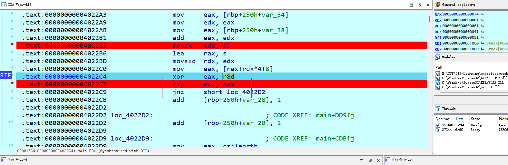
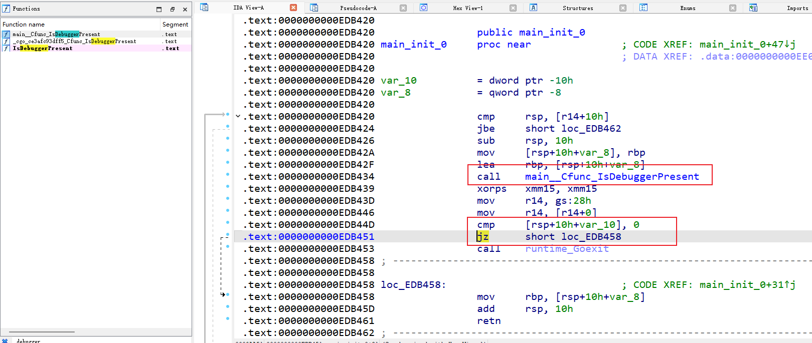
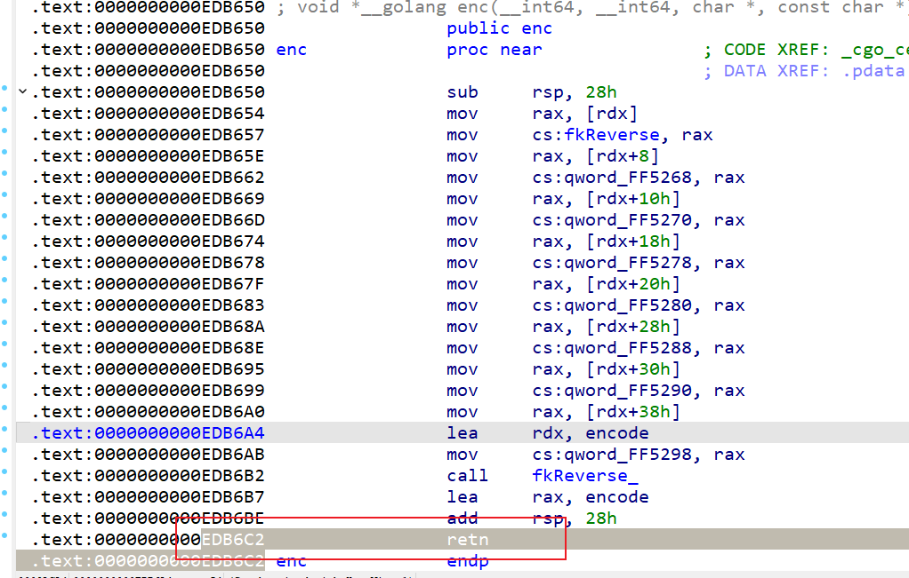
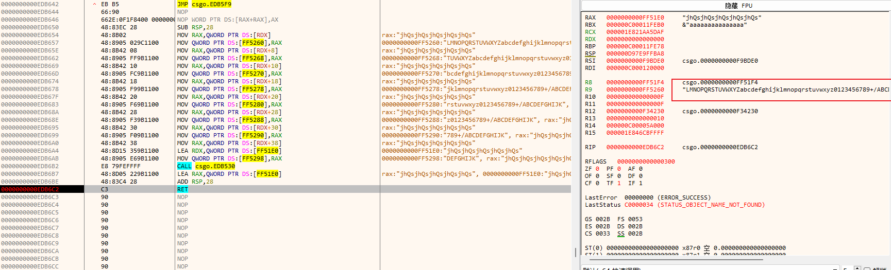
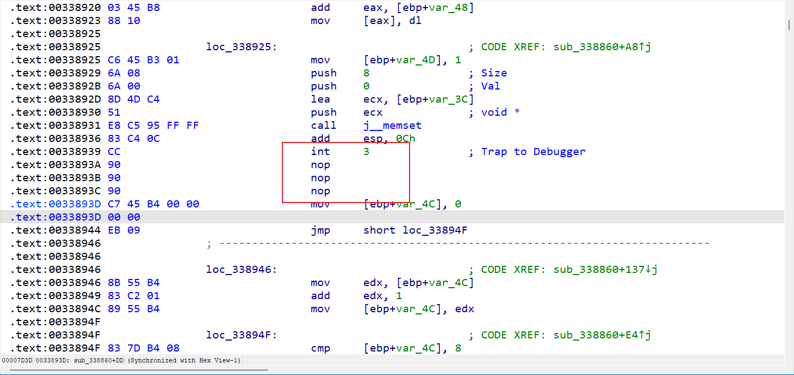
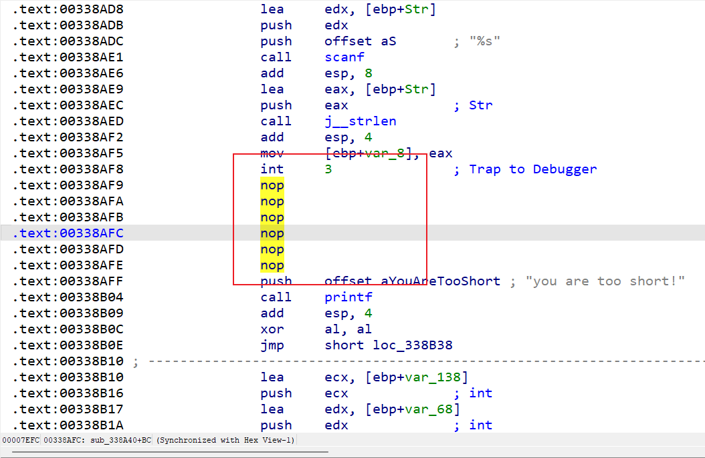
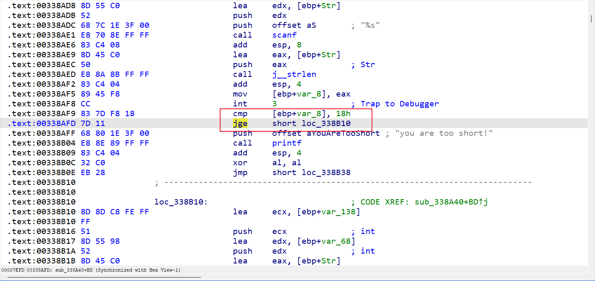

# Week 11（2024.11.25-2024.12.2）

## [NISACTF 2022]tears_confusion

https://www.nssctf.cn/problem/2040

挺有意思，考察反反编译，函数很大无法反编译

所以要该函数地址，跳转到正确函数然后动态调试，难点在于call后函数地址的确定

首先需要知道：call后一条指令的地址+call值=跳转函数地址

所以要跳转的地址0x4014F0-0x4013B5=0x13b，修改完patch下

在cmp上方找到字符比较，可以发现输入的并没有处理而是直接比较

所以直接在这个比较下个断点，编辑下断点写个让他打印chr(eax值)即可得到`f379eaf3c831b04de153469d1bec345e`

~~~python
print(chr(ida_dbg.get_reg_val("RAX")),end="")
~~~

## [HGAME 2022 week4]WOW

https://www.nssctf.cn/problem/1884

检查可以发现中间sub_1019B0对代码做了类似smc操作，动态调试可以知道memcmp是比较加密完的结果，memset后又进行了解密打印字符串，因此可以在中间比较的时候patch为相同结果，这样直接获取flag

~~~c
int __cdecl main(int argc, const char **argv, const char **envp)
{
  void *v4[16]; // [esp+0h] [ebp-168h] BYREF
  char v5[64]; // [esp+40h] [ebp-128h] BYREF
  struct _STARTUPINFOA StartupInfo; // [esp+80h] [ebp-E8h] BYREF
  char v7[64]; // [esp+C4h] [ebp-A4h] BYREF
  struct _PROCESS_INFORMATION ProcessInformation; // [esp+104h] [ebp-64h] BYREF
  _QWORD Buf2[5]; // [esp+114h] [ebp-54h] BYREF
  char v10[4]; // [esp+13Ch] [ebp-2Ch] BYREF
  int v11; // [esp+140h] [ebp-28h]
  int v12; // [esp+144h] [ebp-24h]
  int v13; // [esp+148h] [ebp-20h]
  int v14; // [esp+14Ch] [ebp-1Ch]
  int v15; // [esp+150h] [ebp-18h]
  int v16; // [esp+154h] [ebp-14h]
  int v17; // [esp+158h] [ebp-10h]
  int v18; // [esp+15Ch] [ebp-Ch]
  int v19; // [esp+160h] [ebp-8h]
  int i; // [esp+164h] [ebp-4h]

  memset(&StartupInfo, 0, sizeof(StartupInfo));
  StartupInfo.cb = 68;
  memset(&ProcessInformation, 0, sizeof(ProcessInformation));
  *(_DWORD *)v10 = 0;
  v11 = 0;
  v12 = 0;
  v13 = 0;
  v14 = 0;
  v15 = 0;
  v16 = 0;
  v17 = 0;
  v18 = 0;
  v19 = 0;
  memset(Buf2, 0, sizeof(Buf2));
  sub_101940();
  sub_101850((int)a12345678, (int)&unk_1051A0);
  sub_1012B0();
  printf(Format, (char)v4[0]);
  scanf(a40s, (char)v10);
  for ( i = 0; i < 4; ++i )
  {
    sub_101850((int)&v10[8 * i], (int)v5);
    sub_101410((int)v5, (int)v7);
    sub_1018D0((int)v7, (int)&Buf2[i]);
  }
  sub_1019B0();
  sub_1019B0();
  if ( memcmp(&unk_104D40, Buf2, 0x20u) )
  {
    printf(aError, (char)v4[0]);
    JUMPOUT(0x101CA8);
  }
  printf(aYouWin, (char)v4[0]);
  CreateProcessA(0, CommandLine, 0, 0, 0, 0, 0, 0, &StartupInfo, &ProcessInformation);
  memset(v10, 0, 0x28u);
  for ( i = 0; i < 4; ++i )
  {
    sub_101850((int)&Buf2[i], (int)v7);
    sub_101630((int)v7, (int)v4);
    sub_1018D0((int)v4, (int)&v10[8 * i]);
  }
  return 0;
}
~~~

这题怎么说呢有点坑，别急着直接去分析加密算法，还是大体读完所有代码再说（差点直接去爆破了）

## [NSSCTF 2nd]MyBase

https://www.nssctf.cn/problem/4257

乍一看以为只是简单的base64魔改，其实不然

这里新学到一个知识点setjmp和longjmp的[搭配](https://www.runoob.com/cprogramming/c-macro-setjmp.html)，概括而言就是直接调用setjmp和longjmp调用的setjmp返回值不同

下面这个代码可以看到每3个字符加密完就会更新一次base64 table

~~~c
_BYTE *__fastcall base64_encode(__int64 a1, unsigned __int64 a2, size_t *a3)
{
  unsigned __int64 v4; // rax
  unsigned __int64 v5; // rax
  int v6; // eax
  unsigned __int64 v7; // rax
  int v8; // eax
  __int64 v9; // rax
  unsigned int v10; // [rsp+28h] [rbp-28h]
  int v11; // [rsp+30h] [rbp-20h]
  int v12; // [rsp+34h] [rbp-1Ch]
  _BYTE *v13; // [rsp+38h] [rbp-18h]
  __int64 v14; // [rsp+40h] [rbp-10h]
  unsigned __int64 v15; // [rsp+48h] [rbp-8h]

  *a3 = 4 * ((a2 + 2) / 3);
  v13 = malloc(*a3);
  if ( !v13 )
    return 0i64;
  v15 = 0i64;
  v14 = 0i64;
  while ( v15 < a2 )
  {
    v4 = v15++;
    v12 = *(unsigned __int8 *)(a1 + v4);
    if ( v15 >= a2 )
    {
      v6 = 0;
    }
    else
    {
      v5 = v15++;
      v6 = *(unsigned __int8 *)(a1 + v5);
    }
    v11 = v6;
    if ( v15 >= a2 )
    {
      v8 = 0;
    }
    else
    {
      v7 = v15++;
      v8 = *(unsigned __int8 *)(a1 + v7);
    }
    v10 = (v11 << 8) + (v12 << 16) + v8;
    v13[v14] = base64_table[v8 & 0x3F];
    v13[v14 + 1] = base64_table[(v10 >> 6) & 0x3F];
    v13[v14 + 2] = base64_table[(v10 >> 12) & 0x3F];
    v9 = v14 + 3;
    v14 += 4i64;
    v13[v9] = base64_table[(v10 >> 18) & 0x3F];
    if ( !setjmp(env) )
      exception_handler();
  }
  if ( a2 % 3 == 1 )
  {
    v13[*a3 - 1] = 61;
  }
  else if ( a2 % 3 != 2 )
  {
    goto LABEL_18;
  }
  v13[*a3 - 2] = 61;
LABEL_18:
  v13[*a3] = 0;
  return v13;
}

void __noreturn exception_handler()
{
  generate_base64_table(base64_table);
  longjmp_0(env, 1);
}
~~~

直接下断点打印每轮加密的base64 table（输入27个字符，因为加密完36个字符）

~~~python
data = idc.get_bytes(0x404040, 65)
print('"%s"' % "".join(chr(b) for b in data))
~~~

解密即可

~~~python
import base64
tables = ["+86420ywusqomkigecaYWUSQOMKIGECABDFHJLNPRTVXZbdfhjlnprtvxz13579/",
"YsVO0tvT2o4puZ38j1dwf7MArGPNeQLDRHUK+SChbFanmklWEcgixXJIq6y5B/9z=",
"xDfpNE4LYH5Tk+MRtrlv1oFbQm0gP37eqIajh2syUnZcSV8iBK6O/XWuzdCwA9GJ=",
"YvHeOZECmTyg0Mw2i7PIGKblsfF59rzUk6p3hVdW1qaQ+xRANnXLj48BcJDotS/u=",
"xDfpNE4LYH5Tk+MRtrlv1oFbQm0gP37eqIajh2syUnZcSV8iBK6O/XWuzdCwA9GJ=",
"YvHeOZECmTyg0Mw2i7PIGKblsfF59rzUk6p3hVdW1qaQ+xRANnXLj48BcJDotS/u=",
"xDfpNE4LYH5Tk+MRtrlv1oFbQm0gP37eqIajh2syUnZcSV8iBK6O/XWuzdCwA9GJ=",
"YvHeOZECmTyg0Mw2i7PIGKblsfF59rzUk6p3hVdW1qaQ+xRANnXLj48BcJDotS/u=",
"xDfpNE4LYH5Tk+MRtrlv1oFbQm0gP37eqIajh2syUnZcSV8iBK6O/XWuzdCwA9GJ="]
cmp = "YkLYv1Xj23X7N0E5eoFgUveKeos1XS8K9r4g"
for i in range(9):
    correct_table = 'ABCDEFGHIJKLMNOPQRSTUVWXYZabcdefghijklmnopqrstuvwxyz0123456789+/'
    table = tables[i]
    c = cmp[i*4:i*4+4][::-1]
    new_c = []
    for i in range(len(c)):
        if c[i] != '=':
            new_c.append(correct_table[table.index(c[i])])
        else:
            new_c.append(c[i])
    print(base64.b64decode(''.join(new_c)).decode(), end="")
~~~

## [羊城杯 2023]CSGO

https://www.nssctf.cn/problem/4366

go逆向+反调试，来学习下，最近经常见到go反调试

第一种方法猜测：直接flag开头base64结果和真是结果对比下，找到真实base64表

第二种方法定位检查debugger的函数，patch成jnz即可

第三种x64dbg+sharpOD反反调试插件，直接找base64表修改完后的地址

在x64dbg里下同样位置的断点，插件开启下，F9即可跑到这里，就可以看到红框里新的base64表

## [羊城杯 2023]Blast

https://www.nssctf.cn/problem/4367

findcrypt有md5加密，结合后面多个32位字符串猜测做了加密，拿去somd5里解密可以发现是单个字符加密两次，因此可以爆破

~~~python
from hashlib import md5
s = b'14d89c38cd0fb23a14be2798d449c182\x00a94837b18f8f43f29448b40a6e7386ba\x00af85d512594fc84a5c65ec9970956ea5\x00af85d512594fc84a5c65ec9970956ea5\x0010e21da237a4a1491e769df6f4c3b419\x00a705e8280082f93f07e3486636f3827a\x00297e7ca127d2eef674c119331fe30dff\x00b5d2099e49bdb07b8176dff5e23b3c14\x0083be264eb452fcf0a1c322f2c7cbf987\x00a94837b18f8f43f29448b40a6e7386ba\x0071b0438bf46aa26928c7f5a371d619e1\x00a705e8280082f93f07e3486636f3827a\x00ac49073a7165f41c57eb2c1806a7092e\x00a94837b18f8f43f29448b40a6e7386ba\x00af85d512594fc84a5c65ec9970956ea5\x00ed108f6919ebadc8e809f8b86ef40b05\x0010e21da237a4a1491e769df6f4c3b419\x003cfd436919bc3107d68b912ee647f341\x00a705e8280082f93f07e3486636f3827a\x0065c162f7c43612ba1bdf4d0f2912bbc0\x0010e21da237a4a1491e769df6f4c3b419\x00a705e8280082f93f07e3486636f3827a\x003cfd436919bc3107d68b912ee647f341\x00557460d317ae874c924e9be336a83cbe\x00a705e8280082f93f07e3486636f3827a\x009203d8a26e241e63e4b35b3527440998\x0010e21da237a4a1491e769df6f4c3b419\x00f91b2663febba8a884487f7de5e1d249\x00a705e8280082f93f07e3486636f3827a\x00d7afde3e7059cd0a0fe09eec4b0008cd\x00488c428cd4a8d916deee7c1613c8b2fd\x0039abe4bca904bca5a11121955a2996bf\x00a705e8280082f93f07e3486636f3827a\x003cfd436919bc3107d68b912ee647f341\x0039abe4bca904bca5a11121955a2996bf\x004e44f1ac85cd60e3caa56bfd4afb675e\x0045cf8ddfae1d78741d8f1c622689e4af\x003cfd436919bc3107d68b912ee647f341\x0039abe4bca904bca5a11121955a2996bf\x004e44f1ac85cd60e3caa56bfd4afb675e\x0037327bb06c83cb29cefde1963ea588aa\x00a705e8280082f93f07e3486636f3827a\x0023e65a679105b85c5dc7034fded4fb5f\x0010e21da237a4a1491e769df6f4c3b419\x0071b0438bf46aa26928c7f5a371d619e1\x00af85d512594fc84a5c65ec9970956ea5\x0039abe4bca904bca5a11121955a2996bf\x00\x00'
s = s.split(b"\x00")
flag = ""
for i in range(len(s)):
    for j in range(32, 128):
        if md5(md5(chr(j).encode()).hexdigest().encode()).hexdigest() == s[i].decode():
            flag += chr(j)
            break
    if j == 127:
        print("AH???")
print(flag)

~~~

## [NSSRound#X Basic]Integer part

https://www.nssctf.cn/problem/3539

考察了个浮点数转换读取，struct转换下找到正确范围内的ascii

~~~python
import struct

with open("flag.txt", encoding="utf-8") as f:
    content = f.read()
data = content.split("\n")[3:]
float_data = []
for d in data:
    print(d.split()[1:7])
    float_data += d.split()[1:7]
for i in range(len(float_data)):
    float_data[i] = struct.unpack(">f", bytes.fromhex(float_data[i]))[0]
print(float_data)
flag = ""
for i in range(len(float_data)):
    if 32 < float_data[i] < 128:
        flag += chr(int(float_data[i]))
print(flag)
~~~

## [SWPU 2019]ReverseMe

https://www.nssctf.cn/problem/41

一道加密题，用的ZUC（祖冲之国密）算法，其实到最后还是原来的数组和另一个数组异或，因此调试也可以拿到异或的数组，但为了以后有脚本专门去找了脚本记录下

~~~python
import struct
from math import ceil

S0 = [
    0x3E, 0x72, 0x5B, 0x47, 0xCA, 0xE0, 0x00, 0x33, 0x04, 0xD1, 0x54, 0x98, 0x09, 0xB9, 0x6D, 0xCB,
    0x7B, 0x1B, 0xF9, 0x32, 0xAF, 0x9D, 0x6A, 0xA5, 0xB8, 0x2D, 0xFC, 0x1D, 0x08, 0x53, 0x03, 0x90,
    0x4D, 0x4E, 0x84, 0x99, 0xE4, 0xCE, 0xD9, 0x91, 0xDD, 0xB6, 0x85, 0x48, 0x8B, 0x29, 0x6E, 0xAC,
    0xCD, 0xC1, 0xF8, 0x1E, 0x73, 0x43, 0x69, 0xC6, 0xB5, 0xBD, 0xFD, 0x39, 0x63, 0x20, 0xD4, 0x38,
    0x76, 0x7D, 0xB2, 0xA7, 0xCF, 0xED, 0x57, 0xC5, 0xF3, 0x2C, 0xBB, 0x14, 0x21, 0x06, 0x55, 0x9B,
    0xE3, 0xEF, 0x5E, 0x31, 0x4F, 0x7F, 0x5A, 0xA4, 0x0D, 0x82, 0x51, 0x49, 0x5F, 0xBA, 0x58, 0x1C,
    0x4A, 0x16, 0xD5, 0x17, 0xA8, 0x92, 0x24, 0x1F, 0x8C, 0xFF, 0xD8, 0xAE, 0x2E, 0x01, 0xD3, 0xAD,
    0x3B, 0x4B, 0xDA, 0x46, 0xEB, 0xC9, 0xDE, 0x9A, 0x8F, 0x87, 0xD7, 0x3A, 0x80, 0x6F, 0x2F, 0xC8,
    0xB1, 0xB4, 0x37, 0xF7, 0x0A, 0x22, 0x13, 0x28, 0x7C, 0xCC, 0x3C, 0x89, 0xC7, 0xC3, 0x96, 0x56,
    0x07, 0xBF, 0x7E, 0xF0, 0x0B, 0x2B, 0x97, 0x52, 0x35, 0x41, 0x79, 0x61, 0xA6, 0x4C, 0x10, 0xFE,
    0xBC, 0x26, 0x95, 0x88, 0x8A, 0xB0, 0xA3, 0xFB, 0xC0, 0x18, 0x94, 0xF2, 0xE1, 0xE5, 0xE9, 0x5D,
    0xD0, 0xDC, 0x11, 0x66, 0x64, 0x5C, 0xEC, 0x59, 0x42, 0x75, 0x12, 0xF5, 0x74, 0x9C, 0xAA, 0x23,
    0x0E, 0x86, 0xAB, 0xBE, 0x2A, 0x02, 0xE7, 0x67, 0xE6, 0x44, 0xA2, 0x6C, 0xC2, 0x93, 0x9F, 0xF1,
    0xF6, 0xFA, 0x36, 0xD2, 0x50, 0x68, 0x9E, 0x62, 0x71, 0x15, 0x3D, 0xD6, 0x40, 0xC4, 0xE2, 0x0F,
    0x8E, 0x83, 0x77, 0x6B, 0x25, 0x05, 0x3F, 0x0C, 0x30, 0xEA, 0x70, 0xB7, 0xA1, 0xE8, 0xA9, 0x65,
    0x8D, 0x27, 0x1A, 0xDB, 0x81, 0xB3, 0xA0, 0xF4, 0x45, 0x7A, 0x19, 0xDF, 0xEE, 0x78, 0x34, 0x60
]

S1 = [
    0x55, 0xC2, 0x63, 0x71, 0x3B, 0xC8, 0x47, 0x86, 0x9F, 0x3C, 0xDA, 0x5B, 0x29, 0xAA, 0xFD, 0x77,
    0x8C, 0xC5, 0x94, 0x0C, 0xA6, 0x1A, 0x13, 0x00, 0xE3, 0xA8, 0x16, 0x72, 0x40, 0xF9, 0xF8, 0x42,
    0x44, 0x26, 0x68, 0x96, 0x81, 0xD9, 0x45, 0x3E, 0x10, 0x76, 0xC6, 0xA7, 0x8B, 0x39, 0x43, 0xE1,
    0x3A, 0xB5, 0x56, 0x2A, 0xC0, 0x6D, 0xB3, 0x05, 0x22, 0x66, 0xBF, 0xDC, 0x0B, 0xFA, 0x62, 0x48,
    0xDD, 0x20, 0x11, 0x06, 0x36, 0xC9, 0xC1, 0xCF, 0xF6, 0x27, 0x52, 0xBB, 0x69, 0xF5, 0xD4, 0x87,
    0x7F, 0x84, 0x4C, 0xD2, 0x9C, 0x57, 0xA4, 0xBC, 0x4F, 0x9A, 0xDF, 0xFE, 0xD6, 0x8D, 0x7A, 0xEB,
    0x2B, 0x53, 0xD8, 0x5C, 0xA1, 0x14, 0x17, 0xFB, 0x23, 0xD5, 0x7D, 0x30, 0x67, 0x73, 0x08, 0x09,
    0xEE, 0xB7, 0x70, 0x3F, 0x61, 0xB2, 0x19, 0x8E, 0x4E, 0xE5, 0x4B, 0x93, 0x8F, 0x5D, 0xDB, 0xA9,
    0xAD, 0xF1, 0xAE, 0x2E, 0xCB, 0x0D, 0xFC, 0xF4, 0x2D, 0x46, 0x6E, 0x1D, 0x97, 0xE8, 0xD1, 0xE9,
    0x4D, 0x37, 0xA5, 0x75, 0x5E, 0x83, 0x9E, 0xAB, 0x82, 0x9D, 0xB9, 0x1C, 0xE0, 0xCD, 0x49, 0x89,
    0x01, 0xB6, 0xBD, 0x58, 0x24, 0xA2, 0x5F, 0x38, 0x78, 0x99, 0x15, 0x90, 0x50, 0xB8, 0x95, 0xE4,
    0xD0, 0x91, 0xC7, 0xCE, 0xED, 0x0F, 0xB4, 0x6F, 0xA0, 0xCC, 0xF0, 0x02, 0x4A, 0x79, 0xC3, 0xDE,
    0xA3, 0xEF, 0xEA, 0x51, 0xE6, 0x6B, 0x18, 0xEC, 0x1B, 0x2C, 0x80, 0xF7, 0x74, 0xE7, 0xFF, 0x21,
    0x5A, 0x6A, 0x54, 0x1E, 0x41, 0x31, 0x92, 0x35, 0xC4, 0x33, 0x07, 0x0A, 0xBA, 0x7E, 0x0E, 0x34,
    0x88, 0xB1, 0x98, 0x7C, 0xF3, 0x3D, 0x60, 0x6C, 0x7B, 0xCA, 0xD3, 0x1F, 0x32, 0x65, 0x04, 0x28,
    0x64, 0xBE, 0x85, 0x9B, 0x2F, 0x59, 0x8A, 0xD7, 0xB0, 0x25, 0xAC, 0xAF, 0x12, 0x03, 0xE2, 0xF2
]

D = [
    0x44D7, 0x26BC, 0x626B, 0x135E, 0x5789, 0x35E2, 0x7135, 0x09AF,
    0x4D78, 0x2F13, 0x6BC4, 0x1AF1, 0x5E26, 0x3C4D, 0x789A, 0x47AC
]

def addition_uint31(a, b):
    c = a + b
    return (c & 0x7FFFFFFF) + (c >> 31)

def rotl_uint31(a, shift):
    return ((a << shift) | (a >> (31 - shift))) & 0x7FFFFFFF

def rotl_uint32(a, shift):
    return ((a << shift) | (a >> (32 - shift))) & 0xFFFFFFFF

def l1(x):
    return (x ^ rotl_uint32(x, 2) ^ rotl_uint32(x, 10) ^ rotl_uint32(x, 18) ^ rotl_uint32(x, 24))

def l2(x):
    return (x ^ rotl_uint32(x, 8) ^ rotl_uint32(x, 14) ^ rotl_uint32(x, 22) ^ rotl_uint32(x, 30))

def make_uint32(a, b, c, d):
    return ((a << 24) & 0xffffffff) | ((b << 16) & 0xffffffff) | ((c << 8) & 0xffffffff) | d

def make_uint31(a, b, c):
    return ((a << 23) & 0x7fffffff) | ((b << 8) & 0x7fffffff) | c

class ZUC(object):
    def __init__(self, key, iv):
        self.r = [0, 0]
        self.lfsr = [0 for _ in range(16)]
        self.x = [0, 0, 0, 0]
        self.zuc_init(key, iv)

    def bit_reorganization(self):
        self.x[0] = ((self.lfsr[15] & 0x7FFF8000) << 1) | (self.lfsr[14] & 0xFFFF)
        self.x[1] = ((self.lfsr[11] & 0xFFFF) << 16) | (self.lfsr[9] >> 15)
        self.x[2] = ((self.lfsr[7] & 0xFFFF) << 16) | (self.lfsr[5] >> 15)
        self.x[3] = ((self.lfsr[2] & 0xFFFF) << 16) | (self.lfsr[0] >> 15)

    def lfsr_next(self):
        f = self.lfsr[0]
        v = rotl_uint31(self.lfsr[0], 8)
        f = addition_uint31(f, v)
        v = rotl_uint31(self.lfsr[4], 20)
        f = addition_uint31(f, v)
        v = rotl_uint31(self.lfsr[10], 21)
        f = addition_uint31(f, v)
        v = rotl_uint31(self.lfsr[13], 17)
        f = addition_uint31(f, v)
        v = rotl_uint31(self.lfsr[15], 15)
        f = addition_uint31(f, v)
        return f

    def lfsr_append(self, f):
        self.lfsr.append(f)
        if len(self.lfsr) > 16:
            self.lfsr.pop(0)

    def lfsr_init(self, u):
        self.lfsr_append(addition_uint31(self.lfsr_next(), u))

    def lfsr_shift(self):
        self.lfsr_append(self.lfsr_next())

    def f(self):
        W = ((self.x[0] ^ self.r[0]) + self.r[1]) & 0xffffffff
        W1 = (self.r[0] + self.x[1]) & 0xffffffff
        W2 = self.r[1] ^ self.x[2]
        u = l1(((W1 & 0x0000ffff) << 16) | (W2 >> 16))
        v = l2(((W2 & 0x0000ffff) << 16) | (W1 >> 16))
        self.r = [make_uint32(S0[u >> 24], S1[(u >> 16) & 0xFF],
                              S0[(u >> 8) & 0xFF], S1[u & 0xFF]),
                  make_uint32(S0[v >> 24], S1[(v >> 16) & 0xFF],
                              S0[(v >> 8) & 0xFF], S1[v & 0xFF])]
        return W

    def zuc_init(self, key, iv):
        # Expand key.
        self.lfsr = [make_uint31(key[i], D[i], iv[i]) for i in range(16)]
        self.r = [0, 0]
        for i in range(32):
            self.bit_reorganization()
            w = self.f()
            self.lfsr_init(w >> 1)

    def zuc_generate_keystream(self, length):
        keystream_buffer = []
        self.bit_reorganization()
        self.f()  # Discard the output of F.

        def itor():
            self.lfsr_shift()
            self.bit_reorganization()
            return self.f() ^ self.x[-1]

        keystream_buffer = [itor() for _ in range(length)]
        self.lfsr_shift()
        return keystream_buffer

    def zuc_encrypt(self, input):
        length = len(input)
        key_stream = self.zuc_generate_keystream(length)
        return [inp ^ key_stream[i] for i, inp in enumerate(input)]		# 这里可以看到本质还是异或

if '__main__' == __name__:
    iv = [0x66, 0x03, 0x54, 0x92, 0x78, 0x00, 0x00, 0x00, 0x66, 0x03, 0x54, 0x92, 0x78, 0x00, 0x00, 0x00]
    key = [0x17, 0x3D, 0x14, 0xBA, 0x50, 0x03, 0x73, 0x1D, 0x7A, 0x60, 0x04, 0x94, 0x70, 0xF0, 0x0A, 0x29, 0x60]
    zuc = ZUC(key, iv)
    out = [0xF80F37B3, 0x5DAEBCBC, 0x864D5ABA, 0xD3629744, 0x1624BA4F, 0x1A729F0B, 0x266D6865, 0x67C86BBA]
    out = zuc.zuc_encrypt(out)
    str_list = []
    for i in range(len(out)):
        str_list.append(struct.pack('<I', out[i]))
    flag = list(b''.join(str_list))
    xor_key = b"SWPU_2019_CTF"
    for i in range(len(flag)):
        flag[i] ^= xor_key[i%len(xor_key)]
    print("".join(map(chr, flag)))

~~~

## [HGAME 2022 week4]server

https://www.nssctf.cn/problem/1885

头一次见到监听本地端口的，读读代码可知是go语言写的监听本地http 9090端口提交的flag参数值，对flag进行rsa加密然后再来两轮异或，可以直接爆破

爆破有两种思路，我的思路比较麻烦，属于完全的逆向，直接爆破数组倒数第二位，范围0-255，然后完全逆向回去，最后异或值必须等于102

另一种简单思路是爆破原始字符最后一位，然后先进行第二轮加密，在进行第一轮加密，要求最后第一轮加密完最后一个字符等于爆破的字符，范围0x30-0x3a

~~~python
import copy
from Crypto.Util.number import long_to_bytes
from gmpy2 import invert

p = 92582184765240663364795767694262273105045150785272129481762171937885924776597
q = 107310528658039985708896636559112400334262005367649176746429531274300859498993
n = p * q
phi = (p - 1) * (q - 1)
e = 950501
d = invert(e, phi)
c1 = [0x0000000000000063, 0x0000000000000055, 0x0000000000000004, 0x0000000000000003, 0x0000000000000005, 0x0000000000000005, 0x0000000000000005, 0x0000000000000003, 0x0000000000000007, 0x0000000000000007, 0x0000000000000002, 0x0000000000000008, 0x0000000000000008, 0x000000000000000B, 0x0000000000000001, 0x0000000000000002, 0x000000000000000A, 0x0000000000000004, 0x0000000000000002, 0x000000000000000D, 0x0000000000000008, 0x0000000000000009, 0x000000000000000C, 0x0000000000000009, 0x0000000000000004, 0x000000000000000D, 0x0000000000000008, 0x0000000000000000, 0x000000000000000E, 0x0000000000000000, 0x000000000000000F, 0x000000000000000D, 0x000000000000000E, 0x000000000000000A, 0x0000000000000002, 0x0000000000000002, 0x0000000000000001, 0x0000000000000007, 0x0000000000000003, 0x0000000000000005, 0x0000000000000006, 0x0000000000000004, 0x0000000000000006, 0x0000000000000007, 0x0000000000000006, 0x0000000000000002, 0x0000000000000002, 0x0000000000000005, 0x0000000000000003, 0x0000000000000003, 0x0000000000000009, 0x0000000000000006, 0x0000000000000000, 0x000000000000000B, 0x000000000000000D, 0x000000000000000B, 0x0000000000000000, 0x0000000000000002, 0x0000000000000003, 0x0000000000000008, 0x0000000000000003, 0x000000000000000B, 0x0000000000000007, 0x0000000000000001, 0x000000000000000B, 0x0000000000000005, 0x000000000000000E, 0x0000000000000005, 0x0000000000000000, 0x000000000000000A, 0x000000000000000E, 0x000000000000000F, 0x000000000000000D, 0x0000000000000007, 0x000000000000000D, 0x0000000000000007, 0x000000000000000E, 0x0000000000000001, 0x000000000000000F, 0x0000000000000001, 0x000000000000000B, 0x0000000000000005, 0x0000000000000006, 0x0000000000000002, 0x000000000000000C, 0x0000000000000006, 0x000000000000000A, 0x0000000000000004, 0x0000000000000001, 0x0000000000000007, 0x0000000000000004, 0x0000000000000002, 0x0000000000000006, 0x0000000000000003, 0x0000000000000006, 0x000000000000000C, 0x0000000000000005, 0x000000000000000C, 0x0000000000000003, 0x000000000000000C, 0x0000000000000006, 0x0000000000000000, 0x0000000000000004, 0x000000000000000F, 0x0000000000000002, 0x000000000000000E, 0x0000000000000007, 0x0000000000000000, 0x000000000000000E, 0x000000000000000E, 0x000000000000000C, 0x0000000000000004, 0x0000000000000003, 0x0000000000000004, 0x0000000000000002, 0x0000000000000000, 0x0000000000000000, 0x0000000000000002, 0x0000000000000006, 0x0000000000000002, 0x0000000000000003, 0x0000000000000006, 0x0000000000000004, 0x0000000000000004, 0x0000000000000004, 0x0000000000000007, 0x0000000000000001, 0x0000000000000002, 0x0000000000000003, 0x0000000000000009, 0x0000000000000002, 0x000000000000000C, 0x0000000000000008, 0x0000000000000001, 0x000000000000000C, 0x0000000000000003, 0x000000000000000C, 0x0000000000000002, 0x0000000000000000, 0x0000000000000003, 0x000000000000000E, 0x0000000000000003, 0x000000000000000E, 0x000000000000000C, 0x0000000000000009, 0x0000000000000001, 0x0000000000000007, 0x000000000000000F, 0x0000000000000005, 0x0000000000000007, 0x0000000000000002, 0x0000000000000002, 0x0000000000000004]
for j in range(256):
    c = copy.deepcopy(c1)
    xor = j
    c[-1] ^= xor
    for i in range(len(c)-2, -1, -1):
        v = xor
        xor ^= c[i]
        c[i] = v
    for i in range(len(c)-1, -1, -1):
        v = xor
        xor ^= c[i]
        c[i] = v
    if xor == 102:
        try:
            c = int("".join(map(chr, c)))
            break
        except:
            continue
m = pow(c, d, n)
print(long_to_bytes(m))

~~~

## [HNCTF 2022 WEEK4]findit

https://www.nssctf.cn/problem/3109

垃圾题目，不知道咋出的，思路太乱了。唯一可以学习下dfs写法，经常碰见

解题思路：先md5解密（somd5）找到key，然后逆向

~~~python
import copy

cmp = [29, 70, 92, 84, 87, 19, 61, 43, 62, 60, 29, 9, 18, 63, 6, 6, 42, 14, 124, 110, 109, 60, 105, 160, 184, 135, 62, 128, 92, 61, 223, 179]
def dfs(cmp, index):
    if index == -1:
        key = b"HN_CTF"
        for i in range(len(cmp)):
            cmp[i] ^= key[i//4%6]
        for i in range(0, len(cmp), 4):
            cmp[i], cmp[i+1], cmp[i+2], cmp[i+3] = cmp[i+3], cmp[i], cmp[i+2], cmp[i+1]
        print("".join(map(chr, cmp)))
    for i in range(256):
        if cmp[index+1] ^ i ^ ((i + 12) % 24) ^ (index+18) == cmp[index]:
            tmp = copy.deepcopy(cmp)
            tmp[index] = i
            dfs(tmp, index-1)

dfs(cmp, 30)

~~~

然后一堆解还有乱码，真是服了

## [SWPU 2019]EasiestRe

https://www.nssctf.cn/problem/40

主函数如下：

~~~python
int __cdecl main_0(int argc, const char **argv, const char **envp)
{
  PVOID lpBaseAddress; // [esp+18h] [ebp-558h]
  char v5; // [esp+1Fh] [ebp-551h]
  DWORD dwContinueStatus; // [esp+20h] [ebp-550h]
  struct _DEBUG_EVENT DebugEvent; // [esp+28h] [ebp-548h] BYREF
  char v8; // [esp+8Fh] [ebp-4E1h]
  CONTEXT Context; // [esp+94h] [ebp-4DCh] BYREF
  HANDLE hThread; // [esp+364h] [ebp-20Ch]
  int i; // [esp+368h] [ebp-208h]
  SIZE_T NumberOfBytesRead[3]; // [esp+370h] [ebp-200h] BYREF
  SIZE_T NumberOfBytesWritten[3]; // [esp+37Ch] [ebp-1F4h] BYREF
  char Buffer[60]; // [esp+388h] [ebp-1E8h] BYREF
  char v15[40]; // [esp+3C4h] [ebp-1ACh] BYREF
  char v16[16]; // [esp+3ECh] [ebp-184h] BYREF
  struct _STARTUPINFOA StartupInfo; // [esp+3FCh] [ebp-174h] BYREF
  struct _PROCESS_INFORMATION ProcessInformation; // [esp+448h] [ebp-128h] BYREF
  CHAR Filename[267]; // [esp+460h] [ebp-110h] BYREF

  memset(&ProcessInformation, 0, sizeof(ProcessInformation));
  j__memset(&StartupInfo, 0, sizeof(StartupInfo));
  v16[0] = -112;
  v16[1] = -125;
  v16[2] = 125;
  v16[3] = -8;
  v16[4] = 24;
  v16[5] = 125;
  v16[6] = 17;
  v15[0] = -112;
  v15[1] = 15;
  v15[2] = -74;
  v15[3] = 85;
  v15[4] = -9;
  v15[5] = -117;
  v15[6] = 69;
  v15[7] = 8;
  v15[8] = -117;
  v15[9] = 4;
  v15[10] = -112;
  v15[11] = 15;
  v15[12] = -81;
  v15[13] = 69;
  v15[14] = -4;
  v15[15] = 51;
  v15[16] = -46;
  v15[17] = -9;
  v15[18] = 117;
  v15[19] = -8;
  v15[20] = 15;
  v15[21] = -74;
  v15[22] = 77;
  v15[23] = -9;
  v15[24] = -117;
  v15[25] = 69;
  v15[26] = 12;
  v15[27] = -119;
  v15[28] = 20;
  v15[29] = 0x88;
  j__memset(Buffer, 0, 0x32u);
  NumberOfBytesWritten[0] = 0;
  i = 0;
  v8 = 1;
  if ( IsDebuggerPresent() )
  {
    sub_333922();
    return 0;
  }
  else
  {
    GetStartupInfoA(&StartupInfo);
    GetModuleFileNameA(0, Filename, 0x104u);
    if ( CreateProcessA(Filename, 0, 0, 0, 0, 3u, 0, 0, &StartupInfo, &ProcessInformation) )
    {
      v5 = 1;
      while ( v5 )
      {
        dwContinueStatus = 65538;
        WaitForDebugEvent(&DebugEvent, 0xFFFFFFFF);
        switch ( DebugEvent.dwDebugEventCode )
        {
          case 1u:
            if ( DebugEvent.u.Exception.ExceptionRecord.ExceptionCode == 0x80000003 )
            {
              v8 = 1;
              dwContinueStatus = 65538;
              lpBaseAddress = DebugEvent.u.Exception.ExceptionRecord.ExceptionAddress;
              ReadProcessMemory(
                ProcessInformation.hProcess,
                DebugEvent.u.Exception.ExceptionRecord.ExceptionAddress,
                Buffer,
                0x23u,
                NumberOfBytesRead);
              if ( NumberOfBytesRead[0] )
              {
                for ( i = 1; i < 35 && (unsigned __int8)Buffer[i] == 0x90; ++i )	# 检查nop数目
                  ;
              }
              if ( i == 1 )
                v8 = 0;
              if ( v8 )
              {
                switch ( i )
                {
                  case 4:
                    Context.ContextFlags = 65543;
                    hThread = OpenThread(0x1FFFFFu, 0, DebugEvent.dwThreadId);
                    if ( !GetThreadContext(hThread, &Context) )
                      goto LABEL_33;
                    ++Context.Eip;
                    if ( SetThreadContext(hThread, &Context) )
                    {
                      dwContinueStatus = 65538;
                      CloseHandle(hThread);
                    }
                    break;
                  case 5:
LABEL_33:
                    dwContinueStatus = -2147418111;
                    break;
                  case 7:
                    WriteProcessMemory(ProcessInformation.hProcess, lpBaseAddress, v16, 7u, NumberOfBytesWritten);
                    if ( NumberOfBytesWritten[0] == 7 )
                    {
                      ReadProcessMemory(ProcessInformation.hProcess, lpBaseAddress, Buffer, 7u, NumberOfBytesRead);
                      dwContinueStatus = 65538;
                    }
                    break;
                  case 30:
                    WriteProcessMemory(ProcessInformation.hProcess, lpBaseAddress, v15, 0x1Eu, NumberOfBytesWritten);
                    if ( NumberOfBytesWritten[0] == 30 )
                      dwContinueStatus = 65538;
                    break;
                  default:
                    goto LABEL_35;
                }
              }
              else
              {
                dwContinueStatus = -2147418111;
              }
            }
            break;
          case 2u:
            dwContinueStatus = 65538;
            break;
          case 3u:
            dwContinueStatus = 65538;
            break;
          case 4u:
            dwContinueStatus = 65538;
            v5 = 0;
            break;
          case 5u:
            dwContinueStatus = 65538;
            v5 = 0;
            break;
          case 6u:
            dwContinueStatus = 65538;
            break;
          default:
            break;
        }
LABEL_35:
        ContinueDebugEvent(DebugEvent.dwProcessId, DebugEvent.dwThreadId, dwContinueStatus);
      }
      return 0;
    }
    else
    {
      return 0;
    }
  }
}
~~~

参考[DebugEvent.dwDebugEventCode](https://learn.microsoft.com/zh-cn/windows/win32/api/minwinbase/ns-minwinbase-debug_event)可知，主程序负责调试子程序，通过调试事件类型来控制不同操作

dwDebugEventCode值为1且DebugEvent.u.Exception.ExceptionRecord.ExceptionCode == 0x80000003（触发断点时引发的异常）时才开始各种操作（int3+nop）

当读取nop指令数目为3时，eip++跳过当前指令继续执行，直接nop掉int 3即可

当读取nop指令数目为6时，用v16来覆盖相应代码区域；

我们可以直接ida change bytes

当读取nop指令数目为29时，用v15来覆盖相应代码区域，同理找到这个地方然后change bytes即可

~~~python
v15 = [-112, 15, -74, 85, -9, -117, 69, 8, -117, 4, -112, 15, -81, 69, -4, 51, -46, -9, 117, -8, 15, -74, 77, -9, -117, 69, 12, -119, 20, 136]

for i in range(0x338825, 0x338825+29):
    idc.patch_byte(i, v15[i-0x338825])
~~~

至此还原所有加密逻辑，反编译代码如下

~~~c
char sub_338A40()
{
  int v1[52]; // [esp+8h] [ebp-138h] BYREF
  int v2[10]; // [esp+D8h] [ebp-68h] BYREF
  char Str[56]; // [esp+100h] [ebp-40h] BYREF
  int v4; // [esp+138h] [ebp-8h]

  v4 = 0;
  j__memset(Str, 0, 0x32u);
  v2[0] = 2;
  v2[1] = 3;
  v2[2] = 7;
  v2[3] = 14;
  v2[4] = 30;
  v2[5] = 57;
  v2[6] = 120;
  v2[7] = 251;
  j__memset(v1, 0, 0xC8u);
  printf("Please Input Flag:\n");
  scanf("%s", Str);
  v4 = j__strlen(Str);
  __debugbreak();
  if ( v4 >= 24 )
  {
    sub_33247D(Str, (int)v2, (int)v1);
    sub_33384B(v1);
    return 1;
  }
  else
  {
    printf("you are too short!");
    return 0;
  }
}
// attributes: thunk
void __usercall sub_33460B(int a1@<ebx>, _DWORD *a2)
{
  sub_3387E0(a1, a2);
}
void __usercall sub_3387E0(int a1@<ebx>, _DWORD *a2)
{
  int savedregs; // [esp+Ch] [ebp+0h] BYREF

  __debugbreak();
  *(_DWORD *)(a1 + 8 * (_DWORD)&savedregs) = 41 * *a2 % 0x1EBu;
  __asm { iret }
}
char __cdecl sub_338860(char *Str, int a2, int a3)
{
  unsigned __int8 v4; // [esp+Fh] [ebp-4Dh]
  int j; // [esp+10h] [ebp-4Ch]
  int k; // [esp+10h] [ebp-4Ch]
  int i; // [esp+14h] [ebp-48h]
  unsigned __int8 v8; // [esp+1Bh] [ebp-41h]
  int v9[4]; // [esp+20h] [ebp-3Ch] BYREF
  int v10[9]; // [esp+30h] [ebp-2Ch] BYREF
  int v11; // [esp+54h] [ebp-8h]

  v11 = 4660;
  memset(v10, 0, 32);
  v9[0] = 0;
  v9[1] = 0;
  v8 = j__strlen(Str);
  sub_33460B(a2, v10);
  for ( i = 0; i < v8; ++i )
  {
    if ( i )
      Str[i] ^= *(_BYTE *)(a3 + 4 * i - 4);
    else
      *Str ^= v11;
    v4 = 1;
    j__memset(v9, 0, 8u);
    for ( j = 0; j < 8; ++j )
    {
      if ( (v4 & Str[i]) != 0 )
      {
        *((_BYTE *)v9 + j) = 1;
      }
      else
      {
        if ( (unsigned int)j >= 8 )
          j____report_rangecheckfailure();
        *((_BYTE *)v9 + j) = 0;
      }
      v4 *= 2;
    }
    for ( k = 0; k < 8; ++k )
      *(_DWORD *)(a3 + 4 * i) += v10[7 - k] * *((unsigned __int8 *)v9 + k);
  }
  return 1;
}
~~~

是个背包加密算法，感觉很少用，网上找了wp学习了下

~~~python
c = [2, 3, 7, 14, 30, 57, 0x78, 251]
v = [977, 752, 82, 1141, 466, 752, 548, 1308, 1254, 671, 750, 923, 1017, 811, 754, 1461, 588, 1114, 844, 1389, 10, 1254, 1142, 729]
# for i in range(len(c)):
#     c[i] = 41 * c[i] % 0x1EB
inv = 12	# 求模逆 invert(41, 0x1eb)
c = c[::-1]
arr = []
for i in range(24):
    dec = v[i] * inv % 0x1eb
    ascii_char = 0
    for j in range(8):
        if dec >= c[j]:
            ascii_char += 2**j
            dec -= c[j]
    arr.append(ascii_char)
f = [4460]
f.extend(v)
flag = "".join(chr((arr[i]^f[i])%256) for i in range(24))
print(flag)

~~~

## [GKCTF 2020]Chelly's identity

https://www.nssctf.cn/problem/1316

题目很简单，加密方法是当前字符异或所有小于自身的质数和。可以学习的是ida参数识别的问题，这类代码有个特点就是函数特别多，很多嵌套

~~~c
int __cdecl sub_69B3B0(_DWORD *a1)
{
  _DWORD *i; // eax
  unsigned int v3; // [esp+D0h] [ebp-60h]
  int v4; // [esp+DCh] [ebp-54h]
  int v5; // [esp+F4h] [ebp-3Ch]
  _DWORD *v6; // [esp+100h] [ebp-30h]
  char v7[20]; // [esp+118h] [ebp-18h] BYREF

  __CheckForDebuggerJustMyCode(&unk_6AD027);
  sub_6912F8(0x10u);
  sub_6916E0((int)v7, 128);
  v6 = (_DWORD *)sub_691456(a1);
  v5 = sub_691375(a1);
  while ( v6 != (_DWORD *)v5 )
  {
    v4 = 0;
    v3 = 0;
    for ( i = (_DWORD *)sub_691325(v7, 0); *i < *v6; i = (_DWORD *)sub_691325(v7, v3) )
      v4 += *(_DWORD *)sub_691325(v7, v3++);
    *v6++ ^= v4;
  }
  return sub_6914D3(v7);
}
// attributes: thunk
int __cdecl sub_691721(_DWORD *a1)
{
  return sub_69B3B0(a1);
}
int __cdecl main_0(int argc, const char **argv, const char **envp)
{
  int v3; // eax
  int v4; // eax
  int v5; // eax
  int v6; // eax
  int v7; // esi
  int v8; // eax
  int v9; // eax
  int v10; // eax
  int v11; // eax
  int v13; // [esp+0h] [ebp-140h]
  int v14; // [esp+0h] [ebp-140h]
  int v15; // [esp+0h] [ebp-140h]
  int v16; // [esp+4h] [ebp-13Ch]
  int v17; // [esp+4h] [ebp-13Ch]
  int v18; // [esp+4h] [ebp-13Ch]
  int v19[51]; // [esp+20h] [ebp-120h] BYREF
  unsigned int i; // [esp+ECh] [ebp-54h]
  _DWORD v21[6]; // [esp+F8h] [ebp-48h] BYREF
  char v22[32]; // [esp+110h] [ebp-30h] BYREF
  int v23; // [esp+13Ch] [ebp-4h]

  __CheckForDebuggerJustMyCode(&unk_6AD027);
  sub_691109();
  v23 = 0;
  v3 = sub_6913C5(std::cout, "hi.Are you know of chelly?");
  std::ostream::operator<<(v3, sub_691532);
  v4 = sub_6913C5(std::cout, "Can you speak chelly's identity?");
  std::ostream::operator<<(v4, sub_691532);
  v5 = sub_6913C5(std::cout, "if you can, I will give you flag.");
  std::ostream::operator<<(v5, sub_691532);
  v6 = sub_6913C5(std::cout, "Give your answer:");
  std::ostream::operator<<(v6, sub_691532);
  sub_6910FA(std::cin, v22);
  sub_6912F8(0x10u);
  sub_69132A(v13, v16);
  LOBYTE(v23) = 1;
  for ( i = 0; ; ++i )
  {
    v7 = sub_691771(v14, v17);
    if ( v7 == sub_6911D6(v15, v18) )
      break;
    v19[0] = *(char *)sub_691528(v22, i);
    sub_6915D2((int)v19);
  }
  check_len((int)v21);                          // len 16
  sub_691721(v21);                              // 异或小于自身的素数和
  if ( (unsigned __int8)sub_691852((int)v21) )
  {
    v8 = sub_6913C5(std::cout, "You do know Chelly!!!! ");
    v9 = std::ostream::operator<<(v8, sub_691532);
    v10 = sub_6913C5(v9, (char *)sub_691532);
    std::ostream::operator<<(v10, v14);
  }
  else
  {
    v11 = sub_6913C5(std::cout, "it's not chelly's identity.");
    std::ostream::operator<<(v11, sub_691532);
  }
  system("pause");
  LOBYTE(v23) = 0;
  sub_6914D3(v21);
  v23 = -1;
  sub_69146F(v14, v17);
  return 0;
}
~~~

有时候ida识别不准确，可能少识别了参数，可以进到最底层函数（最后被调用的函数）一层层往回F5重新分析代码，可以增加识别准确率，动态调试可以辅助验证下加密逻辑（经验之谈）

~~~python
from gmpy2 import is_prime

prime_list = []
for i in range(128):
    if is_prime(i):
        prime_list.append(i)
print(prime_list)
cmp = [438, 1176, 1089, 377, 377, 1600, 924, 377, 1610, 924, 637, 639, 376, 566, 836, 830]
flag = ""
xor_list = []
for i in range(32, 128):
    sum = 0
    for j in prime_list:
        if j < i:
            sum += j
    xor_list.append(sum^i)
flag = ""
for i in range(len(cmp)):
    flag += chr(xor_list.index(cmp[i])+32)
print(flag)
~~~

## [watevrCTF 2019]Hacking For Vodka

https://www.nssctf.cn/problem/81

题目出的很简单，考察到了2022强网杯一道题里也有的ptrace，第一个参数传入[PTRACE_TRACEME](https://bbs.kanxue.com/thread-274679.htm)时相当于反调试，如果附加成功说明没被调试，返回值等于0，否则返回值为-1

~~~c
void __fastcall __noreturn main(int a1, char **a2, char **a3)
{
  if ( ptrace(PTRACE_TRACEME, 0LL, 1LL, 0LL) < 0 )
    sub_102E();
  sub_12BF();
  exit(0);
}
~~~

## [NSSRound#18 Basic]新年礼物

https://www.nssctf.cn/problem/5114

exe里隐藏了dll（string可以看到）我还搜了半天dll，最后直接010editor复制第二个MZ~结尾到新的dll，dnspy即可反编译

~~~c#
// Program
// Token: 0x06000006 RID: 6 RVA: 0x00002098 File Offset: 0x00000298
public static void Main()
{
	Console.WriteLine("Hello, 新年快乐!");
	Console.WriteLine("给我一个sha256后和sha256('NSSCTF2024')前几字符一样的字符串，13%概率给你flag");
	Console.Write("请输入一个字符串: ");
	string text = Console.ReadLine();
	if (text == "NSSCTF2024")
	{
		Console.WriteLine("输入不能是NSSCTF2024，请重新输入。");
		return;
	}
	string sha256Hash = Program.GetSHA256Hash(text);
	string sha256Hash2 = Program.GetSHA256Hash("NSSCTF2024");
	string text2 = sha256Hash.Substring(0, 7);
	string value = sha256Hash2.Substring(0, 7);
	text2.Equals(value);
	long num = DateTimeOffset.Now.ToUnixTimeMilliseconds() % 16L;
	int[] array = new int[text2.Length];
	for (int i = 0; i < text2.Length; i++)
	{
		int num2 = Convert.ToInt32(text2.Substring(i, 1), 16);
		array[i] = num2;
	}
	int[] encryptedArray = new int[]
	{
		129,
		75,
		102,
		116,
		123,
		118,
		103,
		127,
		122,
		126,
		105,
		114,
		103,
		105,
		126,
		105,
		122,
		122,
		97,
		76,
		103,
		110,
		103,
		122,
		118,
		124,
		114,
		111,
		109,
		112,
		115,
		109,
		118,
		112,
		100,
		111,
		98,
		103,
		125,
		141,
		115,
		32,
		121,
		112,
		102,
		122,
		123,
		118,
		101,
		126,
		107,
		119,
		119,
		143,
		111,
		100,
		126,
		107,
		122,
		118,
		123,
		118,
		107,
		114,
		102,
		102,
		126,
		127,
		118,
		121,
		135
	};
	int key = Convert.ToInt32(sha256Hash.Substring(7, 1).ToString(), 16);
	string text3 = Program.Decrypt(encryptedArray, array, key);
	if (text3.StartsWith("{Hap"))
	{
		Console.WriteLine("给你flag，NSSCTF" + text3);
		return;
	}
	Console.WriteLine("可能只是运气不好，再试试吧！");
}

~~~

直接改编成python代码运行即可

~~~python
from hashlib import sha256
hash_value = sha256(b"NSSCTF2024").hexdigest()[:8]
hash_value = [int(i, 16) for i in hash_value]
enc = [129,75,102,116,123,118,103,127,122,126,105,114,103,105,126,105,122,122,97,76,103,110,103,122,118,124,114,111,109,112,115,109,118,112,100,111,98,103,125,141,115,32,121,112,102,122,123,118,101,126,107,119,119,143,111,100,126,107,122,118,123,118,107,114,102,102,126,127,118,121,135]
num = 0
key = hash_value[-1]
flag = "NSSCTF"
for i in range(len(enc)):
    flag += chr(((enc[i] ^ hash_value[(num + 1) % 7]) - hash_value[num % 7])&0xff)
    num += key
print(flag)
~~~

## [SUCTF 2018 招新赛]basic-re

https://www.nssctf.cn/problem/2326

~~~c
int __fastcall main_0(int argc, const char **argv, const char **envp)
{
  char *v3; // rdi
  __int64 i; // rcx
  char v6; // [rsp+0h] [rbp-20h] BYREF
  char v7[32]; // [rsp+30h] [rbp+10h]
  char v8[184]; // [rsp+50h] [rbp+30h] BYREF
  char v9[60]; // [rsp+108h] [rbp+E8h] BYREF
  unsigned int v10[8]; // [rsp+144h] [rbp+124h] BYREF
  int j; // [rsp+164h] [rbp+144h]
  int v12; // [rsp+234h] [rbp+214h]
  int v13; // [rsp+238h] [rbp+218h]

  v3 = &v6;
  for ( i = 150i64; i; --i )
  {
    *(_DWORD *)v3 = -858993460;
    v3 += 4;
  }
  j___CheckForDebuggerJustMyCode(&unk_140023035, argv, envp);
  v7[0] = 2;
  v7[1] = 3;
  v7[2] = 2;
  v7[3] = 1;
  v7[4] = 4;
  v7[5] = 7;
  v7[6] = 4;
  v7[7] = 5;
  v7[8] = 10;
  v7[9] = 11;
  v7[10] = 10;
  v7[11] = 9;
  v7[12] = 14;
  v7[13] = 15;
  v7[14] = 12;
  v7[15] = 13;
  v7[16] = 16;
  v7[17] = 19;
  v7[18] = 16;
  v7[19] = 17;
  v7[20] = 20;
  v7[21] = 23;
  v7[22] = 22;
  v7[23] = 19;
  v7[24] = 28;
  v7[25] = 25;
  v7[26] = 30;
  v7[27] = 31;
  v7[28] = 28;
  v7[29] = 25;
  v7[30] = 26;
  v7[31] = 31;
  qmemcpy(v8, "$!\"'$!\"#().+$-&/81:;4=>7092;<567HIBBDDFGHIJJMMONPPRSUTVWYYZ[\\]^^``ccdeggiikklmnnpprstuwwxy{{}}", 94);
  v8[94] = 127;
  v8[95] = 127;
  v8[96] = -127;
  v8[97] = -127;
  v8[98] = -125;
  v8[99] = -125;
  v8[100] = -116;
  v8[101] = -115;
  v8[102] = -114;
  v8[103] = -113;
  v8[104] = -120;
  v8[105] = -119;
  v8[106] = -118;
  v8[107] = -117;
  v8[108] = -116;
  v8[109] = -115;
  v8[110] = -114;
  v8[111] = -121;
  v8[112] = -104;
  v8[113] = -111;
  v8[114] = -110;
  v8[115] = -109;
  v8[116] = -108;
  v8[117] = -107;
  v8[118] = -106;
  v8[119] = -105;
  v8[120] = -104;
  v8[121] = -103;
  v8[122] = -102;
  v8[123] = -102;
  v8[124] = -100;
  v8[125] = -100;
  v8[126] = -98;
  v8[127] = -98;
  v8[128] = -96;
  v8[129] = -96;
  v8[130] = -94;
  v8[131] = -94;
  v8[132] = -92;
  v8[133] = -92;
  v8[134] = -90;
  v8[135] = -90;
  v8[136] = -88;
  v8[137] = -88;
  v8[138] = -86;
  v8[139] = -86;
  v8[140] = -84;
  v8[141] = -84;
  v8[142] = -82;
  v8[143] = -82;
  v8[144] = -80;
  v8[145] = -79;
  v8[146] = -78;
  v8[147] = -77;
  memset(v9, 0, 0x1Fui64);
  sub_140011159(std::cout, "flag format: SUCTF{xxxxxxxxxxxxxxx}\n");
  sub_140011159(std::cout, "Please Input Key:");
  std::istream::operator>>(std::cin, v10);
  v10[0] %= 0x10000u;
  v9[30] = 8;
  while ( v9[30] )
  {
    --v9[30];
    for ( j = 22; j; v9[j] |= v13 << v9[30] )
    {
      v12 = v7[22 * v9[30] + --j];
      v13 = (v12 >> ((v10[0] >> (2 * v9[30])) & 3)) & 1;
    }
  }
  sub_140011159(std::cout, v9);
  system("pause");
  return 0;
}
~~~

c++直接开爆，注意每次爆破初始化v9

~~~c++
#include<iostream>
#include <string.h>
using namespace std;

int main()
{
  char v6; // [rsp+0h] [rbp-20h] BYREF
  unsigned int v10[8]; // [rsp+144h] [rbp+124h] BYREF
  int j; // [rsp+164h] [rbp+144h]
  int v12; // [rsp+234h] [rbp+214h]
  int v13; // [rsp+238h] [rbp+218h]

  char v7[180] = {2, 3, 2, 1, 4, 7, 4, 5, 10, 11, 10, 9, 14, 15, 12, 13, 16, 19, 16, 17, 20, 23, 22, 19, 28, 25, 30, 31, 28, 25, 26, 31, 36, 33, 34, 39, 36, 33, 34, 35, 40, 41, 46, 43, 36, 45, 38, 47, 56, 49, 58, 59, 52, 61, 62, 55, 48, 57, 50, 59, 60, 53, 54, 55, 72, 73, 66, 66, 68, 68, 70, 71, 72, 73, 74, 74, 77, 77, 79, 78, 80, 80, 82, 83, 85, 84, 86, 87, 89, 89, 90, 91, 92, 93, 94, 94, 96, 96, 99, 99, 100, 101, 103, 103, 105, 105, 107, 107, 108, 109, 110, 110, 112, 112, 114, 115, 116, 117, 119, 119, 120, 121, 123, 123, 125, 125, 127, 127, -127, -127, -125, -125, -116, -115, -114, -113, -120, -119, -118, -117, -116, -115, -114, -121, -104, -111, -110, -109, -108, -107, -106, -105, -104, -103, -102, -102, -100, -100, -98, -98, -96, -96, -94, -94, -92, -92, -90, -90, -88, -88, -86, -86, -84, -84, -82, -82, -80, -79, -78, -77};
  for (int i = 0; i < 0x10000; i++) {
    char v9[60]; // [rsp+108h] [rbp+E8h] BYREF
    memset(v9, 0, 0x1F);
    v9[30] = 8;
    while ( v9[30] )
    {
        --v9[30];
        for ( j = 22; j; v9[j] |= v13 << v9[30] )
        {
          v12 = v7[22 * v9[30] + --j];
          v13 = (v12 >> ((i >> (2 * v9[30])) & 3)) & 1;
        }
    }
    if (!strncmp(v9, "SUCTF{", 6))
      cout << v9;
  }
  return 0;
}
~~~

## [NCTF 2022]just run it

https://www.nssctf.cn/problem/3265

第一次见到无后缀可执行文件可以在windows下跑，查了下利用的是[cosmopolitan](https://github.com/jart/cosmopolitan)，`build-once run-anywhere`

分析方法和原来没啥区别，还是先定位关键字符串，搜`key:`

~~~c
__int64 sub_4028AB()
{//...
  v0 = 11i64;
  v1 = v17;
  v16 = 0i64;
  while ( v0 )
  {
    *(_DWORD *)v1 = 0;
    v1 += 4;
    --v0;
  }
  printf(0i64);
  scanf(v2);
  v3 = input;
  v4 = -1i64;
  do
  {
    if ( !v4 )
      break;
    v5 = *v3++ == 0;
    --v4;
  }
  while ( !v5 );
  if ( v4 != -18 )                              // 长度18
    goto LABEL_8;
  sub_405BAF(4, 4);
  for ( i = 0i64; i != 16; byte_42817F[i] = v7 )
  {
    v7 = byte_428120[i] ^ byte_428180[i];
    ++i;
  }
  sub_405BAF(4, 4);                             // 置换
  if ( (unsigned int)sub_415BA0(v8, 0x10ui64) )
  {
LABEL_8:
    printf((const char *const)v4);              // wrong key
    goto LABEL_17;
  }
  printf((const char *const)v4);                // input flag:
  sub_405D00();
  v12 = -1i64;
  v13 = &v16;
  do
  {
    if ( !v12 )
      break;
    v5 = *(_BYTE *)v13 == 0;
    v13 = (__int128 *)((char *)v13 + 1);
    --v12;
  }
  while ( !v5 );
  if ( v12 != -44
    || (sub_41D3E7(),
        sub_41D455((__int64)&v16, 16, (__int64)v19),
        sub_41D455((__int64)v17, 16, (__int64)v20),
        sub_41D455((__int64)v18, 16, (__int64)v21),
        (unsigned int)sub_415BA0(v14, 0x30ui64)) )	// 这里找到了sm4的s盒，推测为sm4加密
  {
    sub_407710(v12, v9, v10, v11);
LABEL_17:
    sub_40FA90();
  }
  sub_407710(v12, v9, v10, v11);
  sub_4077B0();
  return 0i64;
}
~~~

最关键的是获取sm4的密钥，动态调试（直接看汇编代码里比较的数组，反编译的代码不太对）可以找到最终比较的字符串，中间异或的值，以及换表的位置

~~~python
s = [0x77, 0x4D, 0x93, 0x85, 0xF0, 0x56, 0x3C, 0xB2, 0x00, 0x03, 0x24, 0x0D, 0x20, 0x61, 0x25, 0x66]
[s.index(i) for i in [0x77, 0x4D, 0xF0, 0x00, 0x56, 0x93, 0x85, 0x3C, 0x03, 0x20, 0x61, 0x24, 0xB2, 0x0D, 0x25, 0x66]]
// [0, 1, 4, 8, 5, 2, 3, 6, 9, 12, 13, 10, 7, 11, 14, 15]
~~~

解密获取key，注意异或前后两次换表

~~~python
key = [0x11, 0x4D, 0x92, 0xDA, 0xAC, 0x0B, 0x62, 0xF7, 0x54, 0x51, 0x27, 0x5A, 0x72, 0x62, 0x7B, 0x76]
key = [key[i] for i in [0, 1, 4, 8, 5, 2, 3, 6, 9, 12, 13, 10, 7, 11, 14, 15]]
xor = [0x46, 0x7C, 0xC1, 0x31, 0x67, 0xA2, 0xB4, 0x0D, 0x32, 0x11, 0x50, 0x15, 0x83, 0x3C, 0x14, 0x57]
key = [key[i]^xor[i] for i in range(16)]
key = [key[i] for i in [0, 1, 4, 8, 5, 2, 3, 6, 9, 12, 13, 10, 7, 11, 14, 15]]
print("".join(map(chr,key)))	# W1lc0menctf2o2o!
~~~

最后找到密文到cyberchef解密得到flag
