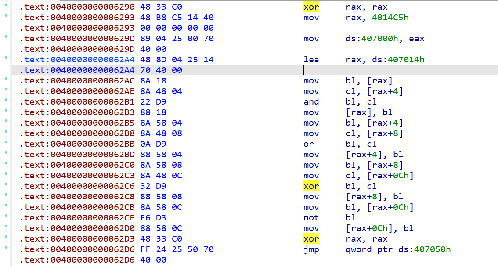

# Week 12（2024.12.2-2024.12.8）

周末打了国城杯15th

## [蓝帽杯 2022 初赛]loader

https://www.nssctf.cn/problem/2441

里面有加载另一个exe，但是直接导出分析失败，因此还是动态调试分析入口点，找主加密函数

调试的方法就是不断下断点直到找到最后F8会打印挑战的函数

~~~c
__int64 sub_7FF794DA5890()
{
  __int64 v0; // rax
  __int64 v1; // rax
  _QWORD *v2; // rsi
  __int64 v3; // rdi
  __int64 *v4; // rdx
  __int64 v5; // rbx
  __m128i *v6; // rax
  __m128i *v7; // rdi
  __m128i *v8; // rax
  unsigned __int64 *v10; // rsi
  __int64 v11; // rbx
  __int64 v12; // rcx
  __m128i *v13; // rbp
  __int64 v14; // rdx
  unsigned __int64 v15; // rdi
  __int64 v16; // rbx
  unsigned __int64 *v17; // rbp
  __m128i *v18; // rax
  __int64 v19; // rcx
  __int64 v20; // rdx
  unsigned __int64 v21; // rsi
  __int64 v22; // rdi
  __int64 *v23; // rdx
  unsigned __int64 v24; // rcx
  __m128i v25; // xmm4
  __int64 v26; // rdi
  __int64 *v27; // rdx
  unsigned __int64 v28; // rcx
  __m128i v29; // [rsp+20h] [rbp-78h] BYREF
  __m128i v30; // [rsp+30h] [rbp-68h] BYREF
  __int64 v31; // [rsp+40h] [rbp-58h] BYREF
  __int64 v32; // [rsp+48h] [rbp-50h]
  __m128i v33; // [rsp+50h] [rbp-48h] BYREF
  __int64 v34; // [rsp+60h] [rbp-38h] BYREF
  __int64 v35; // [rsp+68h] [rbp-30h]

  sub_7FF794DA0500((__int64)sub_7FF794DA57E0);
  sub_7FF794DA0500((__int64)&unk_7FF794DA57D0);
  sub_7FF794DA0500((__int64)&unk_7FF794DA57C0);
  sub_7FF794DA0500((__int64)&unk_7FF794DA57B0);
  sub_7FF794DA0500((__int64)&unk_7FF794DA57A0);
  sub_7FF794DA0500((__int64)&unk_7FF794DA5790);
  sub_7FF794DA0500((__int64)&unk_7FF794DA5780);
  sub_7FF794DA0500((__int64)&unk_7FF794DA5770);
  sub_7FF794DA0500((__int64)&unk_7FF794DA5760);
  sub_7FF794D956F0(&off_7FF794DA9E08, 1i64);    // 打印输入提示
  v0 = off_7FF794DA8100(0i64);
  v1 = sub_7FF794D96220(v0);                    // 输入到v1，v1是个结构体，一个长度一个别的然后是字符串
  v2 = (_QWORD *)v1;
  if ( v1 )
    *(_QWORD *)(v1 - 16) += 8i64;
  if ( qword_7FF794DBF200 )
  {
    v3 = *(_QWORD *)(qword_7FF794DBF200 - 16);
    v4 = (__int64 *)(qword_7FF794DBF200 - 16);
    *(_QWORD *)(qword_7FF794DBF200 - 16) = v3 - 8;
    if ( (unsigned __int64)(v3 - 8) <= 7 )
      sub_7FF794D99580((__int64 *)off_7FF794DAA350 + 3, v4);
  }
  qword_7FF794DBF200 = (__int64)v2;
  v5 = 0i64;
  v6 = sub_7FF794D9C000(5i64);
  v7 = v6;
  if ( !v6 )
  {
    if ( v2 )
      sub_7FF794D9F460(0i64, -1i64);
    sub_7FF794D9F460(0i64, -1i64);
  }
  if ( !v2 )
  {
    if ( !v6->m128i_i64[0] )
      sub_7FF794D9F460(0i64, -1i64);
    sub_7FF794D9F460(0i64, -1i64);
  }
  do
  {
    if ( v6->m128i_i64[0] <= (unsigned __int64)v5 )
      sub_7FF794D9F460(v5, v6->m128i_i64[0] - 1);
    if ( *v2 <= (unsigned __int64)v5 )
      sub_7FF794D9F460(v5, *v2 - 1i64);
    v6[1].m128i_i8[v5] = *((_BYTE *)v2 + v5 + 16);
    ++v5;
  }
  while ( v5 <= 4 );
  if ( v6->m128i_i64[0] != 5 )
    goto LABEL_15;
  v8 = v6 + 1;
  if ( v7[1].m128i_i32[0] != dword_7FF794DA9E00 )
    goto LABEL_15;
  if ( v8->m128i_i8[4] != byte_7FF794DA9E04 )
    goto LABEL_15;
  v10 = (unsigned __int64 *)qword_7FF794DBF200;
  if ( !qword_7FF794DBF200 || *(_QWORD *)qword_7FF794DBF200 != 42i64 || *(_BYTE *)(qword_7FF794DBF200 + 57) != '}' )
    goto LABEL_15;
  v11 = 0i64;
  v13 = sub_7FF794D9C000(18i64);
  if ( !v13 )
    sub_7FF794D9F460(0i64, -1i64);
  do
  {
    v14 = v13->m128i_i64[0];
    if ( v13->m128i_i64[0] <= (unsigned __int64)v11 )
      sub_7FF794D9F460(v11, v14 - 1);
    v15 = v11 + 5;
    if ( v11 + 5 < 0 || v15 < v11 )
      sub_7FF794D9AFB0(v12, v14);
    if ( *v10 <= v15 )
      sub_7FF794D9F460(v11 + 5, *v10 - 1);
    v13[1].m128i_i8[v11++] = *((_BYTE *)v10 + v15 + 16);
  }
  while ( v11 <= 17 );                          // 取17位
  v16 = 0i64;
  s2int((__int64)v13, 10i64, &input18);         // 17位字符串转为数字
  v17 = (unsigned __int64 *)qword_7FF794DBF200;
  v18 = sub_7FF794D9C000(18i64);
  if ( !v18 )
  {
    if ( v17 )
      sub_7FF794D9F460(0i64, -1i64);
    sub_7FF794D9F460(0i64, -1i64);
  }
  if ( !v17 )
  {
    if ( !v18->m128i_i64[0] )
      sub_7FF794D9F460(0i64, -1i64);
    sub_7FF794D9F460(23i64, -1i64);
  }
  do
  {
    v20 = v18->m128i_i64[0];
    if ( v18->m128i_i64[0] <= (unsigned __int64)v16 )
      sub_7FF794D9F460(v16, v20 - 1);
    v21 = v16 + 23;
    if ( v16 + 23 < 0 || v21 < v16 )
      sub_7FF794D9AFB0(v19, v20);
    if ( *v17 <= v21 )
      sub_7FF794D9F460(v16 + 23, *v17 - 1);
    v18[1].m128i_i8[v16++] = *((_BYTE *)v17 + v21 + 16);// 从23位后取，也就是flag{的5位+前面18位
  }
  while ( v16 <= 17 );
  s2int((__int64)v18, 10i64, &input36);         // 也就是说分别读取前18位和后18位
  s2int((__int64)&unk_7FF794DA9DC0, 10i64, &xmmword_7FF794DBF190);// 读取硬编码数字
  s2int((__int64)&unk_7FF794DA9D80, 10i64, &xmmword_7FF794DBF1A0);
  v30 = _mm_loadu_si128((const __m128i *)&xmmword_7FF794DBF190);
  v29 = _mm_loadu_si128((const __m128i *)&input18);
  if ( !(unsigned __int8)sub_7FF794DA50C0(&v30, &v29) )
    goto LABEL_15;
  v30 = _mm_loadu_si128((const __m128i *)&input18);
  v29 = _mm_loadu_si128((const __m128i *)&xmmword_7FF794DBF1A0);
  if ( !(unsigned __int8)sub_7FF794DA50C0(&v30, &v29) )
    goto LABEL_15;
  v31 = 0i64;
  v32 = 0i64;
  v30 = (__m128i)input18;
  v29 = (__m128i)input18;
  mul(&v30, &v29, (__int64)&v31);               // input18*input18
  v22 = v31;
  if ( v31 )
    *(_QWORD *)(v31 - 16) += 8i64;
  if ( (_QWORD)xmmword_7FF794DBF1D0 )
  {
    v23 = (__int64 *)(xmmword_7FF794DBF1D0 - 16);
    v24 = *(_QWORD *)(xmmword_7FF794DBF1D0 - 16) - 8i64;
    *(_QWORD *)(xmmword_7FF794DBF1D0 - 16) = v24;
    if ( v24 <= 7 )
      sub_7FF794D99580((__int64 *)off_7FF794DAA350 + 3, v23);
  }
  *(_QWORD *)&xmmword_7FF794DBF1D0 = v22;
  v33 = 0ui64;
  BYTE8(xmmword_7FF794DBF1D0) = v32;
  v30 = (__m128i)input36;
  v29 = (__m128i)input36;
  mul(&v30, &v29, (__int64)&v33);
  v25 = _mm_load_si128(&v33);
  v34 = 0i64;
  v35 = 0i64;
  v30 = v25;
  mulint(&v30, 11i64, &v34);                    // v34 = input36*input36*11
  v26 = v34;
  if ( v34 )
    *(_QWORD *)(v34 - 16) += 8i64;
  if ( (_QWORD)xmmword_7FF794DBF160 )
  {
    v27 = (__int64 *)(xmmword_7FF794DBF160 - 16);
    v28 = *(_QWORD *)(xmmword_7FF794DBF160 - 16) - 8i64;
    *(_QWORD *)(xmmword_7FF794DBF160 - 16) = v28;
    if ( v28 <= 7 )
      sub_7FF794D99580((__int64 *)off_7FF794DAA350 + 3, v27);
  }
  *(_QWORD *)&xmmword_7FF794DBF160 = v26;
  v30 = _mm_loadu_si128((const __m128i *)&xmmword_7FF794DBF1D0);
  BYTE8(xmmword_7FF794DBF160) = v35;
  v29 = _mm_loadu_si128((const __m128i *)&xmmword_7FF794DBF160);
  sub(&v30, &v29, &xmmword_7FF794DBF1E0);
  s2int((__int64)&unk_7FF794DA9D50, 10i64, &xmmword_7FF794DBF1C0);// 9
  v30 = _mm_loadu_si128((const __m128i *)&xmmword_7FF794DBF1E0);
  v29 = _mm_loadu_si128((const __m128i *)&xmmword_7FF794DBF1C0);
  if ( (unsigned __int8)isEqual(&v30, &v29) )
  {
    qword_7FF794DAD6A0 = 1i64;
  }
  else
  {
LABEL_15:
    if ( qword_7FF794DAD6A0 != 1 )
      return sub_7FF794D956F0(&off_7FF794DA9D00, 1i64);// error
  }
  return sub_7FF794D956F0(&off_7FF794DA9D28, 1i64);// win
}
~~~

最后知道是前18位数的平方-后18位数的平方*11=9

看了题解才知道可以用[求解网站](https://www.wolframalpha.com/)来做，神奇说实话要是不限制x范围可以多解

y位数不够补零

## [NUSTCTF 2022 新生赛]Heaven's Gate

https://www.nssctf.cn/problem/3129

先做的羊城杯oddcode发现又考察了天堂之门，来找题狠狠学习下

通常给的文件都会识别为32位程序，里面会有部分代码来实现从32位到64位的转化，具体是关注cs寄存器，当其值为0x33时是64位，0x23时是32位

~~~assembly
// convert x86 to x64
6A 33                    push 0x33   ； cs寄存器的新值
E8 00 00 00 00           call $+5     ；push 下一条指令的地址入栈，并继续执行下一条指令
83 04 24 05              add dword [esp], 5  ；栈顶的返回地址加5，指向retf的下一条指令
CB                       retf  ； 通过retf，程序返回到下一条指令继续执行，但cs 寄存器已经被修改为0x33， 执行的代码是64位
// convert x64 to x86
E8 00 00 00 00           call $+5
C7 44 24 04 23 00 00 00  mov dword [rsp + 4], 0x23
83 04 24 0D              add dword [rsp], 0xD
CB                       retf
~~~

首先读取key文件716字节，并检查后四位

~~~c
int __cdecl sub_401100(void *Buffer)
{
  FILE *Stream; // [esp+0h] [ebp-1Ch]
  void (*v3)(void); // [esp+4h] [ebp-18h]
  void (*v4)(void); // [esp+8h] [ebp-14h]
  void (*v5)(void); // [esp+Ch] [ebp-10h]
  void (*lpAddress)(void); // [esp+10h] [ebp-Ch]
  char v7; // [esp+14h] [ebp-8h]
  char v8; // [esp+15h] [ebp-7h]
  char v9; // [esp+16h] [ebp-6h]
  char v10; // [esp+17h] [ebp-5h]

  Stream = fopen("key.txt", "rb");
  if ( Stream )
  {
    fread(Buffer, 1u, 716u, Stream);
  }
  else
  {
    puts("I need key to open the door!\n");
    _loaddll(0);
  }
  v7 = *((_BYTE *)Buffer + 0x2C8) ^ 0x89;
  v8 = *((_BYTE *)Buffer + 0x2C9) ^ 0x49;
  v9 = *((_BYTE *)Buffer + 0x2CA) ^ 2;
  v10 = *((_BYTE *)Buffer + 0x2CB) ^ 0xE7;
  lpAddress = (void (*)(void))VirtualAlloc(0, 0xAu, 0x1000u, 0x40u);
  *(_BYTE *)lpAddress = v7;
  lpAddress();
  VirtualFree(lpAddress, 0, 0x8000u);
  v5 = (void (*)(void))VirtualAlloc(0, 0xAu, 0x1000u, 0x40u);
  *(_BYTE *)v5 = v8;
  v5();
  VirtualFree(v5, 0, 0x8000u);
  v4 = (void (*)(void))VirtualAlloc(0, 0xAu, 0x1000u, 0x40u);
  *(_BYTE *)v4 = v9;
  v4();
  VirtualFree(v4, 0, 0x8000u);
  v3 = (void (*)(void))VirtualAlloc(0, 0xAu, 0x1000u, 0x40u);
  *(_BYTE *)v3 = v10;
  v3();
  VirtualFree(v3, 0, 0x8000u);
  return fclose(Stream);
}
~~~

要想绕过`lpAddress();`的调用，可以使得异或完结果等于0x90，即nop，从而得到0x7792d919

这里先nop掉了天堂之门的代码，64位分析可以反编译一个基本能读懂逻辑的代码

~~~c
// positive sp value has been detected, the output may be wrong!
int __cdecl main(int argc, const char **argv, const char **envp)
{
  unsigned int v3; // eax
  FILE *v7; // [esp+14h] [ebp-34h]
  void *v8; // [esp+18h] [ebp-30h]
  FILE *Stream; // [esp+1Ch] [ebp-2Ch]
  char *v10; // [esp+20h] [ebp-28h]
  int n; // [esp+24h] [ebp-24h]
  int k; // [esp+2Ch] [ebp-1Ch]
  int m; // [esp+30h] [ebp-18h]
  void *Bufferb; // [esp+38h] [ebp-10h]
  char *Buffer; // [esp+38h] [ebp-10h]
  void *Buffera; // [esp+38h] [ebp-10h]
  char *v17; // [esp+3Ch] [ebp-Ch]
  char *Block; // [esp+40h] [ebp-8h]
  int argca; // [esp+50h] [ebp+8h]
  int v20; // [esp+6Ch] [ebp+24h]
  int i; // [esp+8Ch] [ebp+44h]
  int j; // [esp+ACh] [ebp+64h]

  Bufferb = malloc(0xFA0u);                     // 64
  puts("Try to repair the gate\n");
  sub_401100(Bufferb);
  v3 = STACK[0x1A8] - 1;
  argca = v3;
  v20 = 0;
  for ( i = 0; i < 179; ++i )
  {
    _EAX = v3 - 1;
    __asm { arpl    word ptr [ebp+arg_3C], ax }
    v20 ^= *(_DWORD *)(argca + 4 * (_EAX - 1));	// 所有(int *)key的异或和
    v3 = i + 1;
  }
  for ( j = 0; j < 179; ++j )
  {
    _EAX = v3 - 1;
    __asm { arpl    word ptr [ebp+arg_5C], ax }
    v20 ^= *(_DWORD *)(argca + 4 * (_EAX - 1));// 每次异或一个key，得到的是所有后面key的异或和
    LOWORD(_EAX) = v20 - 1;
    __asm { arpl    word ptr [ebp+arg_5C], ax }
    *(_DWORD *)(argca + 4 * (v20 - 2)) = v20;
    v3 = j + 1;
  }
  Stream = fopen("judge.txt", "rb");
  v10 = (char *)malloc(0xFA0u);
  if ( Stream )
    fread(v10, 1u, 0x2C8u, Stream);
  for ( k = 0; k < 712; ++k )
  {
    if ( v10[k] != Buffer[k] )
    {
      printf((int)"wrong key!");
      return 0;
    }
  }
  printf((int)"The gate is open\n");
  printf((int)"Please input your flag:");
  Block = (char *)malloc(0xA0u);
  sub_4010C0("%s", Block);
  if ( strlen(Block) == 36 )
  {
    v8 = malloc(0xFA0u);
    v7 = fopen("key.txt", "rb");
    if ( v7 )
      fread(v8, 1u, 716u, v7);
    for ( m = 0; m < 716; ++m )
      byte_4208D8[m] ^= *((_BYTE *)v8 + m);
    v17 = (char *)VirtualAlloc(0, 0x3E8u, 0x1000u, 0x40u);
    qmemcpy(v17, byte_4208D8, 0x3E8u);
    ((void (__thiscall *)(char *))v17)(Block);
    ((void (__thiscall *)(char *))v17)(Block + 6);
    ((void (__thiscall *)(char *))v17)(Block + 12);
    ((void (__thiscall *)(char *))v17)(Block + 18);
    ((void (__thiscall *)(char *))v17)(Block + 24);
    ((void (__thiscall *)(char *))v17)(Block + 30);
    printf((int)"Searching the true flag!!\n");
    for ( n = 0; n < 36; ++n )
    {
      if ( Block[n] != byte_4208B0[n] )
      {
        printf((int)"wrong flag!");
        return 0;
      }
    }
    printf((int)"Yes,you get the flag\n");
    free(Buffera);
    free(Block);
    free(v10);
    fclose(Stream);
    free(v8);
    return 0;
  }
  else
  {
    printf((int)"Wrong length!\n");
    return 0;
  }
}
~~~

可以发现key.txt的内容处理后和题目给的judge.txt内容比较，还原下原来的key（这里有个bug，前面得到的0x7792d919应该是第一个key的值，因为judge最后一个dword是最后的key【718位置】，异或到judge第一个dword后得到是第二个key【1位置】，没有0位置的key）

~~~python
import struct
with open("judge.txt", "rb") as f:
    data = f.read()
c = []
for i in range(0, len(data), 4):
    c.append(struct.unpack("<I", data[i:i+4])[0])
total = c[-1]
for i in range(len(c)-2, -1, -1):
    c[i] ^= total
    total ^= c[i]
c = [0x7792d919] + c
print(len(c))
print(c)
~~~

去ida中patch下byte_4208D8

~~~python
c=[2006112537, 1568618256, 1484313293, 2754311536, 1314525592, 3919160374, 1963131039, 2251017951, 2723598928, 3941036396, 4229591264, 435551969, 2206004675, 690314696, 2257269302, 3345376940, 750463669, 2958060190, 3965949573, 966502579, 356475692, 3366377603, 1206857715, 1492296876, 4151693419, 4171508301, 4022062565, 1292270732, 3406554104, 201727761, 2106950143, 2176159624, 3421326489, 180992546, 3431636007, 2619113493, 1850277202, 1043020311, 4092047234, 2308452583, 1871325032, 782836165, 1278774389, 1892073205, 3328064096, 2784964416, 1883980451, 3129183602, 2914248959, 2888460253, 925705460, 267206356, 2612404554, 2338850865, 3140206987, 1516220625, 1272059783, 3409351954, 1439886542, 3262580572, 3048618809, 911265173, 2649666658, 2987565483, 307117351, 3585388814, 1837984811, 3511558195, 3704032853, 4020143122, 3741099087, 176580264, 3398426888, 277595766, 1237790002, 2220397569, 3612484805, 4265228112, 1186797690, 2862680433, 1006472017, 3315980789, 2951329292, 595552367, 1874658738, 2869685752, 2627311628, 3645739694, 738247467, 1005188145, 1750700000, 4121536036, 1819359043, 1056681906, 2868423725, 3765503750, 1728058046, 3158253266, 1015103959, 1136678601, 2530690209, 4277240869, 910351620, 133526050, 2993028913, 2391761025, 4073214745, 1437302278, 3025581299, 903247098, 165655226, 2529221290, 3600225196, 4207002086, 1419070925, 1934764162, 2421493090, 697337817, 3946296438, 3585886277, 2617168985, 1220430248, 676509724, 3852295142, 4030650646, 571000424, 2763155809, 215008155, 3355626590, 3228303471, 929438253, 4067696857, 2641927990, 1780889682, 4223228835, 2196001621, 655131619, 2863984613, 1228537385, 3837754884, 1600907498, 1221846333, 3115455075, 2162229275, 2122481681, 1300110768, 640936247, 23493903, 4252973916, 66442962, 2785482185, 1320014740, 2530102031, 4071854712, 2512151936, 2454791585, 1092362417, 3832877752, 2317282559, 875680617, 928410630, 3778631654, 1597831467, 3731455842, 4054458132, 859611543, 761339690, 2052393282, 679766814, 1660580769, 1276849761, 798266108, 3599876523, 942771225, 1463170677, 1728216005, 868209022, 3185438290, 616663626]
addr = 0x3A08D8
for i in range(len(c)):
    value = idc.get_wide_dword(addr+i*4)
    idc.patch_dword(addr+4*i, value^c[i])
~~~

即可反编译获取处理block的函数

~~~c
// positive sp value has been detected, the output may be wrong!
char __usercall sub_3A08D8@<al>(char *a1@<ecx>, int a2@<ebp>)
{
  char v3; // dh
  char v4; // bh
  char v5; // al
  unsigned __int8 v6; // cl
  unsigned __int8 v7; // bl
  char v8; // ch
  char v9; // ah
  char v10; // dl
  int v11; // edi
  unsigned __int8 v12; // al
  char v13; // bh
  char v14; // dh
  int v15; // esi
  char v16; // dl
  char v17; // ch
  char v18; // cl
  char v19; // dl
  char v20; // cl
  char v21; // dl
  char v22; // al
  unsigned __int8 v23; // ah
  unsigned __int8 v24; // dl
  char v25; // cl
  char v26; // al
  char v27; // al
  char v28; // cl
  char v29; // ah
  char v30; // al
  char v31; // bl
  char v32; // cl
  unsigned __int8 v33; // dl
  char v34; // ch
  char v35; // cl
  unsigned __int8 v36; // al
  char v37; // dl
  char v38; // dh
  char v39; // dl
  _BYTE *v40; // edi
  char result; // al

  strcpy((char *)(a2 - 20), "DBBBCA");	// key
  v3 = 0;
  *(_DWORD *)(a2 - 12) = a1;
  v4 = 0;
  v5 = *a1;
  v6 = a1[4];
  v7 = a1[3];
  v8 = a1[2];
  v9 = a1[1];
  v10 = a1[5];
  v11 = 64;
  *(_BYTE *)(a2 - 2) = v5;
  *(_BYTE *)(a2 - 5) = v9;
  *(_BYTE *)(a2 - 4) = v8;
  *(_BYTE *)(a2 - 6) = v7;
  v12 = v9 ^ ((unsigned __int8)(v8 ^ ((unsigned __int8)(v7 ^ (v6 >> 1)) >> 1)) >> 1);
  *(_BYTE *)(a2 - 3) = v6;
  for ( *(_BYTE *)(a2 - 1) = v10; ; v10 = *(_BYTE *)(a2 - 1) )
  {
    v13 = v4 + 34;
    v14 = v3 + 51;
    v15 = v14 & 3;
    v16 = v8 ^ (2 * (v7 ^ (2 * (v6 ^ (2 * v10)))));
    v17 = *(_BYTE *)(a2 - 4);
    v18 = v13 + v14 + *(_BYTE *)(a2 + v15 + (v13 & 3) - 20);
    v13 += 68;
    v19 = v18 ^ (2 * (v9 ^ (2 * v16)));
    v20 = *(_BYTE *)(a2 - 1);
    v21 = ((unsigned __int8)(v20 ^ (v12 >> 3)) >> 1) ^ v19;
    v22 = *(_BYTE *)(a2 - 3);
    v23 = (v9 ^ v17 ^ v7 ^ v22 ^ v20 ^ v21) + *(_BYTE *)(a2 - 2);
    *(_BYTE *)(a2 - 2) = v23;
    v24 = v22 ^ ((unsigned __int8)(v20 ^ (v23 >> 1)) >> 1);
    v25 = v22 ^ (2 * (*(_BYTE *)(a2 - 1) ^ (2 * (v23 ^ (8 * (v17 ^ (2 * v7)))))));
    v26 = v14 + *(_BYTE *)(a2 + v15 + (v13 & 3) - 20);
    v14 += 65;
    v27 = v13 + v26;
    v13 += 66;
    *(_BYTE *)(a2 - 5) += *(_BYTE *)(a2 - 2) ^ v17 ^ v7 ^ *(_BYTE *)(a2 - 3) ^ *(_BYTE *)(a2 - 1) ^ ((unsigned __int8)(v17 ^ ((unsigned __int8)(v7 ^ (v24 >> 1)) >> 1)) >> 2) ^ v27 ^ (2 * v25);
    v28 = v13 + v14 + *(_BYTE *)(a2 + (v13 & 3) - 20 + (v14 & 3));
    v13 += 66;
    v14 += 67;
    v29 = *(_BYTE *)(a2 - 5);
    v30 = (*(_BYTE *)(a2 - 2) ^ v29 ^ v7 ^ *(_BYTE *)(a2 - 3) ^ *(_BYTE *)(a2 - 1) ^ ((unsigned __int8)(*(_BYTE *)(a2 - 3) ^ ((unsigned __int8)(*(_BYTE *)(a2 - 1) ^ ((unsigned __int8)(*(_BYTE *)(a2 - 2) ^ ((unsigned __int8)(v29 ^ (v7 >> 3)) >> 1)) >> 1)) >> 1)) >> 1) ^ (2 * (v29 ^ (8 * (v7 ^ (2 * (*(_BYTE *)(a2 - 3) ^ (2 * (*(_BYTE *)(a2 - 1) ^ (2 * *(_BYTE *)(a2 - 2)))))))))) ^ v28)
        + *(_BYTE *)(a2 - 4);
    *(_BYTE *)(a2 - 4) = v30;
    v31 = *(_BYTE *)(a2 - 2) ^ (2 * (v29 ^ (2 * v30)));
    v32 = v13 + v14 + *(_BYTE *)(a2 + (v13 & 3) - 20 + (v14 & 3));
    v13 += 66;
    v14 += 66;
    v33 = (*(_BYTE *)(a2 - 2) ^ *(_BYTE *)(a2 - 5) ^ *(_BYTE *)(a2 - 4) ^ *(_BYTE *)(a2 - 3) ^ *(_BYTE *)(a2 - 1) ^ ((unsigned __int8)(*(_BYTE *)(a2 - 5) ^ ((unsigned __int8)(*(_BYTE *)(a2 - 4) ^ (v24 >> 3)) >> 1)) >> 1) ^ (4 * (*(_BYTE *)(a2 - 3) ^ (2 * (*(_BYTE *)(a2 - 1) ^ (2 * v31))))) ^ v32)
        + *(_BYTE *)(a2 - 6);
    *(_BYTE *)(a2 - 6) = v33;
    v34 = *(_BYTE *)(a2 - 4);
    v35 = v13 + v14 + *(_BYTE *)(a2 + (v13 & 3) - 20 + (v14 & 3));
    v9 = *(_BYTE *)(a2 - 5);
    v14 += 66;
    *(_BYTE *)(a2 - 7) = v14;
    v13 += 67;
    v36 = (*(_BYTE *)(a2 - 2) ^ v9 ^ v34 ^ v33 ^ *(_BYTE *)(a2 - 1) ^ (2
                                                                     * (*(_BYTE *)(a2 - 2) ^ (2
                                                                                            * (v9 ^ (2 * (v34 ^ (2 * (v33 ^ (8 * *(_BYTE *)(a2 - 1)))))))))) ^ ((unsigned __int8)(*(_BYTE *)(a2 - 1) ^ ((unsigned __int8)(*(_BYTE *)(a2 - 2) ^ ((unsigned __int8)(v9 ^ ((unsigned __int8)(v34 ^ (v33 >> 1)) >> 1)) >> 1)) >> 1)) >> 3) ^ v35)
        + *(_BYTE *)(a2 - 3);
    *(_BYTE *)(a2 - 3) = v36;
    v12 = v9 ^ ((unsigned __int8)(v34 ^ ((unsigned __int8)(v33 ^ (v36 >> 1)) >> 1)) >> 1);
    v37 = *(_BYTE *)(a2 + (v13 & 3) - 20 + (v14 & 3));
    v38 = *(_BYTE *)(a2 - 7);
    v8 = *(_BYTE *)(a2 - 4);
    v39 = (2 * (*(_BYTE *)(a2 - 6) ^ (2 * (*(_BYTE *)(a2 - 3) ^ (8 * v31))))) ^ (v13 + v38 + v37);
    v7 = *(_BYTE *)(a2 - 6);
    v4 = v13 + 65;
    v3 = v38 + 66;
    v6 = *(_BYTE *)(a2 - 3);
    *(_BYTE *)(a2 - 1) += *(_BYTE *)(a2 - 2) ^ v9 ^ v8 ^ v7 ^ v6 ^ ((unsigned __int8)(*(_BYTE *)(a2 - 2) ^ (v12 >> 1)) >> 1) ^ v39;
    if ( !--v11 )
      break;
  }
  v40 = *(_BYTE **)(a2 - 12);
  *v40 = *(_BYTE *)(a2 - 2);
  result = *(_BYTE *)(a2 - 1);
  v40[3] = v7;
  v40[1] = v9;
  v40[2] = v8;
  v40[4] = v6;
  v40[5] = result;
  return result;
}
~~~

题出的是真离谱，故意恶心人的感觉，设那么多变量，直接抄了出题人的加密函数，改编了下写了python解密，和tea解密思路一样，就是换下顺序，多加几个求和处理

~~~python
from ctypes import  c_uint8

def tea_encrypt(v):
    x0, x1, x2, x3, x4, x5 = c_uint8(v[0]), c_uint8(v[1]), c_uint8(v[2]), c_uint8(v[3]), c_uint8(v[4]), c_uint8(v[5])
    sum1 = c_uint8(0)
    sum2 = c_uint8(0)
    key = b"DBBBCA\x00"
    for i in range(64):
        sum1.value += 34
        sum2.value += 51
        x0.value += ((x1.value << 1) ^ (x1.value >> 4) ^ x1.value) ^ ((x2.value << 2) ^ (x2.value >> 5) ^ x2.value) ^ ((x3.value << 3) ^ (x3.value >> 6) ^ x3.value) ^ (
                    (x4.value << 4) ^ (x4.value >> 7) ^ x4.value) ^ ((x5.value << 5) ^ (x5.value >> 1) ^ x5.value) ^ (
                          sum1.value + sum2.value + key[(sum1.value & 3) + (sum2.value & 3)])
        sum1.value += 68
        x1.value += ((x2.value << 6) ^ (x2.value >> 2) ^ x2.value) ^ ((x3.value << 7) ^ (x3.value >> 3) ^ x3.value) ^ ((x4.value << 1) ^ (x4.value >> 4) ^ x4.value) ^ (
                    (x5.value << 2) ^ (x5.value >> 5) ^ x5.value) ^ ((x0.value << 3) ^ (x0.value >> 6) ^ x0.value) ^ (
                          sum1.value + sum2.value + key[(sum1.value & 3) + (sum2.value & 3)])
        sum1.value += 66
        sum2.value += 65
        x2.value += ((x3.value << 4) ^ (x3.value >> 7) ^ x3.value) ^ ((x4.value << 5) ^ (x4.value >> 1) ^ x4.value) ^ ((x5.value << 6) ^ (x5.value >> 2) ^ x5.value) ^ (
                    (x0.value << 7) ^ (x0.value >> 3) ^ x0.value) ^ ((x1.value << 1) ^ (x1.value >> 4) ^ x1.value) ^ (
                          sum1.value + sum2.value + key[(sum1.value & 3) + (sum2.value & 3)])
        sum1.value += 66
        sum2.value += 67
        x3.value += ((x4.value << 2) ^ (x4.value >> 5) ^ x4.value) ^ ((x5.value << 3) ^ (x5.value >> 6) ^ x5.value) ^ ((x0.value << 4) ^ (x0.value >> 7) ^ x0.value) ^ (
                    (x1.value << 5) ^ (x1.value >> 1) ^ x1.value) ^ ((x2.value << 6) ^ (x2.value >> 2) ^ x2.value) ^ (
                          sum1.value + sum2.value + key[(sum1.value & 3) + (sum2.value & 3)])
        sum1.value += 66
        sum2.value += 66
        x4.value += ((x5.value << 7) ^ (x5.value >> 3) ^ x5.value) ^ ((x0.value << 1) ^ (x0.value >> 4) ^ x0.value) ^ ((x1.value << 2) ^ (x1.value >> 5) ^ x1.value) ^ (
                    (x2.value << 3) ^ (x2.value >> 6) ^ x2.value) ^ ((x3.value << 4) ^ (x3.value >> 7) ^ x3.value) ^ (
                          sum1.value + sum2.value + key[(sum1.value & 3) + (sum2.value & 3)])
        sum1.value += 67
        sum2.value += 66
        x5.value += ((x0.value << 5) ^ (x0.value >> 1) ^ x0.value) ^ ((x1.value << 6) ^ (x1.value >> 2) ^ x1.value) ^ ((x2.value << 7) ^ (x2.value >> 3) ^ x2.value) ^ (
                    (x3.value << 1) ^ (x3.value >> 4) ^ x3.value) ^ ((x4.value << 2) ^ (x4.value >> 5) ^ x4.value) ^ (
                          sum1.value + sum2.value + key[(sum1.value & 3) + (sum2.value & 3)])
        sum1.value += 65
        sum2.value += 66
    return [x0.value, x1.value, x2.value, x3.value, x4.value, x5.value]

def tea_decrypt(v):
    x0, x1, x2, x3, x4, x5 = c_uint8(v[0]), c_uint8(v[1]), c_uint8(v[2]), c_uint8(v[3]), c_uint8(v[4]), c_uint8(v[5])
    sum1 = c_uint8((34+68+65+66+66+66+65)*64)
    sum2 = c_uint8((51+0+66+67+66+67+66)*64)
    key = b"DBBBCA\x00"
    for i in range(64):
        sum1.value -= 65
        sum2.value -= 66
        x5.value -= ((x0.value << 5) ^ (x0.value >> 1) ^ x0.value) ^ ((x1.value << 6) ^ (x1.value >> 2) ^ x1.value) ^ ((x2.value << 7) ^ (x2.value >> 3) ^ x2.value) ^ (
                    (x3.value << 1) ^ (x3.value >> 4) ^ x3.value) ^ ((x4.value << 2) ^ (x4.value >> 5) ^ x4.value) ^ (
                          sum1.value + sum2.value + key[(sum1.value & 3) + (sum2.value & 3)])
        sum1.value -= 67
        sum2.value -= 66
        x4.value -= ((x5.value << 7) ^ (x5.value >> 3) ^ x5.value) ^ ((x0.value << 1) ^ (x0.value >> 4) ^ x0.value) ^ ((x1.value << 2) ^ (x1.value >> 5) ^ x1.value) ^ (
                    (x2.value << 3) ^ (x2.value >> 6) ^ x2.value) ^ ((x3.value << 4) ^ (x3.value >> 7) ^ x3.value) ^ (
                          sum1.value + sum2.value + key[(sum1.value & 3) + (sum2.value & 3)])
        sum1.value -= 66
        sum2.value -= 66
        x3.value -= ((x4.value << 2) ^ (x4.value >> 5) ^ x4.value) ^ ((x5.value << 3) ^ (x5.value >> 6) ^ x5.value) ^ ((x0.value << 4) ^ (x0.value >> 7) ^ x0.value) ^ (
                    (x1.value << 5) ^ (x1.value >> 1) ^ x1.value) ^ ((x2.value << 6) ^ (x2.value >> 2) ^ x2.value) ^ (
                          sum1.value + sum2.value + key[(sum1.value & 3) + (sum2.value & 3)])
        sum1.value -= 66
        sum2.value -= 67
        x2.value -= ((x3.value << 4) ^ (x3.value >> 7) ^ x3.value) ^ ((x4.value << 5) ^ (x4.value >> 1) ^ x4.value) ^ ((x5.value << 6) ^ (x5.value >> 2) ^ x5.value) ^ (
                    (x0.value << 7) ^ (x0.value >> 3) ^ x0.value) ^ ((x1.value << 1) ^ (x1.value >> 4) ^ x1.value) ^ (
                          sum1.value + sum2.value + key[(sum1.value & 3) + (sum2.value & 3)])
        sum1.value -= 66
        sum2.value -= 65
        x1.value -= ((x2.value << 6) ^ (x2.value >> 2) ^ x2.value) ^ ((x3.value << 7) ^ (x3.value >> 3) ^ x3.value) ^ ((x4.value << 1) ^ (x4.value >> 4) ^ x4.value) ^ (
                    (x5.value << 2) ^ (x5.value >> 5) ^ x5.value) ^ ((x0.value << 3) ^ (x0.value >> 6) ^ x0.value) ^ (
                          sum1.value + sum2.value + key[(sum1.value & 3) + (sum2.value & 3)])
        sum1.value -= 68
        x0.value -= ((x1.value << 1) ^ (x1.value >> 4) ^ x1.value) ^ ((x2.value << 2) ^ (x2.value >> 5) ^ x2.value) ^ ((x3.value << 3) ^ (x3.value >> 6) ^ x3.value) ^ (
                    (x4.value << 4) ^ (x4.value >> 7) ^ x4.value) ^ ((x5.value << 5) ^ (x5.value >> 1) ^ x5.value) ^ (
                          sum1.value + sum2.value + key[(sum1.value & 3) + (sum2.value & 3)])
        sum1.value -= 34
        sum2.value -= 51
    return [x0.value, x1.value, x2.value, x3.value, x4.value, x5.value]

v = [0x57, 0xC2, 0x53, 0x0C, 0x05, 0x94, 0x6D, 0x47, 0xA5, 0x2E, 0xFA, 0x62, 0x1F, 0x96, 0x32, 0x26, 0xA3, 0x30, 0x30, 0x29, 0xD4, 0xA6, 0x86, 0x00, 0x0D, 0x52, 0x8D, 0x3B, 0xB9, 0xC3, 0x2C, 0x86, 0x19, 0xB5, 0x54, 0xA4]
for i in range(0, len(v), 6):
    v[i:i+6] = tea_decrypt(v[i:i+6])
print("".join(map(chr, v)))	# flag{Th3_3nc4ypt1on_1s_st5nd_5tt5ck}
~~~

## [西湖论剑 2022]Dual personality

https://www.nssctf.cn/problem/3443

首先动态调试过sub_401120函数，此时后面的代码发生变化

这里jmp far是长跳转直接设置cs段为0x33，从而执行dword_4011D0是以64位进行

由于这里是32位在调试，所以可以修改exe的可选头的010b修改为020b从而使得ida可以反编译exe

直接搜字节定位，可以反编译：可以看到存在反调试，首先调用gs:60h先获取了peb地址，然后偏移两位获取BeingDebugged值，如果调试的话al=1，会发生跳转，正常运行是不跳转进行赋值，32位下0x407058位置的数据被更新为0x5DF966AE

上面是第一处32位到64位，主要是反调试同时最后跳转回0x407000位置，由下图可以发现恢复了32位环境

第二处借助的不是jmp far而是call fword，此时byte_40700C里存储的正好是cs寄存器值以及跳转的地址

64位反编译发现是很多移位操作

~~~c
__int64 __fastcall sub_40000000006200(__int64 a1, __int64 a2, __int64 a3, __int64 a4, __int64 a5)
{
  void *retaddr[2]; // [rsp+8h] [rbp+8h]

  if ( MEMORY[0x40705C] )
  {
    *(_QWORD *)retaddr[1] = __ROL8__(*(_QWORD *)retaddr[1], 32);
    *((_QWORD *)retaddr[1] + 1) = __ROL8__(*((_QWORD *)retaddr[1] + 1), 32);
    *((_QWORD *)retaddr[1] + 2) = __ROL8__(*((_QWORD *)retaddr[1] + 2), 32);
    *((_QWORD *)retaddr[1] + 3) = __ROL8__(*((_QWORD *)retaddr[1] + 3), 32);
  }
  else
  {
    *(_QWORD *)retaddr[1] = __ROL8__(*(_QWORD *)retaddr[1], 12);
    *((_QWORD *)retaddr[1] + 1) = __ROL8__(*((_QWORD *)retaddr[1] + 1), 34);
    *((_QWORD *)retaddr[1] + 2) = __ROL8__(*((_QWORD *)retaddr[1] + 2), 56);
    *((_QWORD *)retaddr[1] + 3) = __ROL8__(*((_QWORD *)retaddr[1] + 3), 14);
  }
  return MK_FP(retaddr[0], retaddr[0])(a1, a2, a3, a4, a5);
}
~~~

这个函数的0x40705C指向的是反调试那里赋值的byte，正确逻辑是else里的。else里可以看出来应该是把flag每八个字节进行了移位操作。最后进行了retf 8（处理器先从栈中弹出一个字到IP，再弹出一个字到CS，可以确定的是同样恢复了cs=0x23即32位环境）

第三处是下图，64位代码位于dword_401290里

64位反汇编结果如下

~~~c
__int64 sub_40000000006290()
{
  MEMORY[0x407000] = 4199621;
  MEMORY[0x407014] &= MEMORY[0x407018];
  MEMORY[0x407018] |= MEMORY[0x40701C];
  MEMORY[0x40701C] ^= MEMORY[0x407020];
  MEMORY[0x407020] = ~MEMORY[0x407020];
  return MEMORY[0x407050]();
}
~~~

是做了一系列位运算操作。由于此处最后直接跳转了0x407050，没有恢复32位环境，所以之后的都是64位环境，所以ida反编译出错（dec eax开始）

还是64位定位该部分函数，可以发现也做了加密运算，最后还恢复了32位环境，这里很明显input异或了长度为4的key

~~~c
__int64 sub_4000000000646E()
{
  __int64 v0; // rax

  while ( MEMORY[0x4070C8] != 32i64 )
  {
    v0 = MEMORY[0x4070C8];
    *(_BYTE *)(MEMORY[0x4070C8] + 0x407060i64) ^= *(_BYTE *)(4 * (MEMORY[0x4070C8] % 4ui64) + 0x407014);
    MEMORY[0x4070C8] = v0 + 1;
  }
  return MK_FP(MEMORY[0x407008], MEMORY[0x407000])();
}
~~~

最后的解密脚本

~~~python
cmp = [0xaa, 0x4f, 0xf, 0xe2, 0xe4, 0x41, 0x99, 0x54, 0x2c, 0x2b, 0x84, 0x7e, 0xbc, 0x8f, 0x8b, 0x78, 0xd3, 0x73, 0x88, 0x5e, 0xae, 0x47, 0x85, 0x70, 0x31, 0xb3, 0x9, 0xce, 0x13, 0xf5, 0xd, 0xca]
key = [0x9d, 0x44, 0x37, 0xb5]
key[0] &= key[1]
key[1] |= key[2]
key[2] ^= key[3]
key[3] = ~key[3]
for i in range(len(cmp)):
    cmp[i] ^= (key[i%4]&0xff)

def ror(num, bits):
    return list((((num >> bits) | (num << (64 - bits))) & ((1 << 64) - 1)).to_bytes(8, "little"))

cmp[0:8] = ror(int.from_bytes(bytes([i&0xff for i in cmp[0:8]]), "little"), 12)
cmp[8:16] = ror(int.from_bytes(bytes([i&0xff for i in cmp[8:16]]), "little"), 34)
cmp[16:24] = ror(int.from_bytes(bytes([i&0xff for i in cmp[16:24]]), "little"), 56)
cmp[24:] = ror(int.from_bytes(bytes([i&0xff for i in cmp[24:32]]), "little"), 14)

a = 0x5DF966AE - 0x21524111
for i in range(8):
    c = int.from_bytes(cmp[4*i:4*i+4], "little")
    cmp[4*i:4*i+4] = list(((c - a) & 0xffffffff).to_bytes(4, "little"))
    a ^= c
print("".join(chr(c) for c in cmp))	# 6cc1e44811647d38a15017e389b3f704
~~~

## [羊城杯 2021]OddCode

https://www.nssctf.cn/problem/234

看了会儿题果断放弃，基本没法手动去花，花指令干扰太狠了，ida反汇编基本错完。去找wp学习一波非常规方法

