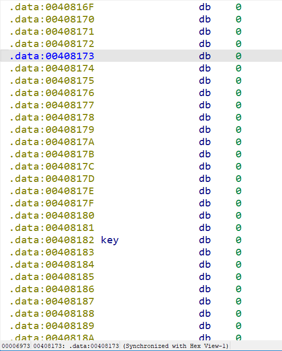

# Week 13（2024.12.9-2024.12.15）

周末ciscn，惨不忍睹，学校第五，排三百九十多铁没戏

## [柏鹭杯 2021]baby_python

https://www.nssctf.cn/problem/614

首先pyinstxtractor提取exe，注意在相同python版本下跑，发现提示PYZ-00.pyz_extracted下的pyc被加密，也就是导入库被加密

然后uncompyle6反编译baby.pyc

~~~python
# uncompyle6 version 3.9.2
# Python bytecode version base 3.7.0 (3394)
# Decompiled from: Python 3.8.19 | packaged by conda-forge | (default, Mar 20 2024, 12:38:07) [MSC v.1929 64 bit (AMD64)]
# Embedded file name: baby_python\baby.py
from baby_python.baby_core import main
if __name__ == "__main__":
    main()

# okay decompiling .\baby.pyc
~~~

可以看到导入的是baby_python.baby_core，但是被加密了

在pyimod00_crypto_key.pyc找到key="f8c0870eba862579"，结合pyimod02_archive.pyc里最后的Cipher类解密即可，记得加pyc头

~~~python
# Visit https://www.lddgo.net/string/pyc-compile-decompile for more information
# Python 3.7.0 (3394)

import sys
import zlib

CRYPT_BLOCK_SIZE = 16

class Cipher(object):
    __doc__ = "\n    This class is used only to decrypt Python modules.\n    "

    def __init__(self):
        key = "f8c0870eba862579"
        if not type(key) is str:
            raise AssertionError
        elif len(key) > CRYPT_BLOCK_SIZE:
            self.key = key[:CRYPT_BLOCK_SIZE]
        else:
            self.key = key.zfill(CRYPT_BLOCK_SIZE)
        assert len(self.key) == CRYPT_BLOCK_SIZE
        import tinyaes
        self._aesmod = tinyaes
        del sys.modules["tinyaes"]

    def __create_cipher(self, iv):
        return self._aesmod.AES(self.key.encode(), iv)

    def decrypt(self, data):
        cipher = self.__create_cipher(data[:CRYPT_BLOCK_SIZE])
        return cipher.CTR_xcrypt_buffer(data[CRYPT_BLOCK_SIZE:])

from Crypto.Cipher import AES
c = Cipher()
with open("baby_core.pyc.encrypted", "rb") as f:
    data = f.read()

buffer = b'\x42\x0D\x0D\x0A\x00\x00\x00\x00\x00\x00\x00\x00\x00\x00\x00\x00'
buffer += zlib.decompress(c.decrypt(data))
with open("baby_core.pyc", "wb") as f1:
    f1.write(buffer)
~~~

得到pyc，反编译源码

~~~python
# Visit https://www.lddgo.net/string/pyc-compile-decompile for more information
# Version : Python 3.7

import hashlib

def md5(s=None):
    m = hashlib.md5()
    m.update(s)
    return m.hexdigest().lower()

def main():
    secret = input('secret: ')
    if len(secret) != 48:
        return None
    if not secret.isnumeric():
        return None
    values = []
    for i in range(0, 48, 3):
        values.append(int(secret[i:i + 3]))

    co = [[158,195,205,229,213,238,211,198,190,226,135,119,145,205,113,122], [234,256,185,253,244,134,102,117,190,106,131,205,198,234,162,218], [164,164,209,200,168,226,189,151,253,241,232,151,193,119,226,193], [213,117,151,103,249,148,103,213,218,222,104,228,100,206,218,177], [217,202,126,214,195,125,144,105,152,118,167,137,171,173,206,240], [160,134,131,135,186,213,146,129,125,139,174,205,177,240,194,181], [183,213,127,136,136,209,199,191,150,218,160,111,191,226,154,191], [247,188,210,219,179,204,155,220,215,127,225,214,195,162,214,239], [108,112,104,133,178,138,110,176,232,124,193,239,131,138,161,218], [140,213,142,181,179,173,203,208,184,129,129,119,122,152,186,124], [105,205,124,142,175,184,234,119,195,218,141,122,202,202,190,178], [183,178,256,124,241,132,163,209,204,104,175,211,196,136,158,210], [224,144,189,106,177,251,206,163,167,144,208,254,117,253,100,106], [251,251,136,170,145,177,175,124,193,188,193,198,208,171,151,230], [143,200,143,150,243,148,136,213,161,224,170,208,185,117,189,242], [234,188,226,194,248,168,250,244,166,106,113,218,209,220,158,228]]
    r = [472214, 480121, 506256, 449505, 433390, 435414, 453899, 536361, 423332, 427624, 440268, 488759, 469049, 484574, 480266, 522818]
    for i in range(16):
        v = 0
        for j in range(16):
            v += co[i][j] * values[j]
        if v != r[i]:
            return None
    print('flag{ISEC-%s}' % md5(secret.encode()))

~~~

z3求解

~~~python
from hashlib import md5
from z3 import *

s = Solver()
co = [[158, 195, 205, 229, 213, 238, 211, 198, 190, 226, 135, 119, 145, 205, 113, 122],
      [234, 256, 185, 253, 244, 134, 102, 117, 190, 106, 131, 205, 198, 234, 162, 218],
      [164, 164, 209, 200, 168, 226, 189, 151, 253, 241, 232, 151, 193, 119, 226, 193],
      [213, 117, 151, 103, 249, 148, 103, 213, 218, 222, 104, 228, 100, 206, 218, 177],
      [217, 202, 126, 214, 195, 125, 144, 105, 152, 118, 167, 137, 171, 173, 206, 240],
      [160, 134, 131, 135, 186, 213, 146, 129, 125, 139, 174, 205, 177, 240, 194, 181],
      [183, 213, 127, 136, 136, 209, 199, 191, 150, 218, 160, 111, 191, 226, 154, 191],
      [247, 188, 210, 219, 179, 204, 155, 220, 215, 127, 225, 214, 195, 162, 214, 239],
      [108, 112, 104, 133, 178, 138, 110, 176, 232, 124, 193, 239, 131, 138, 161, 218],
      [140, 213, 142, 181, 179, 173, 203, 208, 184, 129, 129, 119, 122, 152, 186, 124],
      [105, 205, 124, 142, 175, 184, 234, 119, 195, 218, 141, 122, 202, 202, 190, 178],
      [183, 178, 256, 124, 241, 132, 163, 209, 204, 104, 175, 211, 196, 136, 158, 210],
      [224, 144, 189, 106, 177, 251, 206, 163, 167, 144, 208, 254, 117, 253, 100, 106],
      [251, 251, 136, 170, 145, 177, 175, 124, 193, 188, 193, 198, 208, 171, 151, 230],
      [143, 200, 143, 150, 243, 148, 136, 213, 161, 224, 170, 208, 185, 117, 189, 242],
      [234, 188, 226, 194, 248, 168, 250, 244, 166, 106, 113, 218, 209, 220, 158, 228]]
r = [472214, 480121, 506256, 449505, 433390, 435414, 453899, 536361, 423332, 427624, 440268, 488759, 469049, 484574, 480266, 522818]
x = [Int('x%d' % i) for i in range(16)]
for i in range(16):
    v = 0
    for j in range(16):
        v += co[i][j] * x[j]
    s.add(v == r[i])
    s.add(x[i] < 1000)
    s.add(x[i] > 0)
if s.check() == sat:
    ans = s.model()
    secret = ""
    for i in x:
        secret += str(ans[i].as_long()).zfill(3)
    print('flag{ISEC-%s}' % md5(secret.encode()).hexdigest())

~~~

## [MTCTF 2021 final]pyc

https://www.nssctf.cn/problem/1227

挺烦的，pycdc反编译pyc的lamda死活乱码，只能硬读代码

~~~python
# Source Generated with Decompyle++
# File: pyc.pyc (Python 3.10)

import hashlib
s = input()
if len(s) != 72:
    print('wrong')
a1 = set()
a2 = set()
a3 = set()
a4 = [
    0x9E3779B9,
    0x9E3779B9]
for d in '012345678':
    a3.add(s.count(d))     # 所有都出现且出现次数相同才能保证a3长度为1，或者都不出现
for i in range(0, len(s), 9):
    for l in range(0, 15, 2):
        a2.add(sum([s[i + j] for j in [int(c) for c in s[l:l + 3]]]))
#         a2.add(sum((lambda .0: for j in .0:
# int(s[i + j:i + j + 1]))((lambda .0: [ int(v) for v in .0 ])(str(a4[1] ^ 0xE4172600000000 ^ 0xCD70877A)[l:l + 3]))))
    if int(s[i:i + 9]) >= a4[0]:    # 每次都不满足，即每9位数都在变小，且不相等
        pass
    else:
        a4[0] = int(s[i:i + 9])
        a1.add(s[i:i + 9])
    if len(a1) == 8 and len(a2) == 1 and len(a3) == 1 and s.count('9') == 0:    # 不出现9
        print(f'''flag{{{hashlib.md5(s.encode('ascii')).hexdigest()}}}''')
        return None
    None(print)
    return None

~~~

分析可知72位数字0-8各出现8次，且每9位数字在变小，以及a2满足每次加的数相等

看了题解才知道是考察三阶幻方，其中的数字按照特定的规则排列，使得每一行、每一列和对角线的和都相等，这里因为是0-8所以和是12

跟着[B站教程](https://www.bilibili.com/video/BV1vi421i7M9/?vd_source=e0f5ae790b625864de79da11828ba533)做了下，很多解但要保证从大到小，旋转4种，左右上下对角线反转4种，正好共8种

| 5    | 6    | 1    |
| ---- | ---- | ---- |
| 0    | 4    | 8    |
| 7    | 2    | 3    |

~~~python
from hashlib import md5
c = [723048561,705246381,561048723,507642183,381246705,327840165,183642507,165840327]
s = "".join(map(str, c))
print(f"flag{{{md5(s.encode()).hexdigest()}}}")
~~~

## [AFCTF 2018]JPython

https://www.nssctf.cn/problem/1122

> 小祥为了保护自己的代码，修改了部分Python Bytecode指令集，并把这个指令集称之为JPython， JPython只能在他私人定制的环境上才能运行，其他人无法得到这个环境。 现在，小明为了获取小祥代码中的秘密，收集到了三个文件 hash.pyc 可以直接使用Python 2.7运行的脚本 Jhash.pyc 通过hash.pyc转化而成的只能在JPython环境上运行的脚本 Jflag.pyc 藏着小祥最大的秘密，但是只能在JPython的环境运行。 谁能帮助小明得到小祥代码里的秘密呢？

对比hash.pyc和Jhash.pyc即可发现是做了字节替换，可以处理下生成字典映射

~~~python
with open("hash.pyc", "rb") as f:
    data = f.read()
with open("Jhash.pyc", "rb") as f1:
    data1 = f1.read()
change_dict = {}
for i in range(len(data)):
    if data1[i] != data[i]:
        change_dict[data1[i]] = data[i]
print(change_dict)
with open("Jflag.pyc", "rb") as f2:
    data2 = f2.read()
new_data = []
for i in range(len(data2)):
    if data2[i] in change_dict.keys():
        new_data.append(change_dict[data2[i]])
    else:
        new_data.append(data2[i])
with open("new-Jflag.pyc", "wb") as f3:
    f3.write(bytes(new_data))
#{148: 100, 117: 108, 69: 90, 149: 101, 39: 24, 35: 20, 38: 23}
~~~

但是处理完还是没法反编译成py，貌似存在花指令，只好pycdas反汇编下

~~~
new-Jflag.pyc (Python 2.7)
[Code]
    File Name: D:\pyc\flag.py
    Object Name: <modlle>
    Arg Count: 0
    Locals: 0
    Stack Size: 6
    Flags: 0x00000040 (CO_NOFREE)
    [Names]
        'time'
        'base64'
        'sys'
        'argv'
        'flag'
        'jd'
        'len'
        'b64encode'
        'base64_str'
        'b'
        'range'
        'i'
        'ord'
        'head'
        'chr'
    [Var Names]
    [Free Vars]
    [Cell Vars]
    [Constants]
        -1
        None
        1
        'jd'
        30
        3
        '+1s'
        2
        ''
        0
        44
        10
        7
        '^P]mc@]0emZ7VOZ2_}A}VBwpbQ?5e5>lN4UwSSM>L}A}'
        'Congratllations!Yol Get Flag'
        'Wrong!'
        '+1s+1s+1s'
    [Disassembly]
        0       JUMP_ABSOLUTE                   12
        3       LOAD_CONST                      1: None
        6       IMPORT_NAME                     0: time
        9       STORE_NAME                      0: time
        12      LOAD_CONST                      0: -1
        15      LOAD_CONST                      1: None
        18      IMPORT_NAME                     1: base64
        21      STORE_NAME                      1: base64
        24      LOAD_CONST                      0: -1
        27      LOAD_CONST                      1: None
        30      IMPORT_NAME                     2: sys
        33      STORE_NAME                      2: sys
        36      LOAD_NAME                       2: sys
        39      LOAD_ATTR                       3: argv
        42      LOAD_CONST                      2: 1
        45      BINARY_SUBSCR                   
        46      STORE_NAME                      4: flag
        49      LOAD_CONST                      3: 'jd'
        52      STORE_NAME                      5: jd
        55      LOAD_NAME                       6: len
        58      LOAD_NAME                       4: flag
        61      CALL_FUNCTION                   1
        64      LOAD_CONST                      4: 30
        67      COMPARE_OP                      2 (==)
        70      POP_JUMP_IF_FALSE               210
        73      LOAD_NAME                       1: base64
        76      LOAD_ATTR                       7: b64encode
        79      LOAD_NAME                       4: flag
        82      LOAD_CONST                      16: '+1s+1s+1s'
        85      BINARY_ADD                      
        86      LOAD_NAME                       5: jd
        89      LOAD_CONST                      7: 2
        92      BINARY_MULTIPLY                 
        93      BINARY_ADD                      
        94      CALL_FUNCTION                   1
        97      STORE_NAME                      8: base64_str
        100     LOAD_CONST                      8: ''
        103     STORE_NAME                      9: b
        106     SETUP_LOOP                      73 (to 182)
        109     LOAD_NAME                       10: range
        112     LOAD_CONST                      9: 0
        115     LOAD_CONST                      10: 44
        118     CALL_FUNCTION                   2
        121     GET_ITER                        
        122     FOR_ITER                        56 (to 181)
        125     STORE_NAME                      11: i
        128     LOAD_NAME                       12: ord
        131     LOAD_NAME                       8: base64_str
        134     LOAD_NAME                       11: i
        137     BINARY_SUBSCR                   
        138     CALL_FUNCTION                   1
        141     LOAD_CONST                      11: 10
        144     <INVALID>                       
        145     STORE_NAME                      13: head
        148     LOAD_NAME                       9: b
        151     LOAD_NAME                       14: chr
        154     LOAD_NAME                       12: ord
        157     LOAD_NAME                       8: base64_str
        160     LOAD_NAME                       11: i
        163     BINARY_SUBSCR                   
        164     CALL_FUNCTION                   1
        167     LOAD_CONST                      12: 7
        170     BINARY_XOR                      
        171     CALL_FUNCTION                   1
        174     INPLACE_ADD                     
        175     STORE_NAME                      9: b
        178     JUMP_ABSOLUTE                   122
        181     POP_BLOCK                       
        182     LOAD_NAME                       9: b
        185     LOAD_CONST                      13: '^P]mc@]0emZ7VOZ2_}A}VBwpbQ?5e5>lN4UwSSM>L}A}'
        188     COMPARE_OP                      2 (==)
        191     POP_JUMP_IF_FALSE               202
        194     LOAD_CONST                      14: 'Congratllations!Yol Get Flag'
        197     PRINT_ITEM                      
        198     PRINT_NEWLINE                   
        199     JUMP_ABSOLUTE                   210
        202     LOAD_CONST                      15: 'Wrong!'
        205     PRINT_ITEM                      
        206     PRINT_NEWLINE                   
        207     JUMP_FORWARD                    0 (to 210)
        210     LOAD_CONST                      1: None
        213     RETURN_VALUE                    

~~~

获取信息有：

* flag长度30
* base64_str=b64encode(flag+'+1s+1s+1s'+'jd'*2)
* 遍历和10做了个处理存到head（没啥用），然后原来的base64_str和7异或存到b
* b和字符串比较
* 注意原来的69改成了90导致字符串出现']'这样不合理的base64字符，因此遍历的时候加个过滤检查

~~~python
from base64 import b64decode
s = b'^P]mc@]0emZ7VOZ2_}A}VBwpbQ?5e5>lN4UwSSM>L}A}'
print(len(s))
flag = ""
for i in range(len(s)):
    if s[i] == 90:
        flag += chr(69^7)
    else:
        flag += chr(s[i]^7)
print(flag)
print(b64decode(flag.encode()).decode())
~~~

## [长城杯 2021 院校组]funny_js

https://www.nssctf.cn/problem/342

[quickjs](https://gitee.com/haloxxg/QuickJS/tree/59dde3f036a8efde000f08afbb1f2a89546bbfb8)只有这个版本！！！的才能导出正确字节，然后按照这个[KCTF导出字节码教程](https://blog.d2x3.cn/kctf2020-%E7%AC%AC%E4%B8%89%E9%A2%98-%E5%AF%BB%E8%B8%AA%E8%A7%85%E6%BA%90.html)改quickjs源码，导出如下，可以看到很多加密特征

~~~
0000:  02 1b                    27 atom indexes {
0002:  06 72 63 34                string: 1"rc4"
0006:  04 73 6e                   string: 1"sn"
0009:  02 69                      string: 1"i"
000b:  02 6a                      string: 1"j"
000d:  02 6b                      string: 1"k"
000f:  02 6c                      string: 1"l"
0011:  02 6d                      string: 1"m"
0013:  02 6e                      string: 1"n"
0015:  04 75 6e                   string: 1"un"
0018:  06 61 72 72                string: 1"arr"
001c:  0c 63 69 70 68 65 72       string: 1"cipher"
0023:  2a 32 30 32 31 71 75 69
       63 6b 6a 73 5f 68 61 70
       70 79 67 61 6d 65          string: 1"2021quickjs_happygame"
0039:  48 2a 2a 2a 2a 2a 2a 2a
       2a 2a 2a 2a 2a 2a 2a 2a
       2a 2a 2a 2a 2a 2a 2a 2a
       2a 2a 2a 2a 2a 2a 2a 2a
       2a 2a 2a 2a 2a             string: 1"************************************"
005e:  02 73                      string: 1"s"
0060:  18 66 72 6f 6d 43 68 61
       72 43 6f 64 65             string: 1"fromCharCode"
006d:  0a 70 72 69 6e 74          string: 1"print"
0073:  12 73 6f 75 72 63 65 2e
       6a 73                      string: 1"source.js"
007d:  08 64 61 74 61             string: 1"data"
0082:  06 6b 65 79                string: 1"key"
0086:  06 62 6f 78                string: 1"box"
008a:  02 78                      string: 1"x"
008c:  08 74 65 6d 70             string: 1"temp"
0091:  02 79                      string: 1"y"
0093:  06 6f 75 74                string: 1"out"
0097:  08 63 6f 64 65             string: 1"code"
009c:  14 63 68 61 72 43 6f 64
       65 41 74                   string: 1"charCodeAt"
00a7:  08 70 75 73 68             string: 1"push"
                                }
00ac:  0e                       function {
00ad:  00 06 00 9e 01 00 01 00
       20 00 08 eb 04 01          name: "<eval>"
                                  args=0 vars=1 defargs=0 closures=0 cpool=8
                                  stack=32 bclen=619 locals=1
                                  vars {
00bb:  a0 01 00 00 00               name: "<ret>"
                                  }
                                  bytecode {
~~~

js汇编字节码：

~~~
source.js:3: function: rc4
  args: data key
  locals:
    0: var box
    1: var i
    2: var x
    3: var temp
    4: var y
    5: var out
    6: var code
    7: var k
  stack_size: 5
  opcodes:
        get_var Array
        push_i16 256
        call1 1
        put_loc0 0: box
        push_0 0
        put_loc1 1: i
   12:  get_loc1 1: i
        push_i16 256
        lt
        if_false8 27
        get_loc0 0: box
        get_loc1 1: i
        get_loc1 1: i
        put_array_el
        inc_loc 1: i
        goto8 12
   27:  push_0 0
        put_loc2 2: x
        push_0 0
        put_loc1 1: i
   31:  get_loc1 1: i
        push_i16 256
        lt
        if_false8 81
        get_loc2 2: x
        get_loc0 0: box
        get_loc1 1: i
        get_array_el
        add
        get_arg1 1: key
        get_field2 charCodeAt
        get_loc1 1: i
        get_arg1 1: key
        get_length
        mod
        call_method 1
        add
        push_i16 256
        mod
        put_loc2 2: x
        get_loc0 0: box
        get_loc1 1: i
        get_array_el
        put_loc3 3: temp
        get_loc0 0: box
        get_loc1 1: i
        to_propkey2
        get_loc0 0: box
        get_loc2 2: x
        get_array_el
        put_array_el
        get_loc0 0: box
        get_loc2 2: x
        get_loc3 3: temp
        put_array_el
        inc_loc 1: i
        goto8 31
   81:  push_0 0
        put_loc2 2: x
        push_0 0
        put_loc8 4: y
        array_from 0
        put_loc8 5: out
        push_0 0
        put_loc1 1: i
   93:  get_loc1 1: i
        get_arg0 0: data
        get_length
        lt
        if_false8 184
        get_arg0 0: data
        get_field2 charCodeAt
        get_loc1 1: i
        call_method 1
        put_loc8 6: code
        get_loc2 2: x
        push_1 1
        add
        push_i16 256
        mod
        put_loc2 2: x
        get_loc8 4: y
        get_loc0 0: box
        get_loc2 2: x
        get_array_el
        add
        push_i16 256
        mod
        put_loc8 4: y
        get_loc0 0: box
        get_loc2 2: x
        get_array_el
        put_loc3 3: temp
        get_loc0 0: box
        get_loc2 2: x
        to_propkey2
        get_loc0 0: box
        get_loc8 4: y
        get_array_el
        put_array_el
        get_loc0 0: box
        get_loc8 4: y
        get_loc3 3: temp
        put_array_el
        get_loc0 0: box
        get_loc2 2: x
        get_array_el
        get_loc0 0: box
        get_loc8 4: y
        get_array_el
        add
        push_i16 256
        mod
        put_loc8 7: k
        get_loc8 5: out
        get_field2 push
        get_loc8 6: code
        get_loc0 0: box
        get_loc8 7: k
        get_array_el
        xor
        call_method 1
        drop
        inc_loc 1: i
        goto8 93
  184:  get_loc8 5: out
        return
。。。
source.js:1: function: <eval>
  locals:
    0: var <ret>
  stack_size: 32
  opcodes:
        check_define_var rc4,64
        check_define_var sn,0
        check_define_var i,0
        check_define_var j,0
        check_define_var k,0
        check_define_var l,0
        check_define_var m,0
        check_define_var n,0
        check_define_var un,0
        check_define_var arr,0
        check_define_var cipher,0
        check_define_var i,0
        fclosure8 0: [bytecode rc4]
        define_func rc4,0
        define_var sn,0
        define_var i,0
        define_var j,0
        define_var k,0
        define_var l,0
        define_var m,0
        define_var n,0
        define_var un,0
        define_var arr,0
        define_var cipher,0
        define_var i,0
        push_atom_value "2021quickjs_happygame"
        dup
        put_var un
        drop
        push_atom_value "************************************"
        dup
        put_var sn
        put_loc0 0: "<ret>"
        push_i16 150
        push_i16 224
        push_i16 244
        push_i8 68
        push_i8 61
        push_i8 125
        push_i8 8
        push_i16 239
        push_i16 203
        push_i16 254
        push_i16 241
        push_i8 113
        push_i16 213
        push_i16 176
        push_i8 64
        push_i8 106
        push_i8 103
        push_i16 166
        push_i16 185
        push_i16 159
        push_i16 158
        push_i16 172
        push_i8 9
        push_i16 213
        push_i16 239
        push_i8 12
        push_i8 100
        push_i16 185
        push_i8 90
        push_i16 174
        push_i8 107
        push_i16 131
        array_from 32
        push_i16 223
        define_field "32"
        push_i8 122
        define_field "33"
        push_i16 229
        define_field "34"
        push_i16 157
        define_field "35"
        dup
        put_var arr
        drop
        push_const8 1: 0n
        dup
        put_var m
        put_loc0 0: "<ret>"
        push_const8 2: 0n
        dup
        put_var n
        put_loc0 0: "<ret>"
        push_0 0
        dup
        put_var l
        put_loc0 0: "<ret>"
        push_0 0
        dup
        put_var k
        put_loc0 0: "<ret>"
        get_var rc4
        get_var sn
        get_var un
        call2 2
        dup
        put_var cipher
        drop
        undefined
        put_loc0 0: "<ret>"
        push_0 0
        dup
        put_var i
        drop
  361:  get_var i
        get_var cipher
        get_length
        lt
        if_false8 484
        get_var cipher
        get_var i
        get_array_el
        dup
        put_var j
        put_loc0 0: "<ret>"
        get_var j
        push_i8 56
        push_i8 17
        sub
        xor
        dup
        put_var l
        put_loc0 0: "<ret>"
        undefined
        put_loc0 0: "<ret>"
        get_var l
        get_var arr
        get_var k
        get_array_el
        eq
        if_false8 446
        get_var m
        post_inc
        put_var m
        put_loc0 0: "<ret>"
        goto8 458
  446:  get_var n
        post_inc
        put_var n
        put_loc0 0: "<ret>"
  458:  get_var k
        post_inc
        put_var k
        put_loc0 0: "<ret>"
        get_var i
        post_inc
        put_var i
        drop
        goto8 361
  484:  undefined
        put_loc0 0: "<ret>"
        get_var m
        get_var cipher
        get_length
        eq
        if_false8 520
        get_var n
        push_0 0
        eq
        if_false8 520
        push_const8 3: 18071254662143010n
        dup
        put_var n
        put_loc0 0: "<ret>"
        goto8 529
  520:  push_const8 4: 24706849372394394n
        dup
        put_var n
        put_loc0 0: "<ret>"
  529:  push_empty_string
        dup
        put_var s
        put_loc0 0: "<ret>"
        undefined
        put_loc0 0: "<ret>"
  539:  get_var n
        push_const8 5: 0n
        gt
        if_false8 606
        get_var s
        get_var String
        get_field2 fromCharCode
        get_var Number
        get_var n
        push_const8 6: 127n
        mod
        call1 1
        call_method 1
        add
        dup
        put_var s
        put_loc0 0: "<ret>"
        get_var n
        push_const8 7: 127n
        div
        dup
        put_var n
        put_loc0 0: "<ret>"
        goto8 539
  606:  get_var print
        get_var s
        call1 1
        set_loc0 0: "<ret>"
        return
~~~

rc4内部检查没有魔改，在调用发现做了和56-17异或

~~~python
def KSA(key):
    """ Key-Scheduling Algorithm (KSA) 密钥调度算法"""
    S = list(range(256))
    j = 0
    for i in range(256):
        j = (j + S[i] + key[i % len(key)]) % 256
        S[i], S[j] = S[j], S[i]
    return S

def PRGA(S):
    """ Pseudo-Random Generation Algorithm (PRGA) 伪随机数生成算法"""
    i, j = 0, 0
    while True:
        i = (i + 1) % 256
        j = (j + S[i]) % 256
        S[i], S[j] = S[j], S[i]
        K = S[(S[i] + S[j]) % 256]
        yield K

def RC4(key, text):
    """ RC4 encryption/decryption """
    S = KSA(key)
    keystream = PRGA(S)
    res = []
    for i in range(len(text)):
        res.append(text[i] ^ next(keystream) ^ 39)
    return bytes(res)

if __name__ == "__main__":
    key = b"2021quickjs_happygame"
    text = [150, 224, 244, 68, 61, 125, 8, 239, 203, 254, 241, 113, 213, 176, 64, 106, 103, 166, 185, 159, 158, 172, 9, 213, 239, 12, 100, 185, 90, 174, 107, 131, 223, 122, 229, 157]
    print(len(text))
    print(RC4(key, text).decode())

~~~

开始练习**VM**

## [HGAME 2023 week4]vm

https://www.nssctf.cn/problem/3521

结合反编译代码手写个解析器

~~~python
opcode = [0x00, 0x03, 0x02, 0x00, 0x03, 0x00, 0x02, 0x03, 0x00, 0x00, 0x00, 0x00, 0x00, 0x02, 0x01, 0x00, 0x00, 0x03, 0x02, 0x32, 0x03, 0x00, 0x02, 0x03, 0x00, 0x00, 0x00, 0x00, 0x03, 0x00, 0x01, 0x00, 0x00, 0x03, 0x02, 0x64, 0x03, 0x00, 0x02, 0x03, 0x00, 0x00, 0x00, 0x00, 0x03, 0x03, 0x01, 0x00, 0x00, 0x03, 0x00, 0x08, 0x00, 0x02, 0x02, 0x01, 0x03, 0x04, 0x01, 0x00, 0x03, 0x05, 0x02, 0x00, 0x03, 0x00, 0x01, 0x02, 0x00, 0x02, 0x00, 0x01, 0x01, 0x00, 0x00, 0x03, 0x00, 0x01, 0x03, 0x00, 0x03, 0x00, 0x00, 0x02, 0x00, 0x03, 0x00, 0x03, 0x01, 0x28, 0x04, 0x06, 0x5F, 0x05, 0x00, 0x00, 0x03, 0x03, 0x00, 0x02, 0x01, 0x00, 0x03, 0x02, 0x96, 0x03, 0x00, 0x02, 0x03, 0x00, 0x00, 0x00, 0x00, 0x04, 0x07, 0x88, 0x00, 0x03, 0x00, 0x01, 0x03, 0x00, 0x03, 0x00, 0x00, 0x02, 0x00, 0x03, 0x00, 0x03, 0x01, 0x28, 0x04, 0x07, 0x63, 0xFF, 0xFF, 0x00, 0x00, 0x00, 0x00, 0x00, 0x00, 0x00, 0x00, 0x00, 0x00, 0x00, 0x00, 0x00, 0x00, 0x00, 0x00, 0x00, 0x00, 0x00, 0x00, 0x00, 0x00, 0x00, 0x00, 0x00, 0x00, 0x00, 0x00, 0x00, 0x00, 0x00, 0x00, 0x00, 0x00, 0x00, 0x00, 0x00, 0x00, 0x00, 0x00, 0x00, 0x00, 0x00, 0x00, 0x00, 0x00, 0x00, 0x00, 0x00, 0x00, 0x00, 0x00, 0x00, 0x00, 0x00, 0x00, 0x00, 0x00, 0x00, 0x00, 0x00, 0x00, 0x00, 0x00, 0x00, 0x00, 0x00, 0x00, 0x00, 0x00, 0x00, 0x00, 0x00, 0x00, 0x00, 0x00, 0x00, 0x00, 0x00, 0x00, 0x00, 0x00, 0x00, 0x00, 0x00, 0x00, 0x00, 0x00, 0x00, 0x00, 0x00, 0x00, 0x00, 0x00, 0x00, 0x00, 0x00, 0x00, 0x00, 0x00, 0x00, 0x00, 0x00, 0x00, 0x00, 0x00, 0x00, 0x00, 0x00, 0x00, 0x00, 0x00, 0x00, 0x00, 0x00, 0x00, 0x00, 0x00, 0x00, 0x00, 0x00, 0x00, 0x00, 0x00, 0x00, 0x00, 0x00, 0x00, 0x00, 0x00, 0x00, 0x00, 0x00, 0x00, 0x00, 0x00, 0x00, 0x00, 0x00, 0x00, 0x00, 0x00, 0x00, 0x00, 0x00, 0x00, 0x00, 0x00, 0x00, 0x00, 0x00, 0x00, 0x00, 0x00, 0x00, 0x00, 0x00, 0x00, 0x00, 0x00, 0x00, 0x00, 0x00, 0x00, 0x00, 0x00, 0x00, 0x00, 0x00, 0x00, 0x00, 0x00, 0x00, 0x00, 0x00, 0x00, 0x00, 0x00, 0x00, 0x00, 0x00, 0x00, 0x00, 0x00, 0x00, 0x00, 0x00, 0x00, 0x00, 0x00, 0x00, 0x00, 0x00, 0x00, 0x00, 0x00, 0x00, 0x00, 0x00, 0x00, 0x00, 0x00, 0x00, 0x00, 0x00, 0x00, 0x00, 0x00, 0x00, 0x00, 0x00, 0x00, 0x00, 0x00, 0x00, 0x00, 0x00, 0x00, 0x00, 0x00, 0x00, 0x00, 0x00, 0x00, 0x00, 0x00, 0x00, 0x00, 0x00, 0x00, 0x00, 0x00, 0x00, 0x00, 0x00, 0x00, 0x00, 0x00, 0x00, 0x00, 0x00, 0x00, 0x00, 0x00, 0x00, 0x00, 0x00, 0x00, 0x00, 0x00, 0x00, 0x00, 0x00, 0x00, 0x00, 0x00, 0x00, 0x00, 0x00, 0x00, 0x00, 0x00, 0x00, 0x00, 0x00, 0x00, 0x00, 0x00, 0x00, 0x00, 0x00, 0x00, 0x00, 0x00, 0x00, 0x00, 0x00, 0x00, 0x00, 0x00, 0x00, 0x00, 0x00, 0x00, 0x00, 0x00, 0x00, 0x00, 0x00, 0x00, 0x00, 0x00, 0x00, 0x00, 0x00, 0x00, 0x00, 0x00, 0x00, 0x00, 0x00, 0x00, 0x00, 0x00, 0x00, 0x00, 0x00, 0x00, 0x00, 0x00, 0x00, 0x00, 0x00, 0x00, 0x00, 0x00, 0x00, 0x00, 0x00, 0x00, 0x00, 0x00, 0x00, 0x00, 0x00, 0x00, 0x00, 0x00, 0x00, 0x00, 0x00, 0x00, 0x00, 0x00, 0x00, 0x00, 0x00, 0x00, 0x00, 0x00, 0x00, 0x00, 0x00, 0x00, 0x00, 0x00, 0x00, 0x00, 0x00, 0x00, 0x00, 0x00, 0x00, 0x00, 0x00, 0x00, 0x00, 0x00, 0x00, 0x00, 0x00, 0x00, 0x00, 0x00, 0x00, 0x00, 0x00, 0x00, 0x00, 0x00, 0x00, 0x00, 0x00, 0x00, 0x00, 0x00, 0x00, 0x00, 0x00, 0x00, 0x00, 0x00, 0x00, 0x00, 0x00, 0x00, 0x00, 0x00, 0x00, 0x00, 0x00, 0x00, 0x00, 0x00, 0x00, 0x00, 0x00, 0x00, 0x00, 0x00, 0x00, 0x00, 0x00, 0x00, 0x00, 0x00, 0x00, 0x00, 0x00, 0x00, 0x00, 0x00, 0x00, 0x00, 0x00, 0x00, 0x00, 0x00, 0x00, 0x00, 0x00, 0x00, 0x00, 0x00, 0x00, 0x00, 0x00, 0x00, 0x00, 0x00, 0x00, 0x00, 0x00, 0x00, 0x00, 0x00, 0x00, 0x00, 0x00, 0x00, 0x00, 0x00, 0x00, 0x00, 0x00, 0x00, 0x00, 0x00, 0x00, 0x00, 0x00, 0x00, 0x00, 0x00, 0x00, 0x00, 0x00, 0x00, 0x00, 0x00, 0x00, 0x00, 0x00, 0x00, 0x00, 0x00, 0x00, 0x00, 0x00, 0x00, 0x00, 0x00, 0x00, 0x00, 0x00, 0x00, 0x00, 0x00, 0x00, 0x00, 0x00, 0x00, 0x00, 0x00, 0x00, 0x00, 0x00, 0x00, 0x00, 0x00, 0x00, 0x00, 0x00, 0x00, 0x00, 0x00, 0x00, 0x00, 0x00, 0x00, 0x00, 0x00, 0x00, 0x00, 0x00, 0x00, 0x00, 0x00, 0x00, 0x00, 0x00, 0x00, 0x00, 0x00, 0x00, 0x00, 0x00, 0x00, 0x00, 0x00, 0x00, 0x00, 0x00, 0x00, 0x00, 0x00, 0x00, 0x00, 0x00, 0x00, 0x00, 0x00, 0x00, 0x00, 0x00, 0x00, 0x00, 0x00, 0x00, 0x00, 0x00, 0x00, 0x00, 0x00, 0x00, 0x00, 0x00, 0x00, 0x00, 0x00, 0x00, 0x00, 0x00, 0x00, 0x00, 0x00, 0x00, 0x00, 0x00, 0x00, 0x00, 0x00, 0x00, 0x00, 0x00, 0x00, 0x00, 0x00, 0x00, 0x00, 0x00, 0x00, 0x00, 0x00, 0x00, 0x00, 0x00, 0x00, 0x00, 0x00, 0x00, 0x00, 0x00, 0x00, 0x00, 0x00, 0x00, 0x00, 0x00, 0x00, 0x00, 0x00, 0x00, 0x00, 0x00, 0x00, 0x00, 0x00, 0x00, 0x00, 0x00, 0x00, 0x00, 0x00, 0x00, 0x00, 0x00, 0x00, 0x00, 0x00, 0x00, 0x00, 0x00, 0x00, 0x00, 0x00, 0x00, 0x00, 0x00, 0x00, 0x00, 0x00, 0x00, 0x00, 0x00, 0x00, 0x00, 0x00, 0x00, 0x00, 0x00, 0x00, 0x00, 0x00, 0x00, 0x00, 0x00, 0x00, 0x00, 0x00, 0x00, 0x00, 0x00, 0x00, 0x00, 0x00, 0x00, 0x00, 0x00, 0x00, 0x00, 0x00, 0x00, 0x00, 0x00, 0x00, 0x00, 0x00, 0x00, 0x00, 0x00, 0x00, 0x00, 0x00, 0x00, 0x00, 0x00, 0x00, 0x00, 0x00, 0x00, 0x00, 0x00, 0x00, 0x00, 0x00, 0x00, 0x00, 0x00, 0x00, 0x00, 0x00, 0x00, 0x00, 0x00, 0x00, 0x00, 0x00, 0x00, 0x00, 0x00, 0x00, 0x00, 0x00, 0x00, 0x00, 0x00, 0x00, 0x00, 0x00, 0x00, 0x00, 0x00, 0x00, 0x00, 0x00, 0x00, 0x00, 0x00, 0x00, 0x00, 0x00, 0x00, 0x00, 0x00, 0x00, 0x00, 0x00, 0x00, 0x00, 0x00, 0x00, 0x00, 0x00, 0x00, 0x00, 0x00, 0x00, 0x00, 0x00, 0x00, 0x00, 0x00, 0x00, 0x00, 0x00, 0x00, 0x00, 0x00, 0x00, 0x00, 0x00, 0x00, 0x00, 0x00, 0x00, 0x00, 0x00, 0x00, 0x00, 0x00, 0x00, 0x00, 0x00, 0x00, 0x00, 0x00, 0x00, 0x00, 0x00, 0x00, 0x00, 0x00, 0x00, 0x00, 0x00, 0x00, 0x00, 0x00, 0x00, 0x00, 0x00, 0x00, 0x00, 0x00, 0x00, 0x00, 0x00, 0x00, 0x00, 0x00, 0x00, 0x00, 0x00, 0x00, 0x00, 0x00, 0x00, 0x00, 0x00, 0x00, 0x00, 0x00, 0x00, 0x00, 0x00, 0x00, 0x00, 0x00, 0x00, 0x00, 0x00, 0x00, 0x00, 0x00, 0x00, 0x00, 0x00, 0x00, 0x00, 0x00, 0x00, 0x00, 0x00, 0x00, 0x00, 0x00, 0x00, 0x00, 0x00, 0x00, 0x00, 0x00, 0x00, 0x00, 0x00, 0x00, 0x00, 0x00, 0x00, 0x00, 0x00, 0x00, 0x00, 0x00, 0x00, 0x00, 0x00, 0x00, 0x00, 0x00, 0x00, 0x00, 0x00, 0x00, 0x00, 0x00, 0x00, 0x00, 0x00, 0x00, 0x00, 0x00, 0x00, 0x00, 0x00, 0x00, 0x00, 0x00, 0x00, 0x00, 0x00, 0x00, 0x00, 0x00, 0x00, 0x00, 0x00, 0x00, 0x00, 0x00]
mem = [ord("f"), ord("l"), ord("a"), ord("g"), 0x00000000, 0x00000000, 0x00000000, 0x00000000, 0x00000000, 0x00000000, 0x00000000, 0x00000000, 0x00000000, 0x00000000, 0x00000000, 0x00000000, 0x00000000, 0x00000000, 0x00000000, 0x00000000, 0x00000000, 0x00000000, 0x00000000, 0x00000000, 0x00000000, 0x00000000, 0x00000000, 0x00000000, 0x00000000, 0x00000000, 0x00000000, 0x00000000, 0x00000000, 0x00000000, 0x00000000, 0x00000000, 0x00000000, 0x00000000, 0x00000000, 0x00000000, 0x00000000, 0x00000000, 0x00000000, 0x00000000, 0x00000000, 0x00000000, 0x00000000, 0x00000000, 0x00000000, 0x00000000, 0x0000009B, 0x000000A8, 0x00000002, 0x000000BC, 0x000000AC, 0x0000009C, 0x000000CE, 0x000000FA, 0x00000002, 0x000000B9, 0x000000FF, 0x0000003A, 0x00000074, 0x00000048, 0x00000019, 0x00000069, 0x000000E8, 0x00000003, 0x000000CB, 0x000000C9, 0x000000FF, 0x000000FC, 0x00000080, 0x000000D6, 0x0000008D, 0x000000D7, 0x00000072, 0x00000000, 0x000000A7, 0x0000001D, 0x0000003D, 0x00000099, 0x00000088, 0x00000099, 0x000000BF, 0x000000E8, 0x00000096, 0x0000002E, 0x0000005D, 0x00000057, 0x00000000, 0x00000000, 0x00000000, 0x00000000, 0x00000000, 0x00000000, 0x00000000, 0x00000000, 0x00000000, 0x00000000, 0x000000C9, 0x000000A9, 0x000000BD, 0x0000008B, 0x00000017, 0x000000C2, 0x0000006E, 0x000000F8, 0x000000F5, 0x0000006E, 0x00000063, 0x00000063, 0x000000D5, 0x00000046, 0x0000005D, 0x00000016, 0x00000098, 0x00000038, 0x00000030, 0x00000073, 0x00000038, 0x000000C1, 0x0000005E, 0x000000ED, 0x000000B0, 0x00000029, 0x0000005A, 0x00000018, 0x00000040, 0x000000A7, 0x000000FD, 0x0000000A, 0x0000001E, 0x00000078, 0x0000008B, 0x00000062, 0x000000DB, 0x0000000F, 0x0000008F, 0x0000009C, 0x00000000, 0x00000000, 0x00000000, 0x00000000, 0x00000000, 0x00000000, 0x00000000, 0x00000000, 0x00000000, 0x00000000, 0x00004800, 0x0000F100, 0x00004000, 0x00002100, 0x00003501, 0x00006400, 0x00007801, 0x0000F900, 0x00001801, 0x00005200, 0x00002500, 0x00005D01, 0x00004700, 0x0000FD00, 0x00006901, 0x00005C00, 0x0000AF01, 0x0000B200, 0x0000EC01, 0x00005201, 0x00004F01, 0x00001A01, 0x00005000, 0x00008501, 0x0000CD00, 0x00002300, 0x0000F800, 0x00000C00, 0x0000CF00, 0x00003D01, 0x00004501, 0x00008200, 0x0000D201, 0x00002901, 0x0000D501, 0x00000601, 0x0000A201, 0x0000DE00, 0x0000A601, 0x0000CA01, 0x00000000, 0x00000000, 0x00000000, 0x00000000, 0x00000000, 0x00000000, 0x00000000, 0x00000000, 0x00000000, 0x00000000]
r = [0] * 9
stack = [0] * 80
ip = 0
print("r6=ip")
while opcode[ip] != 255:
    print(ip, end=" ")
    if opcode[ip] == 0:
        if opcode[ip+1] == 1:
            print(f"mov mem[r2], r0\t({mem[r[2]]}, {r[0]})")
            mem[r[2]] = r[0]
        elif opcode[ip+1] == 2:
            print(f"mov r{opcode[ip+2]}, r{opcode[ip+3]}\t({r[opcode[ip+2]]}, {r[opcode[ip+3]]})")
            r[opcode[ip+2]] = r[opcode[ip+3]]
        elif opcode[ip+1] == 3:
            print(f"mov r{opcode[ip+2]}, {opcode[ip+3]}\t({r[opcode[ip+2]]}, {opcode[ip+3]})")
            r[opcode[ip+2]] = opcode[ip+3]
        else:
            print(f"mov r0, mem[r2]\t({r[0]}, {mem[r[2]]})")
            r[0] = mem[r[2]]
        ip += 4
    elif opcode[ip] == 1:
        if opcode[ip+1] == 1:
            print(f"push r0\t({r[0]})")
            r[7] += 1
            stack[r[7]] = r[0]
        elif opcode[ip+1] == 2:
            print(f"push r2\t({r[2]})")
            r[7] += 1
            stack[r[7]] = r[2]
        elif opcode[ip+1] == 3:
            print(f"push r3\t({r[3]})")
            r[7] += 1
            stack[r[7]] = r[3]
        else:
            print(f"push r0\t({r[0]})")
            r[7] += 1
            stack[r[7]] = r[0]
        ip += 2
    elif opcode[ip] == 2:
        if opcode[ip+1] == 1:
            r[1] = stack[r[7]]
            print(f"pop r1\t({r[1]})")
            stack[r[7]] = 0
            r[7] -= 1
        elif opcode[ip+1] == 2:
            r[2] = stack[r[7]]
            print(f"pop r2\t({r[2]})")
            stack[r[7]] = 0
            r[7] -= 1
        elif opcode[ip+1] == 3:
            r[3] = mem[r[7]]
            print(f"pop r3\t({r[3]})")
            stack[r[7]] = 0
            r[7] -= 1
        else:
            r[0] = mem[r[7]]
            print(f"pop r0\t({r[0]})")
            stack[r[7]] = 0
            r[7] -= 1
        ip += 2
    elif opcode[ip] == 3:
        if opcode[ip+1] == 0:
            print(f"add r{opcode[ip+2]}, r{opcode[ip+3]}\t({r[opcode[ip+2]]}, {r[opcode[ip+3]]})")
            r[opcode[ip+2]] += r[opcode[ip+3]]
        elif opcode[ip+1] == 1:
            print(f"add r{opcode[ip+2]}, r{opcode[ip+3]}\t({r[opcode[ip+2]]}, {r[opcode[ip+3]]})")
            r[opcode[ip+2]] -= r[opcode[ip+3]]
        elif opcode[ip+1] == 2:
            print(f"mul r{opcode[ip+2]}, r{opcode[ip+3]}\t({r[opcode[ip+2]]}, {r[opcode[ip+3]]})")
            r[opcode[ip+2]] *= r[opcode[ip+3]]
        elif opcode[ip+1] == 3:
            print(f"xor r{opcode[ip+2]}, r{opcode[ip+3]}\t({r[opcode[ip+2]]}, {r[opcode[ip+3]]})")
            r[opcode[ip+2]] ^= r[opcode[ip+3]]
        elif opcode[ip+1] == 4:
            print(f"shl r{opcode[ip+2]}, r{opcode[ip+3]}\t({r[opcode[ip+2]]}, {r[opcode[ip+3]]})")
            r[opcode[ip+2]] <<= r[opcode[ip+3]]
            print(f"r{opcode[ip+2]} &= 0xff00 {r[opcode[ip+2]]}")
            r[opcode[ip+2]] &= 0xff00
        elif opcode[ip+1] == 5:
            print(f"shr r{opcode[ip+2]}, r{opcode[ip+3]}\t({r[opcode[ip+2]]}, {r[opcode[ip+3]]})")
            r[opcode[ip+2]] >>= r[opcode[ip+3]]
        ip += 4
    elif opcode[ip] == 4:
        print(f"not cmp r0, r1\t({r[0] == r[1]})")
        r[8] = r[0] != r[1]
        ip += 1
    elif opcode[ip] == 5:
        print(f"jmp {opcode[ip+1]}")
        ip = opcode[ip+1]
    elif opcode[ip] == 6:
        print(f"ip=ip+2 if r8 else {opcode[ip+1]}")
        ip = ip + 2 if r[8] else opcode[ip+1]
    elif opcode[ip] == 7:
        print(f"ip=ip+2 if not r8 else {opcode[ip + 1]}")
        ip = ip + 2 if not r[8] else opcode[ip+1]
~~~

从打印的log来看先是40轮加密，然后是遍历150:190比较，复制出前两轮加密分析下逻辑

~~~
0 mov r2, 0	(0, 0)
4 add r2, r3	(0, 0)
8 mov r0, mem[r2]	(0, 102)
12 mov r1, r0	(0, 102)
16 mov r2, 50	(0, 50)
20 add r2, r3	(50, 0)
24 mov r0, mem[r2]	(102, 155)
28 add r1, r0	(102, 155)
32 mov r2, 100	(50, 100)
36 add r2, r3	(100, 0)
40 mov r0, mem[r2]	(155, 201)
44 xor r1, r0	(257, 201)
48 mov r0, 8	(201, 8)
52 mov r2, r1	(100, 456)
56 shl r1, r0	(456, 8)
r1 &= 0xff00 116736
60 shr r2, r0	(456, 8)
64 add r1, r2	(51200, 1)
68 mov r0, r1	(8, 51201)
72 push r0	(51201)
74 mov r0, 1	(51201, 1)
78 add r3, r0	(0, 1)
82 mov r0, r3	(1, 1)
86 mov r1, 40	(51201, 40)
90 not cmp r0, r1	(False)
91 ip=ip+2 if r8 else 95
93 jmp 0
0 mov r2, 0	(1, 0)
4 add r2, r3	(0, 1)
8 mov r0, mem[r2]	(1, 108)
12 mov r1, r0	(40, 108)
16 mov r2, 50	(1, 50)
20 add r2, r3	(50, 1)
24 mov r0, mem[r2]	(108, 168)
28 add r1, r0	(108, 168)
32 mov r2, 100	(51, 100)
36 add r2, r3	(100, 1)
40 mov r0, mem[r2]	(168, 169)
44 xor r1, r0	(276, 169)
48 mov r0, 8	(169, 8)
52 mov r2, r1	(101, 445)
56 shl r1, r0	(445, 8)
r1 &= 0xff00 113920
60 shr r2, r0	(445, 8)
64 add r1, r2	(48384, 1)
68 mov r0, r1	(8, 48385)
72 push r0	(48385)
74 mov r0, 1	(48385, 1)
78 add r3, r0	(1, 1)
82 mov r0, r3	(1, 2)
86 mov r1, 40	(48385, 40)
90 not cmp r0, r1	(False)
~~~

第一个：

* r = (input[0]+mem[50])^mem[100]
* push (r<<8&0xff00)+(r>>8)

第二个：

* r = (input[1]+mem[51])^mem[101]
* push (r<<8&0xff00)+(r>>8)

到这里就加密就很清晰了

再来看第一个比较：51968正好是最后一个，说明比较是逆序

~~~python
95 mov r3, 0	(40, 0)
99 pop r1	(51968)
101 mov r2, 150	(0, 150)
105 add r2, r3	(150, 0)
109 mov r0, mem[r2]	(40, 18432)
113 not cmp r0, r1	(False)
114 ip=ip+2 if not r8 else 136
~~~

写解密脚本：

~~~python
mem = [ord("f"), ord("l"), ord("a"), ord("g"), 0x00000000, 0x00000000, 0x00000000, 0x00000000, 0x00000000, 0x00000000, 0x00000000, 0x00000000, 0x00000000, 0x00000000, 0x00000000, 0x00000000, 0x00000000, 0x00000000, 0x00000000, 0x00000000, 0x00000000, 0x00000000, 0x00000000, 0x00000000, 0x00000000, 0x00000000, 0x00000000, 0x00000000, 0x00000000, 0x00000000, 0x00000000, 0x00000000, 0x00000000, 0x00000000, 0x00000000, 0x00000000, 0x00000000, 0x00000000, 0x00000000, 0x00000000, 0x00000000, 0x00000000, 0x00000000, 0x00000000, 0x00000000, 0x00000000, 0x00000000, 0x00000000, 0x00000000, 0x00000000, 0x0000009B, 0x000000A8, 0x00000002, 0x000000BC, 0x000000AC, 0x0000009C, 0x000000CE, 0x000000FA, 0x00000002, 0x000000B9, 0x000000FF, 0x0000003A, 0x00000074, 0x00000048, 0x00000019, 0x00000069, 0x000000E8, 0x00000003, 0x000000CB, 0x000000C9, 0x000000FF, 0x000000FC, 0x00000080, 0x000000D6, 0x0000008D, 0x000000D7, 0x00000072, 0x00000000, 0x000000A7, 0x0000001D, 0x0000003D, 0x00000099, 0x00000088, 0x00000099, 0x000000BF, 0x000000E8, 0x00000096, 0x0000002E, 0x0000005D, 0x00000057, 0x00000000, 0x00000000, 0x00000000, 0x00000000, 0x00000000, 0x00000000, 0x00000000, 0x00000000, 0x00000000, 0x00000000, 0x000000C9, 0x000000A9, 0x000000BD, 0x0000008B, 0x00000017, 0x000000C2, 0x0000006E, 0x000000F8, 0x000000F5, 0x0000006E, 0x00000063, 0x00000063, 0x000000D5, 0x00000046, 0x0000005D, 0x00000016, 0x00000098, 0x00000038, 0x00000030, 0x00000073, 0x00000038, 0x000000C1, 0x0000005E, 0x000000ED, 0x000000B0, 0x00000029, 0x0000005A, 0x00000018, 0x00000040, 0x000000A7, 0x000000FD, 0x0000000A, 0x0000001E, 0x00000078, 0x0000008B, 0x00000062, 0x000000DB, 0x0000000F, 0x0000008F, 0x0000009C, 0x00000000, 0x00000000, 0x00000000, 0x00000000, 0x00000000, 0x00000000, 0x00000000, 0x00000000, 0x00000000, 0x00000000, 0x00004800, 0x0000F100, 0x00004000, 0x00002100, 0x00003501, 0x00006400, 0x00007801, 0x0000F900, 0x00001801, 0x00005200, 0x00002500, 0x00005D01, 0x00004700, 0x0000FD00, 0x00006901, 0x00005C00, 0x0000AF01, 0x0000B200, 0x0000EC01, 0x00005201, 0x00004F01, 0x00001A01, 0x00005000, 0x00008501, 0x0000CD00, 0x00002300, 0x0000F800, 0x00000C00, 0x0000CF00, 0x00003D01, 0x00004501, 0x00008200, 0x0000D201, 0x00002901, 0x0000D501, 0x00000601, 0x0000A201, 0x0000DE00, 0x0000A601, 0x0000CA01, 0x00000000, 0x00000000, 0x00000000, 0x00000000, 0x00000000, 0x00000000, 0x00000000, 0x00000000, 0x00000000, 0x00000000]
for x, y, z in zip(mem[50:90], mem[100:140], mem[150:190][::-1]):
    r = (z<<8&0xff00)+(z>>8)
    print(chr((r^y)-x), end="")
~~~

## [GWCTF 2019]babyvm

https://www.nssctf.cn/problem/250

相比上一个指令少且更简单，模式很清晰

~~~python
opcode = [0xF5,
          0xF1, 0xE1, 0x00, 0x00, 0x00, 0x00,
          0xF2,
          0xF1, 0xE4, 0x20, 0x00, 0x00, 0x00,
          0xF1, 0xE1, 0x01, 0x00, 0x00, 0x00,
          0xF2,
          0xF1, 0xE4, 0x21, 0x00, 0x00, 0x00,
          0xF1, 0xE1, 0x02, 0x00, 0x00, 0x00,
          0xF2,
          0xF1, 0xE4, 0x22, 0x00, 0x00, 0x00,
          0xF1, 0xE1, 0x03, 0x00, 0x00, 0x00,
          0xF2,
          0xF1, 0xE4, 0x23, 0x00, 0x00, 0x00,
          0xF1, 0xE1, 0x04, 0x00, 0x00, 0x00,
          0xF2,
          0xF1, 0xE4, 0x24, 0x00, 0x00, 0x00,
          0xF1, 0xE1, 0x05, 0x00, 0x00, 0x00,
          0xF2,
          0xF1, 0xE4, 0x25, 0x00, 0x00, 0x00,
          0xF1, 0xE1, 0x06, 0x00, 0x00, 0x00,
          0xF2,
          0xF1, 0xE4, 0x26, 0x00, 0x00, 0x00,
          0xF1, 0xE1, 0x07, 0x00, 0x00, 0x00,
          0xF2,
          0xF1, 0xE4, 0x27, 0x00, 0x00, 0x00,
          0xF1, 0xE1, 0x08, 0x00, 0x00, 0x00,
          0xF2,
          0xF1, 0xE4, 0x28, 0x00, 0x00, 0x00,
          0xF1, 0xE1, 0x09, 0x00, 0x00, 0x00,
          0xF2,
          0xF1, 0xE4, 0x29, 0x00, 0x00, 0x00,
          0xF1, 0xE1, 0x0A, 0x00, 0x00, 0x00,
          0xF2,
          0xF1, 0xE4, 0x2A, 0x00, 0x00, 0x00,
          0xF1, 0xE1, 0x0B, 0x00, 0x00, 0x00,
          0xF2,
          0xF1, 0xE4, 0x2B, 0x00, 0x00, 0x00,
          0xF1, 0xE1, 0x0C, 0x00, 0x00, 0x00,
          0xF2,
          0xF1, 0xE4, 0x2C, 0x00, 0x00, 0x00,
          0xF1, 0xE1, 0x0D, 0x00, 0x00, 0x00,
          0xF2,
          0xF1, 0xE4, 0x2D, 0x00, 0x00, 0x00,
          0xF1, 0xE1, 0x0E, 0x00, 0x00, 0x00,
          0xF2,
          0xF1, 0xE4, 0x2E, 0x00, 0x00, 0x00,
          0xF1, 0xE1, 0x0F, 0x00, 0x00, 0x00,
          0xF2,
          0xF1, 0xE4, 0x2F, 0x00, 0x00, 0x00,
          0xF1, 0xE1, 0x10, 0x00, 0x00, 0x00,
          0xF2,
          0xF1, 0xE4, 0x30, 0x00, 0x00, 0x00,
          0xF1, 0xE1, 0x11, 0x00, 0x00, 0x00,
          0xF2,
          0xF1, 0xE4, 0x31, 0x00, 0x00, 0x00,
          0xF1, 0xE1, 0x12, 0x00, 0x00, 0x00,
          0xF2,
          0xF1, 0xE4, 0x32, 0x00, 0x00, 0x00,
          0xF1, 0xE1, 0x13, 0x00, 0x00, 0x00,
          0xF2,
          0xF1, 0xE4, 0x33, 0x00, 0x00, 0x00,
          0xF4, 0x00, 0x00, 0x00, 0x00, 0x00, 0x00, 0x00, 0x00, 0x00, 0x00, 0x00, 0x00, 0x00, 0x00, 0x00, 0x00, 0x00, 0x00, 0x00, 0x00, 0x00, 0x00, 0x00, 0x00, 0x00, 0x00,
          0xF5,
          0xF1, 0xE1, 0x00, 0x00, 0x00, 0x00,
          0xF1, 0xE2, 0x01, 0x00, 0x00, 0x00,
          0xF2,
          0xF1, 0xE4, 0x00, 0x00, 0x00, 0x00,
          0xF1, 0xE1, 0x01, 0x00, 0x00, 0x00,
          0xF1, 0xE2, 0x02, 0x00, 0x00, 0x00,
          0xF2,
          0xF1, 0xE4, 0x01, 0x00, 0x00, 0x00,
          0xF1, 0xE1, 0x02, 0x00, 0x00, 0x00,
          0xF1, 0xE2, 0x03, 0x00, 0x00, 0x00,
          0xF2,
          0xF1, 0xE4, 0x02, 0x00, 0x00, 0x00,
          0xF1, 0xE1, 0x03, 0x00, 0x00, 0x00,
          0xF1, 0xE2, 0x04, 0x00, 0x00, 0x00,
          0xF2,
          0xF1, 0xE4, 0x03, 0x00, 0x00, 0x00,
          0xF1, 0xE1, 0x04, 0x00, 0x00, 0x00,
          0xF1, 0xE2, 0x05, 0x00, 0x00, 0x00,
          0xF2,
          0xF1, 0xE4, 0x04, 0x00, 0x00, 0x00,
          0xF1, 0xE1, 0x05, 0x00, 0x00, 0x00,
          0xF1, 0xE2, 0x06, 0x00, 0x00, 0x00,
          0xF2,
          0xF1, 0xE4, 0x05, 0x00, 0x00, 0x00,
          0xF1, 0xE1, 0x06, 0x00, 0x00, 0x00,
          0xF1, 0xE2, 0x07, 0x00, 0x00, 0x00,
          0xF1, 0xE3, 0x08, 0x00, 0x00, 0x00,
          0xF1, 0xE5, 0x0C, 0x00, 0x00, 0x00,
          0xF6,
          0xF7,
          0xF1, 0xE4, 0x06, 0x00, 0x00, 0x00,
          0xF1, 0xE1, 0x07, 0x00, 0x00, 0x00,
          0xF1, 0xE2, 0x08, 0x00, 0x00, 0x00,
          0xF1, 0xE3, 0x09, 0x00, 0x00, 0x00,
          0xF1, 0xE5, 0x0C, 0x00, 0x00, 0x00,
          0xF6,
          0xF7,
          0xF1, 0xE4, 0x07, 0x00, 0x00, 0x00,
          0xF1, 0xE1, 0x08, 0x00, 0x00, 0x00,
          0xF1, 0xE2, 0x09, 0x00, 0x00, 0x00,
          0xF1, 0xE3, 0x0A, 0x00, 0x00, 0x00,
          0xF1, 0xE5, 0x0C, 0x00, 0x00, 0x00,
          0xF6,
          0xF7,
          0xF1, 0xE4, 0x08, 0x00, 0x00, 0x00,
          0xF1, 0xE1, 0x0D, 0x00, 0x00, 0x00,
          0xF1, 0xE2, 0x13, 0x00, 0x00, 0x00,
          0xF8,
          0xF1, 0xE4, 0x0D, 0x00, 0x00, 0x00,
          0xF1, 0xE7, 0x13, 0x00, 0x00, 0x00,
          0xF1, 0xE1, 0x0E, 0x00, 0x00, 0x00,
          0xF1, 0xE2, 0x12, 0x00, 0x00, 0x00,
          0xF8,
          0xF1, 0xE4, 0x0E, 0x00, 0x00, 0x00,
          0xF1, 0xE7, 0x12, 0x00, 0x00, 0x00,
          0xF1, 0xE1, 0x0F, 0x00, 0x00, 0x00,
          0xF1, 0xE2, 0x11, 0x00, 0x00, 0x00,
          0xF8,
          0xF1, 0xE4, 0x0F, 0x00, 0x00, 0x00,
          0xF1, 0xE7, 0x11, 0x00, 0x00, 0x00,
          0xF4]
ip = 0
mem = list(range(97, 97+21))+[0]*100
r = [0, 18, 0, 0]
while ip < len(opcode):
    if opcode[ip] != 0:
        print(ip, end=" ")
    if opcode[ip] == 0xf1:
        if opcode[ip + 1] == 0xe1:
            print(f"mov r0, mem[{opcode[ip + 2]}]\t({mem[opcode[ip + 2]]})")
            r[0] = mem[opcode[ip + 2]]
        elif opcode[ip + 1] == 0xe2:
            print(f"mov r1, mem[{opcode[ip + 2]}]\t({mem[opcode[ip + 2]]})")
            r[1] = mem[opcode[ip + 2]]
        elif opcode[ip + 1] == 0xe3:
            print(f"mov r2, mem[{opcode[ip + 2]}]\t({mem[opcode[ip + 2]]})")
            r[2] = mem[opcode[ip + 2]]
        elif opcode[ip + 1] == 0xe4:
            print(f"mov mem[{opcode[ip + 2]}], r0\t({opcode[ip + 2]}, {r[0]}->{r[0]&0xff})")
            mem[opcode[ip + 2]] = r[0]&0xff
        elif opcode[ip + 1] == 0xe5:
            print(f"mov r3, mem[{opcode[ip + 2]}]\t({mem[opcode[ip + 2]]})")
            r[3] = mem[opcode[ip + 2]]
        elif opcode[ip + 1] == 0xe7:
            print(f"mov mem[{opcode[ip + 2]}], r1\t({opcode[ip + 2]}, {r[1]}->{r[1]&0xff})")
            mem[opcode[ip + 2]] = r[1]&0xff
        ip += 6
    elif opcode[ip] == 0xf2:
        print(f"xor r0, r1\t({r[0]}, {r[1]})")
        r[0] ^= r[1]
        ip += 1
    elif opcode[ip] == 0xf5:
        print("buf length == 21")
        ip += 1
    elif opcode[ip] == 0xf4 or opcode[ip] == 0:
        ip += 1
    elif opcode[ip] == 0xf7:
        print(f"mul r0, r3\t({r[0]}, {r[3]})")
        r[0] *= r[3]
        ip += 1
    elif opcode[ip] == 0xf8:
        print(f"chg r0, r1\t({r[0]}, {r[1]})")
        r[0], r[1] = r[1], r[0]
        ip += 1
    elif opcode[ip] == 0xf6:
        print(f"mov r0, r2+2*r1+3*r0\t({r[0]}, {r[1]}, {r[2]})")
        r[0] = r[2] + 2 * r[1] + 3 * r[0]
        ip += 1
~~~

但需要注意最后比较的字符串被init hook过了

~~~python
s = [0x69, 0x45, 0x2A, 0x37, 0x09, 0x17, 0xC5, 0x0B, 0x5C, 0x72, 0x33, 0x76, 0x33, 0x21, 0x74, 0x31, 0x5F, 0x33, 0x73, 0x72]
print(len(s))
# s[0] ^= s[1]
# s[1] ^= s[2]
# s[2] ^= s[3]
# s[3] ^= s[4]
# s[4] ^= s[5]
# s[5] ^= s[6]
# s[6] = (3*s[6]+2*s[7]+s[8])*s[12]&0xff
# s[7] = (3*s[7]+2*s[8]+s[9])*s[12]&0xff
# s[8] = (3*s[8]+2*s[9]+s[10])*s[12]&0xff
s[13], s[19] = s[19], s[13]
s[14], s[18] = s[18], s[14]
s[15], s[17] = s[17], s[15]
for i in range(32, 127):
    if (3*i+2*s[9]+s[10])*s[12]&0xff == s[8]:
        s[8] = i
        break
for i in range(32, 127):
    if (3*i+2*s[8]+s[9])*s[12]&0xff == s[7]:
        s[7] = i
        break
for i in range(32, 127):
    if (3 * i + 2 * s[7] + s[8]) * s[12] & 0xff == s[6]:
        s[6] = i
        break
for i in range(5, -1, -1):
    s[i] ^= s[i+1]
print("".join(map(chr, s)))

~~~

## [西湖论剑 2022]BabyRE

看似简单，但后面加密逻辑挺复杂

首先定位最终比较：可知rc4加密，但是key值不知道

~~~c
int sub_4014E0()
{
  char v1; // [esp+0h] [ebp-E8h]

  __CheckForDebuggerJustMyCode(&unk_4090A2);
  memcpy(&rc4_result, &unk_4081C0, 0x70u);
  rc4_init(&rc4_box, &key, 6);
  rc4_enc(&rc4_box, &rc4_result, 112);
  if ( memcmp(&rc4_result, &final, 0x70u) )
    ExitProcess(0);
  return printf("Good, flag is DASCTF{your input}", v1);
}
~~~

key的调用只有这里，因此key的值唯一可能产生的是上面溢出到这里，往上找发现Str正好是输入的字符串

对输入的限制有：0-9范围，因此rc4可以爆破

~~~c
void *__thiscall input_and_check(void *this)
{
  char v2; // [esp+0h] [ebp-E4h]
  size_t i; // [esp+D0h] [ebp-14h]

  __CheckForDebuggerJustMyCode(&unk_4090A2);
  printf("Input:", v2);
  scanf("%99s", (char)Str);
  for ( i = 0; i < strlen(Str); ++i )
  {
    if ( Str[i] < '0' || Str[i] > '9' )
      ExitProcess(0);
  }
  return this;
}
~~~

爆破启动：

~~~python
from itertools import product

def KSA(key):
    """ Key-Scheduling Algorithm (KSA) 密钥调度算法"""
    S = list(range(256))
    j = 0
    for i in range(256):
        j = (j + S[i] + key[i % len(key)]) % 256
        S[i], S[j] = S[j], S[i]
    return S

def PRGA(S):
    """ Pseudo-Random Generation Algorithm (PRGA) 伪随机数生成算法"""
    i, j = 0, 0
    while True:
        i = (i + 1) % 256
        j = (j + S[i]) % 256
        S[i], S[j] = S[j], S[i]
        K = S[(S[i] + S[j]) % 256]
        yield K

def RC4(key, text):
    """ RC4 encryption/decryption """
    S = KSA(key)
    keystream = PRGA(S)
    res = []
    for char in text:
        res.append(char ^ next(keystream))
    return bytes(res)

if __name__ == "__main__":
    for i in product(range(48, 58), range(48, 58), range(48, 58), range(48, 58), range(48, 58), range(48, 58)):
        key = list(i)
        text = [0x3F, 0x95, 0xBB, 0xF2, 0x57, 0xF1, 0x7A, 0x5A, 0x22, 0x61, 0x51, 0x43, 0xA2, 0xFA, 0x9B, 0x6F, 0x44, 0x63, 0xC0, 0x08, 0x12, 0x65, 0x5C, 0x8A, 0x8C, 0x4C, 0xED, 0x5E, 0xCA, 0x76, 0xB9, 0x85, 0xAF, 0x05, 0x38, 0xED, 0x42, 0x3E, 0x42, 0xDF, 0x5D, 0xBE, 0x05, 0x8B, 0x35, 0x6D, 0xF3, 0x1C, 0xCF, 0xF8, 0x6A, 0x73, 0x25, 0xE4, 0xB7, 0xB9, 0x36, 0xFB, 0x02, 0x11, 0xA0, 0xF0, 0x57, 0xAB, 0x21, 0xC6, 0xC7, 0x46, 0x99, 0xBD, 0x1E, 0x61, 0x5E, 0xEE, 0x55, 0x18, 0xEE, 0x03, 0x29, 0x84, 0x7F, 0x94, 0x5F, 0xB4, 0x6A, 0x29, 0xD8, 0x6C, 0xE4, 0xC0, 0x9D, 0x6B, 0xCC, 0xD5, 0x94, 0x5C, 0xDD, 0xCC, 0xD5, 0x3D, 0xC0, 0xEF, 0x0C, 0x29, 0xE5, 0xB0, 0x93, 0xF1, 0xB3, 0xDE, 0xB0, 0x70]
        try:
            print(RC4(key, text).decode(), "".join(map(chr, key)))
            break
        except:
            continue
# 1523306115230466162304651523346214431471150310701503207116032063140334661543446114434066142304661563446615430464 807391
~~~

可以获取加密前的字符串和key值，字符串长度112很明显和Str长度42不符

发现是做了类似base64的加密base8，base表为01234567，每三bit转化为一个字符

~~~python
from itertools import product
from Crypto.Util.number import long_to_bytes

def KSA(key):
    """ Key-Scheduling Algorithm (KSA) 密钥调度算法"""
    S = list(range(256))
    j = 0
    for i in range(256):
        j = (j + S[i] + key[i % len(key)]) % 256
        S[i], S[j] = S[j], S[i]
    return S

def PRGA(S):
    """ Pseudo-Random Generation Algorithm (PRGA) 伪随机数生成算法"""
    i, j = 0, 0
    while True:
        i = (i + 1) % 256
        j = (j + S[i]) % 256
        S[i], S[j] = S[j], S[i]
        K = S[(S[i] + S[j]) % 256]
        yield K

def RC4(key, text):
    """ RC4 encryption/decryption """
    S = KSA(key)
    keystream = PRGA(S)
    res = []
    for char in text:
        res.append(char ^ next(keystream))
    return bytes(res)

if __name__ == "__main__":
    for i in product(range(48, 58), range(48, 58), range(48, 58), range(48, 58), range(48, 58), range(48, 58)):
        key = list(i)
        text = [0x3F, 0x95, 0xBB, 0xF2, 0x57, 0xF1, 0x7A, 0x5A, 0x22, 0x61, 0x51, 0x43, 0xA2, 0xFA, 0x9B, 0x6F, 0x44, 0x63, 0xC0, 0x08, 0x12, 0x65, 0x5C, 0x8A, 0x8C, 0x4C, 0xED, 0x5E, 0xCA, 0x76, 0xB9, 0x85, 0xAF, 0x05, 0x38, 0xED, 0x42, 0x3E, 0x42, 0xDF, 0x5D, 0xBE, 0x05, 0x8B, 0x35, 0x6D, 0xF3, 0x1C, 0xCF, 0xF8, 0x6A, 0x73, 0x25, 0xE4, 0xB7, 0xB9, 0x36, 0xFB, 0x02, 0x11, 0xA0, 0xF0, 0x57, 0xAB, 0x21, 0xC6, 0xC7, 0x46, 0x99, 0xBD, 0x1E, 0x61, 0x5E, 0xEE, 0x55, 0x18, 0xEE, 0x03, 0x29, 0x84, 0x7F, 0x94, 0x5F, 0xB4, 0x6A, 0x29, 0xD8, 0x6C, 0xE4, 0xC0, 0x9D, 0x6B, 0xCC, 0xD5, 0x94, 0x5C, 0xDD, 0xCC, 0xD5, 0x3D, 0xC0, 0xEF, 0x0C, 0x29, 0xE5, 0xB0, 0x93, 0xF1, 0xB3, 0xDE, 0xB0, 0x70]
        flag = ""
        try:
            s = RC4(key, text).decode()
            s_bin = ""
            for j in range(len(s)):
                s_bin += bin(int(s[j]))[2:].zfill(3)
            flag += long_to_bytes(int(s_bin, 2)).decode()
            flag += "".join(map(chr, key))
            print(f"DASCTF{{{flag}}}")
            break
        except:
            continue
# DASCTF{561516915572239428449843076691286116796614807391}
~~~

