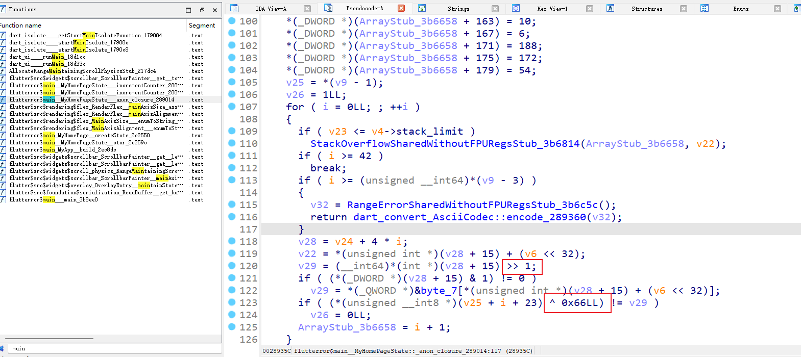

## [羊城杯 2021]Babyvm

https://www.nssctf.cn/problem/232

SMC不用管怎么处理的，直接动调找到VM代码

~~~c
unsigned int __cdecl sub_80487A8(_DWORD *a1)
{
  _BYTE *v2; // [esp+18h] [ebp-20h]
  unsigned int v3; // [esp+2Ch] [ebp-Ch]

  v3 = __readgsdword(0x14u);
  while ( 1 )
  {
    if ( *(_BYTE *)a1[8] == 113 )
    {
      a1[6] -= 4;
      *(_DWORD *)a1[6] = *(_DWORD *)(a1[8] + 1);
      a1[8] += 5;
    }
    if ( *(_BYTE *)a1[8] == 65 )
    {
      a1[1] += a1[2];
      ++a1[8];
    }
    if ( *(_BYTE *)a1[8] == 66 )
    {
      a1[1] -= a1[4];
      ++a1[8];
    }
    if ( *(_BYTE *)a1[8] == 67 )
    {
      a1[1] *= a1[3];
      ++a1[8];
    }
    if ( *(_BYTE *)a1[8] == 55 )
    {
      a1[1] = a1[5];
      ++a1[8];
    }
    if ( *(_BYTE *)a1[8] == 56 )
    {
      a1[1] ^= a1[4];
      ++a1[8];
    }
    if ( *(_BYTE *)a1[8] == 57 )
    {
      a1[1] ^= a1[5];
      ++a1[8];
    }
    if ( *(_BYTE *)a1[8] == 53 )
    {
      a1[5] = a1[1];
      ++a1[8];
    }
    if ( *(_BYTE *)a1[8] == 0xF7 )
    {
      a1[9] += a1[1];
      ++a1[8];
    }
    if ( *(_BYTE *)a1[8] == 68 )
    {
      a1[1] /= a1[5];
      ++a1[8];
    }
    if ( *(_BYTE *)a1[8] == 0x80 )
    {
      a1[sub_804875F((int)a1, 1u)] = *(_DWORD *)(a1[8] + 2);
      a1[8] += 6;
    }
    if ( *(_BYTE *)a1[8] == 119 )
    {
      a1[1] ^= a1[9];
      ++a1[8];
    }
    if ( *(_BYTE *)a1[8] == 83 )
    {
      putchar(*(char *)a1[3]);
      a1[8] += 2;
    }
    if ( *(_BYTE *)a1[8] == 34 )
    {
      a1[1] >>= a1[2];
      ++a1[8];
    }
    if ( *(_BYTE *)a1[8] == 35 )
    {
      a1[1] <<= a1[2];
      ++a1[8];
    }
    if ( *(_BYTE *)a1[8] == 0x99 )
      break;
    if ( *(_BYTE *)a1[8] == 118 )
    {
      a1[3] = *(_DWORD *)a1[6];
      *(_DWORD *)a1[6] = 0;
      a1[6] += 4;
      a1[8] += 5;
    }
    if ( *(_BYTE *)a1[8] == 84 )
    {
      v2 = (_BYTE *)a1[3];
      *v2 = getchar();
      a1[8] += 2;
    }
    if ( *(_BYTE *)a1[8] == 48 )
    {
      a1[1] |= a1[2];
      ++a1[8];
    }
    if ( *(_BYTE *)a1[8] == 49 )
    {
      a1[1] &= a1[2];
      ++a1[8];
    }
    if ( *(_BYTE *)a1[8] == 50 )
    {
      a1[3] = *(unsigned __int8 *)(a1[8] + 1);
      a1[8] += 2;
    }
    if ( *(_BYTE *)a1[8] == 9 )
    {
      a1[1] = 0x6FEBF967;
      ++a1[8];
    }
    if ( *(_BYTE *)a1[8] == 16 )
    {
      a1[9] = a1[1];
      ++a1[8];
    }
    if ( *(_BYTE *)a1[8] == 51 )
    {
      a1[4] = a1[1];
      ++a1[8];
    }
    if ( *(_BYTE *)a1[8] == 52 )
    {
      a1[2] = *(unsigned __int8 *)(a1[8] + 1);
      a1[8] += 2;
    }
    if ( *(_BYTE *)a1[8] == 0xFE )
    {
      a1[1] = a1[9];
      ++a1[8];
    }
    if ( *(_BYTE *)a1[8] == 17 )
    {
      printf("%x\n", a1[1]);
      ++a1[8];
    }
    if ( *(_BYTE *)a1[8] == 0xA0 )
    {
      if ( a1[1] != 1877735783 )
        exit(0);
      ++a1[8];
    }
    if ( *(_BYTE *)a1[8] == 0xA1 )
    {
      read(0, s, 0x2Cu);
      if ( strlen(s) != 44 )
        exit(0);
      ++a1[8];
    }
    if ( *(_BYTE *)a1[8] == 0xB1 )
    {
      a1[9] = dword_804B080[0];
      ++a1[8];
    }
    if ( *(_BYTE *)a1[8] == 0xB2 )
    {
      a1[9] = dword_804B084;
      ++a1[8];
    }
    if ( *(_BYTE *)a1[8] == 0xA4 )
    {
      dword_804B080[*(unsigned __int8 *)(a1[8] + 1)] = a1[1];
      a1[8] += 4;
    }
    if ( *(_BYTE *)a1[8] == 0xB3 )
    {
      a1[9] = dword_804B088;
      ++a1[8];
    }
    if ( *(_BYTE *)a1[8] == 0xB4 )
    {
      a1[9] = dword_804B08C;
      ++a1[8];
    }
    if ( *(_BYTE *)a1[8] == 0xC1 )
    {
      a1[1] = (unsigned __int8)s[*(unsigned __int8 *)(a1[8] + 1)];
      a1[8] += 2;
    }
    if ( *(_BYTE *)a1[8] == 0xC7 )
    {
      if ( dword_804B060 != a1[1] )
        exit(0);
      ++a1[8];
    }
    if ( *(_BYTE *)a1[8] == 0xC8 )
    {
      if ( dword_804B064 != a1[1] )
        exit(0);
      ++a1[8];
    }
    if ( *(_BYTE *)a1[8] == 0xC2 )
    {
      if ( (unsigned __int8)*(_DWORD *)(a1[8] + 1) != a1[1] )
        exit(0);
      a1[8] += 5;
    }
  }
  return __readgsdword(0x14u) ^ v3;
}
~~~

然后写vm_print

~~~python
import struct

s = ['a'] * 44  # 假设 s 是一个足够大的字符串数组或缓冲区
code = [0xA1, 0xC1, 0x00, 0xB1, 0x77, 0xC2, 0x4A, 0x01, 0x00, 0x00, 0xC1, 0x01, 0xB2, 0x77, 0xC2, 0x19, 0x01, 0x00, 0x00, 0xC1, 0x02, 0xB4, 0x77, 0xC2, 0xDD, 0x01, 0x00, 0x00, 0xC1, 0x03, 0xB3, 0x77, 0xC2, 0x0F, 0x01, 0x00, 0x00, 0xC1, 0x04, 0xB2, 0x77, 0xC2, 0x1B, 0x01, 0x00, 0x00, 0xC1, 0x05, 0xB4, 0x77, 0xC2, 0x89, 0x01, 0x00, 0x00, 0xC1, 0x06, 0xB1, 0x77, 0xC2, 0x19, 0x01, 0x00, 0x00, 0xC1, 0x07, 0xB3, 0x77, 0xC2, 0x54, 0x01, 0x00, 0x00, 0xC1, 0x08, 0xB1, 0x77, 0xC2, 0x4F, 0x01, 0x00, 0x00, 0xC1, 0x09, 0xB1, 0x77, 0xC2, 0x4E, 0x01, 0x00, 0x00, 0xC1, 0x0A, 0xB3, 0x77, 0xC2, 0x55, 0x01, 0x00, 0x00, 0xC1, 0x0B, 0xB3, 0x77, 0xC2, 0x56, 0x01, 0x00, 0x00, 0xC1, 0x0C, 0xB4, 0x77, 0xC2, 0x8E, 0x00, 0x00, 0x00, 0xC1, 0x0D, 0xB2, 0x77, 0xC2, 0x49, 0x00, 0x00, 0x00, 0xC1, 0x0E, 0xB3, 0x77, 0xC2, 0x0E, 0x01, 0x00, 0x00, 0xC1, 0x0F, 0xB1, 0x77, 0xC2, 0x4B, 0x01, 0x00, 0x00, 0xC1, 0x10, 0xB3, 0x77, 0xC2, 0x06, 0x01, 0x00, 0x00, 0xC1, 0x11, 0xB3, 0x77, 0xC2, 0x54, 0x01, 0x00, 0x00, 0xC1, 0x12, 0xB2, 0x77, 0xC2, 0x1A, 0x00, 0x00, 0x00, 0xC1, 0x13, 0xB1, 0x77, 0xC2, 0x42, 0x01, 0x00, 0x00, 0xC1, 0x14, 0xB3, 0x77, 0xC2, 0x53, 0x01, 0x00, 0x00, 0xC1, 0x15, 0xB1, 0x77, 0xC2, 0x1F, 0x01, 0x00, 0x00, 0xC1, 0x16, 0xB3, 0x77, 0xC2, 0x52, 0x01, 0x00, 0x00, 0xC1, 0x17, 0xB4, 0x77, 0xC2, 0xDB, 0x00, 0x00, 0x00, 0xC1, 0x18, 0xB1, 0x77, 0xC2, 0x19, 0x01, 0x00, 0x00, 0xC1, 0x19, 0xB4, 0x77, 0xC2, 0xD9, 0x00, 0x00, 0x00, 0xC1, 0x1A, 0xB1, 0x77, 0xC2, 0x19, 0x01, 0x00, 0x00, 0xC1, 0x1B, 0xB3, 0x77, 0xC2, 0x55, 0x01, 0x00, 0x00, 0xC1, 0x1C, 0xB2, 0x77, 0xC2, 0x19, 0x00, 0x00, 0x00, 0xC1, 0x1D, 0xB3, 0x77, 0xC2, 0x00, 0x01, 0x00, 0x00, 0xC1, 0x1E, 0xB1, 0x77, 0xC2, 0x4B, 0x01, 0x00, 0x00, 0xC1, 0x1F, 0xB2, 0x77, 0xC2, 0x1E, 0x00, 0x00, 0x00, 0xC1, 0x20, 0x80, 0x02, 0x18, 0x00, 0x00, 0x00, 0x23, 0x10, 0xC1, 0x21, 0x80, 0x02, 0x10, 0x00, 0x00, 0x00, 0x23, 0xF7, 0xC1, 0x22, 0x80, 0x02, 0x08, 0x00, 0x00, 0x00, 0x23, 0xF7, 0xC1, 0x23, 0xF7, 0xFE, 0x80, 0x02, 0x05, 0x00, 0x00, 0x00, 0x22, 0x77, 0x10, 0x80, 0x02, 0x07, 0x00, 0x00, 0x00, 0x23, 0x80, 0x02, 0x23, 0x77, 0xF1, 0x98, 0x31, 0x77, 0x10, 0x80, 0x02, 0x18, 0x00, 0x00, 0x00, 0x23, 0x80, 0x02, 0x20, 0xB9, 0xE4, 0x35, 0x31, 0x77, 0x10, 0x80, 0x02, 0x12, 0x00, 0x00, 0x00, 0x22, 0x77, 0xA0, 0xC1, 0x24, 0x80, 0x02, 0x18, 0x00, 0x00, 0x00, 0x23, 0x10, 0xC1, 0x25, 0x80, 0x02, 0x10, 0x00, 0x00, 0x00, 0x23, 0xF7, 0xC1, 0x26, 0x80, 0x02, 0x08, 0x00, 0x00, 0x00, 0x23, 0xF7, 0xC1, 0x27, 0xF7, 0xFE, 0x32, 0x20, 0x43, 0x33, 0x77, 0x80, 0x02, 0x11, 0x00, 0x00, 0x00, 0x22, 0x35, 0x37, 0x38, 0x77, 0x80, 0x02, 0x0D, 0x00, 0x00, 0x00, 0x23, 0x77, 0x38, 0x39, 0x10, 0x32, 0x20, 0x43, 0x33, 0x77, 0x80, 0x02, 0x11, 0x00, 0x00, 0x00, 0x22, 0x35, 0x37, 0x38, 0x77, 0x80, 0x02, 0x0D, 0x00, 0x00, 0x00, 0x23, 0x77, 0x38, 0x39, 0xC7, 0xC1, 0x28, 0x80, 0x02, 0x18, 0x00, 0x00, 0x00, 0x23, 0x10, 0xC1, 0x29, 0x80, 0x02, 0x10, 0x00, 0x00, 0x00, 0x23, 0xF7, 0xC1, 0x2A, 0x80, 0x02, 0x08, 0x00, 0x00, 0x00, 0x23, 0xF7, 0xC1, 0x2B, 0xF7, 0xFE, 0x32, 0x20, 0x43, 0x33, 0x77, 0x80, 0x02, 0x11, 0x00, 0x00, 0x00, 0x22, 0x35, 0x37, 0x38, 0x77, 0x80, 0x02, 0x0D, 0x00, 0x00, 0x00, 0x23, 0x77, 0x38, 0x39, 0x10, 0x32, 0x20, 0x43, 0x33, 0x77, 0x80, 0x02, 0x11, 0x00, 0x00, 0x00, 0x22, 0x35, 0x37, 0x38, 0x77, 0x80, 0x02, 0x0D, 0x00, 0x00, 0x00, 0x23, 0x77, 0x38, 0x39, 0xC8, 0x99]
ip = 0
tmp_list = []
xor_cmp_list = []
while True:
    # print(ip, end=" ")
    if code[ip] == 113:
        print("push ", code[ip + 1])
        ip += 5
    elif code[ip] == 65:
        print("reg1 += reg2")
        ip += 1
    elif code[ip] == 66:
        print("reg1 -= reg4")
        ip += 1
    elif code[ip] == 67:
        print("reg1 *= reg3")
        ip += 1
    elif code[ip] == 55:
        print("reg1 = reg5")
        ip += 1
    elif code[ip] == 56:
        print("reg1 ^= reg4")
        ip += 1
    elif code[ip] == 57:
        print("reg1 ^= reg5")
        ip += 1
    elif code[ip] == 53:
        print("reg5 = reg1")
        ip += 1
    elif code[ip] == 0xF7:
        print("tmp += reg1")
        ip += 1
    elif code[ip] == 68:
        print("reg1 /= reg5")
        ip += 1
    elif code[ip] == 0x80:
        print(f"reg2 = {struct.unpack('<I', bytes(code[ip+2:ip+6]))[0]}")
        ip += 6
    elif code[ip] == 119:
        print("reg1 ^= tmp")
        ip += 1
    elif code[ip] == 83:
        print(f"putchar reg3")
        ip += 2
    elif code[ip] == 34:
        print("reg1 >>= reg2")
        ip += 1
    elif code[ip] == 35:
        print("reg1 <<= reg2")
        ip += 1
    elif code[ip] == 0x99:
        print("End of processing")
        break
    elif code[ip] == 118:
        print("pop reg3")
        ip += 5
    elif code[ip] == 84:
        print(f"getchar reg3")
        ip += 2
    elif code[ip] == 48:
        print("reg1 |= reg2")
        ip += 1
    elif code[ip] == 49:
        print("reg1 &= reg2")
        ip += 1
    elif code[ip] == 50:
        print(f"reg3 = {code[ip+1]}")
        ip += 2
    elif code[ip] == 9:
        print("reg1 = 0x6FEBF967")
        ip += 1
    elif code[ip] == 16:
        print("tmp = reg1")
        ip += 1
    elif code[ip] == 51:
        print("reg4 = reg1")
        ip += 1
    elif code[ip] == 52:
        print(f"reg2 = {code[ip+1]}")
        ip += 2
    elif code[ip] == 0xFE:
        print("reg1 = tmp")
        ip += 1
    elif code[ip] == 17:
        print("print reg1")
        ip += 1
    elif code[ip] == 0xA0:
        print("cmp reg1, 0x6FEBF967")
        ip += 1
    elif code[ip] == 0xA1:
        print("input len=44")
        ip += 1
    elif code[ip] == 0xB1:
        tmp_list.append(0x7b)
        print("tmp = 0x7b")
        ip += 1
    elif code[ip] == 0xB2:
        tmp_list.append(0x2f)
        print("tmp = 0x2f")
        ip += 1
    elif code[ip] == 0xA4:
        print("mov dword[code[ip+1]], reg1")
        ip += 4
    elif code[ip] == 0xB3:
        tmp_list.append(0x37)
        print("tmp = 0x37")
        ip += 1
    elif code[ip] == 0xB4:
        tmp_list.append(0xe8)
        print("tmp = 0xe8")
        ip += 1
    elif code[ip] == 0xC1:
        print(f"reg1 = s[{code[ip + 1]}]")
        ip += 2
    elif code[ip] == 0xC7:
        print("cmp reg1, 0xCF1304DC")
        ip += 1
    elif code[ip] == 0xC8:
        print("cmp reg1, 0x283B8E84")
        ip += 1
    elif code[ip] == 0xC2:
        xor_cmp_list.append(code[ip + 1])
        print(f"cmp, reg1, {code[ip + 1]}")
        ip += 5
print(tmp_list)
print(xor_cmp_list)
~~~

打印如下

~~~
input len=44
reg1 = s[0]
tmp = 0x7b
reg1 ^= tmp
cmp, reg1, 74
reg1 = s[1]
tmp = 0x2f
reg1 ^= tmp
cmp, reg1, 25
reg1 = s[2]
tmp = 0xe8
reg1 ^= tmp
cmp, reg1, 221
reg1 = s[3]
tmp = 0x37
reg1 ^= tmp
cmp, reg1, 15
reg1 = s[4]
tmp = 0x2f
reg1 ^= tmp
cmp, reg1, 27
reg1 = s[5]
tmp = 0xe8
reg1 ^= tmp
cmp, reg1, 137
reg1 = s[6]
tmp = 0x7b
reg1 ^= tmp
cmp, reg1, 25
reg1 = s[7]
tmp = 0x37
reg1 ^= tmp
cmp, reg1, 84
reg1 = s[8]
tmp = 0x7b
reg1 ^= tmp
cmp, reg1, 79
reg1 = s[9]
tmp = 0x7b
reg1 ^= tmp
cmp, reg1, 78
reg1 = s[10]
tmp = 0x37
reg1 ^= tmp
cmp, reg1, 85
reg1 = s[11]
tmp = 0x37
reg1 ^= tmp
cmp, reg1, 86
reg1 = s[12]
tmp = 0xe8
reg1 ^= tmp
cmp, reg1, 142
reg1 = s[13]
tmp = 0x2f
reg1 ^= tmp
cmp, reg1, 73
reg1 = s[14]
tmp = 0x37
reg1 ^= tmp
cmp, reg1, 14
reg1 = s[15]
tmp = 0x7b
reg1 ^= tmp
cmp, reg1, 75
reg1 = s[16]
tmp = 0x37
reg1 ^= tmp
cmp, reg1, 6
reg1 = s[17]
tmp = 0x37
reg1 ^= tmp
cmp, reg1, 84
reg1 = s[18]
tmp = 0x2f
reg1 ^= tmp
cmp, reg1, 26
reg1 = s[19]
tmp = 0x7b
reg1 ^= tmp
cmp, reg1, 66
reg1 = s[20]
tmp = 0x37
reg1 ^= tmp
cmp, reg1, 83
reg1 = s[21]
tmp = 0x7b
reg1 ^= tmp
cmp, reg1, 31
reg1 = s[22]
tmp = 0x37
reg1 ^= tmp
cmp, reg1, 82
reg1 = s[23]
tmp = 0xe8
reg1 ^= tmp
cmp, reg1, 219
reg1 = s[24]
tmp = 0x7b
reg1 ^= tmp
cmp, reg1, 25
reg1 = s[25]
tmp = 0xe8
reg1 ^= tmp
cmp, reg1, 217
reg1 = s[26]
tmp = 0x7b
reg1 ^= tmp
cmp, reg1, 25
reg1 = s[27]
tmp = 0x37
reg1 ^= tmp
cmp, reg1, 85
reg1 = s[28]
tmp = 0x2f
reg1 ^= tmp
cmp, reg1, 25
reg1 = s[29]
tmp = 0x37
reg1 ^= tmp
cmp, reg1, 0
reg1 = s[30]
tmp = 0x7b
reg1 ^= tmp
cmp, reg1, 75
reg1 = s[31]
tmp = 0x2f
reg1 ^= tmp
cmp, reg1, 30
reg1 = s[32]
reg2 = 24
reg1 <<= reg2
tmp = reg1
reg1 = s[33]
reg2 = 16
reg1 <<= reg2
tmp += reg1
reg1 = s[34]
reg2 = 8
reg1 <<= reg2
tmp += reg1
reg1 = s[35]
tmp += reg1
reg1 = tmp
reg2 = 5
reg1 >>= reg2
reg1 ^= tmp
tmp = reg1
reg2 = 7
reg1 <<= reg2
reg2 = 2565961507
reg1 &= reg2
reg1 ^= tmp
tmp = reg1
reg2 = 24
reg1 <<= reg2
reg2 = 904182048
reg1 &= reg2
reg1 ^= tmp
tmp = reg1
reg2 = 18
reg1 >>= reg2
reg1 ^= tmp
cmp reg1, 0x6FEBF967
reg1 = s[36]
reg2 = 24
reg1 <<= reg2
tmp = reg1
reg1 = s[37]
reg2 = 16
reg1 <<= reg2
tmp += reg1
reg1 = s[38]
reg2 = 8
reg1 <<= reg2
tmp += reg1
reg1 = s[39]
tmp += reg1
reg1 = tmp
reg3 = 32
reg1 *= reg3
reg4 = reg1
reg1 ^= tmp
reg2 = 17
reg1 >>= reg2
reg5 = reg1
reg1 = reg5
reg1 ^= reg4
reg1 ^= tmp
reg2 = 13
reg1 <<= reg2
reg1 ^= tmp
reg1 ^= reg4
reg1 ^= reg5
tmp = reg1
reg3 = 32
reg1 *= reg3
reg4 = reg1
reg1 ^= tmp
reg2 = 17
reg1 >>= reg2
reg5 = reg1
reg1 = reg5
reg1 ^= reg4
reg1 ^= tmp
reg2 = 13
reg1 <<= reg2
reg1 ^= tmp
reg1 ^= reg4
reg1 ^= reg5
cmp reg1, 0xCF1304DC
reg1 = s[40]
reg2 = 24
reg1 <<= reg2
tmp = reg1
reg1 = s[41]
reg2 = 16
reg1 <<= reg2
tmp += reg1
reg1 = s[42]
reg2 = 8
reg1 <<= reg2
tmp += reg1
reg1 = s[43]
tmp += reg1
reg1 = tmp
reg3 = 32
reg1 *= reg3
reg4 = reg1
reg1 ^= tmp
reg2 = 17
reg1 >>= reg2
reg5 = reg1
reg1 = reg5
reg1 ^= reg4
reg1 ^= tmp
reg2 = 13
reg1 <<= reg2
reg1 ^= tmp
reg1 ^= reg4
reg1 ^= reg5
tmp = reg1
reg3 = 32
reg1 *= reg3
reg4 = reg1
reg1 ^= tmp
reg2 = 17
reg1 >>= reg2
reg5 = reg1
reg1 = reg5
reg1 ^= reg4
reg1 ^= tmp
reg2 = 13
reg1 <<= reg2
reg1 ^= tmp
reg1 ^= reg4
reg1 ^= reg5
cmp reg1, 0x283B8E84
End of processing
[123, 47, 232, 55, 47, 232, 123, 55, 123, 123, 55, 55, 232, 47, 55, 123, 55, 55, 47, 123, 55, 123, 55, 232, 123, 232, 123, 55, 47, 55, 123, 47]
[74, 25, 221, 15, 27, 137, 25, 84, 79, 78, 85, 86, 142, 73, 14, 75, 6, 84, 26, 66, 83, 31, 82, 219, 25, 217, 25, 85, 25, 0, 75, 30]
~~~

分析可知前32位异或，后面12位每四字节可以爆破，范围为十六进制字母

~~~python
#xor
from Crypto.Util.number import bytes_to_long

xor = [123, 47, 232, 55, 47, 232, 123, 55, 123, 123, 55, 55, 232, 47, 55, 123, 55, 55, 47, 123, 55, 123, 55, 232, 123, 232, 123, 55, 47, 55, 123, 47]
cmp = [74, 25, 221, 15, 27, 137, 25, 84, 79, 78, 85, 86, 142, 73, 14, 75, 6, 84, 26, 66, 83, 31, 82, 219, 25, 217, 25, 85, 25, 0, 75, 30]
flag = ""
for i in range(32):
    flag += chr(xor[i] ^ cmp[i])
print(flag)
s = [97] * 44

from itertools import product

s_list = list("0123456789abcdef")
for i in product(s_list, repeat=4):
    tmp = bytes_to_long("".join(i).encode())
    tmp = (tmp>>5)^tmp
    tmp = ((tmp<<7)&2565961507)^tmp
    tmp = ((tmp<<24)&904182048)^tmp
    if (tmp>>18)^tmp==0x6FEBF967:
        flag += ''.join(i)
        break
for i in product(s_list, repeat=4):
    tmp = bytes_to_long("".join(i).encode())
    reg1 = tmp
    reg3 = 32
    reg1 *= reg3
    reg1 &= 0xffffffff
    reg4 = reg1
    reg1 ^= tmp
    reg2 = 17
    reg1 >>= reg2
    reg5 = reg1
    reg1 = reg5
    reg1 ^= reg4
    reg1 ^= tmp
    reg2 = 13
    reg1 <<= reg2
    reg1 &= 0xffffffff
    reg1 ^= tmp
    reg1 ^= reg4
    reg1 ^= reg5
    tmp = reg1
    reg3 = 32
    reg1 *= reg3
    reg1 &= 0xffffffff
    reg4 = reg1
    reg1 ^= tmp
    reg2 = 17
    reg1 >>= reg2
    reg5 = reg1
    reg1 = reg5
    reg1 ^= reg4
    reg1 ^= tmp
    reg2 = 13
    reg1 <<= reg2
    reg1 &= 0xffffffff
    reg1 ^= tmp
    reg1 ^= reg4
    reg1 ^= reg5
    reg1 &= 0xffffffff
    if reg1 == 0xCF1304DC:
        flag += "".join(i)
        break
for i in product(s_list, repeat=4):
    tmp = bytes_to_long("".join(i).encode())
    reg1 = tmp
    reg3 = 32
    reg1 *= reg3
    reg1 &= 0xffffffff
    reg4 = reg1
    reg1 ^= tmp
    reg2 = 17
    reg1 >>= reg2
    reg5 = reg1
    reg1 = reg5
    reg1 ^= reg4
    reg1 ^= tmp
    reg2 = 13
    reg1 <<= reg2
    reg1 &= 0xffffffff
    reg1 ^= tmp
    reg1 ^= reg4
    reg1 ^= reg5
    tmp = reg1
    reg3 = 32
    reg1 *= reg3
    reg1 &= 0xffffffff
    reg4 = reg1
    reg1 ^= tmp
    reg2 = 17
    reg1 >>= reg2
    reg5 = reg1
    reg1 = reg5
    reg1 ^= reg4
    reg1 ^= tmp
    reg2 = 13
    reg1 <<= reg2
    reg1 &= 0xffffffff
    reg1 ^= tmp
    reg1 ^= reg4
    reg1 ^= reg5
    if reg1 == 0x283B8E84:
        flag += "".join(i)
        break
print(flag)
~~~

## [NSSRound#18 Basic]EzADVM

https://www.nssctf.cn/problem/5109

这道题我取巧做出来了，还是找到VM代码print出来，然后我直接把所有流程打印出来作为代码，用z3来表示最终的s

首先是vm_print

~~~python
opcode = [0x01, 0x01, 0x21, 0xF1, 0xC3, 0xB2, 0xE5, 0xD4, 0xA1, 0x53, 0x57, 0x44, 0x61, 0x44, 0x64, 0xF1, 0xC3, 0xB2, 0xE5, 0xD4, 0xA1, 0xF1, 0xC3, 0xB2, 0xE5, 0xD4, 0xA1, 0xF1, 0xC3, 0xB2, 0xE5, 0xD4, 0xA1, 0x53, 0x57, 0x44, 0x61, 0x44, 0x64, 0xF1, 0xC3, 0xB2, 0xE5, 0xD4, 0xA1, 0xF1, 0xC3, 0xB2, 0xE5, 0xD4, 0xA1, 0xF1, 0xC3, 0xB2, 0xE5, 0xD4, 0xA1, 0xF1, 0xC3, 0xB2, 0xE5, 0xD4, 0xA1, 0xF1, 0xC3, 0xB2, 0xE5, 0xD4, 0xA1, 0x53, 0x57, 0x44, 0x61, 0x44, 0x64, 0xF1, 0xC3, 0xB2, 0xE5, 0xD4, 0xA1, 0xF1, 0xC3, 0xB2, 0xE5, 0xD4, 0xA1, 0xF1, 0xC3, 0xB2, 0xE5, 0xD4, 0xA1, 0x53, 0x57, 0x44, 0x61, 0x44, 0x64, 0xF1, 0xC3, 0xB2, 0xE5, 0xD4, 0xA1, 0xF1, 0xC3, 0xB2, 0xE5, 0xD4, 0xA1, 0xF1, 0xC3, 0xB2, 0xE5, 0xD4, 0xA1, 0x66, 0x6C, 0x61, 0x67, 0x7B, 0x59, 0x75, 0x69, 0x73, 0x61, 0x62, 0x65, 0x61, 0x75, 0x74, 0x69, 0x66, 0x75, 0x6C, 0x67, 0x69, 0x72, 0x6C, 0x7D, 0xF1, 0xC3, 0xB2, 0xE5, 0xD4, 0xA1, 0xF1, 0xC3, 0xB2, 0xE5, 0xD4, 0xA1, 0x66, 0x6C, 0x61, 0x67, 0x7B, 0x59, 0x75, 0x69, 0x73, 0x61, 0x62, 0x65, 0x61, 0x75, 0x74, 0x69, 0x66, 0x75, 0x6C, 0x67, 0x69, 0x72, 0x6C, 0x7D, 0xF1, 0xC3, 0xB2, 0xE5, 0xD4, 0xA1, 0xF1, 0xC3, 0xB2, 0xE5, 0xD4, 0xA1, 0x66, 0x6C, 0x61, 0x67, 0x7B, 0x59, 0x75, 0x69, 0x73, 0x61, 0x62, 0x65, 0x61, 0x75, 0x74, 0x69, 0x66, 0x75, 0x6C, 0x67, 0x69, 0x72, 0x6C, 0x7D, 0xF1, 0xC3, 0xB2, 0xE5, 0xD4, 0xA1, 0xF1, 0xC3, 0xB2, 0xE5, 0xD4, 0xA1, 0x53, 0x57, 0x44, 0x61, 0x44, 0x64, 0x66, 0x6C, 0x61, 0x67, 0x7B, 0x59, 0x75, 0x69, 0x73, 0x61, 0x62, 0x65, 0x61, 0x75, 0x74, 0x69, 0x66, 0x75, 0x6C, 0x67, 0x69, 0x72, 0x6C, 0x7D, 0xF1, 0xC3, 0xB2, 0xE5, 0xD4, 0xA1, 0xF1, 0xC3, 0xB2, 0xE5, 0xD4, 0xA1, 0xF1, 0xC3, 0xB2, 0xE5, 0xD4, 0xA1, 0xF1, 0xC3, 0xB2, 0xE5, 0xD4, 0xA1, 0x53, 0x57, 0x44, 0x61, 0x44, 0x64, 0x66, 0x6C, 0x61, 0x67, 0x7B, 0x59, 0x75, 0x69, 0x73, 0x61, 0x62, 0x65, 0x61, 0x75, 0x74, 0x69, 0x66, 0x75, 0x6C, 0x67, 0x69, 0x72, 0x6C, 0x7D, 0xF1, 0xC3, 0xB2, 0xE5, 0xD4, 0xA1, 0x66, 0x6C, 0x61, 0x67, 0x7B, 0x59, 0x75, 0x69, 0x73, 0x61, 0x62, 0x65, 0x61, 0x75, 0x74, 0x69, 0x66, 0x75, 0x6C, 0x67, 0x69, 0x72, 0x6C, 0x7D, 0xF1, 0xC3, 0xB2, 0xE5, 0xD4, 0xA1, 0xF1, 0xC3, 0xB2, 0xE5, 0xD4, 0xA1, 0xF1, 0xC3, 0xB2, 0xE5, 0xD4, 0xA1, 0xF1, 0xC3, 0xB2, 0xE5, 0xD4, 0xA1, 0xF1, 0xC3, 0xB2, 0xE5, 0xD4, 0xA1, 0x53, 0x57, 0x44, 0x61, 0x44, 0x64, 0xF1, 0xC3, 0xB2, 0xE5, 0xD4, 0xA1, 0x99, 0xBF, 0xBB, 0xBF, 0xBB, 0xBF, 0xBB, 0xBF, 0xBB, 0xBF, 0xBB, 0xBF, 0xBB, 0xBF, 0xBB, 0xBF, 0xBB, 0xBF, 0xBB, 0xBF, 0xBB, 0xBF, 0xBB, 0xBF, 0xBB, 0xBF, 0xBB, 0xBF, 0xBB, 0xBF, 0xBB, 0xBF, 0xBB, 0xBF, 0xBB, 0xBF, 0xBB, 0xBF, 0xBB, 0xBF, 0xBB, 0x66, 0x6C, 0x61, 0x67, 0x7B, 0x59, 0x75, 0x69, 0x73, 0x61, 0x62, 0x65, 0x61, 0x75, 0x74, 0x69, 0x66, 0x75, 0x6C, 0x67, 0x69, 0x72, 0x6C, 0x7D, 0xBF, 0xBB, 0xBF, 0xBB, 0xBF, 0xBB, 0xBF, 0xBB, 0xBF, 0xBB, 0xBF, 0xBB, 0xBF, 0xBB, 0xBF, 0xBB, 0xBF, 0xBB, 0xBF, 0xBB, 0x53, 0x57, 0x44, 0x44, 0xBF, 0xBB, 0xBF, 0xBB, 0x99, 0x53, 0x57, 0x44, 0x44, 0x53, 0x57, 0x44, 0x44, 0x88, 0xFF, 0x53, 0x57, 0x44, 0x44, 0x00, 0x00, 0x00, 0x00, 0x00, 0x00, 0x00, 0x00, 0x00, 0x00, 0x00, 0x00, 0x00, 0x00, 0x00, 0x00, 0x00, 0x00, 0x00, 0x00, 0x00, 0x00, 0x00, 0x00, 0x00, 0x00, 0x00, 0x00, 0x00, 0x00, 0x00, 0x00, 0x00, 0x00, 0x00, 0x00, 0x00, 0x00, 0x00, 0x00, 0x00, 0x00, 0x00, 0x00, 0x00, 0x00, 0x00, 0x00, 0x00, 0x00, 0x00, 0x00, 0x00, 0x00, 0x00, 0x00, 0x00, 0x00, 0x00, 0x00, 0x00, 0x00, 0x00, 0x00, 0x00, 0x00, 0x00, 0x00, 0x00, 0x00, 0x00, 0x00, 0x00, 0x00, 0x00, 0x00, 0x00, 0x00, 0x00, 0x00, 0x00, 0x00, 0x00, 0x00, 0x00, 0x00, 0x00, 0x00, 0x00, 0x00, 0x00, 0x00, 0x00, 0x00, 0x00, 0x00, 0x00, 0x00, 0x00, 0x00, 0x00, 0x00, 0x00, 0x00, 0x00, 0x00, 0x00, 0x00, 0x00, 0x00, 0x00, 0x00, 0x00, 0x00, 0x00, 0x00, 0x00, 0x00, 0x00, 0x00, 0x00, 0x00, 0x00, 0x00, 0x00, 0x00, 0x00, 0x00, 0x00, 0x00, 0x00, 0x00, 0x00, 0x00, 0x00, 0x00, 0x00, 0x00, 0x00, 0x00, 0x00, 0x00, 0x00, 0x00, 0x00, 0x00, 0x00, 0x00, 0x00, 0x00, 0x00, 0x00, 0x00, 0x00, 0x00, 0x00, 0x00, 0x00, 0x00, 0x00, 0x00, 0x00, 0x00, 0x00, 0x00, 0x00, 0x00, 0x00, 0x00, 0x00, 0x00, 0x00, 0x00, 0x00, 0x00, 0x00, 0x00, 0x00, 0x00, 0x00, 0x00, 0x00, 0x00, 0x00, 0x00, 0x00, 0x00, 0x00, 0x00, 0x00, 0x00, 0x00, 0x00, 0x00, 0x00, 0x00, 0x00, 0x00, 0x00, 0x00, 0x00, 0x00, 0x00, 0x00, 0x00, 0x00, 0x00, 0x00, 0x00, 0x00, 0x00, 0x00, 0x00, 0x00, 0x00, 0x00, 0x00, 0x00, 0x00, 0x00, 0x00, 0x00, 0x00, 0x00, 0x00, 0x00, 0x00, 0x00, 0x00, 0x00, 0x00, 0x00, 0x00, 0x00, 0x00, 0x00, 0x00, 0x00, 0x00, 0x00, 0x00, 0x00, 0x00, 0x00, 0x00, 0x00, 0x00, 0x00, 0x00, 0x00, 0x00, 0x00, 0x00, 0x00, 0x00, 0x00, 0x00, 0x00, 0x00, 0x00, 0x00, 0x00, 0x00, 0x00, 0x00, 0x00, 0x00, 0x00, 0x00, 0x00, 0x00, 0x00, 0x00, 0x00, 0x00, 0x00, 0x00, 0x00, 0x00, 0x00, 0x00, 0x00, 0x00, 0x00, 0x00, 0x00, 0x00, 0x00, 0x00, 0x00, 0x00, 0x00, 0x00, 0x00, 0x00, 0x00, 0x00, 0x00, 0x00, 0x00, 0x00, 0x00, 0x00, 0x00, 0x00, 0x00, 0x00, 0x00, 0x00, 0x00, 0x00, 0x00, 0x00, 0x00, 0x00, 0x00, 0x00, 0x00, 0x00, 0x00, 0x00, 0x00, 0x00, 0x00, 0x00, 0x00, 0x00, 0x00, 0x00, 0x00, 0x00, 0x00, 0x00, 0x00, 0x00, 0x00, 0x00, 0x00, 0x00, 0x00, 0x00, 0x00, 0x00, 0x00, 0x00, 0x00, 0x00, 0x00, 0x00, 0x00, 0x00, 0x00, 0x00, 0x00, 0x00, 0x00, 0x00, 0x00, 0x00, 0x00, 0x00, 0x00, 0x00, 0x00, 0x00, 0x00, 0x00, 0x00, 0x00, 0x00, 0x00, 0x00, 0x00, 0x00, 0x00, 0x00, 0x00, 0x00, 0x00, 0x00, 0x00, 0x00, 0x00, 0x00, 0x00, 0x00, 0x00, 0x00, 0x00, 0x00, 0x00, 0x00, 0x00, 0x00, 0x00, 0x00, 0x00, 0x00, 0x00, 0x00, 0x00, 0x00, 0x00, 0x00, 0x00, 0x00, 0x00, 0x00, 0x00, 0x00, 0x00, 0x00, 0x00, 0x00, 0x00, 0x00, 0x00, 0x00, 0x00, 0x00, 0x00, 0x00, 0x00, 0x00, 0x00, 0x00, 0x00, 0x00, 0x00, 0x00, 0x00, 0x00, 0x00, 0x00, 0x00, 0x00, 0x00, 0x00, 0x00, 0x00, 0x00, 0x00, 0x00, 0x00, 0x00, 0x00, 0x00, 0x00, 0x00, 0x00, 0x00, 0x00, 0x00, 0x00, 0x00, 0x00, 0x00, 0x00, 0x00, 0x00, 0x00, 0x00, 0x00, 0x00, 0x00, 0x00, 0x00, 0x00, 0x00, 0x00, 0x00, 0x00, 0x00, 0x00, 0x00, 0x00, 0x00, 0x00, 0x00, 0x00, 0x00, 0x00, 0x00, 0x00, 0x00, 0x00, 0x00, 0x00, 0x00, 0x00, 0x00, 0x00, 0x00, 0x00, 0x00, 0x00, 0x00, 0x00, 0x00, 0x00, 0x00, 0x00, 0x00, 0x00, 0x00, 0x00, 0x00, 0x00, 0x00, 0x00, 0x00, 0x00, 0x00, 0x00, 0x00, 0x00, 0x00, 0x00, 0x00, 0x00, 0x00, 0x00, 0x00, 0x00, 0x00, 0x00, 0x00, 0x00, 0x00, 0x00, 0x00, 0x00, 0x00, 0x00, 0x00, 0x00, 0x00, 0x00, 0x00, 0x00, 0x00, 0x00, 0x00, 0x00, 0x00, 0x00, 0x00, 0x00, 0x00, 0x00, 0x00, 0x00, 0x00, 0x00, 0x00, 0x00, 0x00, 0x00, 0x00, 0x00, 0x00, 0x00, 0x00, 0x00, 0x00, 0x00, 0x00, 0x00, 0x00, 0x00, 0x00, 0x00, 0x00, 0x00, 0x00, 0x00, 0x00, 0x00, 0x00, 0x00, 0x00, 0x00, 0x00, 0x00, 0x00, 0x00, 0x00, 0x00, 0x00, 0x00, 0x00, 0x00, 0x00, 0x00, 0x00, 0x00, 0x00, 0x00, 0x00, 0x00, 0x00, 0x00, 0x00, 0x00, 0x00, 0x00, 0x00, 0x00, 0x00, 0x00, 0x00, 0x00, 0x00, 0x00, 0x00, 0x00, 0x00, 0x00, 0x00, 0x00, 0x00, 0x00, 0x00, 0x00, 0x00, 0x00, 0x00, 0x00, 0x00, 0x00, 0x00, 0x00, 0x00, 0x00, 0x00, 0x00, 0x00, 0x00, 0x00, 0x00, 0x00, 0x00, 0x00, 0x00, 0x00, 0x00, 0x00, 0x00, 0x00, 0x00, 0x00, 0x00, 0x00, 0x00, 0x00, 0x00, 0x00, 0x00, 0x00, 0x00, 0x00, 0x00, 0x00, 0x00, 0x00, 0x00, 0x00, 0x00, 0x00, 0x00, 0x00, 0x00, 0x00, 0x00, 0x00, 0x00, 0x00, 0x00, 0x00, 0x00, 0x00, 0x00, 0x00, 0x00, 0x00, 0x00, 0x00, 0x00, 0x00, 0x00, 0x00, 0x00, 0x00, 0x00, 0x00, 0x00, 0x00, 0x00, 0x00, 0x00, 0x00, 0x00, 0x00, 0x00, 0x00, 0x00, 0x00, 0x00, 0x00, 0x00, 0x00, 0x00, 0x00, 0x00, 0x00, 0x00, 0x00, 0x00, 0x00, 0x00, 0x00, 0x00, 0x00, 0x00, 0x00, 0x00, 0x00, 0x00, 0x00, 0x00, 0x00, 0x00, 0x00, 0x00, 0x00, 0x00, 0x00, 0x00, 0x00, 0x00, 0x00, 0x00, 0x00, 0x00, 0x00, 0x00, 0x00, 0x00, 0x00, 0x00, 0x00, 0x00, 0x00, 0x00, 0x00, 0x00, 0x00, 0x00, 0x00, 0x00, 0x00, 0x00, 0x00, 0x00, 0x00, 0x00, 0x00, 0x00, 0x00, 0x00, 0x00, 0x00, 0x00, 0x00, 0x00, 0x00, 0x00, 0x00, 0x00, 0x00, 0x00, 0x00, 0x00, 0x00, 0x00, 0x00, 0x00, 0x00, 0x00, 0x00, 0x00, 0x00, 0x00, 0x00, 0x00, 0x00, 0x00, 0x00, 0x00, 0x00, 0x00, 0x00, 0x00, 0x00, 0x00, 0x00, 0x00, 0x00, 0x00, 0x00, 0x00, 0x00, 0x00, 0x00, 0x00, 0x00, 0x00, 0x00, 0x00, 0x00, 0x00, 0x00, 0x00, 0x00, 0x00, 0x00, 0x00, 0x00, 0x00, 0x00, 0x00, 0x00, 0x00, 0x00, 0x00, 0x00, 0x00, 0x00, 0x00, 0x00, 0x00, 0x00, 0x00, 0x00, 0x00, 0x00, 0x00, 0x00, 0x00, 0x00, 0x00, 0x00, 0x00, 0x00, 0x00, 0x00, 0x00, 0x00, 0x00, 0x00, 0x00, 0x00, 0x00, 0x00, 0x00, 0x00, 0x00, 0x00, 0x00, 0x00, 0x00, 0x00, 0x00, 0x00, 0x00, 0x00, 0x00, 0x00, 0x00, 0x00, 0x00, 0x00, 0x00, 0x00, 0x00, 0x00, 0x00, 0x00, 0x00, 0x00, 0x00, 0x00, 0x00, 0x00, 0x00, 0x00, 0x00, 0x00, 0x00, 0x00, 0x00, 0x00, 0x00, 0x00, 0x00, 0x00, 0x00, 0x00, 0x00, 0x00, 0x00, 0x00, 0x00, 0x00, 0x00, 0x00, 0x00, 0x00, 0x00, 0x00, 0x00, 0x00, 0x00, 0x00, 0x00, 0x00, 0x00, 0x00, 0x00, 0x00, 0x00, 0x00, 0x00, 0x00, 0x00, 0x00, 0x00, 0x00, 0x00, 0x00, 0x00, 0x00, 0x00, 0x00, 0x00, 0x00, 0x00, 0x00, 0x00, 0x00, 0x00, 0x00, 0x00, 0x00, 0x00, 0x00, 0x00, 0x00, 0x00, 0x00, 0x00, 0x00, 0x00, 0x00, 0x00, 0x00, 0x00, 0x00, 0x00, 0x00, 0x00, 0x00, 0x00, 0x00, 0x00, 0x00, 0x00, 0x00, 0x00, 0x00, 0x00, 0x00, 0x00, 0x00, 0x00, 0x00, 0x00, 0x00, 0x00, 0x00, 0x00, 0x00, 0x00, 0x00, 0x00, 0x00, 0x00, 0x00, 0x00, 0x00, 0x00, 0x00, 0x00, 0x00, 0x00, 0x00, 0x00, 0x00, 0x00, 0x00, 0x00, 0x00, 0x00, 0x00, 0x00, 0x00, 0x00, 0x00, 0x00, 0x00, 0x00, 0x00, 0x00, 0x00, 0x00, 0x00, 0x00, 0x00, 0x00, 0x00, 0x00, 0x00, 0x00, 0x00, 0x00, 0x00, 0x00, 0x00, 0x00, 0x00, 0x00, 0x00, 0x00, 0x00, 0x00, 0x00, 0x00, 0x00, 0x00, 0x00, 0x00, 0x00, 0x00, 0x00, 0x00, 0x00, 0x00, 0x00, 0x00, 0x00, 0x00, 0x00, 0x00, 0x00, 0x00, 0x00, 0x00, 0x00, 0x00, 0x00, 0x00, 0x00, 0x00, 0x00, 0x00, 0x00, 0x00, 0x00, 0x00, 0x00, 0x00, 0x00, 0x00, 0x00, 0x00, 0x00, 0x00, 0x00, 0x00, 0x00, 0x00, 0x00, 0x00, 0x00, 0x00, 0x00, 0x00, 0x00, 0x00, 0x00, 0x00, 0x00, 0x00, 0x00, 0x00, 0x00, 0x00, 0x00, 0x00, 0x00, 0x00, 0x00, 0x00, 0x00, 0x00, 0x00, 0x00, 0x00, 0x00, 0x00, 0x00, 0x00, 0x00, 0x00, 0x00, 0x00, 0x00, 0x00, 0x00, 0x00, 0x00, 0x00, 0x00, 0x00, 0x00, 0x00, 0x00, 0x00, 0x00, 0x00, 0x00, 0x00, 0x00, 0x00, 0x00, 0x00, 0x00, 0x00, 0x00, 0x00, 0x00, 0x00, 0x00, 0x00, 0x00, 0x00, 0x00, 0x00, 0x00, 0x00, 0x00, 0x00, 0x00, 0x00, 0x00, 0x00, 0x00, 0x00, 0x00, 0x00, 0x00, 0x00, 0x00, 0x00, 0x00, 0x00, 0x00, 0x00, 0x00, 0x00, 0x00, 0x00, 0x00, 0x00, 0x00, 0x00, 0x00, 0x00, 0x00, 0x00, 0x00, 0x00, 0x00, 0x00, 0x00, 0x00, 0x00, 0x00, 0x00, 0x00, 0x00, 0x00, 0x00, 0x00, 0x00, 0x00, 0x00, 0x00, 0x00, 0x00, 0x00, 0x00, 0x00, 0x00, 0x00, 0x00, 0x00, 0x00, 0x00, 0x00, 0x00, 0x00, 0x00, 0x00, 0x00, 0x00, 0x00, 0x00, 0x00, 0x00, 0x00, 0x00, 0x00, 0x00, 0x00, 0x00, 0x00, 0x00, 0x00, 0x00, 0x00, 0x00, 0x00, 0x00, 0x00, 0x00, 0x00, 0x00, 0x00, 0x00, 0x00, 0x00, 0x00, 0x00, 0x00, 0x00, 0x00, 0x00, 0x00, 0x00, 0x00, 0x00, 0x00, 0x00, 0x00, 0x00, 0x00, 0x00, 0x00, 0x00, 0x00, 0x00, 0x00, 0x00, 0x00, 0x00, 0x00, 0x00, 0x00, 0x00, 0x00, 0x00, 0x00, 0x00, 0x00, 0x00, 0x00, 0x00, 0x00, 0x00, 0x00, 0x00, 0x00, 0x00, 0x00, 0x00, 0x00, 0x00, 0x00, 0x00, 0x00, 0x00, 0x00, 0x00, 0x00, 0x00, 0x00, 0x00, 0x00, 0x00, 0x00, 0x00, 0x00, 0x00, 0x00, 0x00, 0x00, 0x00, 0x00, 0x00, 0x00, 0x00, 0x00, 0x00, 0x00, 0x00, 0x00, 0x00, 0x00, 0x00, 0x00, 0x00, 0x00, 0x00, 0x00, 0x00, 0x00, 0x00, 0x00, 0x00, 0x00, 0x00, 0x00, 0x00, 0x00, 0x00, 0x00, 0x00, 0x00, 0x00, 0x00, 0x00, 0x00, 0x00, 0x00, 0x00, 0x00, 0x00, 0x00, 0x00, 0x00, 0x00, 0x00, 0x00, 0x00, 0x00, 0x00, 0x00, 0x00, 0x00, 0x00, 0x00, 0x00, 0x00, 0x00, 0x00, 0x00, 0x00, 0x00, 0x00, 0x00, 0x00, 0x00, 0x00, 0x00, 0x00, 0x00, 0x00, 0x00, 0x00, 0x00, 0x00, 0x00, 0x00, 0x00, 0x00, 0x00, 0x00, 0x00, 0x00, 0x00, 0x00, 0x00, 0x00, 0x00, 0x00, 0x00, 0x00, 0x00, 0x00, 0x00, 0x00, 0x00, 0x00, 0x00, 0x00, 0x00, 0x00, 0x00, 0x00, 0x00, 0x00, 0x00, 0x00, 0x00, 0x00, 0x00, 0x00, 0x00, 0x00, 0x00, 0x00, 0x00, 0x00, 0x00, 0x00, 0x00, 0x00, 0x00, 0x00, 0x00, 0x00, 0x00, 0x00, 0x00, 0x00, 0x00, 0x00, 0x00, 0x00, 0x00, 0x00, 0x00, 0x00, 0x00, 0x00, 0x00, 0x00, 0x00, 0x00, 0x00, 0x00, 0x00, 0x00, 0x00, 0x00, 0x00, 0x00, 0x00, 0x00, 0x00, 0x00, 0x00, 0x00, 0x00, 0x00, 0x00, 0x00, 0x00, 0x00, 0x00, 0x00, 0x00, 0x00, 0x00, 0x00, 0x00, 0x00, 0x00, 0x00, 0x00, 0x00, 0x00, 0x00, 0x00, 0x00, 0x00, 0x00, 0x00, 0x00, 0x00, 0x00, 0x00, 0x00, 0x00, 0x00, 0x00, 0x00, 0x00, 0x00, 0x00, 0x00, 0x00, 0x00, 0x00, 0x00, 0x00, 0x00, 0x00, 0x00, 0x00, 0x00, 0x00, 0x00, 0x00, 0x00, 0x00, 0x00, 0x00, 0x00, 0x00, 0x00, 0x00, 0x00, 0x00, 0x00, 0x00, 0x00, 0x00, 0x00, 0x00, 0x00, 0x00, 0x00, 0x00, 0x00, 0x00, 0x00, 0x00, 0x00, 0x00, 0x00, 0x00, 0x00, 0x00, 0x00, 0x00, 0x00, 0x00]
ip = 1

while 1:
    while 1:
        if ip == 0:
            print("wrong")
            exit(0)
        ip += 1
        if opcode[ip] != 33:
            break
    if opcode[ip] == 255:
        exit(0)
    if opcode[ip] == 136:
        break
    if opcode[ip] == 0xa1:
        print("s[v11 - 1] = v25 & v22")
    elif opcode[ip] == 0xc3:
        print("v22 = v17 | v18")
    elif opcode[ip] == 0xb2:
        print("v23 = ~v17")
    elif opcode[ip] == 0xe5:
        print("v24 = ~v18")
    elif opcode[ip] == 0xf1:
        print("v17 = a[v11]")
        print("v11 += 1")
        print("v18 = a[v11]")
    elif opcode[ip] == 0xd4:
        print("v25 = v24 | v23")
    elif opcode[ip] == 0xbf:
        print("v6 = v11")
        print("v11 += 1")
        print("v21[0] = s[v6]")
    elif opcode[ip] == 0x99:
        print("v11 = 0")
    elif opcode[ip] == 0xbb:
        print("s[v11 - 1] = v11 + v21[0] - 1")
~~~

然后是z3脚本

~~~python
from z3 import *

sol = Solver()
cmp = [0x1D, 0x01, 0x12, 0x1A, 0x16, 0x42, 0x39, 0x0F, 0x38, 0x09, 0x13, 0x31, 0x28, 0x38, 0x67, 0x6E, 0x1B, 0x61, 0x7C, 0x24, 0x1F, 0x47, 0x44, 0x81, 0x6A, 0x2C, 0x6D, 0x2B, 0x2C, 0x2D, 0x6A, 0x9C]
a = [BitVec(f"a{i}", 8) for i in range(64)]
s = [0] * 32
v11 = 0
v21 = [0]
v17 = a[v11]
v11 += 1
v18 = a[v11]
v22 = v17 | v18
v23 = ~v17
v24 = ~v18
v25 = v24 | v23
s[v11 - 1] = v25 & v22
v17 = a[v11]
v11 += 1
v18 = a[v11]
v22 = v17 | v18
v23 = ~v17
v24 = ~v18
v25 = v24 | v23
s[v11 - 1] = v25 & v22
v17 = a[v11]
v11 += 1
v18 = a[v11]
v22 = v17 | v18
v23 = ~v17
v24 = ~v18
v25 = v24 | v23
s[v11 - 1] = v25 & v22
v17 = a[v11]
v11 += 1
v18 = a[v11]
v22 = v17 | v18
v23 = ~v17
v24 = ~v18
v25 = v24 | v23
s[v11 - 1] = v25 & v22
v17 = a[v11]
v11 += 1
v18 = a[v11]
v22 = v17 | v18
v23 = ~v17
v24 = ~v18
v25 = v24 | v23
s[v11 - 1] = v25 & v22
v17 = a[v11]
v11 += 1
v18 = a[v11]
v22 = v17 | v18
v23 = ~v17
v24 = ~v18
v25 = v24 | v23
s[v11 - 1] = v25 & v22
v17 = a[v11]
v11 += 1
v18 = a[v11]
v22 = v17 | v18
v23 = ~v17
v24 = ~v18
v25 = v24 | v23
s[v11 - 1] = v25 & v22
v17 = a[v11]
v11 += 1
v18 = a[v11]
v22 = v17 | v18
v23 = ~v17
v24 = ~v18
v25 = v24 | v23
s[v11 - 1] = v25 & v22
v17 = a[v11]
v11 += 1
v18 = a[v11]
v22 = v17 | v18
v23 = ~v17
v24 = ~v18
v25 = v24 | v23
s[v11 - 1] = v25 & v22
v17 = a[v11]
v11 += 1
v18 = a[v11]
v22 = v17 | v18
v23 = ~v17
v24 = ~v18
v25 = v24 | v23
s[v11 - 1] = v25 & v22
v17 = a[v11]
v11 += 1
v18 = a[v11]
v22 = v17 | v18
v23 = ~v17
v24 = ~v18
v25 = v24 | v23
s[v11 - 1] = v25 & v22
v17 = a[v11]
v11 += 1
v18 = a[v11]
v22 = v17 | v18
v23 = ~v17
v24 = ~v18
v25 = v24 | v23
s[v11 - 1] = v25 & v22
v17 = a[v11]
v11 += 1
v18 = a[v11]
v22 = v17 | v18
v23 = ~v17
v24 = ~v18
v25 = v24 | v23
s[v11 - 1] = v25 & v22
v17 = a[v11]
v11 += 1
v18 = a[v11]
v22 = v17 | v18
v23 = ~v17
v24 = ~v18
v25 = v24 | v23
s[v11 - 1] = v25 & v22
v17 = a[v11]
v11 += 1
v18 = a[v11]
v22 = v17 | v18
v23 = ~v17
v24 = ~v18
v25 = v24 | v23
s[v11 - 1] = v25 & v22
v17 = a[v11]
v11 += 1
v18 = a[v11]
v22 = v17 | v18
v23 = ~v17
v24 = ~v18
v25 = v24 | v23
s[v11 - 1] = v25 & v22
v17 = a[v11]
v11 += 1
v18 = a[v11]
v22 = v17 | v18
v23 = ~v17
v24 = ~v18
v25 = v24 | v23
s[v11 - 1] = v25 & v22
v17 = a[v11]
v11 += 1
v18 = a[v11]
v22 = v17 | v18
v23 = ~v17
v24 = ~v18
v25 = v24 | v23
s[v11 - 1] = v25 & v22
v17 = a[v11]
v11 += 1
v18 = a[v11]
v22 = v17 | v18
v23 = ~v17
v24 = ~v18
v25 = v24 | v23
s[v11 - 1] = v25 & v22
v17 = a[v11]
v11 += 1
v18 = a[v11]
v22 = v17 | v18
v23 = ~v17
v24 = ~v18
v25 = v24 | v23
s[v11 - 1] = v25 & v22
v17 = a[v11]
v11 += 1
v18 = a[v11]
v22 = v17 | v18
v23 = ~v17
v24 = ~v18
v25 = v24 | v23
s[v11 - 1] = v25 & v22
v17 = a[v11]
v11 += 1
v18 = a[v11]
v22 = v17 | v18
v23 = ~v17
v24 = ~v18
v25 = v24 | v23
s[v11 - 1] = v25 & v22
v17 = a[v11]
v11 += 1
v18 = a[v11]
v22 = v17 | v18
v23 = ~v17
v24 = ~v18
v25 = v24 | v23
s[v11 - 1] = v25 & v22
v17 = a[v11]
v11 += 1
v18 = a[v11]
v22 = v17 | v18
v23 = ~v17
v24 = ~v18
v25 = v24 | v23
s[v11 - 1] = v25 & v22
v17 = a[v11]
v11 += 1
v18 = a[v11]
v22 = v17 | v18
v23 = ~v17
v24 = ~v18
v25 = v24 | v23
s[v11 - 1] = v25 & v22
v17 = a[v11]
v11 += 1
v18 = a[v11]
v22 = v17 | v18
v23 = ~v17
v24 = ~v18
v25 = v24 | v23
s[v11 - 1] = v25 & v22
v17 = a[v11]
v11 += 1
v18 = a[v11]
v22 = v17 | v18
v23 = ~v17
v24 = ~v18
v25 = v24 | v23
s[v11 - 1] = v25 & v22
v17 = a[v11]
v11 += 1
v18 = a[v11]
v22 = v17 | v18
v23 = ~v17
v24 = ~v18
v25 = v24 | v23
s[v11 - 1] = v25 & v22
v17 = a[v11]
v11 += 1
v18 = a[v11]
v22 = v17 | v18
v23 = ~v17
v24 = ~v18
v25 = v24 | v23
s[v11 - 1] = v25 & v22
v17 = a[v11]
v11 += 1
v18 = a[v11]
v22 = v17 | v18
v23 = ~v17
v24 = ~v18
v25 = v24 | v23
s[v11 - 1] = v25 & v22
v17 = a[v11]
v11 += 1
v18 = a[v11]
v22 = v17 | v18
v23 = ~v17
v24 = ~v18
v25 = v24 | v23
s[v11 - 1] = v25 & v22
v17 = a[v11]
v11 += 1
v18 = a[v11]
v22 = v17 | v18
v23 = ~v17
v24 = ~v18
v25 = v24 | v23
s[v11 - 1] = v25 & v22
v11 = 0
v6 = v11
v11 += 1
v21[0] = s[v6]
s[v11 - 1] = v11 + v21[0] - 1
v6 = v11
v11 += 1
v21[0] = s[v6]
s[v11 - 1] = v11 + v21[0] - 1
v6 = v11
v11 += 1
v21[0] = s[v6]
s[v11 - 1] = v11 + v21[0] - 1
v6 = v11
v11 += 1
v21[0] = s[v6]
s[v11 - 1] = v11 + v21[0] - 1
v6 = v11
v11 += 1
v21[0] = s[v6]
s[v11 - 1] = v11 + v21[0] - 1
v6 = v11
v11 += 1
v21[0] = s[v6]
s[v11 - 1] = v11 + v21[0] - 1
v6 = v11
v11 += 1
v21[0] = s[v6]
s[v11 - 1] = v11 + v21[0] - 1
v6 = v11
v11 += 1
v21[0] = s[v6]
s[v11 - 1] = v11 + v21[0] - 1
v6 = v11
v11 += 1
v21[0] = s[v6]
s[v11 - 1] = v11 + v21[0] - 1
v6 = v11
v11 += 1
v21[0] = s[v6]
s[v11 - 1] = v11 + v21[0] - 1
v6 = v11
v11 += 1
v21[0] = s[v6]
s[v11 - 1] = v11 + v21[0] - 1
v6 = v11
v11 += 1
v21[0] = s[v6]
s[v11 - 1] = v11 + v21[0] - 1
v6 = v11
v11 += 1
v21[0] = s[v6]
s[v11 - 1] = v11 + v21[0] - 1
v6 = v11
v11 += 1
v21[0] = s[v6]
s[v11 - 1] = v11 + v21[0] - 1
v6 = v11
v11 += 1
v21[0] = s[v6]
s[v11 - 1] = v11 + v21[0] - 1
v6 = v11
v11 += 1
v21[0] = s[v6]
s[v11 - 1] = v11 + v21[0] - 1
v6 = v11
v11 += 1
v21[0] = s[v6]
s[v11 - 1] = v11 + v21[0] - 1
v6 = v11
v11 += 1
v21[0] = s[v6]
s[v11 - 1] = v11 + v21[0] - 1
v6 = v11
v11 += 1
v21[0] = s[v6]
s[v11 - 1] = v11 + v21[0] - 1
v6 = v11
v11 += 1
v21[0] = s[v6]
s[v11 - 1] = v11 + v21[0] - 1
v6 = v11
v11 += 1
v21[0] = s[v6]
s[v11 - 1] = v11 + v21[0] - 1
v6 = v11
v11 += 1
v21[0] = s[v6]
s[v11 - 1] = v11 + v21[0] - 1
v6 = v11
v11 += 1
v21[0] = s[v6]
s[v11 - 1] = v11 + v21[0] - 1
v6 = v11
v11 += 1
v21[0] = s[v6]
s[v11 - 1] = v11 + v21[0] - 1
v6 = v11
v11 += 1
v21[0] = s[v6]
s[v11 - 1] = v11 + v21[0] - 1
v6 = v11
v11 += 1
v21[0] = s[v6]
s[v11 - 1] = v11 + v21[0] - 1
v6 = v11
v11 += 1
v21[0] = s[v6]
s[v11 - 1] = v11 + v21[0] - 1
v6 = v11
v11 += 1
v21[0] = s[v6]
s[v11 - 1] = v11 + v21[0] - 1
v6 = v11
v11 += 1
v21[0] = s[v6]
s[v11 - 1] = v11 + v21[0] - 1
v6 = v11
v11 += 1
v21[0] = s[v6]
s[v11 - 1] = v11 + v21[0] - 1
v6 = v11
v11 += 1
v21[0] = s[v6]
s[v11 - 1] = v11 + v21[0] - 1
v6 = v11
v11 += 1
v21[0] = s[v6]
s[v11 - 1] = v11 + v21[0] - 1
v11 = 0
for i in range(32):
    sol.add(cmp[i] == s[i])
# while sol.check() == sat:
#     ans = sol.model()
#     for i in a:
#         try:
#             print(chr(ans[i].as_long()), end="")
#         except:
#             continue
print(s)
"""
[1 + ((~a1 | ~a0) & (a0 | a1)) - 1, 2 + ((~a2 | ~a1) & (a1 | a2)) - 1, 3 + ((~a3 | ~a2) & (a2 | a3)) - 1, 4 + ((~a4 | ~a3) & (a3 | a4)) - 1, 5 + ((~a5 | ~a4) & (a4 | a5)) - 1, 6 + ((~a6 | ~a5) & (a5 | a6)) - 1, 7 + ((~a7 | ~a6) & (a6 | a7)) - 1, 8 + ((~a8 | ~a7) & (a7 | a8)) - 1, 9 + ((~a9 | ~a8) & (a8 | a9)) - 1, 10 + ((~a10 | ~a9) & (a9 | a10)) - 1, 11 + ((~a11 | ~a10) & (a10 | a11)) - 1, 12 + ((~a12 | ~a11) & (a11 | a12)) - 1, 13 + ((~a13 | ~a12) & (a12 | a13)) - 1, 14 + ((~a14 | ~a13) & (a13 | a14)) - 1, 15 + ((~a15 | ~a14) & (a14 | a15)) - 1, 16 + ((~a16 | ~a15) & (a15 | a16)) - 1, 17 + ((~a17 | ~a16) & (a16 | a17)) - 1, 18 + ((~a18 | ~a17) & (a17 | a18)) - 1, 19 + ((~a19 | ~a18) & (a18 | a19)) - 1, 20 + ((~a20 | ~a19) & (a19 | a20)) - 1, 21 + ((~a21 | ~a20) & (a20 | a21)) - 1, 22 + ((~a22 | ~a21) & (a21 | a22)) - 1, 23 + ((~a23 | ~a22) & (a22 | a23)) - 1, 24 + ((~a24 | ~a23) & (a23 | a24)) - 1, 25 + ((~a25 | ~a24) & (a24 | a25)) - 1, 26 + ((~a26 | ~a25) & (a25 | a26)) - 1, 27 + ((~a27 | ~a26) & (a26 | a27)) - 1, 28 + ((~a28 | ~a27) & (a27 | a28)) - 1, 29 + ((~a29 | ~a28) & (a28 | a29)) - 1, 30 + ((~a30 | ~a29) & (a29 | a30)) - 1, 31 + ((~a31 | ~a30) & (a30 | a31)) - 1, 32 + ((~a32 | ~a31) & (a31 | a32)) - 1]
"""
~~~

观察发现规律循环异或操作，异或完减i，搞定

~~~python
cmp = [0x1D, 0x01, 0x12, 0x1A, 0x16, 0x42, 0x39, 0x0F, 0x38, 0x09, 0x13, 0x31, 0x28, 0x38, 0x67, 0x6E, 0x1B, 0x61, 0x7C, 0x24, 0x1F, 0x47, 0x44, 0x81, 0x6A, 0x2C, 0x6D, 0x2B, 0x2C, 0x2D, 0x6A, 0x9C]
cmp[31] -= 31
for i in range(30, -1, -1):
    cmp[i] -= i
    cmp[i] ^= cmp[i+1]
print("".join(map(chr, cmp)))
~~~

## [SDCTF 2022]Oracle

https://www.nssctf.cn/problem/2358

too easy java

~~~python
def thirdPass(s):
    for i in range(42):
        s[i] -= ((7 * i * i) + (31 * i) + 127 + (i % 2))
        s[i] &= 0xff
    return s

def secondPass(s):
    f = [0] * 42
    for i in range(42):
        f[(i + 41) % 42] |= ((s[i] & 0xf0) >> 4)
        f[i] |= ((s[i] & 0xf) << 4)
    return f

def firstPass(s):
    for i in range(42):
        s[i] ^= (((((3 * i) * i) + (5 * i)) + 101) + (i % 2))
        s[i] &= 0xff
    return s

cmp = [48, 6, 122, -86, -73, -59, 78, 84, 105, -119, -36, -118, 70, 17, 101, -85, 55, -38, -91, 32, -18, -107, 53, 99, -74, 67, 89, 120, -41, 122, -100, -70, 34, -111, 21, -128, 78, 27, 123, -103, 36, 87]
print(len(cmp))
cmp = thirdPass(cmp)
cmp = secondPass(cmp)
cmp = firstPass(cmp)
print("".join(map(chr, cmp)))
~~~

## [NCTF 2022]cccha

https://www.nssctf.cn/problem/3266

花指令混淆很严重，但是观察发现两种实际代码

因此我使用ida的trace功能把所有运行的指令打印了下来导出，然后python脚本找到这两种执行代码提取出来

~~~python
# 读取文件并提取每列的数据
class CODE:
    def __init__(self, index, dis):
        self.index = index
        self.dis = dis
def extract_columns_from_file(file_path):
    # 打开文件并读取所有行
    with open(file_path, 'r', encoding='utf-8') as file:
        lines = file.readlines()
    codes = []
    # 处理每一行，提取每一列的数据
    for i in range(12, len(lines)):
        line = lines[i]
        # 去除行首尾的空白符，并按'|'分割
        parts = line.strip().split('\t')
        # 确保行包含至少7个部分，防止异常
        if len(parts) >= 4:
            dis = parts[2].strip()
            if "Debug event" in dis:
                continue
            if "jmp     cs:" in dis:
                continue
            code = CODE(i, dis)
            codes.append(code)
            # 返回每列的数据作为结果
    return codes

file_path = 'trace.txt'
codes = extract_columns_from_file(file_path)

final_codes = []
for i in range(len(codes) - 1):
    insert1 = 0
    insert2 = 0
    code = codes[i]
    if codes[i - 1].dis == "popfq" and codes[i + 1].dis == "push    rbx":
        insert1 = 1
    if codes[i - 1].dis == "retn" and codes[i + 1].dis == "push    rbx":
        insert2 = 1
    if insert1 == 1 or insert2 == 1:
        final_codes.append(code)
for i in range(len(final_codes)):
    code = final_codes[i]
    print(f"{code.dis}")
~~~

把里面所有函数手动分离下（根据push ebp和retn）

* 首先初始化了很多数据

* sub_55D2834A8941循环getchar输入，要求长度42

* sub_55D2834A1090出现硬编码字符串"expand 32-byte k"，查询可知[Chacha20](https://blog.csdn.net/weixin_59166557/article/details/144060806)，发现传入参数正好分别是空的、32字节（key）、12字节（nonce）和一个counter（随机数）

* sub_55D2834A1F33里面大量xor和rol操作，查询发现正好80次，符合chacha20加密

  

* 主函数里还有很长的明显重复操作，发现`cmp     dword ptr [rbp-138h], 29h ; ')'`多次运行，有循环且42次，里面和前面expand返回值进行了循环异或

~~~
cdqe
push    rax
lea     rdx, unk_55D2834AD000
push    rax
movzx   ecx, byte ptr [rax+rdx]
mov     eax, [rbp-138h]
cdqe
lea     rdx, [rbp-130h]
add     rax, rdx
movzx   eax, byte ptr [rax]
push    rax
xor     ecx, eax
push    rax
mov     eax, [rbp-138h]
cdqe
push    rax
lea     rdx, unk_55D2834AD000
mov     [rax+rdx], cl
mov     eax, [rbp-138h]
push    rax
cdqe
push    rax
lea     rdx, unk_55D2834AD000
movzx   eax, byte ptr [rax+rdx]
mov     edx, [rbp-138h]
lea     ecx, [rax+rdx]
mov     eax, [rbp-138h]
cdqe
lea     rdx, unk_55D2834AD000
push    rax
mov     [rax+rdx], cl
push    rax
add     dword ptr [rbp-138h], 1
~~~

同时注意到里面魔改了chacha20加密，异或外多了个加i

~~~python
import struct

# 宏定义：循环左移（左移操作后，右边溢出的部分重新回到左边）
def ROTL(a, b):
    return ((a << b) & 0xFFFFFFFF) | (a >> (32 - b))

# 宏定义：Chacha20的四分之一轮（Quarter Round）操作
def QR(a, b, c, d):
    a = (a + b) & 0xFFFFFFFF
    d ^= a
    d = ROTL(d, 16)
    c = (c + d) & 0xFFFFFFFF
    b ^= c
    b = ROTL(b, 12)
    a = (a + b) & 0xFFFFFFFF
    d ^= a
    d = ROTL(d, 8)
    c = (c + d) & 0xFFFFFFFF
    b ^= c
    b = ROTL(b, 7)
    return a, b, c, d

# ChaCha20加密算法中的块函数
def chacha20_block(output, input_state):
    x = list(input_state)

    # 进行20轮加密操作，每轮执行四分之一轮操作
    for _ in range(10):
        # 奇数轮
        x[0], x[4], x[8], x[12] = QR(x[0], x[4], x[8], x[12])
        x[1], x[5], x[9], x[13] = QR(x[1], x[5], x[9], x[13])
        x[2], x[6], x[10], x[14] = QR(x[2], x[6], x[10], x[14])
        x[3], x[7], x[11], x[15] = QR(x[3], x[7], x[11], x[15])

        # 偶数轮
        x[0], x[5], x[10], x[15] = QR(x[0], x[5], x[10], x[15])
        x[1], x[6], x[11], x[12] = QR(x[1], x[6], x[11], x[12])
        x[2], x[7], x[8], x[13] = QR(x[2], x[7], x[8], x[13])
        x[3], x[4], x[9], x[14] = QR(x[3], x[4], x[9], x[14])

    # 将加密结果与原始输入状态相加，输出最终结果
    for i in range(16):
        output[i] = (x[i] + input_state[i]) & 0xFFFFFFFF

# ChaCha20加密函数
def chacha20_encrypt(out, in_data, in_len, key, nonce, counter):
    state = [
        0x61707865, 0x3320646e, 0x79622d32, 0x6b206574,  # 固定常量（ASCII编码：expand 32-byte k）
        key[0], key[1], key[2], key[3],  # 256位密钥（8个32位字）
        key[4], key[5], key[6], key[7],
        counter, nonce[0], nonce[1], nonce[2]  # 计数器和nonce
    ]

    block = [0] * 16  # 存储每次生成的64字节的加密块
    while in_len > 0:
        # 生成一个加密块
        chacha20_block(block, state)
        state[12] = (state[12] + 1) & 0xFFFFFFFF  # 每次加密后递增计数器

        block_size = min(in_len, 64)  # 计算当前块的大小
        for i in range(block_size):
            out[i] = in_data[i] ^ (block[i // 4] >> (8 * (i % 4)) & 0xFF)  # 将输入数据与加密块异或得到密文

        # 更新剩余输入数据的长度和指针
        in_len -= block_size
        in_data = in_data[block_size:]
        out = out[block_size:]

# 主函数
def main():
    # 示例：初始化密钥、nonce、明文等
    key = [0x57, 0xEE, 0x23, 0x50, 0x80, 0xA2, 0x05, 0x6A, 0x05, 0x40, 0x12, 0x73, 0xEC, 0xEB, 0xCF, 0x12,
           0xC4, 0x18, 0xD9, 0x9E, 0xD2, 0xC3, 0x60, 0xF0, 0x72, 0x5B, 0x17, 0xDB, 0x36, 0x30, 0x61, 0x45]  # 32字节的密钥
    nonce = [0xE6, 0x37, 0x13, 0x8A, 0xBD, 0x83, 0x3D, 0x14, 0x95, 0xA9, 0x9B, 0x90]  # 12字节的nonce
    key = [struct.unpack("<I", bytes(key[i:i+4]))[0] for i in range(0, len(key), 4)]
    nonce = [struct.unpack("<I", bytes(nonce[i:i+4]))[0] for i in range(0, len(nonce), 4)]
    plaintext = b"Hello, this is a test for the ChaCha20 encryption algorithm."  # 明文
    ciphertext = [0x5E, 0xC0, 0x7C, 0x75, 0x73, 0x4B, 0xCE, 0x23, 0xA4, 0xBB, 0x89, 0xAC, 0xF3, 0x01, 0x8F, 0x70,
                  0xC8, 0x7F, 0x31, 0x83, 0x41, 0x5B, 0xD4, 0x62, 0xA6, 0xA7, 0x27, 0xDC, 0x9D, 0xFC, 0x50, 0x4B,
                  0x06, 0x98, 0x2F, 0x6B, 0x38, 0x17, 0x51, 0x38, 0x2F, 0xEF]  # 密文

    # 对密文进行预处理
    for i in range(42):
        ciphertext[i] = (ciphertext[i] - i) & 0xFF

    # 执行解密操作（加密是对称的，解密过程与加密相同）
    decrypted = bytearray(len(ciphertext))
    chacha20_encrypt(decrypted, ciphertext, len(ciphertext), key, nonce, 0x9E3779B9)

    # 解密后的数据应当与原始明文相同
    print(decrypted.decode('utf-8'))

if __name__ == "__main__":
    main()
~~~

## [NSSRound#X Basic]绝世欧皇

https://www.nssctf.cn/problem/3542

小心动态规划，有点偏算法

脑子炸了，sb算法不写了

## [香山杯 2023]hello_py

https://www.nssctf.cn/problem/4577

第一次见到安卓里调用python sdk的，直接zip找assets-chaquopy里的app.imy，zip打开就是python源码，是个简单的xxtea，加了点混淆，直接脚本秒

~~~python
import struct
from ctypes import c_uint32

def xxtea_decrypt(n, v, key):
    # 全部转为c_unit32格式
    v = [c_uint32(i) for i in v]
    r = 6 + 52 // n
    v0 = v[0].value
    delta = 0x9e3779b9
    total = c_uint32(delta * r)
    for i in range(r):
        e = (total.value >> 2) & 3
        for j in range(n-1, 0, -1):
            v1 = v[j-1].value
            v[j].value -= ((((v1 >> 5) ^ (v0 << 2)) + ((v0 >> 3) ^ (v1 << 4))) ^ ((total.value ^ v0) + (key[(j & 3) ^ e] ^ v1)))
            v0 = v[j].value
        v1 = v[n-1].value
        v[0].value -= ((((v1 >> 5) ^ (v0 << 2)) + ((v0 >> 3) ^ (v1 << 4))) ^ ((total.value ^ v0) + (key[(0 & 3) ^ e] ^ v1)))
        v0 = v[0].value
        total.value -= delta
    return [i.value for i in v]

k = [12345678 ,12398712 ,91283904 ,12378192 ]
v = [689085350 ,626885696 ,1894439255 ,1204672445 ,1869189675 ,475967424 ,1932042439 ,1280104741 ,2808893494 ]
# 解密
v = xxtea_decrypt(len(v), v, k)

# 输出解密后的数据
str_list = []
for i in range(len(v)):
    str_list.append(struct.pack('>I', v[i]).decode()[::-1])
print('decrypted: %s' % ''.join(str_list))
~~~

## [CISCN 2023 初赛]flutterror

https://www.nssctf.cn/problem/4064

[blutter](https://bbs.kanxue.com/thread-279403.htm)工具逆向，要有VS的promt控制台，在里面的python直接找conda下envs里的python.exe。运行结束会生成符号表等

然后直接搜main函数，筛选下找到存在数组的函数分析下

关注到数组全是偶数，数组第一个异或0x66正好是f，直接上脚本

~~~python
cmp = [0, 20, 14, 2, 58, 190, 160, 6, 160, 166, 160, 190, 162, 150, 166, 6, 8, 8, 150, 164, 162, 164, 162, 150, 190, 160, 170, 160,150, 14, 6, 0, 10, 4, 172, 164, 168, 10, 6, 188, 172, 54]
for i in range(0, len(cmp)):
    cmp[i] >>= 1
    cmp[i] ^= 0x66
print("".join(map(chr, cmp)))
~~~

## [justCTF 2020]Rusty

https://www.nssctf.cn/problem/928

直接反编译解密的flag是假的

~~~python
from z3 import *

s = Solver()

cmp = [0x0145, 0x0144, 0x013B, 0x011B, 0x00FB, 0x00FB, 0x0120, 0x013C, 0x0151, 0x0142, 0x0147, 0x013B, 0x0141, 0x012C, 0x0140, 0x0119, 0x0119, 0x0116, 0x0147, 0x015D, 0x0143, 0x0135, 0x0132, 0x0138, 0x0136, 0x0130, 0x013A, 0x014A, 0x0149, 0x0143, 0x0142, 0x013E, 0x0134, 0x00FA, 0x00F2, 0x00D9, 0x00E6, 0x00D2, 0x00D1, 0x00D6, 0x00D7, 0x00D3, 0x00D4, 0x00A9, 0x0089, 0x0063, 0x0063, 0x00BF]
print(len(cmp))
a = [BitVec(f"a{i}", 9) for i in range(50)]
for i in range(48):
    s.add(a[i]+a[i+1]+a[i+2]==cmp[i])
    s.add(a[i]<127)
    s.add(a[i]>32)
s.add(a[49]==ord("}"))
if s.check() == sat:
    ans = s.model()
    for i in a:
        print(chr(ans[i].as_long()), end="")
~~~

找了其他函数都没有，看了[wp](https://github.com/1GN1tE/CTF_Writeups/blob/7e1c5d4c56bb3a79b063efe7f4f45b901d722a50/Writeups/JustCTF_2021/Rusty/README.md)才知道真实代码藏到了DOS stub里

通常DOS stub都用来输出"This program cannot be run in DOS mode"类似的字符串，但这里的明显大于常规PE文件，说明里面可能藏了16进制代码

用DOSBox运行下（mount挂载目录）运行发现有动画，真的神奇，敲击键盘会有火花

用ida 16-bit intel8086打开，会只反编译dos stub，可以看到一些函数，分析可知是一种循环异或

可以发现明显的检查keyboard输入，且长度word_10088正好0x27（"This program cannot be run in DOS mode."也是这么长）

输入后直接打印flag

## PEPEPE

https://www.nssctf.cn/problem/3391

再来道PE文件题目，下周重点学习下，写个笔记

exeinfo会提示不是正确PE文件，010editor打开会告诉你AddressOfNewExeHeader有问题，查看发现是0，正常来讲是指向PE开头的位置

修改为80即可ida反编译，很明显file文件是file_org根据input循环异或和取反得到结果

~~~c
scanf("%s", input);
v7 = strlen(input);
Stream = fopen("file_org", "rb");
if ( Stream )
{
    fseek(Stream, 0, 2);
    v5 = ftell(Stream);
    rewind(Stream);
    for ( i = 0; i < v5 - 1; ++i )
    {
      bank[i] = getc(Stream);
      bank[i] = ~(bank[i] ^ input[i % v7]);
    }
    fclose(Stream);
    Character = fopen("file", "wb");
    for ( j = 0; j < v5; ++j )
      fputc((int)Character, (FILE *)bank[j]);
    printf("[root@Track.Sh]# It's over, I don't know what you gonna do but... Just keep justy.");
    return 0;
}
else
{
    puts("[root@Track.Sh]# An unexcepted error happened:(");
    return 1;
}
~~~

file_org在哪呢？猜测原始文件也是PE文件，直接根据固定字符串做个异或取反处理

~~~python
s = "This program cannot be run in DOS mode."
c = [0xDE, 0xB6, 0xE4, 0xE9, 0xA9, 0xEA, 0xFF, 0xF9, 0xFD, 0xFF, 0xE9, 0xFB, 0xB3, 0xF0, 0xF2, 0xF8,
0xFA, 0xF5, 0xF2, 0xB0, 0xE8, 0xBB, 0xAD, 0xE8, 0xFC, 0xF4, 0xAD, 0xFF, 0xF4, 0xAD, 0xCC, 0xD9,
0xC0, 0xB3, 0xFE, 0xF9, 0xF0, 0xFF, 0xA8
]
for i in range(len(c)):
    print(chr(0xff-(ord(s[i])^c[i])), end="")
# u!reverierwilllikeyou!reverierwilllikey
~~~

确定input为`reverierwilllikeyou!`，重新异或下

~~~python
key = b"reverierwilllikeyou!"
with open("file", "rb") as f:
    data = list(f.read())
for i in range(len(data)):
    data[i] ^= key[i%len(key)]
    data[i] = 0xff - data[i]
with open("file.exe", "wb") as f:
    f.write(bytes(data))
~~~

打开新的exe直接找到flag
