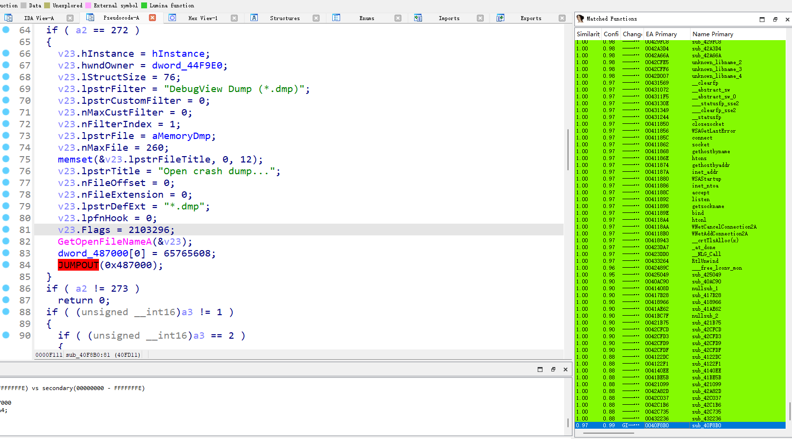
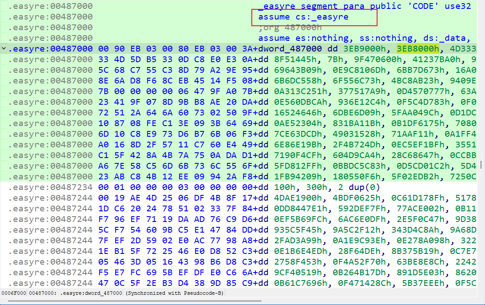
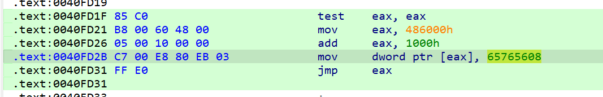

# Week 2（2024.9.23-2024.9.29）

## Inject 津门杯

题目给了个dbgview-infected.exe，从名字上可以看出是一款软件注入了其他代码，可以在网上找汉化的相同版本dbgview对比下不同

汉化4.76版：http://xz.winwin7xz.com/Small/Dbgview.rar

用ida7.7里的bindiff插件对比了不同（另一个需要为idb格式，ida打开保存下数据库）

如上图，下拉找到相似度不为1的函数，打开infected软件函数，可以看到红色`JUMPOUT`，猜测为注入函数；跳转后来到的是一段没能反编译的数据

找到jmpout对应的汇编代码，发现实际跳转的地址为65765608即3EB80E8h

然后就不会了。。。等等以后再做

## babyarm 太湖杯

arm类型发现main函数无法反编译，存在花指令，经过一点点测试，发现

~~~c
int __fastcall main(int a1, char **a2, char **a3)
{
  memset(v11, 0, sizeof(v11));
  v12[0] = 0;
  v12[1] = 0;
  v13[0] = 0;
  *(_DWORD *)((char *)v13 + 3) = 0;
  fd = open("/dev/zero", 0);
  dest = mmap(0, 0x1000u, 7, 2, fd, 0);
  v19 = dest;
  for ( i = 0; i < 1024; ++i )
    v19[i] = 0xE7FFDEFE;
  memcpy(dest, &sub_21088, 0xC0u);	// 第一部分
  sub_10684((int)dest);
  v18 = dest;
  v16 = (int)dest + 64;
  v17 = (int)dest + 128;
  v15 = (int)dest + 128;
  for ( j = 0; j <= 25; ++j )
    v11[j] = getchar();
  v10[0] = (int)v18;
  v10[1] = v16;
  v10[2] = v15;
  v8[0] = 0x4FFED263;
  v8[1] = 0x3F00D9B9;
  v8[2] = 0x504380A0;
  v9 = 85;
  for ( k = 0; k <= 12; ++k )
  {
    v14 = (int (__fastcall *)(_DWORD, _DWORD))v10[k % 3];
    v3 = *((unsigned __int8 *)v8 + k);
    if ( v3 != v14((unsigned __int8)v11[k], byte_2103C[k]) )
    {
      puts("Operation failed!!!");
      return -1;
    }
  }
  puts("Check next section");
  v13[2] = 6;	// 第二部分
  v7[0] = (int)sub_104FC;
  v7[1] = (int)sub_10568;
  for ( m = 0; m <= 5; ++m )
  {
    v5 = m & 1;
    if ( m < 0 )
      v5 = -v5;
    ((void (__fastcall *)(char *))v7[v5])((char *)&unk_2104C + 6 * m);
  }
  if ( sub_10770((int)&unk_2104C, (int)v12 + 1) )
    puts("you find the whole flag!");
  else
    puts("what a pity!");
  munmap(dest, 0x1000u);
  return 0;
}
~~~

获取flag大体可以分为2个部分

1. SMC自修改代码，需要还原三个基本运算函数
2. 一个迷宫，初始矩阵需要加密后获取

首先第一部分：SMC自修改代码还原

~~~python
addr=0x21088
addr1=0x10D28
for i in range(192):
    new_byte = ord(idc.get_bytes(addr+i, 1))^ord(idc.get_bytes(addr1+i, 1))
    idc.patch_byte(addr+i,new_byte^ord("SECRET"[i%6]))
~~~

还原后发现v18、v16、v15分别是add、sub、xor函数

~~~python
import struct

flag = ""
array1 = []
for i in [0x4FFED263, 0x3F00D9B9, 0x504380A0]:
    array1 += list(struct.pack('<I', i))
array1.append(85)
s = [0xFD, 0x9A, 0x9F, 0xE8, 0xC2, 0xAE, 0x9B, 0x2D, 0xC3, 0x11, 0x2A, 0x35, 0xF6]
for i in range(13):
    if i % 3 == 0:
        flag += chr((array1[i]-s[i])&0xff)
    elif i % 3 == 1:
        flag += chr((array1[i]+s[i])&0xff)
    else:
        flag += chr(array1[i]^s[i])
print(flag)	# flag{welcome_
~~~

第二部分：首先获取新的maze

~~~python
maze = [0x54, 0x54, 0x54, 0x54, 0x54, 0x54, 0x3A, 0x30, 0x30, 0x30, 0x55, 0x3A, 0x54, 0x40, 0x54, 0x54, 0x54, 0x54, 0x3A, 0x30, 0x3A, 0x3A, 0x3A, 0x3A, 0x54, 0x40, 0x54, 0x54, 0x54, 0x54, 0x3A, 0x30, 0x30, 0x30, 0x30, 0x3A, 0x54, 0x54, 0x54, 0x54, 0x40, 0x54, 0x3A, 0x3A, 0x3A, 0x3A, 0x30, 0x3A, 0x54, 0x54, 0x54, 0x54, 0x88, 0x54, 0x3A, 0x3A, 0x3A, 0x3A, 0x3A, 0x3A]
new_maze = ""
for i in range(6):
    if i & 1:
        for j in range(6):
            new_maze += chr(maze[6*i+j]^0x10)
    else:
        for j in range(6):
            new_maze += chr(maze[6*i+j]>>1)
for i in range(6):
    print(new_maze[i*6:i*6+6])
"""
******
*   E*
* ****
* ****
* ****
*    *
"""
~~~

然后分析迷宫走法

~~~c
int __fastcall sub_10770(int a1, int a2)
{//...
  v8 = 4;
  v7 = 1;
  v4[0] = 0x41203E53;
  v4[1] = 0xB242C1E;
  v4[2] = 0x52372836;
  v5 = 14;
  for ( i = 0; i <= 12; ++i )
  {
    *(_BYTE *)(a2 + i) ^= *((_BYTE *)v4 + i);
    switch ( *(_BYTE *)(a2 + i) )
    {
      case 'a':
        --v8;
        break;
      case 'd':
        ++v8;
        break;
      case 's':
        ++v7;
        break;
      case 'w':
        --v7;
        break;
      default:
        break;
    }
    if ( *(_BYTE *)(a1 + 6 * v7 + v8) == '*' )
    {
      puts("Boom!!!");
      return 0;
    }
  }
  return 1;
}
~~~

可知初始在`[v7,v8]（1，4）`位置，走到星号走法为`aaassssddd`，发现迷宫走的步数为13，因此应该不止6*6，拐回去看了maze长度为60，实际应该为6\*10，所以回去改下new_maze的i为10得到正确的迷宫，因此实际应为`aaassssdddsss`

~~~
******
*   E*
* ****
* ****
* ****
*    *
**** *
**** *
****D*
******
~~~

再异或回去即可

~~~python
step = "aaassssdddsss"
xor = []
for i in [0x41203E53, 0xB242C1E, 0x52372836, 14]:
    xor += list(struct.pack('<I', i))
for i in range(13):
    flag += chr(xor[i]^ord(step[i]))
print(flag)
~~~

得到总的flag为`flag{welcome_2_A2m_WoRLD!}`，实际提交时发现不能带感叹号，貌似题目出得有点小问题？

## GoodRE 津门杯

超级魔改的tea加密，把每步运算都单独写了个函数，包括求和、异或、左移、右移

~~~c
__int64 __fastcall main(int a1, char **a2, char **a3)
{//...
  v17[3] = __readfsqword(0x28u);
  memset(input, 0, sizeof(input));
  v17[0] = 0LL;
  v17[1] = 0LL;
  std::operator<<<std::char_traits<char>>(&std::cout, ">> ", a3);
  std::operator>><char,std::char_traits<char>>(&std::cin, input);// 输入
  if ( (unsigned int)strlen((const char *)input) == 64 )// 长度64
  {
    v3 = input;
    v4 = (int *)&unk_555910EEC020;
    v5 = 0LL;
    do
    {
      v6 = sub_555910EE8A3B(v3, 8);             // 每次取前八位十六进制字符转为十进制数
      v7 = int_input;
      copy((__int64)&int_input[v5], v6);
      copy((__int64)&key[v5], 17);
      v8 = v15;
      copy((__int64)&v15[v5 * 4], *v4);
      ++v3;
      ++v4;
      v5 += 9LL;
    }
    while ( v3 != v17 );
    tea(int_input, key);                        // 四组tea加密
    tea((int *)v11, key);
    tea((int *)v12, key);
    tea((int *)v13, key);
    while ( !(unsigned int)cmp(v7, v8) )        // v7和v8比较，实际上是input和unk_555910EEC020比较
    {
      v7 += 9;
      v8 += 36;
      if ( v7 == key )
      {
        __printf_chk(1LL, "flag{%s}\n", (const char *)input);
        return 0LL;
      }
    }
    puts("error");
  }
  else
  {
    puts("error");
  }
  return 0LL;
}
~~~

tea加密如下

~~~c
unsigned __int64 __fastcall tea(int *v, int *key)
{//...
  v20 = __readfsqword(0x28u);
  set(num1, v);
  set(num2, v + 9);
  copy((__int64)v6, 0);
  copy((__int64)v7, 0x830A5376);
  copy((__int64)v8, 0x1D3D2ACF);
  xor(v9, v8, v7);
  set(key0, key);
  set(key1, key + 9);
  set(key2, key + 18);
  set(key3, key + 27);
  v2 = 32;
  do                                            // 循环32次
  {
    add(v6, v6, v9);                            // 同xor函数结构，为add
    shl((__int64)v14, num2, 4);
    add(v14, v14, key0);
    add(v15, num2, v6);
    shr(v16, num2, 5LL);
    add(v16, v16, key1);
    xor(v14, v14, v15);
    xor(v14, v14, v16);
    add(num1, num1, v14);
    shl((__int64)v17, num1, 4);
    add(v17, v17, key2);
    add(v18, num1, v6);
    shr(v19, num1, 5LL);
    add(v19, v19, key3);
    xor(v17, v17, v18);
    xor(v17, v17, v19);
    add(num2, num2, v17);
    --v2;
  }
  while ( v2 );
  set(v, num1);
  set(v + 9, num2);
  return __readfsqword(0x28u) ^ v20;
}
~~~

简单分析下里面的运算函数，以xor

~~~c
__int64 __fastcall sub_555910EE8667(_DWORD *a1, int *a2, int *a3)
{
  v12[5] = __readfsqword(0x28u);
  v3 = 0LL;
  memset(v12, 0, 32);
  v4 = *a2;                                     // 获取a2的长度
  v5 = *a3;                                     // 获取a3的长度
  v6 = *a3;
  if ( *a2 >= *a3 )                             // 比较长度，谁大谁给v6
    v6 = *a2;
  if ( v6 <= 0 )
  {
    result = 0LL;
  }
  else
  {
    while ( 1 )
    {
      v7 = 0;
      if ( v4 > (int)v3 )
        v7 = *((_BYTE *)a2 + v3 + 4);
      if ( v5 > (int)v3 )
        v7 ^= *((_BYTE *)a3 + v3 + 4);
      *((_BYTE *)v12 + v3) = v7;
      if ( v3 == v6 - 1 )
        break;
      ++v3;
    }                                           // 相当于a2^a3
    v8 = v6;
    do
    {
      result = (unsigned int)v8;
      if ( v8 == v6 - (unsigned __int64)(unsigned int)v6 )
        break;
      --v8;
    }
    while ( !*((_BYTE *)v12 + v8) );            // 获取新的长度
  }
  if ( (int)result > 4 )
    result = 4LL;
  *a1 = result;                                 // a1前半部分直接等于长度
  v10 = a1 + 1;                                 // 后半部分等于v10，v12赋给v10
  if ( (_DWORD)result )
  {
    v11 = 0LL;
    do
    {
      *((_BYTE *)v10 + v11) = *((_BYTE *)v12 + v11);
      ++v11;
    }
    while ( v11 < (int)result );
  }
  return result;
}
~~~

tea解密如下

~~~python
from ctypes import c_uint32

def tea_decrypt(r, v, key, delta):
    v0, v1 = c_uint32(v[0]), c_uint32(v[1])
    # delta = 0x9e3779b9
    total = c_uint32(delta * r)
    for i in range(r):
        v1.value -= ((v0.value << 4) + key[2]) ^ (v0.value + total.value) ^ ((v0.value >> 5) + key[3])
        v0.value -= ((v1.value << 4) + key[0]) ^ (v1.value + total.value) ^ ((v1.value >> 5) + key[1])
        total.value -= delta
    return v0.value, v1.value

if __name__ == '__main__':
    k = [17, 17, 17, 17]
    v = [0x79AE1A3B, 0x596080D3, 0x80E03E80, 0x846C8D73, 0x21A01CF7, 0xC7CACA32, 0x45F9AC14, 0xC5F5F22F]
    delta = 0x830A5376 ^ 0x1D3D2ACF
    for i in range(0, len(v), 2):
        v[i:i + 2] = tea_decrypt(32, v[i:i + 2], k, delta)
    flag = "flag{"
    for i in v:
        flag += hex(i)[2:].upper()
    flag += "}"
    print(flag)

~~~

总结：第一次见如此新奇的tea魔改方式

周末第一次跟着su战队一块参加了SCTF，虽然啥都不会，但是见识到了很多题目，三叶草他们出的是真不错
