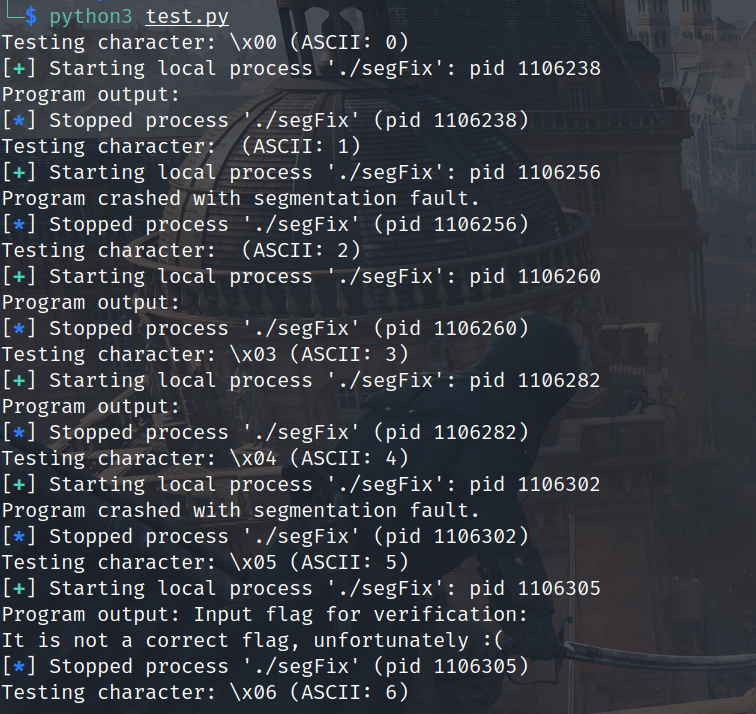

# Week 20

这周过年论文懒得写了，空闲时间做了点题，周末打的nullcon HackIM CTF Goa 2025，很抽象的比赛，很多题目都被打烂了，逆向有道题目想吐槽这明明不是波形图隐写，是misc里的吗，为什么放到re里，是来充数的么

## [EquinorCTF 2021]segFix

https://www.nssctf.cn/problem/6329

考察SMC

首先main函数由于call的地址为寄存器值无法直接反编译，需要动态调试

动态调试发现需要输入一个字节使得jmp rax跳转正确地址，如果输入不对会分段错误

~~~assembly
[stack]:00007FFFAA32FAF0                 mov     rax, 101010101010101h
[stack]:00007FFFAA32FAFA                 push    rax
[stack]:00007FFFAA32FAFB                 mov     rax, 10B3B7574716F68h
[stack]:00007FFFAA32FB05                 xor     [rsp], rax
[stack]:00007FFFAA32FB09                 mov     rax, 20656469766F7250h
[stack]:00007FFFAA32FB13                 push    rax
[stack]:00007FFFAA32FB14                 push    rsp
[stack]:00007FFFAA32FB15                 pop     rsi
[stack]:00007FFFAA32FB16                 mov     rax, 1
[stack]:00007FFFAA32FB1D                 mov     rdi, 1
[stack]:00007FFFAA32FB24                 mov     rdx, 0Fh
[stack]:00007FFFAA32FB2B                 syscall                 ; LINUX - sys_write
[stack]:00007FFFAA32FB2D                 mov     rax, 0
[stack]:00007FFFAA32FB34                 mov     rdi, 0
[stack]:00007FFFAA32FB3B                 sub     rsp, 1
[stack]:00007FFFAA32FB3F                 mov     rsi, rsp
[stack]:00007FFFAA32FB42                 mov     rdx, 1
[stack]:00007FFFAA32FB49                 syscall                 ; LINUX - sys_read
[stack]:00007FFFAA32FB4B                 mov     dil, [rsp]
[stack]:00007FFFAA32FB4F                 lea     rax, loc_7FFFAA32FB56
[stack]:00007FFFAA32FB56
[stack]:00007FFFAA32FB56 loc_7FFFAA32FB56:                       ; DATA XREF: [stack]:00007FFFAA32FB4F↑o
[stack]:00007FFFAA32FB56                 add     rax, rdi
[stack]:00007FFFAA32FB59                 jmp     rax
~~~

因此pwntool实现个自动化测试爆破字符发现只有ascii值为5时才可以

~~~python
from pwn import *

# 定义可打印的 ASCII 字符范围
PRINTABLE_RANGE = range(0, 0x80)  # 从空格 (0x20) 到 ~ (0x7E)

def test_segFix():
    # 记录导致崩溃的字符
    crash_chars = []

    for char_code in PRINTABLE_RANGE:
        char = chr(char_code)  # 将 ASCII 码转换为字符
        print(f"Testing character: {char} (ASCII: {char_code})")

        # 启动目标程序
        p = process('./segFix')

        # 等待程序输出 "Provide input:"
        p.recvuntil(b"Provide input:\n")

        # 发送当前字符并回车
        p.sendline(char.encode())

        # 尝试接收程序的输出
        try:
            output = p.recv(timeout=1)  # 设置超时时间为1秒
            print(f"Program output: {output.decode().strip()}")
        except EOFError:
            # 如果程序崩溃，记录导致崩溃的字符
            print("Program crashed with segmentation fault.")
            crash_chars.append(char)
        except Exception as e:
            # 处理其他异常
            print(f"An error occurred: {e}")
        finally:
            # 关闭进程
            p.close()

    # 输出测试结果
    if crash_chars:
        print("\nCharacters that caused a crash:")
        for char in crash_chars:
            print(f"  - {char} (ASCII: {ord(char)})")
    else:
        print("\nNo characters caused a crash.")

if __name__ == "__main__":
    test_segFix()

~~~

动态调试直接修改jmp eax前rdi的值为5，此时代码很明显是从loc_7FFFAA32FB6E后开始SMC

只需要动态调试跑几轮smc在第一条反汇编出来的指令下断点，F9即可跑出循环，此时可以看到很多数据

直接不管，找到最后的对比，F9随便输几个a，发现是先异或下标，再异或数组

ok脚本逆向即可

~~~python
s = b"EQVxw6jaWd:oekw>~vMp$qsH)jE}isc"
for i in range(len(s)):
    print(chr(s[i]^i), end="")	# EPT{s3lf_m0dify1ng_c0de_1s_fun}
~~~

## [HITCTF 2024]pipe_snake

https://www.nssctf.cn/problem/6256

题目挺难的，涉及到进程间通信，没想到贪吃蛇能魔改到这种地步

## [BSidesSF 2020]config-me

https://www.nssctf.cn/problem/5997

挺有意思的

字符串发现少了中间的部分，猜测是从conf文件里的name解密出来的，所以题目解法只需把name处的替换为password处的值，再次运行即可解密flag

不需要分析加密解密

## [BSidesSF 2020]maltty

https://www.nssctf.cn/problem/6079

很奇怪，没找到wp，但是找到出题[源码](https://github.com/BSidesSF/ctf-2020-release/blob/87c91b7a4992ea9a14e1df4d2665acce412fd455/maltty/challenge/src/windows/winnet.c#L2048)了，是个魔改的putty.exe，里面加入了些后门数据

> In December of 2019, many of the hosts in the BSidesSF organization were compromised. We think we traced it to this modified version of PuTTY, but we can’t figure out what data was being sent. When we analyze it on another host, we see nothing strange, but on the management hosts, we think it was beaconing home. Can you find out what it was sending?

能搞懂代码应该是`201912BSIDESSF.`sha256加密第一次得到aes_cbc的key，再sha256一次得到iv，但是算的不对，就不管了，直接贴出出题人的代码

~~~python
from hashlib import sha256

s = "7c584d1f8e3c63e407f6182c56dc5f3ed7091a5b8f018b4a75c1faaab9f480f9".lower()
for i in range(10000):
    for j in range(100):
        if sha256(f"{str(i).zfill(4)}{str(j).zfill(2)}BSIDESSF.".encode()).hexdigest() == s:
            print(f"{str(i).zfill(4)}{str(j).zfill(2)}BSIDESSF.")
            break

from Crypto.Cipher import AES
import hashlib

KEY = (b"\x7c\x58\x4d\x1f\x8e\x3c\x63\xe4\x07\xf6\x18\x2c"
       b"\x56\xdc\x5f\x3e\xd7\x09\x1a\x5b\x8f\x01\x8b\x4a"
       b"\x75\xc1\xfa\xaa\xb9\xf4\x80\xf9")
IV = (b"\x5d\xa1\x4f\xf2\x3a\x04\xaa\xd0"
      b"\x85\x64\x25\xa1\x9e\x97\x93\x6e")

PTEXT = ("GET /%s HTTP/1.1\r\n"
         "Host: bsidessf.pwned\r\n"
         "X-Flag: CTF{notJustCCleaner}\r\n\r\n")

HOST = "localhost:9999"

TMPL = (
"""#include <sys/types.h>

#define POST_LEN %d

char g_secbuf[] = {%s};
""")

def encrypt_all(k, iv, val):
    ciph = AES.new(k, AES.MODE_CBC, iv)
    return ciph.encrypt(val)

def pad_s(s):
    if isinstance(s, str):
        s = s.encode("utf-8")
    while len(s) % 16:
        s += b"\x00"
    return s

def sha256(s):
    if isinstance(s, str):
        s = s.encode("utf-8")
    return hashlib.sha256(s).digest()

def main():
    s = HOST + "\x00" + PTEXT
    if isinstance(s, str):
        s = s.encode("utf-8")
    padded = pad_s(s)
    ptext = sha256(padded) + padded
    encrypted = encrypt_all(KEY, IV, ptext)
    encrypted_s = ', '.join(('0x%02x' % (c)) for c in encrypted)
    print(TMPL % (len(encrypted), encrypted_s))

if __name__ == '__main__':
    main()
~~~

## [GHCTF 2024 新生赛]难知如阴，动如雷震

https://www.nssctf.cn/problem/5196

> python字节码已经考过这么多次了，来点不一样的给大家看看。

给了一串十六进制字符串，本来以为是python字节码搜了半天发现不对，看了评论区有提示说区块链逆向工程，搜区块链反编译找到[在线反编译网站](https://ethervm.io/decompile)

字节码如下，非常清晰了，就是得微调下

~~~
label_0000:
	0000    60  PUSH1 0x00
	0002    60  PUSH1 0x1d
	0004    90  SWAP1
	0005    50  POP
	0006    61  PUSH2 0x1ce3
	0009    01  ADD
	000A    60  PUSH1 0x22
	000C    01  ADD
	000D    60  PUSH1 0x20
	000F    90  SWAP1
	0010    1B  SHL
	0011    63  PUSH4 0x09a90782
	0016    60  PUSH1 0x02
	0018    02  MUL
	0019    01  ADD
	001A    7F  PUSH32 0xffffffffffffffffffffffffffffffffffffffffffffffffffffa7a7b3cfa9cc
	003B    19  NOT
	003C    18  XOR
	003D    65  PUSH6 0x666666abcdef
	0044    65  PUSH6 0x3a1e2d49f196
	004B    65  PUSH6 0x123456789abc
	0052    65  PUSH6 0x4d494b555859
	0059    18  XOR
	005A    18  XOR
	005B    06  MOD
	005C    00  *STOP
	// Stack delta = +2
	// Outputs[3]
	// {
	//     @003C  stack[0] = ~0xffffffffffffffffffffffffffffffffffffffffffffffffffffa7a7b3cfa9cc ~ 0x02 * 0x09a90782 + (0x20 << 0x22 + 0x1ce3 + 0x1d)
	//     @005B  stack[1] = (0x4d494b555859 ~ 0x123456789abc ~ 0x3a1e2d49f196) % 0x666666abcdef
	//     @005C  stop();
	// }
	// Block terminates

~~~

计算得到flag值

~~~python
var1 = (0x4d494b555859 ^ 0x123456789abc ^ 0x3a1e2d49f196) % 0x666666abcdef
var0 = ((0xffffffffffff-0xa7a7b3cfa9cc) ^ ((0x02 * 0x09a90782) + ((0x22 + 0x1ce3 + 0x1d)<<0x20)))
print(bytes.fromhex(hex(var0)[2:])+bytes.fromhex(hex(var1)[2:]))	# Ez_bY7ec0d3s
~~~

## [NCTF 2023]中文编程2

https://www.nssctf.cn/problem/5091

upx魔改了下，需要先还原里面节名为UPX0、UPX1、UPX!，再去upx -d即可正确还原

定位字符串可以发现有三处加密，最后和48字节比较

~~~c
int sub_2B10DC()
{
  void *v0; // eax
  void *v1; // eax
  void *v2; // eax
  void *v3; // eax
  unsigned int v4; // ecx
  int v5; // ebx
  int v6; // eax
  void *v7; // eax
  void *v9; // [esp-4h] [ebp-14h]
  int v10; // [esp-4h] [ebp-14h]
  void *v11; // [esp+0h] [ebp-10h]
  void *v12; // [esp+4h] [ebp-Ch]
  void *v13; // [esp+8h] [ebp-8h]
  void *v14; // [esp+8h] [ebp-8h]
  void *lp; // [esp+Ch] [ebp-4h]

  SetConsoleTitleA(ConsoleTitle);
  sub_2B17C0(2u, 0, 0, 0, (char)&unk_2C024A);
  lp = (void *)sub_2B18B0(1, 0, 0, 0);
  v0 = lp;
  if ( !lp )
    v0 = &unk_2C025B;
  v1 = (void *)sub_2B1B50(1, (int)v0, 0, 0x80000004);
  v12 = v1;
  if ( !v1 )
    v1 = &unk_2C0266;
  v11 = (void *)encode(
                  (void (__cdecl *)(_DWORD, _DWORD, _DWORD))sub_2B2D80,
                  3,
                  v1,
                  0,
                  -2147483643,
                  aNctf2023,
                  0,
                  -2147483644,
                  1,
                  0,
                  -2147482879);
  if ( v12 )
    sub_2B13F8(v12);
  v2 = v11;
  if ( !v11 )
    v2 = &unk_2C0266;
  v9 = (void *)encode(
                 (void (__cdecl *)(_DWORD, _DWORD, _DWORD))sub_2B2D80,
                 3,
                 v2,
                 0,
                 -2147483643,
                 aC0debr34k,
                 0,
                 -2147483644,
                 2,
                 0,
                 -2147482879);
  if ( v11 )
    sub_2B13F8(v11);
  v13 = v9;
  v3 = v9;
  if ( !v9 )
    v3 = &unk_2C0266;
  v10 = encode(
          (void (__cdecl *)(_DWORD, _DWORD, _DWORD))sub_2B2D80,
          3,
          v3,
          0,
          -2147483643,
          aNctf2023,
          0,
          -2147483644,
          1,
          0,
          -2147482879);
  if ( v13 )
    sub_2B13F8(v13);
  v14 = (void *)v10;
  v4 = 0;
  if ( dword_2C0278 )
    v4 = dword_2C0278[1];
  v5 = 0;
  if ( v10 )
    v5 = *(_DWORD *)(v10 + 4);
  v6 = 1;
  if ( v5 == v4 )
  {
    v6 = 0;
    if ( v4 )
      v6 = cmp((_BYTE *)(v10 + 8), &dword_2C0278[2], v4);	// 比较点，需要保证v6==0
  }
  if ( v6 )
    sub_2B17C0(2u, 0, 0, 0, (char)aFlag);	// 这好像不是正确的flag~
  else
    sub_2B17C0(2u, 0, 0, 0, (char)&unk_2C02B0);	// 这是真的flag
  sub_2B17C0(2u, 0, 0, 0, (char)asc_2C02D5);
  v7 = (void *)sub_2B18B0(1, 0, 0, 0);
  if ( v7 )
    sub_2B13F8(v7);
  if ( lp )
    sub_2B13F8(lp);
  if ( v14 )
    sub_2B13F8(v14);
  return 0;
}
~~~

查看加密，可以发现v6==1时是RC4加密（loc_2B29C6，分析比较麻烦，没法建立函数），不是的时候是DES加密

~~~c
void __cdecl sub_2B2BB0(int *a1, _DWORD *a2, int a3, int a4)
{
  const void *v4; // esi
  signed int v5; // ebp
  int v6; // ecx
  int *v7; // ebx
  int v8; // edi
  int v9; // edi
  _DWORD *v10; // eax
  int v11; // eax
  unsigned int v12; // [esp+10h] [ebp-110h]
  int *v13; // [esp+14h] [ebp-10Ch]
  int v14; // [esp+18h] [ebp-108h]
  char v15[260]; // [esp+1Ch] [ebp-104h] BYREF

  v4 = (const void *)(*a2 + 8);
  v14 = a2[3];
  v5 = *(_DWORD *)(*a2 + 4);
  v6 = 1;
  if ( a3 > 2 && a2[8] == 0x80000301 && a2[6] == 2 )
    v6 = 2;
  v7 = 0;
  v13 = 0;
  v12 = 0;
  if ( v5 <= 0 )
    goto LABEL_21;
  if ( v6 == 1 )
  {
    ((void (__cdecl *)(_DWORD, unsigned int, char *))loc_2B29C6)(a2[3], strlen((const char *)a2[3]), v15);
    v7 = (int *)malloc(v5);
    v13 = v7;
    if ( v7 )
    {
      qmemcpy(v7, v4, v5);
      v12 = v5;
      sub_2B2AA0(v7, v5, v15);
    }
    goto LABEL_21;
  }
  if ( !a4 )
  {
    if ( (v5 & 0x80000007) != 0 )
      goto LABEL_21;
    v7 = (int *)malloc(v5);
    v13 = v7;
    if ( !v7 )
      goto LABEL_21;
    qmemcpy(v7, v4, v5);
    sub_2B2EE0(v7, v5, v14);
    v11 = *v7;
    if ( *v7 > 0 && v5 < v11 + 12 && v11 <= v5 - 4 )
    {
      v10 = sub_2B2980(v7 + 1, *v7);
      goto LABEL_22;
    }
LABEL_12:
    v10 = sub_2B2980(v13, 0);
    goto LABEL_22;
  }
  v8 = ((_BYTE)v5 - 4) & 7;
  if ( (((_BYTE)v5 - 4) & 7) != 0 )
    v8 = 8 - v8;
  v9 = v8 + v5 + 4;
  v12 = v9;
  v7 = (int *)malloc(v9);
  v13 = v7;
  if ( !v7 )
    goto LABEL_12;
  memset(v7, 0, v9);
  *v7 = v5;
  qmemcpy(v7 + 1, v4, v5);
  sub_2B2EC0((int)v7, v9, v14);
LABEL_21:
  v10 = sub_2B2980(v13, v12);
LABEL_22:
  *a1 = (int)v10;
  if ( v7 )
    sub_2B5B69(v7);
}
~~~

看了官方给的答案很简洁，由于rc4和des都是对称加密，只需把要对比的数据作为输入，然后修改des顺序即可。需要patch两处

试了下确实可以，但不太好理解patch的原因（主要和des生成子密钥顺序有关，但是汇编代码很奇怪），感觉还是写脚本靠谱些(但是des不知道为啥魔改的完全看不懂，留着未来再回来钻研)

## [蓝帽杯 2023 半决赛]justamat

https://www.nssctf.cn/problem/4450

主函数主要作用是拼接字符串`there_are_a_lot_useless_information_but_oh.o0O_xxx_you_get_it`（长度为100），根据sub_4051A0判断flag是否正确

~~~c
__int64 sub_404520()
{//...
  v18 = __readfsqword(0x28u);
  v9 = 47LL;
  v10 = v12;
  v0 = (__m128i *)sub_474940((__int64)&v10, (unsigned __int64 *)&v9, 0LL);
  v10 = (__int64 *)v0;
  v12[0] = v9;
  *v0 = _mm_load_si128((const __m128i *)&xmmword_574400);// there_are_a_lot_
  v1 = (__int64)v10;
  v0[1] = _mm_load_si128((const __m128i *)&xmmword_574410);// useless_informat
  qmemcpy(&v0[2], "ion_but_oh.o0O_", 15);
  v11 = v9;
  *(_BYTE *)(v1 + v9) = 0;
  v13 = v15;
  v14 = 0LL;
  v15[0] = 0;
  printf(&unk_5D64C0, "Welcome to the world of linear algebra!", 39LL);
  sub_46F0C0(&unk_5D64C0);
  printf(&unk_5D64C0, "Please give me what I want: ", 28LL);
  sub_46F0C0(&unk_5D64C0);
  sub_406BC0(&unk_5D65E0, &v13);
  v2 = (__int64)v13;
  v3 = v14;
  v16[0] = (__int64)&v16[2];
  if ( &v13[v14] && !v13 )
    sub_402990("basic_string::_M_construct null not valid");
  v9 = v14;
  if ( v14 > 0xF )
  {
    v16[0] = sub_474940((__int64)v16, (unsigned __int64 *)&v9, 0LL);
    v8 = (__int64 *)v16[0];
    v16[2] = v9;
    goto LABEL_25;
  }
  if ( v14 == 1 )
  {
    LOBYTE(v16[2]) = *v13;
    goto LABEL_6;
  }
  if ( v14 )
  {
    v8 = &v16[2];
LABEL_25:
    sub_4011F0(v8, v2, v3);
  }
LABEL_6:
  v16[1] = v9;
  *(_BYTE *)(v16[0] + v9) = 0;
  if ( (unsigned __int64)(0x3FFFFFFFFFFFFFFFLL - v16[1]) <= 0xA )
    sub_402A98("basic_string::append");
  add_string(v16, "_you_get_it", 11LL);
  add_string(&v10, (_BYTE *)v16[0], v16[1]);
  if ( (__int64 *)v16[0] != &v16[2] )
    sub_405290(v16[0]);
  memset(v16, 0, sizeof(v16));
  if ( v11 != 100 )
    goto LABEL_15;
  v4 = (__int64)v10;
  v5 = (char *)v16;
  do
  {
    for ( i = 0LL; i != 10; ++i )
      *(_DWORD *)&v5[4 * i] = *(char *)(v4 + i);
    v5 += 40;
    v4 += 10LL;
  }
  while ( v5 != &v17 );
  if ( (unsigned __int8)sub_4051A0(v16) )
    printf(&unk_5D64C0, "Gooooooood!", 11LL);
  else
LABEL_15:
    printf(&unk_5D64C0, "Wroooooooong! ", 14LL);
  sub_46F0C0(&unk_5D64C0);
  if ( v13 != v15 )
    sub_405290((__int64)v13);
  if ( v10 != v12 )
    sub_405290((__int64)v10);
  if ( __readfsqword(0x28u) != v18 )
    sub_52D790();
  return 0LL;
}
~~~

再来看sub_4051A0，前面先给了两组数据，v11都是单字节数，v12比较大4字节

~~~c
__int64 __fastcall sub_4051A0(_DWORD *a1)
{
  _DWORD *v1; // r10
  char *v2; // rbp
  _DWORD *v3; // rdi
  char *v4; // r8
  char *v5; // r9
  char *v6; // rcx
  _DWORD *v7; // rax
  __int64 v8; // rsi
  __int64 v9; // rdx
  __int64 result; // rax
  char v11[400]; // [rsp+0h] [rbp-348h] BYREF
  char v12[400]; // [rsp+190h] [rbp-1B8h] BYREF
  char v13; // [rsp+320h] [rbp-28h] BYREF
  unsigned __int64 v14; // [rsp+328h] [rbp-20h]

  v1 = a1;
  v2 = v12;
  v14 = __readfsqword(0x28u);
  qmemcpy(v11, &unk_574020, sizeof(v11));
  qmemcpy(v12, &unk_5741C0, sizeof(v12));
  v3 = a1 + 10;
  while ( 2 )
  {
    v4 = v11;
    v5 = v2;
    do
    {
      v6 = v4;
      v7 = v1;
      LODWORD(v8) = 0;
      do
      {
        v9 = (unsigned int)(*(_DWORD *)v6 * *v7++);
        v6 += 40;
        v8 = (unsigned int)(v9 + v8);
      }
      while ( v7 != v3 );                       // 每10个一组
      if ( *(_DWORD *)v5 != (_DWORD)v8 )
      {
        result = 0LL;
        goto LABEL_10;
      }
      v4 += 4;
      v5 += 4;
    }
    while ( v4 != &v11[40] );
    v2 += 40;
    v1 += 10;
    v3 = v7 + 10;
    if ( v2 != &v13 )
      continue;
    break;
  }
  result = 1LL;
LABEL_10:
  if ( __readfsqword(0x28u) != v14 )
    sub_52D790(v3, v8, v9, v6, v4, v5);
  return result;
}
~~~

动态调试下可知逻辑是拼接字符串每10个，分别去乘以第一个数组里的数求和然后和第二个数组比较，很明显是多元方程求解z3即可

~~~python
from z3 import Solver, BitVec, sat

s = Solver()
a = [0x000000FE, 0x0000000B, 0x0000001D, 0x000000F6, 0x00000083, 0x000000FF, 0x000000E0, 0x000000B8, 0x000000DD, 0x000000B0, 0x000000C5, 0x000000DE, 0x000000F6, 0x00000014, 0x0000009F, 0x000000DD, 0x000000D9, 0x00000007, 0x0000002D, 0x0000006B, 0x00000019, 0x000000CA, 0x00000073, 0x000000FD, 0x00000087, 0x00000072, 0x00000024, 0x00000004, 0x00000049, 0x0000007E, 0x000000A9, 0x000000CE, 0x00000091, 0x000000BE, 0x00000041, 0x00000018, 0x00000060, 0x0000003F, 0x0000002B, 0x00000063, 0x0000001C, 0x000000D2, 0x00000090, 0x000000E9, 0x0000008E, 0x000000BA, 0x0000001E, 0x000000F3, 0x00000041, 0x000000AD, 0x0000002C, 0x00000003, 0x00000069, 0x000000DA, 0x00000010, 0x000000FD, 0x000000FD, 0x000000E7, 0x00000006, 0x00000036, 0x000000D6, 0x00000002, 0x00000059, 0x00000018, 0x000000CC, 0x00000050, 0x00000087, 0x000000AF, 0x000000FB, 0x00000018, 0x00000044, 0x0000007F, 0x000000AD, 0x000000F8, 0x0000002C, 0x00000067, 0x0000001D, 0x00000022, 0x00000084, 0x000000AC, 0x0000000E, 0x00000023, 0x000000DC, 0x000000E6, 0x000000BB, 0x000000D2, 0x000000B8, 0x0000004A, 0x000000BC, 0x000000DE, 0x00000050, 0x0000009C, 0x0000001C, 0x0000001E, 0x00000086, 0x0000003A, 0x0000002D, 0x000000DD, 0x000000C3, 0x00000003]
cmp = [0x0001C633, 0x0001DF94, 0x00020EBF, 0x0002BA40, 0x0001E884, 0x000260D1, 0x0001F9B1, 0x0001EA1A, 0x0001EEAA, 0x0001DFB2, 0x0001C1D0, 0x0001EEF2, 0x000216E1, 0x0002BE00, 0x0001FB5E, 0x00025D74, 0x0001F000, 0x000202D6, 0x00020002, 0x0001DDFE, 0x0001C017, 0x0001F08C, 0x000227F6, 0x0002C7BA, 0x000201AE, 0x00027FBF, 0x00020E21, 0x0001FF5C, 0x0001FD62, 0x0001E948, 0x0001BE6E, 0x0001F4D7, 0x00022C8D, 0x0002C353, 0x0001F8DB, 0x00026E1D, 0x0001FF61, 0x0001EA0F, 0x0001F0D6, 0x0001EDA8, 0x0001AD7D, 0x00018218, 0x0001CCD4, 0x000239B6, 0x0001AC4C, 0x00020D7C, 0x0001D967, 0x0001A4F4, 0x0001CAD8, 0x000196AE, 0x0001831B, 0x00017E45, 0x0001D0CF, 0x00023EDF, 0x000181AE, 0x00021760, 0x0001D3B4, 0x000175D6, 0x00017D3A, 0x0001994F, 0x0001189D, 0x00014CCF, 0x0001568E, 0x00017EEB, 0x0001327E, 0x00016A45, 0x00012921, 0x00011FF0, 0x00013643, 0x00011729, 0x00015191, 0x00017D17, 0x00017262, 0x0001A863, 0x00017010, 0x00017B10, 0x00014F9C, 0x000143E8, 0x00015E9B, 0x0001242C, 0x0000F68C, 0x0001192A, 0x000150AD, 0x0001B1A0, 0x00014C60, 0x000182AB, 0x00013F4B, 0x000141A6, 0x00015AA3, 0x000135C9, 0x0001D86F, 0x0001E8FA, 0x0002158D, 0x0002BDAC, 0x00020E4F, 0x00027EE6, 0x000213B9, 0x00020E86, 0x000211FF, 0x0001E1EF]

text = [0x00000074, 0x00000068, 0x00000065, 0x00000072, 0x00000065, 0x0000005F, 0x00000061, 0x00000072, 0x00000065, 0x0000005F, 0x00000061, 0x0000005F, 0x0000006C, 0x0000006F, 0x00000074, 0x0000005F, 0x00000075, 0x00000073, 0x00000065, 0x0000006C, 0x00000065, 0x00000073, 0x00000073, 0x0000005F, 0x00000069, 0x0000006E, 0x00000066, 0x0000006F, 0x00000072, 0x0000006D, 0x00000061, 0x00000074, 0x00000069, 0x0000006F, 0x0000006E, 0x0000005F, 0x00000062, 0x00000075, 0x00000074, 0x0000005F, 0x0000006F, 0x00000068, 0x0000002E, 0x0000006F, 0x00000030, 0x0000004F, 0x0000005F] + [0] * (100 - 47 - 11) + [0x0000005F, 0x00000079, 0x0000006F, 0x00000075, 0x0000005F, 0x00000067, 0x00000065, 0x00000074, 0x0000005F, 0x00000069, 0x00000074]
c = [BitVec(f"c{i}", 32) for i in range(100)]
for i in range(100):
    if text[i]:
        s.add(c[i] == text[i])
for i in range(0, len(text), 10):
    for j in range(10):
        sum = 0
        for k in range(10):
            sum += a[j+k*10] * c[i+k]
        s.add(sum == cmp[i+j])
if s.check() == sat:
    ans = s.model()
    for i in c:
        print(chr(ans[i].as_long()), end="")	# flag{8f9c6cf7-f362-4a4e-ace2-a34d90939589}
~~~

