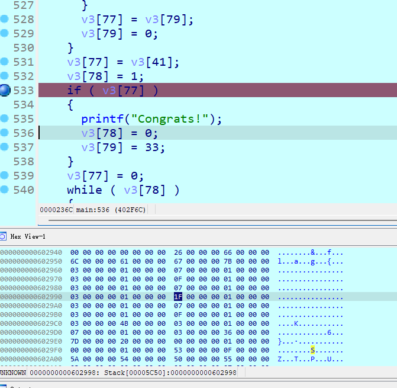

# Week 4（2024.10.7-2024.10.13）

连着好几天失眠睡得很晚，这周一堆项目那边活，但还是抽空把[SCTF](https://github.com/SH-Op-X/CTF-Writeups/tree/main/SCTF_2024) 6道逆向搞懂了4道，剩下两道一道LUA，一道GO逆向，都有点懵，还不会，未来抓紧补下

## Strange_language 第五空间

pyinstaller+反编译pyc，可以发现从pyd里导入了函数

ida64分析发现brainfuck字符，结合跑exe要求输入flag可知，这是brainfuck编写的一个简单flag check

比较麻烦的是怎么把brainfuck转为可读代码，网上很多wp用的 [脚本](https://myu-blog.top/2021/09/27/%E7%AC%AC%E4%BA%94%E7%A9%BA%E9%97%B4_strangelanguage/) 试了下发现生成的python可读性非常差且很多字符的数字要计算出来，再一个输入比较麻烦，因此多次查阅相关资料发现 [bf2any](https://github.com/rdebath/Brainfuck)，用里面的生成了c代码，编译成了exe，借助ida帮助简化了代码，可读性大大提高（1.txt放brainfuck代码）

~~~
.\bfi.exe -c 1.txt > code.c
~~~

这里直接贴上全部代码，动态调试分析即可，定位v3内存地址

~~~c
int __fastcall main(int argc, const char **argv, const char **envp)
{
  int *v3; // rbx
  FILE *v4; // rax
  int mem[30081]; // [rsp+20h] [rbp-60h] BYREF

  _main(argc, argv, envp);
  memset(mem, 0, sizeof(mem));
  v3 = &mem[81];
  v4 = __acrt_iob_func(1u);
  setbuf(v4, 0i64);
  mem[122] = 1;
  for ( mem[126] = 38; mem[126]; --mem[126] )
  {
    mem[128] = mem[125];
    mem[127] = 1;
    if ( mem[125] )
    {
      mem[127] = 0;
      --mem[125];
    }
    mem[128] = 0;
  }
  mem[125] = mem[127];
  mem[127] = 0;
  if ( mem[125] )
    mem[124] = 1;
  mem[125] = 0;
  while ( v3[43] )
  {
    v3[44] = getch(v3[44]);		// 输入一个字符
    v3[43] = v3[44];
    v3[45] = 10 - v3[44];
    v3[44] = 1;
    if ( v3[45] )
      v3[44] = 0;
    v3[45] = 0;
    if ( v3[44] )
      v3[41] = 0;
    v3[44] = v3[1]++;
    v3[46] = v3[43];
    while ( v3[44] )
    {
      ++v3;
      v3[46] = v3[45];
      v3[45] = ++v3[44];
      v3[44] = --v3[43];
      v3[43] = 0;
    }
    v3[2] = v3[46];
    v3[47] = 0;
    v3[44] = v3[46];
    v3[46] = 0;
    while ( v3[45] )
    {
      --v3;
      v3[44] += v3[45];
      v3[45] = --v3[46];
      v3[46] = 0;
    }
    v3[43] = 0;
    v3[44] = v3[1];
    v3[45] = 38;
    v3[47] = 0;
    while ( v3[45] )
    {
      v3[47] = v3[44];
      v3[46] = 1;
      if ( v3[47] )
      {
        v3[46] = 0;
        --v3[44];
      }
      v3[47] = 0;
      --v3[45];
    }
    v3[44] = v3[46];
    v3[46] = 0;
    if ( v3[44] )
    {
      v3[44] = v3[41];
      if ( v3[44] )
        v3[43] = 1;
    }
    v3[44] = 0;
  }	// 循环结束
  v3[51] = 0;
  v3[48] = v3[2];                               // v3[2]存储第一个字符
  v3[50] = 0;
  v3[49] = 102 - v3[48];                        // 检查第一个字符是否为'f'
  v3[48] = 1;
  if ( v3[49] )
    v3[48] = 0;
  v3[49] = 0;
  if ( v3[48] )
  {
    v3[48] = 1;
    while ( v3[48] )
    {
      ++v3;
      v3[49] = v3[48] + 1;
      v3[48] = --v3[47];
      v3[47] = 0;
    }
    v3[51] = 0;
    v3[48] = v3[2];
    v3[50] = 0;
    while ( v3[49] )
    {
      --v3;
      v3[48] += v3[49];
      v3[49] = --v3[50];
      v3[50] = 0;
    }
    v3[49] = 'l' - v3[48];		// 检查第二个字符是否为'l'，后面以此类推，发现检查了flag{}格式
    v3[48] = 1;
    if ( v3[49] )
      v3[48] = 0;
    v3[49] = 0;
    if ( v3[48] )
      ++v3[47];
  }
  v3[48] = 0;
  if ( v3[47] )
  {
    v3[47] = 2;
    while ( v3[47] )
    {
      ++v3;
      v3[48] = v3[47] + 1;
      v3[47] = --v3[46];
      v3[46] = 0;
    }
    v3[50] = 0;
    v3[47] = v3[2];
    v3[49] = 0;
    while ( v3[48] )
    {
      --v3;
      v3[47] += v3[48];
      v3[48] = --v3[49];
      v3[49] = 0;
    }
    v3[48] = 'a' - v3[47];
    v3[47] = 1;
    if ( v3[48] )
      v3[47] = 0;
    v3[48] = 0;
    if ( v3[47] )
      ++v3[46];
  }
  v3[47] = 0;
  if ( v3[46] )
  {
    v3[46] = 3;
    while ( v3[46] )
    {
      ++v3;
      v3[47] = v3[46] + 1;
      v3[46] = --v3[45];
      v3[45] = 0;
    }
    v3[49] = 0;
    v3[46] = v3[2];
    v3[48] = 0;
    while ( v3[47] )
    {
      --v3;
      v3[46] += v3[47];
      v3[47] = --v3[48];
      v3[48] = 0;
    }
    v3[47] = 'g' - v3[46];
    v3[46] = 1;
    if ( v3[47] )
      v3[46] = 0;
    v3[47] = 0;
    if ( v3[46] )
      ++v3[45];
  }
  v3[46] = 0;
  if ( v3[45] )
  {
    v3[45] = 4;
    while ( v3[45] )
    {
      ++v3;
      v3[46] = v3[45] + 1;
      v3[45] = --v3[44];
      v3[44] = 0;
    }
    v3[48] = 0;
    v3[45] = v3[2];
    v3[47] = 0;
    while ( v3[46] )
    {
      --v3;
      v3[45] += v3[46];
      v3[46] = --v3[47];
      v3[47] = 0;
    }
    v3[46] = '{' - v3[45];
    v3[45] = 1;
    if ( v3[46] )
      v3[45] = 0;
    v3[46] = 0;
    if ( v3[45] )
      ++v3[44];
  }
  v3[45] = 0;
  if ( v3[44] )
  {
    v3[44] = 37;                                // 这里直接跳到下标37，即最后一位；说明长度为38，去掉外面的flag{}里面32位
    while ( v3[44] )
    {
      ++v3;
      v3[45] = v3[44] + 1;
      v3[44] = --v3[43];
      v3[43] = 0;
    }
    v3[47] = 0;
    v3[44] = v3[2];
    v3[46] = 0;
    while ( v3[45] )
    {
      --v3;
      v3[44] += v3[45];
      v3[45] = --v3[46];
      v3[46] = 0;
    }
    v3[45] = '}' - v3[44];
    v3[44] = 1;
    if ( v3[45] )
      v3[44] = 0;
    v3[45] = 0;
    if ( v3[44] )
      ++v3[43];
  }
  v3[42] = v3[43];
  v3[43] = 0;
  v3[44] = 1;
  v3[45] = v3[41];
  v3[46] = 1;
  if ( v3[45] )
    v3[46] = 0;
  *(_QWORD *)(v3 + 45) = (unsigned int)v3[46];
  if ( v3[45] )
  {
    v3[43] = 1;
    v3[44] = 0;
  }
  v3[45] = 0;
  if ( v3[44] )
  {
    v3[44] = v3[42];
    v3[45] = 1;
    if ( v3[44] )
      v3[45] = 0;
    *((_QWORD *)v3 + 22) = (unsigned int)v3[45];
    if ( v3[44] )
      ++v3[43];
  }
  v3[44] = 1;
  if ( v3[43] )
  {
    printf("nonono");		// 使用正确格式输入发现终于跳过这里的打印nonono
    v3[44] = 0;
    v3[45] = 'o';
  }
  v3[43] = 0;
  while ( v3[44] )	// 这里开始加密验证，利用了固定字符串
  {
    v3[41] = 1;
    v3[45] = 83;
    v3[46] = 15;
    v3[47] = 90;
    v3[48] = 84;
    v3[49] = 80;
    v3[50] = 85;
    v3[51] = 3;
    v3[52] = 2;
    v3[53] = 0;
    v3[54] = 7;
    v3[55] = 86;
    v3[56] = 7;
    v3[57] = 7;
    v3[58] = 91;
    v3[59] = 9;
    v3[60] = 0;
    v3[61] = 80;
    v3[62] = 5;
    v3[63] = 2;
    v3[64] = 3;
    v3[65] = 93;
    v3[66] = 92;
    v3[67] = 80;
    v3[68] = 81;
    v3[69] = 82;
    v3[70] = 84;
    v3[71] = 90;
    v3[72] = 95;
    v3[73] = 2;
    v3[74] = 87;
    v3[75] = 7;
    v3[76] = 52;
    v3[77] = 5;
    v3[40] = 5;
    v3[78] = 36;
    v3[79] = 0;
    v3[80] = 0;
// ...中间很长的代码无法直接分析，干脆直接动态调试看最后哪些变化
    if ( v3[77] )
    {
      printf("Congrats!");
      v3[78] = 0;
      v3[79] = 33;
    }
    v3[77] = 0;
    while ( v3[78] )
    {
      printf("nonono");
      v3[79] = 111;
      --v3[78];
    }
    --v3[44];
  }
  return 0;
}
~~~

动态调试输入`flag{abcdefghijklmnopqrstuvwxyz123456}`检查变化

发现`flag{`后面的内容发生变化，前面新赋值的地方没有变化，而且发现前面出现了很多1，这不正是连续的一个偶数异或奇数的值，再测试下ord("z")^ord("1")=0x4b，也在里面。完美验证得到加密方式是`s[i]^=s[i+1]`

那么对比的话肯定就是前面连续的32位数组 v3[45]~v3[76]，上脚本

~~~python
v3 = [0] * 100
v3[45] = 83
v3[46] = 15
v3[47] = 90
v3[48] = 84
v3[49] = 80
v3[50] = 85
v3[51] = 3
v3[52] = 2
v3[53] = 0
v3[54] = 7
v3[55] = 86
v3[56] = 7
v3[57] = 7
v3[58] = 91
v3[59] = 9
v3[60] = 0
v3[61] = 80
v3[62] = 5
v3[63] = 2
v3[64] = 3
v3[65] = 93
v3[66] = 92
v3[67] = 80
v3[68] = 81
v3[69] = 82
v3[70] = 84
v3[71] = 90
v3[72] = 95
v3[73] = 2
v3[74] = 87
v3[75] = 7
v3[76] = 52
v3[77] = 5
v3[40] = 5
v3[78] = 36
v3[79] = 0
v3[80] = 0

flag = chr(v3[76])
for i in range(75, 44, -1):
    v3[i] ^= v3[i + 1]
    flag += chr(v3[i])
print(f"flag{{{flag[::-1]}}}")		# flag{d78b6f30225cdc811adfe8d4e7c9fd34}
~~~

