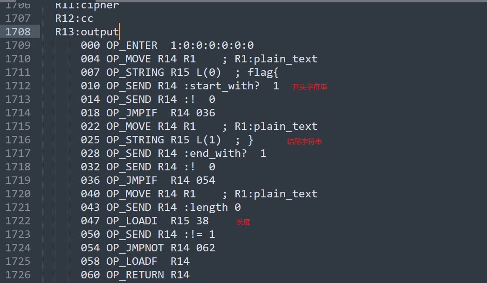

# Week 6（2024.10.21-2024.10.28）

QWB2022+2021

## QR Puzzle

一个加密qrcode 01字符串的算法，动态调试分析可以发现是按照key逆序不断交换字符位置的算法

写个脚本还原加密方法，然后保存01字符串为黑白图像

~~~python
with open("key") as f1:
    key = f1.read().splitlines()[:-1]
with open("encrypted.qr") as f2:
    c = f2.read().splitlines()
print(key)
c = [list(map(int, i)) for i in c]
print(c)
for k in key:
    v = int(k[0])
    id1 = int(k.split(",")[0].split("(")[-1])
    id2 = int(k.split(",")[1][:-1])
    if v == 0:
        c[id2][id1] += c[id2][id1-1]
        c[id2][id1-1] = c[id2][id1] - c[id2][id1-1]
        c[id2][id1] -= c[id2][id1-1]
    elif v == 1:
        c[id2][id1] += c[id2][id1+1]
        c[id2][id1+1] = c[id2][id1] - c[id2][id1+1]
        c[id2][id1] -= c[id2][id1+1]
    elif v == 2:
        c[id2][id1] += c[id2-1][id1]
        c[id2-1][id1] = c[id2][id1] - c[id2-1][id1]
        c[id2][id1] -= c[id2-1][id1]
    elif v == 3:
        c[id2][id1] += c[id2+1][id1]
        c[id2+1][id1] = c[id2][id1] - c[id2+1][id1]
        c[id2][id1] -= c[id2+1][id1]
c = "".join(["".join(map(str, i)) for i in c])
print(c)

from PIL import Image
MAX = 25
pic = Image.new("RGB", (MAX, MAX))
i = 0
for y in range(0, MAX):
    for x in range(0, MAX):
        if c[i] == '1':
            pic.putpixel((x, y), (0, 0, 0))
        else:
            pic.putpixel((x, y), (255, 255, 255))
        i += 1
pic.show()
pic.save("flag.png")
~~~

## [第五空间 2021]babyruby[未完成]

mruby编译一份3.0.0版本的，然后bin目录下会有这仨文件

| tool  |                                              |
| :---- | :------------------------------------------- |
| mruby | 解释器，解释执行字节码文件，可打印字节码信息 |
| mirb  | 用于评估ruby代码                             |
| mrbc  | 编译器，将源程序编译为字节码                 |

[字节操作码含义](https://github.com/mruby/mruby/blob/master/include/mruby/ops.h)也可以参考，更好读懂代码

### 定位主函数和输入

定位关键检查函数：

因此定位plain_text输入，在下方的函数可以看到有Matrix、SBox、Round、Keys等字眼，基本可以确认是个带密钥的多轮块加密

~~~ruby
irep 0x61b0f77659b0 nregs=6 nlocals=2 pools=0 syms=14 reps=11 iseq=137
local variable names:
  R1:plain_text
      000 OP_LOADNIL	R2		
      002 OP_LOADNIL	R3		
      004 OP_CLASS	R2	:Matrix
      007 OP_EXEC	R2	I(0:0x61b0f776fa00)
      010 OP_LOADNIL	R2		
      012 OP_LOADNIL	R3		
      014 OP_CLASS	R2	:SBox
      017 OP_EXEC	R2	I(1:0x61b0f7783c00)
      020 OP_LOADNIL	R2		
      022 OP_LOADNIL	R3		
      024 OP_CLASS	R2	:State
      027 OP_EXEC	R2	I(2:0x61b0f77844d0)
      030 OP_LOADNIL	R2		
      032 OP_LOADNIL	R3		
      034 OP_CLASS	R2	:Util
      037 OP_EXEC	R2	I(3:0x61b0f7785170)
      040 OP_LOADNIL	R2		
      042 OP_LOADNIL	R3		
      044 OP_CLASS	R2	:Consts
      047 OP_EXEC	R2	I(4:0x61b0f77857a0)
      050 OP_LOADNIL	R2		
      052 OP_LOADNIL	R3		
      054 OP_CLASS	R2	:Round
      057 OP_EXEC	R2	I(5:0x61b0f7785c90)
      060 OP_LOADNIL	R2		
      062 OP_LOADNIL	R3		
      064 OP_CLASS	R2	:Keys
      067 OP_EXEC	R2	I(6:0x61b0f7785ec0)
      070 OP_LOADNIL	R2		
      072 OP_LOADNIL	R3		
      074 OP_CLASS	R2	:Encryptor
      077 OP_EXEC	R2	I(7:0x61b0f7786200)
      080 OP_LOADNIL	R2		
      082 OP_LOADNIL	R3		
      084 OP_CLASS	R2	:Cipher
      087 OP_EXEC	R2	I(8:0x61b0f77865f0)
      090 OP_TCLASS	R2		
      092 OP_METHOD	R3	I(9:0x61b0f7786a70)
      095 OP_DEF	R2	:validchar
      098 OP_TCLASS	R2		
      100 OP_METHOD	R3	I(10:0x61b0f7786b90)
      103 OP_DEF	R2	:check					# 这里上方的地址正好指向前面的检查函数
      106 OP_LOADSELF	R2		
      108 OP_SEND	R2	:gets	0
      112 OP_SEND	R2	:chomp	0				# 获取输入，去除换行符
      116 OP_MOVE	R1	R2		; R1:plain_text
      119 OP_LOADSELF	R2		
      121 OP_LOADSELF	R3		
      123 OP_MOVE	R4	R1		; R1:plain_text
      126 OP_SEND	R3	:check	1
      130 OP_SEND	R2	:puts	1
      134 OP_RETURN	R2		
      136 OP_STOP
~~~

[标准输入案例](https://blog.csdn.net/cumubi7453/article/details/107791025)：

由此可知plain_text正是我们的输入，之后进行了check检查，然后puts打印True/False

重点看check函数flag里面32位的检查

### check

首先是个range循环32次

#### 字符范围检查-validchar

基本确定要满足在0-9A-Za-z范围

~~~ruby
irep 0x61b0f7786a70 nregs=6 nlocals=3 pools=0 syms=0 reps=0 iseq=189
local variable names:
  R1:v
  R2:&
      000 OP_ENTER	1:0:0:0:0:0:0
      004 OP_MOVE	R3	R1		; R1:v
      007 OP_LOADI	R4	48	
      010 OP_LT		R3	R4
      012 OP_JMPIF	R3	024			# 小于48（0）跳转024-048-072
      016 OP_MOVE	R3	R1		; R1:v
      019 OP_LOADI	R4	122	
      022 OP_GT		R3	R4
      024 OP_JMPIF	R3	048			# 大于122（z）跳转048-072
      028 OP_MOVE	R3	R1		; R1:v
      031 OP_LOADI	R4	57	
      034 OP_GT		R3	R4
      036 OP_JMPNOT	R3	048			# 不大于57（9）跳转048
      040 OP_MOVE	R3	R1		; R1:v
      043 OP_LOADI	R4	65	
      046 OP_LT		R3	R4
      048 OP_JMPIF	R3	072			# 小于65（A）跳转072
      052 OP_MOVE	R3	R1		; R1:v
      055 OP_LOADI	R4	90	
      058 OP_GT		R3	R4
      060 OP_JMPNOT	R3	072			# 不大于90（Z）跳转072-080
      064 OP_MOVE	R3	R1		; R1:v
      067 OP_LOADI	R4	97	
      070 OP_LT		R3	R4
      072 OP_JMPNOT	R3	080			# 不小于97（a）跳转080
      076 OP_LOADI__1	R3		
      078 OP_RETURN	R3				
      080 OP_MOVE	R3	R1		; R1:v
      083 OP_LOADI	R4	48	
      086 OP_GE		R3	R4
      088 OP_JMPNOT	R3	100	
      092 OP_MOVE	R3	R1		; R1:v
      095 OP_LOADI	R4	57	
      098 OP_LE		R3	R4
      100 OP_JMPNOT	R3	112	
      104 OP_MOVE	R3	R1		; R1:v
      107 OP_SUBI	R3	48
      110 OP_RETURN	R3		
      112 OP_MOVE	R3	R1		; R1:v
      115 OP_LOADI	R4	65	
      118 OP_GE		R3	R4
      120 OP_JMPNOT	R3	132	
      124 OP_MOVE	R3	R1		; R1:v
      127 OP_LOADI	R4	90	
      130 OP_LE		R3	R4
      132 OP_JMPNOT	R3	147	
      136 OP_MOVE	R3	R1		; R1:v
      139 OP_SUBI	R3	65
      142 OP_ADDI	R3	10
      145 OP_RETURN	R3		
      147 OP_MOVE	R3	R1		; R1:v
      150 OP_LOADI	R4	97	
      153 OP_GE		R3	R4
      155 OP_JMPNOT	R3	167	
      159 OP_MOVE	R3	R1		; R1:v
      162 OP_LOADI	R4	122	
      165 OP_LE		R3	R4
      167 OP_JMPNOT	R3	185	
      171 OP_MOVE	R3	R1		; R1:v
      174 OP_SUBI	R3	97
      177 OP_ADDI	R3	36
      180 OP_RETURN	R3		
      182 OP_JMP		187
      185 OP_LOADNIL	R3		
      187 OP_RETURN	R3	
~~~

#### 创建数组

创建大小为64的数组给wanted

#### Cipher

先是R14 从{content[i],content[i+16],content[i+8],content[i+24]}选14次求和给cc

然后是处理cc：output=cipher.hash(cc.unpack("c*"))

接着比较wanted[i]==output，不等就return；相等则i+=1

~~~ruby
2011 OP_MOVE	R12	R14		; R12:cc
2014 OP_MOVE	R14	R11		; R11:cipher
2017 OP_MOVE	R15	R12		; R12:cc
2020 OP_STRING	R16	L(2)	; c*
2023 OP_SEND	R15	:unpack	1
2027 OP_SEND	R14	:hash	1
2031 OP_MOVE	R13	R14		; R13:output
2034 OP_MOVE	R15	R10		; R10:wanted
2037 OP_MOVE	R16	R4		; R4:i
2040 OP_SEND	R15	:[]	1
2044 OP_SEND	R14	:!=	1
2048 OP_JMPNOT	R14	2056	
2052 OP_LOADF	R14		
2054 OP_RETURN_BLK	R14		
2056 OP_MOVE	R14	R4		; R4:i
2059 OP_ADDI	R14	1
2062 OP_MOVE	R4	R14		; R4:i
2065 OP_MOVE	R14	R4		; R4:i
2068 OP_MOVE	R15	R3		; R3:content
2071 OP_SEND	R15	:length	0
2075 OP_LOADI_4	R16		
2077 OP_DIV	R15	R16
2079 OP_LT		R14	R15
2081 OP_JMPIF	R14	1802	
2085 OP_LOADT	R14		
2087 OP_RETURN	R14	
~~~

