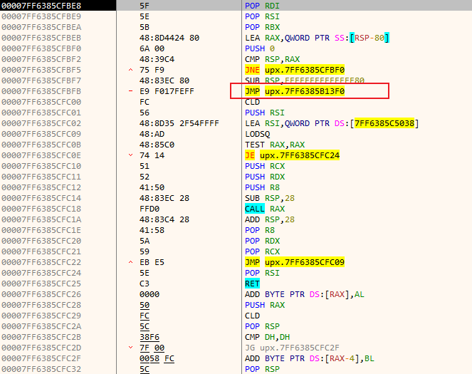
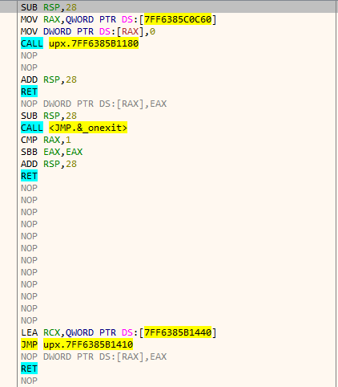
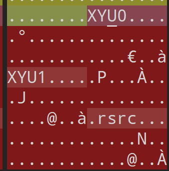
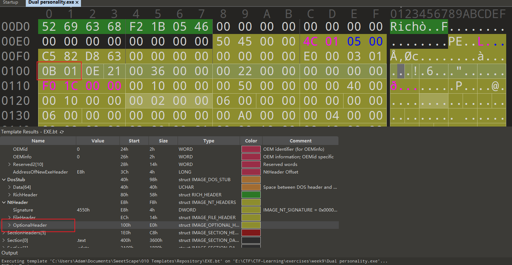
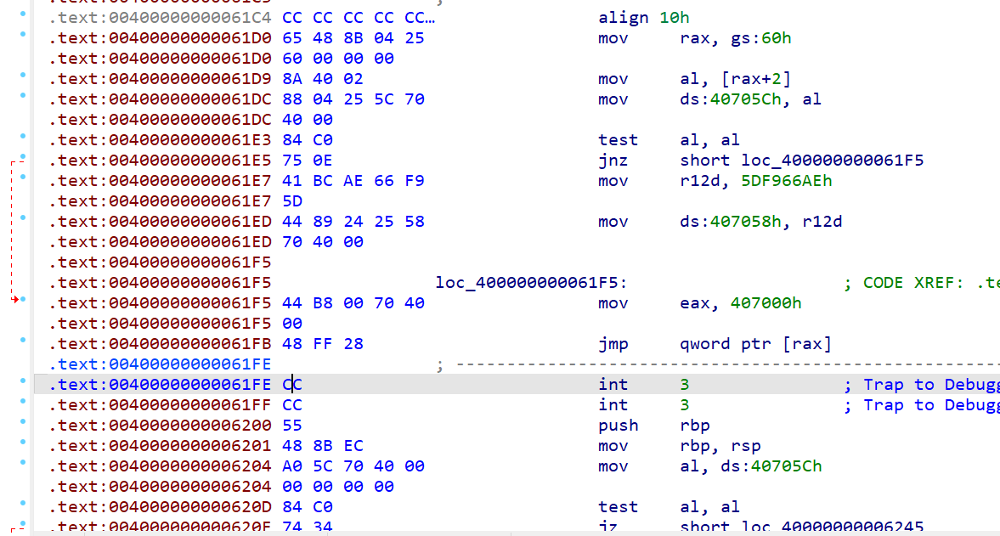

# Week 9（2024.11.11-2024.11.18）

本周重点练习下脱壳，并不是所有壳都可以直接工具脱，有时候还是得借助手动脱壳

## 练习

### [SWPUCTF 2023 秋季新生赛]UPX

文件ida64打开会提示无法找到RVA地址0x00011000，可以StudyPE设置其位固定基址

直接x64dbg分析，F9执行到PUSH RBX，然后F8走完所有的PUSH，并下内存断点（硬件断点，访问，4字节），再次F9可以看到跑到了一个大JMP前面

JMP下断点（中间会不断循环），F9跑到jmp并进入，此时就是upx脱壳后的内容

再学习下怎么导出：首先在这里打开插件Scylla，先IAT自动搜索，然后获取导入（如果里面有红×需要删除），接着点击转储到新的文件，最后修复转储，选中之前创建的新文件。此时再次ida64打开一点问题都没了

### [NSSRound#X Basic]ez_z3

可以直接手动脱壳，也可以先修改XYU为UPX

然后就是比较复杂的z3和一个乘积加密

~~~python
from z3 import *
cmp = [0x00001207, 0x00004CA0, 0x00004F21, 0x00000039, 0x0001A523, 0x0000023A, 0x00000926, 0x00004CA7, 0x00006560, 0x00000036, 0x0001A99B, 0x00004CA8, 0x0001BBE0, 0x00003705, 0x00000926, 0x000077D3, 0x00009A98, 0x0000657B, 0x00000018, 0x00000B11]
print(len(cmp))
a1 = [BitVec(f"a1{i}", 12) for i in range(len(cmp))]
s = Solver()

s.add(20 * a1[19] * 19 * a1[18]
     + 14 * a1[13]
     + 13 * a1[12]
     + 11 * a1[10] * 10 * a1[9]
     + 30 * a1[5]
     + 5 * a1[4]
     + a1[0]
     + 2 * a1[1]
     - 3 * a1[2]
     - 4 * a1[3]
     - 7 * a1[6]
     + 8 * a1[7]
     - 9 * a1[8]
     - 12 * a1[11]
     - 16 * a1[15] * 15 * a1[14]
     - 17 * a1[16]
     - 18 * a1[17] == 2582239)
s.add(20 * a1[19] * 19 * a1[18]
     + 14 * a1[13]
     + 13 * a1[12]
     + 11 * a1[10] * 10 * a1[9]
     + 30 * a1[5]
     - 7 * a1[6]
     + 8 * a1[7]
     - 9 * a1[8]
     + 5 * a1[4]
     + 3 * a1[2]
     + 2 * a1[1] * a1[0]
     - 4 * a1[3]
     - 12 * a1[11]
     - 16 * a1[15] * 15 * a1[14]
     - (18 * a1[17]
      + 17 * a1[16]) == 2602741)
s.add(19 * a1[18]
     + 18 * a1[17]
     + 14 * a1[13] * 13 * a1[12]
     + 12 * a1[11] * 11 * a1[10]
     + 9 * a1[8]
     + 7 * a1[6] * 30 * a1[5]
     + a1[0]
     - 2 * a1[1]
     - 4 * a1[3] * 3 * a1[2]
     - 5 * a1[4]
     + 8 * a1[7]
     - 10 * a1[9]
     - 15 * a1[14]
     - 17 * a1[16] * 16 * a1[15]
     - 20 * a1[19] == 2668123)
s.add(20 * a1[19] * 19 * a1[18]
     + 14 * a1[13]
     + (13 * a1[12] + 11 * a1[10] - 12 * a1[11]) * 10 * a1[9]
     + 30 * a1[5]
     + 5 * a1[4]
     + a1[0]
     + 2 * a1[1]
     - 3 * a1[2]
     - 4 * a1[3]
     - 7 * a1[6]
     + 8 * a1[7]
     - 9 * a1[8]
     - 16 * a1[15] * 15 * a1[14]
     - 17 * a1[16]
     - 18 * a1[17] == 2520193)
s.add(18 * a1[17]
     + 17 * a1[16]
     + 15 * a1[14]
     + 13 * a1[12] * 12 * a1[11]
     + 10 * a1[9]
     + 9 * a1[8] * 8 * a1[7]
     + 3 * a1[2] * 2 * a1[1] * a1[0]
     - 4 * a1[3]
     - 5 * a1[4]
     - 30 * a1[5]
     - 7 * a1[6]
     - 11 * a1[10]
     - 14 * a1[13]
     - 16 * a1[15]
     - 19 * a1[18]
     - 20 * a1[19] == 8904587)
s.add(18 * a1[17]
     + 7 * a1[6] * 30 * a1[5] * 5 * a1[4]
     + 4 * a1[3]
     + 8 * a1[7]
     + a1[0]
     - 2 * a1[1]
     - 3 * a1[2]
     - 9 * a1[8]
     - 11 * a1[10] * 10 * a1[9]
     - 16 * a1[15] * (13 * a1[12] + 12 * a1[11] - 14 * a1[13] - 15 * a1[14])
     - 17 * a1[16]
     - 19 * a1[18]
     - 20 * a1[19] == 1227620874)
s.add(20 * a1[19] * 19 * a1[18]
     + 17 * a1[16]
     + 14 * a1[13]
     + 13 * a1[12]
     + 12 * a1[11] * 11 * a1[10] * 10 * a1[9]
     + 7 * a1[6] * 30 * a1[5]
     + 5 * a1[4]
     + 3 * a1[2]
     + a1[0]
     + 2 * a1[1]
     + 4 * a1[3]
     + 8 * a1[7]
     - 9 * a1[8]
     - 16 * a1[15] * 15 * a1[14]
     - 18 * a1[17] == 1836606059)
s.add(20 * a1[19] * 19 * a1[18]
     + 16 * a1[15] * 15 * a1[14]
     + 14 * a1[13]
     + 13 * a1[12]
     + 12 * a1[11]
     + 7 * a1[6] * 30 * a1[5]
     + 5 * a1[4]
     + 2 * a1[1] * a1[0]
     - 3 * a1[2]
     + 4 * a1[3]
     + 8 * a1[7]
     - 9 * a1[8]
     - 10 * a1[9]
     - 11 * a1[10]
     - 17 * a1[16]
     - 18 * a1[17] == 8720560)
s.add(20 * a1[19] * 19 * a1[18]
     + 14 * a1[13]
     + 13 * a1[12]
     + 11 * a1[10] * (10 * a1[9] + 30 * a1[5] + 5 * a1[4] + 4 * a1[3] - 7 * a1[6] + 8 * a1[7] - 9 * a1[8])
     + a1[0]
     + 2 * a1[1]
     - 3 * a1[2]
     - 12 * a1[11]
     - (16 * a1[15] - 17 * a1[16] - 18 * a1[17]) * 15 * a1[14] == 11387045)
s.add(20 * a1[19] * 19 * a1[18]
     + 16 * a1[15] * 15 * a1[14]
     + 14 * a1[13]
     + 11 * a1[10] * 10 * a1[9]
     + 9 * a1[8]
     + 3 * a1[2]
     + a1[0]
     - 2 * a1[1]
     + 4 * a1[3]
     - 5 * a1[4]
     - 30 * a1[5]
     - 7 * a1[6]
     + 8 * a1[7]
     - 12 * a1[11]
     - 13 * a1[12]
     - 17 * a1[16]
     - 18 * a1[17] == 7660269)
s.add(20 * a1[19] * 19 * a1[18]
     + 14 * a1[13]
     + 13 * a1[12]
     + 11 * a1[10] * 10 * a1[9]
     - 12 * a1[11]
     + a1[0]
     + 2 * a1[1]
     - (4 * a1[3] * 3 * a1[2]
      - 5 * a1[4]
      - 30 * a1[5])
     - 7 * a1[6]
     + 8 * a1[7]
     - 9 * a1[8]
     - 16 * a1[15] * 15 * a1[14]
     - 17 * a1[16]
     - 18 * a1[17] == 2461883)
s.add(14 * a1[13]
     + 11 * a1[10] * 10 * a1[9]
     + 9 * a1[8] * 8 * a1[7]
     + 7 * a1[6]
     + 2 * a1[1] * a1[0]
     - 4 * a1[3] * 3 * a1[2]
     - 5 * a1[4]
     - 30 * a1[5]
     - 12 * a1[11]
     - 13 * a1[12]
     - 15 * a1[14]
     - 17 * a1[16] * 16 * a1[15]
     - 18 * a1[17]
     - 19 * a1[18]
     - 20 * a1[19] == -966296)
s.add(14 * a1[13]
     + 13 * a1[12]
     + (11 * a1[10] * 10 * a1[9] + 30 * a1[5] + 5 * a1[4] + 3 * a1[2] + 4 * a1[3] - 7 * a1[6] + 8 * a1[7] - 9 * a1[8])
     * 2
     * a1[1]
     + a1[0]
     - 12 * a1[11]
     - 15 * a1[14]
     - 16 * a1[15]
     - 17 * a1[16]
     - 18 * a1[17]
     - 20 * a1[19] * 19 * a1[18] == 254500223)
s.add(16 * a1[15] * 15 * a1[14]
     + 14 * a1[13]
     + 11 * a1[10] * 10 * a1[9]
     + 7 * a1[6] * 30 * a1[5]
     + a1[0]
     - 2 * a1[1]
     - 3 * a1[2]
     - 5 * a1[4] * 4 * a1[3]
     + 8 * a1[7]
     - 9 * a1[8]
     - 12 * a1[11]
     - 13 * a1[12]
     - 17 * a1[16]
     - 18 * a1[17]
     - 19 * a1[18]
     - 20 * a1[19] == 6022286)
s.add(18 * a1[17]
     + 16 * a1[15]
     - 17 * a1[16]
     + 14 * a1[13]
     + 12 * a1[11]
     + 11 * a1[10] * 10 * a1[9]
     + 30 * a1[5]
     + 5 * a1[4]
     + 4 * a1[3] * 3 * a1[2]
     + 2 * a1[1] * a1[0]
     - 9 * a1[8] * 8 * a1[7] * 7 * a1[6]
     - 13 * a1[12]
     - 15 * a1[14]
     - 19 * a1[18]
     - 20 * a1[19] == -636956022)
s.add(20 * a1[19] * 19 * a1[18]
     + 13 * a1[12]
     + 12 * a1[11]
     + 11 * a1[10] * 10 * a1[9]
     + 7 * a1[6]
     + 30 * a1[5]
     + 5 * a1[4]
     + 3 * a1[2] * 2 * a1[1] * a1[0]
     - 4 * a1[3]
     - 9 * a1[8] * 8 * a1[7]
     - 14 * a1[13]
     - 15 * a1[14]
     - 16 * a1[15]
     - 17 * a1[16]
     - 18 * a1[17] == 10631829)
s.add(20 * a1[19] * 19 * a1[18]
     + 16 * a1[15]
     - 17 * a1[16]
     - 18 * a1[17]
     + 15 * a1[14] * 14 * a1[13]
     + 13 * a1[12]
     + 11 * a1[10] * 10 * a1[9]
     - 12 * a1[11]
     + 7 * a1[6]
     + (4 * a1[3] - 5 * a1[4] - 30 * a1[5]) * 3 * a1[2]
     + a1[0]
     + 2 * a1[1]
     + 8 * a1[7]
     - 9 * a1[8] == 6191333)
s.add(14 * a1[13]
     + 10 * a1[9] * 9 * a1[8] * 8 * a1[7]
     + 5 * a1[4]
     + 4 * a1[3] * 3 * a1[2]
     + 2 * a1[1] * a1[0]
     - 7 * a1[6] * 30 * a1[5]
     - 11 * a1[10]
     - 13 * a1[12] * 12 * a1[11]
     - 16 * a1[15] * 15 * a1[14]
     - 18 * a1[17] * 17 * a1[16]
     - 20 * a1[19] * 19 * a1[18] == 890415359)
s.add(20 * a1[19]
     + 19 * a1[18]
     + 18 * a1[17]
     + 16 * a1[15]
     - 17 * a1[16]
     + 12 * a1[11]
     + 11 * a1[10]
     + 10 * a1[9]
     + 9 * a1[8]
     + 30 * a1[5]
     + a1[0]
     + 4 * a1[3] * 3 * a1[2] * 2 * a1[1]
     - 5 * a1[4]
     - 7 * a1[6]
     + 8 * a1[7]
     - 13 * a1[12]
     - 14 * a1[13]
     - 15 * a1[14] == 23493664)
s.add(20 * a1[19] * 19 * a1[18]
     + 13 * a1[12]
     + 12 * a1[11]
     + 10 * a1[9]
     + 3 * a1[2] * 2 * a1[1]
     + a1[0]
     - 4 * a1[3]
     - 5 * a1[4]
     + 8 * a1[7] * 7 * a1[6] * 30 * a1[5]
     - 9 * a1[8]
     - 11 * a1[10]
     - 14 * a1[13]
     - 16 * a1[15] * 15 * a1[14]
     - 17 * a1[16]
     - 18 * a1[17] == 1967260144)
for i in range(len(a1)):
    s.add(a1[i]<=127, a1[i]>=32)
if s.check() == sat:
    ans = s.model()
    enc = []
    for i in range(len(a1)-1, -1, -1):
        enc.append(ans[a1[i]].as_long()^cmp[len(a1)-i-1])
    print(enc)
r_list = []
r1_list = []
for i in range(32, 128):
    r_list.append(i * i % 1000 * i)
    r1_list.append(i * i % 1000)
flag = ""
a = [0x00000007, 0x00000007, 0x00000007, 0x00000009, 0x00000005, 0x00000006, 0x00000007, 0x00000007, 0x00000007, 0x00000009, 0x00000007, 0x00000007, 0x00000005, 0x00000007, 0x00000007, 0x00000007, 0x00000005, 0x00000007, 0x00000009, 0x00000007]
for i in range(len(enc)):
    if (a[i] & 1) and (a[i] >> 2) & 1:
        flag += chr(r_list.index(enc[i])+32)
    elif (a[i] & 1) == 0 and (a[i] >> 2) & 1:
        flag += chr(r1_list.index(enc[i])+32)
    else:
        flag += chr(enc[i])
print(flag)
# T1e_z3_1s_v1r9_3asy!
~~~

### [西湖论剑 2022]Dual personality

挺难的反调试题目，用到了[天堂之门技术](https://www.freebuf.com/articles/web/209983.html)

关键点在于：64位系统上既可以跑64位程序，也可以跑32位程序；区别在于CS寄存器，32位时CS=0x23，64位时CS=0x33；

参考：https://kamasammohana.github.io/2023/02/14/%E8%A5%BF%E6%B9%96%E8%AE%BA%E5%89%91%202023%20%E5%88%9D%E8%B5%9B%20RE%20%E5%A4%8D%E7%8E%B0/

首先可以先去除64位的代码从而可以反编译

~~~c
int __cdecl main(int argc, const char **argv, const char **envp)
{
  int v3; // eax
  char Buf2[44]; // [esp+D0h] [ebp-70h] BYREF
  int v6; // [esp+FCh] [ebp-44h]
  int v7; // [esp+100h] [ebp-40h]
  int v8; // [esp+104h] [ebp-3Ch]
  int v9; // [esp+108h] [ebp-38h]
  int v10; // [esp+10Ch] [ebp-34h]
  int v11; // [esp+110h] [ebp-30h]
  int v12; // [esp+114h] [ebp-2Ch]
  int v13; // [esp+118h] [ebp-28h]
  char v14; // [esp+11Ch] [ebp-24h]
  int i; // [esp+128h] [ebp-18h]
  _DWORD *v16; // [esp+134h] [ebp-Ch]

  ((void (*)(void))sub_401000)();
  sub_401620("%99s", (char)&unk_407060);
  v3 = sub_401120(7u, (int)dword_4011D0);
  if ( v3 )
    v3 = dword_407058;
  dword_407058 = v3 - 559038737;
  v16 = &unk_407060;
  for ( i = 0; i < 8; ++i )
  {
    v16[i] += dword_407058;
    dword_407058 ^= v16[i];
  }
  MK_FP(*((_WORD *)&byte_40700C + 2), byte_40700C)(&unk_407060, 0);
  sub_401120(7u, (int)dword_401290);
  v6 = 0;
  v7 = 0;
  v8 = 0;
  v9 = 0;
  v10 = 0;
  v11 = 0;
  v12 = 0;
  v13 = 0;
  v14 = 0;
  Buf2[0] = -86;
  Buf2[1] = 79;
  Buf2[2] = 15;
  Buf2[3] = -30;
  Buf2[4] = -28;
  Buf2[5] = 65;
  Buf2[6] = -103;
  Buf2[7] = 84;
  Buf2[8] = 44;
  Buf2[9] = 43;
  Buf2[10] = -124;
  Buf2[11] = 126;
  Buf2[12] = -68;
  Buf2[13] = -113;
  Buf2[14] = -117;
  Buf2[15] = 120;
  Buf2[16] = -45;
  Buf2[17] = 115;
  Buf2[18] = -120;
  Buf2[19] = 94;
  Buf2[20] = -82;
  Buf2[21] = 71;
  Buf2[22] = -123;
  Buf2[23] = 112;
  Buf2[24] = 49;
  Buf2[25] = -77;
  Buf2[26] = 9;
  Buf2[27] = -50;
  Buf2[28] = 19;
  Buf2[29] = -11;
  Buf2[30] = 13;
  Buf2[31] = -54;
  Buf2[32] = 0;
  if ( !memcmp(&unk_407060, Buf2, 0x20u) )
  {
    puts("Right, flag is DASCTF{your input}");
    exit(0);
  }
  puts("Wrong flag");
  return 0;
}
~~~

天堂之门代码如下：

~~~c
int __cdecl sub_401120(size_t Size, int a2)
{
  char *v2; // ebx
  char *retaddr; // [esp+D0h] [ebp+4h]

  dword_407050 = VirtualAlloc(0, Size + 6, 0x3000u, 0x40u);
  dword_407000 = (int)dword_407050;
  memcpy(dword_407050, retaddr, Size);
  v2 = (char *)dword_407050 + Size;
  *v2 = -23;
  *(_DWORD *)(v2 + 1) = &retaddr[Size] - v2 - 5;
  v2[5] = -52;
  *retaddr = 0xEA;
  *(_DWORD *)(retaddr + 1) = a2;
  *(_WORD *)(retaddr + 5) = 0x33;
  return 0;
}
~~~

第一次调用时传入了dword_4011D0，赋给(retaddr + 1)，即天堂之门函数执行完执行dword_4011D0里的代码，(retaddr + 5)正好是从0x23改为0x33，说明要用64位来分析dword_4011D0

~~~assembly
.text:004013DC                 push    offset dword_4011D0
.text:004013E1                 push    7
.text:004013E3                 call    sub_401120
~~~

要做64位反编译需要把exe的可选头的010b修改为020b

然后反编译找的比较费劲，但是可以看到存在反调试：首先调用gs:60h先获取了peb地址，然后偏移两位获取BeingDebugged值，如果调试的话al=1，会发生跳转，正常运行是不跳转进行赋值

先放放，实在绕晕了

## 周末

周日和同门还有0xahhh佬一块打了蜀道山，发挥不错打到了第二，逆向差一题ak，那道题出的思路有点太偏了。成绩比较好感觉主要还是大佬来的太少了
